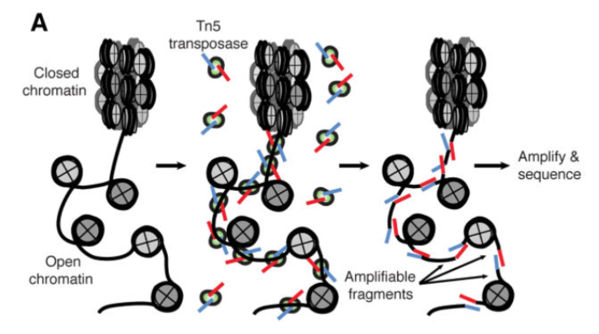
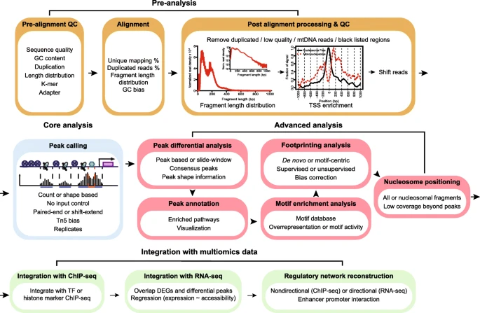
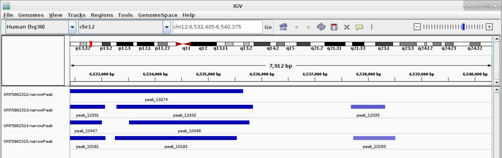
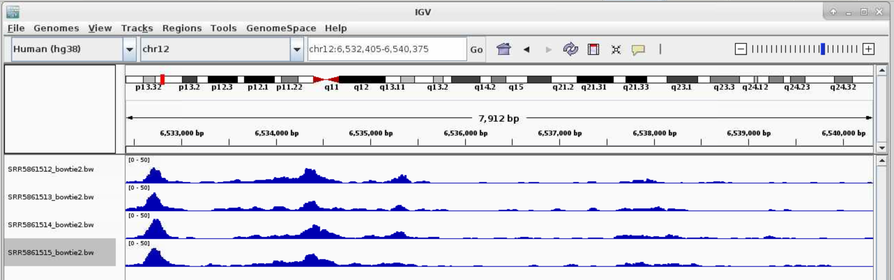

# ATACSeq Data Analysis

ATAC-Seq (Assay for Transposase-Accessible Chromatin with high-throughput Sequencing) is a method for determining 
chromatin accessibility across the genome. It utilizes a hyperactive Tn5 transposase to insert sequencing adapters 
into open chromatin regions (Fig. 1). High-throughput sequencing then yields reads that indicate these regions of 
increased accessibility.



Figure 1. ATAC-seq Overview [Buenrostro et al., 2015](https://www.ncbi.nlm.nih.gov/pmc/articles/PMC4374986/)



Roadmap of a typical ATAC-seq analysis. Four major steps are listed, including pre-analysis, core analysis, advanced 
analysis, and integration with multiomics data. Pre-analyses include pre-alignment QC, alignment and post-alignment 
processing, and QC. Core analysis includes peak calling. Advanced analyses include peak, motif, footprint, and 
nucleosome analysis. Multiomics data integration includes integration with ChIP-seq and RNA-seq data and regulatory 
network reconstruction. Text in each box emphasizes the important considerations in each analysis step.

[https://genomebiology.biomedcentral.com/articles/10.1186/s13059-020-1929-3](https://genomebiology.biomedcentral.com/articles/10.1186/s13059-020-1929-3)

In this documentation, we will focus on the computational analysis of the sequencing data, going over sequence 
data downloading, data quality controls, sequence alignment, and lastly peak calling. We followed the harvard 
ATACseq guidlines with slightly adjustments. If you have any questions, please do not hesitate to contact 
me (fangping@pitt.edu).

## Setting up

Since you are going to be working on our remote cluster, HTC, we first need to log in. 
Follow <a href="/node/5986">these steps </a>to login the HTC cluster. Macs have a utility application called 
“Terminal” for performing tasks on the command line (shell), both locally and on remote machines. With Windows, 
You can also use Putty to log in to remote machines from Windows computers.

Type in the following command with your username to login:

```commandline
ssh username@htc.crc.pitt.edu
```

You will receive a prompt for your password, and you should type in your associated password; note that the cursor 
will not move as you type in your password.

A warning might pop up the first time you try to connect to a remote machine, type “Yes” or “Y”.

Once logged in, you should see the command prompt:

```commandline
[fangping@login0b ~]$
```

## Reference Genome

Reference genome - The nucleotide sequence of the chromosomes of a species. Genes are the functional units of a 
reference genome and gene annotations describe the structure of transcripts expressed from those gene loci.

For atacseq data analysis UCSC reference genomes are commonly used. You can get hg38 reference genomes and associated 
[annotations from UCSC](http://hgdownload.cse.ucsc.edu/goldenPath/hg38/bigZips/)

```commandline
wget http://hgdownload.cse.ucsc.edu/goldenPath/hg38/bigZips/hg38.fa.gz
gunzip hg38.fa.gz
```

Note Ensembl, NCBI, and UCSC can not agree on how to name the chromosomes in many species. For UCSC genome, 
mitochondria is named chrM, which is used in the analysis.

## Genome indexing

In order to align reads to a genome, the reference sequence must be indexed. This is a time- and memory-intense 
procedure, but it needs to be done only once for a given genome.

Bowtie2 indexes are made from a FASTA genome file using the program bowtie2-build.

```commandline
[fangping@login0b ~]$ cd /bgfs/genomics/refs/genome_refs/Homo_sapiens/UCSC/hg38
[fangping@login0b hg38]$ cat bowtie2_index.sbatch
#!/bin/bash
#
#SBATCH -N 1 # Ensure that all cores are on one machine
#SBATCH -t 3-00:00 # Runtime in D-HH:MM
#SBATCH -J bowtie2_index

#SBATCH --cpus-per-task=8 # Request that ncpus be allocated per process.
#SBATCH --mem=120g # Memory pool for all cores (see also --mem-per-cpu)
#SBATCH --output=bowtie2_index.out

module load gcc/8.2.0 bowtie2/2.3.4.2

bowtie2-build --threads 8 hg38.fa hg38
```

Generate a text file bowtie2_index.sbatch with the above content, and submit the job to the HTC cluster 
(sbatch bowtie2_index.sbatch).

For human hg38 reference genome, bowtie2 and bwa mem indices have been built, and they are available 
at `/bgfs/genomics/refs/genome_refs/Homo_sapiens/UCSC/hg38`

## ATAC-Seq Data

The test data consists of 4 ATACseq samples from the following paper.

Pulikkan JA, Hegde M, Ahmad HM, Belaghzal H et al. CBFβ-SMMHC Inhibition Triggers Apoptosis by Disrupting MYC 
Chromatin Dynamics in Acute Myeloid Leukemia. Cell 2018 Jun 28;174(1):172-186.e21. 
PMID:<a href="https://www.ncbi.nlm.nih.gov/pubmed/29958106" title="Link to PubMed record">29958106</a>

In the experiment, ME-1 cells were treated with DMSO/ AI-10-49 (1uM) for six hours and cells were tagmented using 
Tn5 transposase. DNA libraries were sequenced using 100bp paired end reads on an Illumina HiSeqTM 2000. Two 
independent experiments were conducted for DMSO as well as AI-10-49 treatments.. For more description of the 
experiment <a href="https://www.ncbi.nlm.nih.gov/geo/query/acc.cgi?acc=GSE101790">see the PubMed entry 29958106 
and for raw data see the GEO entry GSE101790.</a>

Click the above link and click “SRA Run Selector” at the bottom. Click "Accession List" to download SRR_Acc_List.txt 
and "Metadata" to download SraRunTable.txt

You can download the FASTQ files from the Sequence Read Archive, the identifiers would be SRA run IDs, e.g. 
SRR5861512. You should have two files for a paired-end experiment for each ID, SRR5861512_1.fastq.gz and 
SRR5861512_2.fastq.gz, which give the first and second read for the paired-end fragments.

```commandline
cd /bgfs/genomics/fangping/atacseq/human_leukemia_cell_line/ # go to a folder
mkdir fastqs
```

Choose a method from this <a href="https://crc.pitt.edu/managingdata">managing and moving data</a> and transfer the 
SRR_Acc_List.txt and SraRunTable.txt from your computer to the new folder.

To extract fastq files from the GEO data, use NCBI's program toolkit. It's already installed on HTC cluster and can 
be loaded with module load sra-toolkit/2.10.8. Default configuration of sra-toolkit will use your home directory 
`~/ncbi` as your download/cache area for downloaded files and references. Your home directory has 75GB quota. 

You should run the configuration tool to setup your download/cache are.

```commandline
[fangping@login0b fastqs]$ module load sra-toolkit/2.10.8
[fangping@login0b fastqs]$ vdb-config -i # run this command once
```

The fastq-dump command produces two compressed fastq files for each dataset, for the forward and reverse reads. 
Within your fastqs folder, generate a text file fastq_dump.sbatch with the following contents. Then submit the 
job to the HTC cluster.

```commandline
sbatch fastq_dump.sbatch
[fangping@login0b fastqs]$ cat fastq_dump.sbatch
#!/bin/bash
#
#SBATCH --job-name=fastq_dump
#SBATCH -N 1
#SBATCH --cpus-per-task=1 # Request that ncpus be allocated per process.
#SBATCH -t 1-00:00 # Runtime in D-HH:MM
#SBATCH --output=fastq_dump-%A_%a.out
#SBATCH --array=0-3 # job array index

module load sra-toolkit/2.10.8

names=($(cat SRR_Acc_List.txt))

echo ${names[${SLURM_ARRAY_TASK_ID}]}

prefetch ${names[${SLURM_ARRAY_TASK_ID}]}

vdb-validate ${names[${SLURM_ARRAY_TASK_ID}]}

fastq-dump --split-e --origfmt --gzip ${names[${SLURM_ARRAY_TASK_ID}]}
```

Check fastq-dump options at <
a href="https://ncbi.github.io/sra-tools/fastq-dump.html">https://ncbi.github.io/sra-tools/fastq-dump.html</a>. 
You can also run "fastq-dump -h" to check options. --split-e 3-way splitting for mate-pairs. For each spot, 
if there are two biological reads satisfying filter conditions, the first is placed in the `*_1.fastq` file, and 
the second is placed in the `*_2.fastq` file. If there is only one biological read satisfying the filter conditions, 
it is placed in the `*.fastq` file.All other reads in the spot are ignored. `--origfmt` Defline contains only original 
sequence name. `--gzip` Compress output using gzip.

This job uses job array to submit and manage collections of similar jobs quickly and easily. 
Refer to <a href="https://crc.pitt.edu/multiplejobs">this documentation</a>.

## PreAlignment QC

To get a sense of your data quality before alignment, 
<a href="http://www.bioinformatics.babraham.ac.uk/projects/fastqc/">FastQC</a> provides a simple way to do 
some quality control checks on raw sequence data coming from high throughput sequencing pipelines. 
<a href="http://www.youtube.com/watch?v=bz93ReOv87Y">Video tutorial of FastQC</a>.

Under your working folder, there is a single folder fastqs. Let's create two folder jobs and results.

```commandline
[fangping@login0b human_leukemia_cell_line]$ mkdir jobs
[fangping@login0b human_leukemia_cell_line]$ mkdir results
[fangping@login0b human_leukemia_cell_line]$ ls
fastqs  jobs  results
```

You can write your jobs scripts in jobs folder:

```commandline
cd jobs
```

Submit the following batch job to run FastQC on your fastq files

```commandline
[fangping@login0b jobs]$ cat 1.fastqc.sbatch
#!/bin/bash
#
#SBATCH --job-name=fastqc
#SBATCH -c 1
#SBATCH -t 1-00:00 # Runtime in D-HH:MM
#SBATCH --output=fastqc-%A_%a.out
#SBATCH --array=0-3 # job array index

module load fastqc/0.11.9

names=($(cat ../fastqs/SRR_Acc_List.txt))

echo ${names[${SLURM_ARRAY_TASK_ID}]}

mkdir -p ../results/fastqc

fastqc -o ../results/fastqc ../fastqs/${names[${SLURM_ARRAY_TASK_ID}]}_1.fastq.gz
fastqc -o ../results/fastqc ../fastqs/${names[${SLURM_ARRAY_TASK_ID}]}_2.fastq.gz

[fangping@login0b jobs]$ sbatch 1.fastqc.sbatch # submit the job
```

You can download the *_fastqc.html files within ../results/fastqc to view the FastQC report. You can also use the 
interactive destop on open ondemand to view the html files.

## Adapter removal

Before doing any of the actual analysis, we have to apply some adjustments to the sequences so that computer 
artefacts interfering with our final results can be limited. The first adjustment we are making is to remove the 
adapter. For reads derived from short DNA fragments, the 3’ ends may contain portions of the Illumina sequencing 
adapters. The adapter contamination interferes with the alignments, preventing reads from aligning to the reference 
genome and therefore affecting the downstream analysis. The tool we recommend for trimming is called TrimGalore. 
To run the software, we will specify --paired parameter, which allows the paired reads to be considered, and 
--nextera, which basically tells the software to look for trimming this short sequence called nextera 
(nextera sequence is the adapter sequence that is widely used by the Illumina for ATAC-seq).

```commandline
[fangping@login0b jobs]$ cat 2.trim.sbatch
#!/bin/bash
#
#SBATCH --job-name=trim
#SBATCH -c 1
#SBATCH -t 1-00:00 # Runtime in D-HH:MM
#SBATCH --output=trim-%A_%a.out
#SBATCH --array=0-3 # job array index

module load trimgalore/0.6.5

names=($(cat ../fastqs/SRR_Acc_List.txt))

echo ${names[${SLURM_ARRAY_TASK_ID}]}

mkdir -p ../results/trim_galore

trim_galore --paired --nextera \
  --output_dir ../results/trim_galore \
  ../fastqs/${names[${SLURM_ARRAY_TASK_ID}]}_1.fastq.gz \
  ../fastqs/${names[${SLURM_ARRAY_TASK_ID}]}_2.fastq.gz
```

## Alignment

The next step is to align the reads to a reference genome. In order to align reads to a genome, the reference 
sequence must be indexed. Bowtie2 indexes are made from a FASTA genome file using the 
program <u>bowtie2-build</u>. You can build your own reference genome. For this tutorial, you will 
generate a soft link to an existing hg38 reference genome that I have built.

```commandline
[fangping@login0b human_leukemia_cell_line]$ cd results/
[fangping@login0b results]$ mkdir reference_genome
[fangping@login0b results]$ ln -s /bgfs/genomics/refs/genome_refs/Homo_sapiens/UCSC/hg38 hg38
```

Once the indices are built, the reads can be aligned using Bowtie2. A brief look at the 
<a href="http://bowtie-bio.sourceforge.net/bowtie2/manual.shtml">manual</a> reveals the large number of 
parameters and options available with Bowtie2. Here are a few that we will use:

<table class="githubtable">
	<tbody>
		<tr>
			<th>Argument</th>
			<th>Description</th>
		</tr>
		<tr>
			<td>-X &lt;int&gt;</td>
			<td>Maximum DNA fragment length (default 500bp). If you anticipate that you may have DNA fragments longer than the default value, you should increase this parameter accordingly; otherwise, alignments from such fragments are considered not properly paired (see Fig. 3B below).</td>
		</tr>
		<tr>
			<td>--very-sensitive</td>
			<td>Bowtie2 has a number of alignment and effort parameters that interact in complex (and sometimes unexpected) ways. Preset collections of these parameters are provided for convenience; the default is --sensitive, but better alignment results are frequently achieved with --very-sensitive.</td>
		</tr>
		<tr>
			<td>-k &lt;int&gt;</td>
			<td>Maximum number of alignments to report per read. By default, Bowtie2 reports at most one alignment per read, and if multiple equivalent alignments exist, it chooses one randomly.</td>
		</tr>
		<tr>
			<td>-p &lt;int&gt;</td>
			<td>Number of cores on which to run</td>
		</tr>
	</tbody>
</table>

The output is a <a href="https://samtools.github.io/hts-specs/SAMv1.pdf">SAM file</a>, which contains alignment 
information for each input read. The SAM should be compressed to a binary format (BAM) and sorted by query name 
with <a href="http://www.htslib.org/doc/samtools.html">SAMtools</a>. This is best accomplished by piping the 
output from Bowtie2 directly to samtools view and samtools sort, e.g.:

```commandline
[fangping@login0b jobs]$ cat 3.bowtie2.sbatch
#!/bin/bash
#
#SBATCH --job-name=sort_n_bowtie2
#SBATCH -c 10
#SBATCH -t 1-00:00 # Runtime in D-HH:MM
#SBATCH --output=sort_n_bowtie2-%A_%a.out
#SBATCH --array=0-3 # job array index
#SBATCH --mem=60g

module load bowtie2/2.4.1
module load gcc/8.2.0 samtools/1.10

names=($(cat ../fastqs/SRR_Acc_List.txt))

echo ${names[${SLURM_ARRAY_TASK_ID}]}

mkdir -p ../results/bowtie2

# better alignment results are frequently achieved with --very-sensitive
# use -X 2000 to allow larger fragment size (default is 500)

bowtie2 --very-sensitive -X 2000 -k 10 -p 8 \
  -x ../results/reference_genome/hg38/hg38 \
  -1 ../results/trim_galore/${names[${SLURM_ARRAY_TASK_ID}]}_1_val_1.fq.gz \
  -2 ../results/trim_galore/${names[${SLURM_ARRAY_TASK_ID}]}_2_val_2.fq.gz \
  | samtools view -u - \
  | samtools sort -n -o ../results/bowtie2/${names[${SLURM_ARRAY_TASK_ID}]}_bowtie2_sort_n.bam -
```

Note that samtools -n option will sort by read names (i.e., the QNAME field) rather than by chromosomal coordinates.

Here we have used --very-sensitive and -k 10 with bowtie2. Both options can significantly slow down bowtie2. For this 
sample SRR5861512, this command takes around 10 hours.

Bowtie2 also provides (via stderr) a summary of the mapping results, separated according to uniqueness and alignment 
type (concordant, discordant, and non-concordant/non-discordant).

## Peak Calling

Genrich was designed to be able to run all the post-alignment steps through peak-calling with one command. It 
also possesses a few novel features. Consider the following attributes:

<ul>
	<li>Removal of mitochondrial reads. As stated previously, reads derived from mitochondrial DNA represent noise in ATAC-seq datasets and can substantially inflate the background level. Genrich disregards all alignments to the mitochondrial chromosome with -e chrM, for example.</li>
	<li>Removal of PCR duplicates. PCR duplicates are artifacts of the library preparation procedure, and they should be eliminated from consideration. Genrich follows a systematic procedure to remove PCR duplicates with -r. Note that this evaluation takes into account multimapping reads (see next), which is not provided by other alignment-based duplicate-removal programs, such as Picard's MarkDuplicates.</li>
	<li>Analysis of multimapping reads. It is not uncommon for short sequence reads to align equally well to multiple locations in a reference genome, especially given the repetitive nature of genomes. Non-uniquely aligned reads can be removed by filtering based on MAPQ scores with samtools, but this effectively renders certain genomic regions inaccessible to the assay. With Genrich, reads with multiple alignments are analyzed by adding a fractional count to each location. Genrich's statistical model accommodates these values.</li>
	<li>Along these same lines, Genrich considers the entire reference genome to be part of the assay. If there are chromosomes or genomic regions that should be excluded from analysis, these can be specified by -e or -E, and Genrich will adjust the genome length calculation accordingly. There is no need to guesstimate an "effective" genome size like with MACS2.</li>
	<li>Analysis of multiple replicates. When alignment files for multiple replicates are provided to Genrich, it calls peaks for the replicates collectively. No more IDR. Done.</li>
	<li>Interpretation of alignments suitable for ATAC-seq. Genrich provides an ATAC-seq analysis mode (-j) in which, rather than inferring the full fragments from the alignments, intervals are interpreted that are centered on transposase cut sites (the ends of each DNA fragment). Only properly paired alignments are analyzed by default, but there is an option to consider unpaired alignments as well (-y).</li>
</ul>

```commandline
[fangping@login0b jobs]$ cat 4.genrich.sbatch
#!/bin/bash
#
#SBATCH --job-name=genrich
#SBATCH -c 1 # genrich is not multi-threaded
#SBATCH --mem=30g # Genrich runs very quickly but uses a considerable amount of memory
#SBATCH -t 1-00:00 # Runtime in D-HH:MM
#SBATCH --output=genrich-%A_%a.out
#SBATCH --array=0-3 # job array index

module load genrich/0.6

names=($(cat ../fastqs/SRR_Acc_List.txt))

echo ${names[${SLURM_ARRAY_TASK_ID}]}

mkdir -p ../results/genrich

Genrich  -t ../results/bowtie2/${names[${SLURM_ARRAY_TASK_ID}]}_bowtie2_sort_n.bam  \
  -o ../results/genrich/${names[${SLURM_ARRAY_TASK_ID}]}.narrowPeak  \
  -j  -y  -r  -e chrM  -v
```


## Visualization of ATAC-seq data

Now that your reads are mapped and peaks are called, you may want to visualize your data in a genome browser or use a 
heatmap and/or average plot to visualize the ATAC-seq signals at your peak regions. You can accomplish both of these 
tasks using deepTools. For easy visualization in a genome browser and for making heatmaps you will need to first 
convert your processed .bam file into bigwig(.bw) format. This file is greatly reduced in size relative to the .bam 
and is therefore more amenable to genome scanning in a browser. The bigwig file, along with your .narrowPeak file, 
can be visualized by IGV.

Some post analysis tools requires the bam files to be sorted by chromosomal coordinates. Submit the following jobs 
to use samtools to sort bowtie2 bam output.

```commandline
[fangping@login0b jobs]$ cat 5.samtools.sort_bowtie2.sbatch
#!/bin/bash
#
#SBATCH --job-name=sort
#SBATCH -c 8
#SBATCH -t 1-00:00 # Runtime in D-HH:MM
#SBATCH --output=sort-%A_%a.out
#SBATCH --array=0-3 # job array index
#SBATCH --mem=64g

module load gcc/8.2.0 samtools/1.9

names=($(cat ../fastqs/SRR_Acc_List.txt))

echo ${names[${SLURM_ARRAY_TASK_ID}]}

samtools sort -@ 8 -o ../results/bowtie2/${names[${SLURM_ARRAY_TASK_ID}]}_bowtie2.bam ../results/bowtie2/${names[${SLURM_ARRAY_TASK_ID}]}_bowtie2_sort_n.bam

samtools index ../results/bowtie2/${names[${SLURM_ARRAY_TASK_ID}]}_bowtie2.bam
```

Convert .bam file to a normalized bigwig using the bamCoveragetool in deepTools.

```commandline
[fangping@login0b jobs]$ cat 6.deeptools.sbatch
#!/bin/bash
#
#SBATCH --job-name=deeptools
#SBATCH -c 2
#SBATCH -t 1-00:00 # Runtime in D-HH:MM
#SBATCH --output=deeptools-%A_%a.out
#SBATCH --array=0-3 # job array index

module load deeptools/3.3.0

names=($(cat ../fastqs/SRR_Acc_List.txt))

echo ${names[${SLURM_ARRAY_TASK_ID}]}

mkdir -p ../results/deeptools

bamCoverage --bam ../results/bowtie2/${names[${SLURM_ARRAY_TASK_ID}]}_bowtie2.bam -o ../results/deeptools/${names[${SLURM_ARRAY_TASK_ID}]}_bowtie2.bw --binSize 10 --normalizeUsing RPKM -p=2
```

You can download the .narrowPeak files and .bw files and loaded them directly (File > Load from File) to IGV. 
You can also use IGV on open ondemand to visualize these files.

Log on ondemand.htc.crc.pitt.edu, Interactive Apps > IGV on htc, choose Number of hours and leave Number of Cores 
to be 1. Click Launch, wait till your sessions started, click Launch IGV on htc

Select Human (hg38) in the top left corner. File > Load from File ..., Navigate to the genrich folder and load the 
.narrowPeak files. Type your favorite gene name in the top middle box near Go



For .bw peaks, you may need to right-click on each plot and Choose Set Data Range... and choose the Max to be a 
reasonable number, for example, 50.


