# ChIP-Seq Data Analysis

## Introduction to ChIP-seq

Chromatin immunoprecipitation (ChIP) experiments are performed to identify DNA bound to specific (chromatin) proteins 
of interest. The first step involves isolating the chromatin and immunoprecipitating (IP) fragments with an antibody 
against the protein of interest. In ChIP-seq, the immunoprecipitated DNA fragments are then sequenced, followed by 
identification of enriched regions of DNA or peaks. These peak calls can then be used to make biological inferences by 
determining the associated genomic features and/or over-represented sequence motifs.

### Concept

- Goal: Chromatin immunoprecipitation (ChIP) experiments are performed to identify DNA that binds specific (chromatin) proteins of interest.

- Sequencing Workflow Steps:

a. Crosslinked a known protein to strand of DNA in vivo

b. Shear the single DNA stretch into many small segments

c. Select the bound DNA-Protein complex using antibody and isolate only the DNA (Immunoprecipiating).

d. Amplify the DNA with PCR and sequence the DNA segment

### Data Analysis Pipeline Steps

a. Sequence Reads

b. Quality Control (Evaluate the quality of the sequencing data) -> Fastqc

c. Alignment to Genome &amp; Result Output to SAM -> Bowtie2

d. SAM to BAM conversion -> Samtools

e. Sorting BAM by Genomic Coordinates and filtering only uniquely mapped reads -> Sambamba

f. Peak Calling (Identify **areas** in the genome that have been enriched with **aligned reads** as a consequence 
of performing a ChIP-Seq experiment) -> MACS

g. Downstream Analysis (annotation of the peaks)

 i. Distance from TSS

 ii. Genomic Context

 iii. Motif Discovery

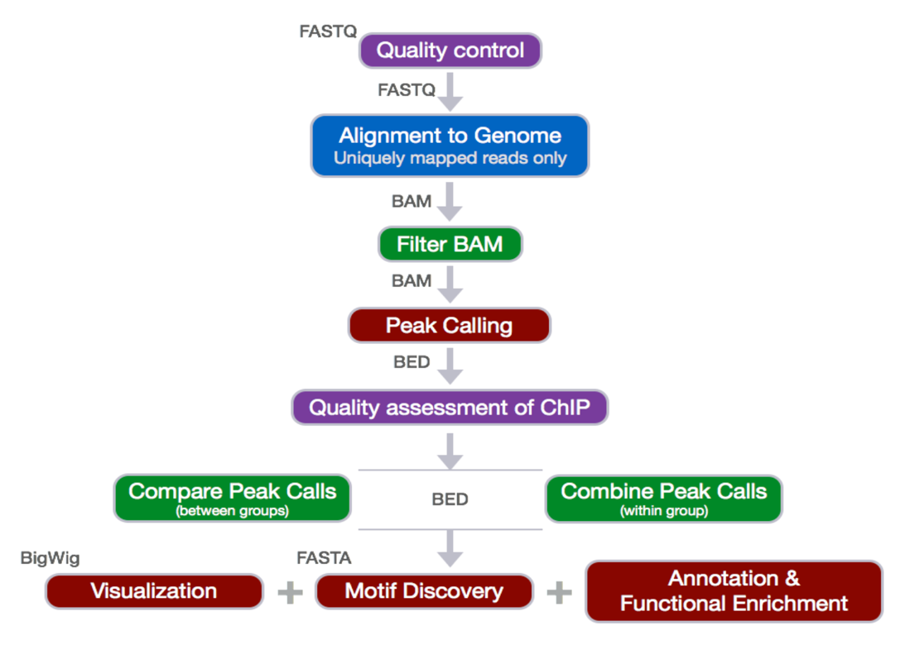

## Pipeline Explained and examples

Before we start:
- Create a directory called chipseq on your cluster</li>
- In the chipseq directory, create 6 directories that are logs, meta, raw_data, reference_data, results and scripts. In the results directory, create 2 directories that are bowtie and fastqc.

This directory structure helps us better organize all the files we need
```commandline
$ mkdir chipseq

$ cd chipseq

$ mkdir logs meta raw_data reference_data results scripts

$ mkdir results/bowtie results/fastqc
```

Here is the resulting visualization of the directory tree

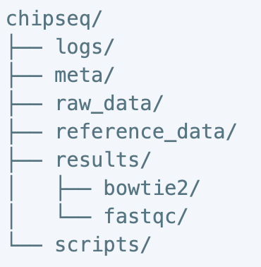

**Quality Control**:

This step was mainly to evaluate the quality of the sequenced reads. Most often, when you retrieve your high-throughput 
sequencing data from the company, you will find it packed in the FASTQ format. What is the FASTQ format then? 
Essentially, it is a text-based format that stores the actual DNA sequence from the sequencing machine, and most 
importantly, the quality score that correspondent to each base call. Opening a fastq file, you should see four lines. 
Line 1 begins with a ‘@’ is an optional description/title. Line 2 is the raw sequence. Line 3, which starts with 
a ‘+’, is an additional description field. Line 4 encodes the quality value, which is consisted of a list of symbols 
and numbers.

The scoring system consists of symbols, characters and numbers, and the correspondent quality score is seen in the 
diagram below. To interpret the score, consider this log equation: `Q=-10*log10(P)`, where P is the probability that 
the corresponding base call is erroneous.

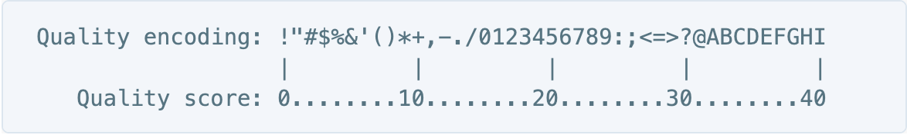

Here is the little chart to save the calculation:

As a quick example, if the score is 30, that means 1 in 1000 chance that the base was called incorrectly, therefore 
yielding an accuracy value of 99.9%.

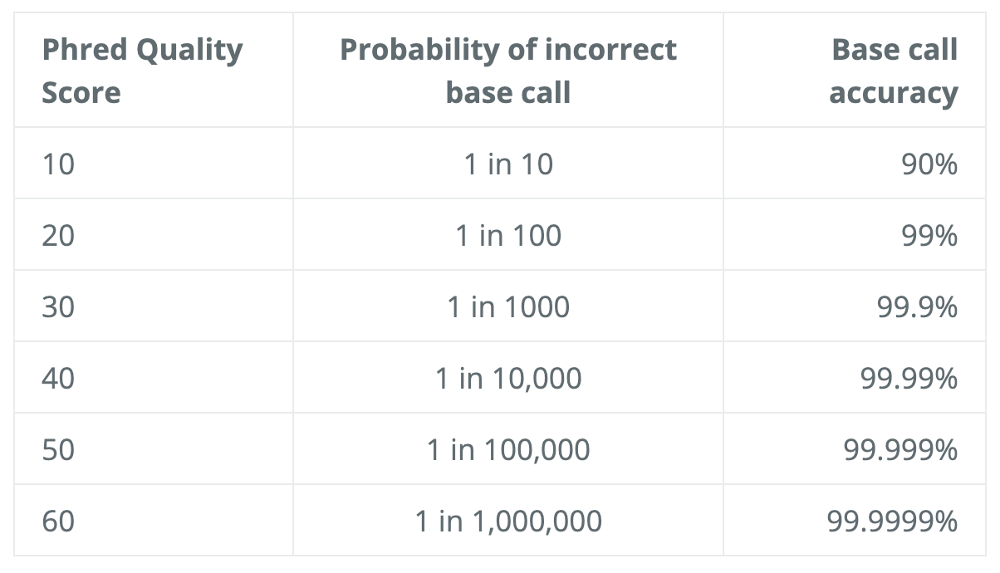

We will use the software FastQC to assess the quality of our data. Some of the advantage of using FastQC includes the 
versatile import from BAM, SAM, or FastQ files, alert of areas where may have problems, and visual aids to quickly
assess the data.

Run FastQC:

Before we start, orient yourself to the directory where the import files are ready to go. For this example, I am using

`/zfs1/fmu/chipseq_practice/raw_data`

Check the contents in the directory typing `ls –l`


Next, make sure to load the FastQC. The good news is that the software is already available on the cluster. 
Just type in `module load fastqc/[version number]`, you will know it is load if no error message is prompted. 
You can also check all the modules that are currently loaded via $ module list. In some scenario when you are unable 
to load the software directly, it could simply be a misspelling or a case sensitivity issue. In that case, type 
`module spider` to either do a generic search of all the modules available through clusters or 
`module spider [module name]` for an oriented search regardless of the case sensitivity.

 Start an interactive session for the computationally intensive task:

`srun -n6 -t02:00:00 --pty --mem 8G bash` (6 cpus, 8G RAM, 2 hours)

-Serial: wildcard exampleàSelecting all the fastq file in the directory (*.fastq) and run in serial

`fastqc *.fastq`

-Parallel: Specify the fastqc multithreading parameter –t to allow many fastq files to run at once 

`fastqc –t 6 *.fastq` (Specify for 6 threads)

-Result: The .html file contain the final reports generated by fastqc and there are multiple ways we can transfer the 
file to the local computer for the viewing purpose.

1) Rsync: In your **local computer**, open the shell and type in 

`rsync -aP jug40@htc.crc.pitt.edu:/path/to/copy <your pitt ID>@htc.crc.pitt.edu:/path/to/copy</a> /local/path/`

2) Filezilla Transfer:

host: `sftp://htc.crc.pitt.edu`

username: pitt ID 

password: your password

port: don’t need

 3) Globus

**Alignment to Genome and filtering of reads**

Now we have assessed the quality of the sequencing data, we are ready to align the reads to the reference genome. 
Bowtie2 is fast and accurate aligner that we introduce for this purpose. By default, it performs a global end-to-end 
read alignment, and by changing the settings, it also supports the local alignment mode. An example between two 
different alignment modes can be seen below. 


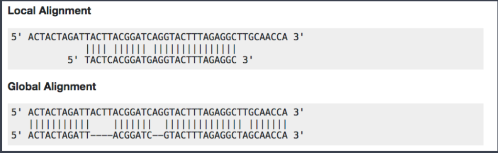

Before we start the hands-on practice, there is a consideration that we are to keep in mind for the use of bowtie2 in 
the ChIP-Seq analysis. For percentage of uniquely mapped reads, 70% or higher is considered good, whereas 50% or lower 
is concerning. The percentages are not consistent across many organisms, and thus this rule needs to be more flexible 
in order to accommodate diverse organisms.

o Creating Bowtie2 index:

A genome index is required for the Bowtie2 alignment. By indexing the genome, we have organized it in a manner that
now allows for efficient search and retrieval of matches of the query to the genome.

```commandline
$ module load gcc/8.2.0 bowtie2/2.3.4.2 # load bowtie module

$ bowtie2-build <path_to_reference_genome.fa> <prefix_to_name_indexes> #no blank but just a dash between bowtie2 and build
```

o Aligning reads to the genome—SAM output:

§ -p: number of processors / cores

§ -q: reads are in FASTQ format

§ --local: local alignment feature to perform soft-clipping (deletion --local convert the aligning mode back to default—global end-to-end)

§ -x: /path/to/genome_indices_directory

§ -U: /path/to/FASTQ_file

§ -S: /path/to/output/SAM_file 

$ bowtie2 -p 2 -q <u>--local</u> -x <path> -U <path> -S <path>

$ less <fileaname>.sam 

less is a command that allows you to view what is in the file, and it is not restricted to just the sam format. Most 
of the file extension are compatible with the less command.

 SAM format -> Sequence Alignment Map format Quick Intro：

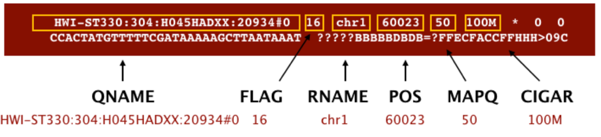

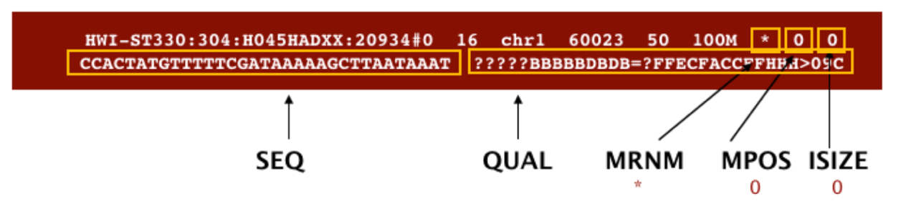

 

o Filtering reads

§ Changing file format from SAM to BAM—samtools 

v BAM format is more compatible with the mainstream analytical tools than is the SAM. Therefore, we will use samtools 
to convert the file formats. 

`module load gcc/8.2.0 samtools/1.9`

-h: include header in output

-S: input is in SAM format

-b: output BAM format

-o: /path/to/output/file

$ samtools view –h –S –b –o <output_filename.bam> <input_filename.sam>

§ Sorting BAM files by **genomic coordinates**—sambamba 

`module load sambamba/0.6.8`

-t: number of threads/cores

-o: /path/to/output/file

`sambamba sort –t 2 –o <output_filename.bam><input_filename.bam>`

§ Filtering uniquely mapping reads—sambamba 

We will use sambamba view command to filter the BAM to keep only the uniquely mapping reads

-t: number of threads/cores

-h: print SAM header before reads

-f: format of output file (default is SAM)

-F: set custom filter – the filter we need is what removes duplicates, multimappers and unmapped reads

$ sambamba view –h –t 2 –f bam –F <span style="color:red">“[XS]==null and not unmapped and not duplicate” <input_filename.bam> **>** <output_filename.bam>

v The filter given are ‘not mapped’, ‘not duplicate’, and ‘[XS] ==null’, which are connected by ‘and’ operator. 

v ‘[XS]’ is a **tag** generated by Bowtie2 that gives an alignment score for the second-best alignment, and it is present only if the read is aligned and more than one alignment was found for the read. Setting it equal to ‘null’, makes sure only the best read is considered.

· **Peak Calling**

This step identifies areas in the genome that have been enriched with aligned reads as a result of performing ChIP-sequencing experiment. 

(Enrichment = Immunoprecipitation reads/background reads (mock IP or untagged IP))


MACS Steps and Parameters:

1) Removing redundancy: ridding duplicate tags and keeping only single read at each location.

2) Modelling the shift size

3) Scaling libraries

4) Effective genome length

5) Peak detection

6) Estimation of false discovery rate


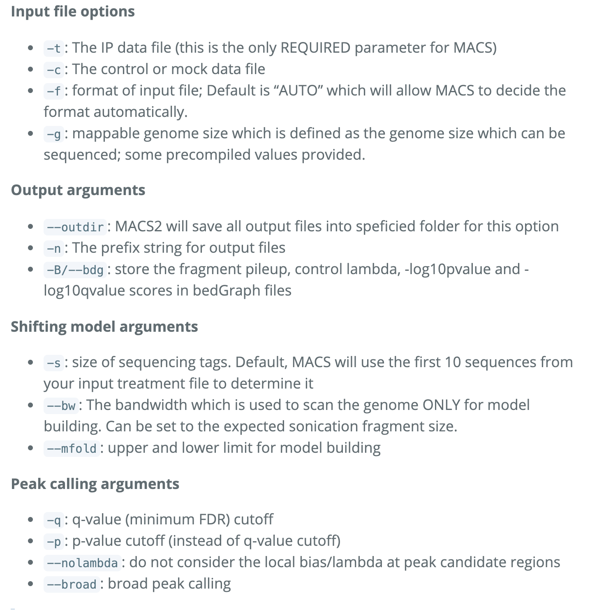

$ module load python/anaconda2.7-5.2.0 gcc/8.2.0 macs/2.1.1.20160309


Directing error to a log file with the ‘2>’ function:

`macs2 callpeak –t <input_filename.bam> -c <input_filename.bam> -f BAM –g <the value> -n <prefix for output> -B --outdir <foldername> 2> <filename.log>`

There should be 6 MACS2 files output associated with each sample:

1) <span style="color:#567482">_peaks.narrowPeak<span style="color:#606C71">: BED6+4 format file which contains the peak locations together with peak summit, pvalue and qvalue

2) <span style="color:#567482">_peaks.xls<span style="color:#606C71">: a tabular file which contains information about called peaks. Additional information includes pileup and fold enrichment

3) <span style="color:#567482">_summits.bed<span style="color:#606C71">: peak summits locations for every peak. To find the motifs at the binding sites, this file is recommended

4) <span style="color:#567482">_model.R<span style="color:#606C71">: an R script which you can use to produce a PDF image about the model based on your data and cross-correlation plot

5) _control_lambda.bdg: bedGraph format for input sample

6) _treat_pileup.bdg: bedGraph format for treatment sample

-Count peaks called in each sample: $ wc –l *.narrowPeak 

-Run R script to generate two pdf images. The first plot illustrates **the distance between the modes from which the shift size was determined. **The second plot** is the cross-correlation plot. **It is a graphical representation of the Pearson correlation of positive- and negative- strand tag densities, shifting the strands relative to each other by increasing distance**.   **

$ module load gcc/8.2.0 r/3.5.2 

$ Rscript <filename>_model.r

**ChIP-seq Quality Assessment -> ChIPQC &amp; Phantompeakqualtools**

<span style="color:black; font-family:courier new">o <u>Cross-correlation Quality Metrics</u>: 

§ Normalized strand cross-correlation coefficient (NSC)

v <u>Max CC values/Min CC values </u>

v Better enrichment: higher NSC (better signal : noise)

v Low signal-to-noise: NSC value <1.1

v Minimum possible NSC value: 1 (no enrichment)

§ Relative strand cross-correlation coefficient (RSC)

v <u>(Max CC – Min CC)/(Phantom CC – Min CC)</u>

v High enrichment: RSC > 1

v Low signal-to-noise: RSC values < 0.8

v Minimum possible RSC value: 0 (no enrichment)

§ SSD

v Indicate evidence of enrichment

v A measure of pileup across the genome and is computed by looking at the **standard deviation of signal pileup along the genome normalized to the total number of reads**.

v Higher SSD is more indicative of better enrichment à it is dependent on the signal pile-up in the whole genome wide 

§ Fraction of reads in peaks (FRiP):

v Reports the percentage of reads **overlapping** within called peaks. Or in another way to understand it, what proportion of the library consists of fragments from binding sites vs. background reads à How “enriched” the sample is OR the success of the immunoprecipitation. 

v Value varies depending on the protein of interest. As an example, a good quality TF with successful enrichment would exhibit a FRiP around 5% or higher; and the Polll would exhibit a FRiP of 30% or higher. 

§ Relative Enrichment of Genomic Intervals (REGI):

v Show where reads map in terms of various genomic features à makes note of how these regions might compare to what we expect for enrichment

§ Reads overlapping in Blacklisted Regions (RiBL):

v Acts as a guide for the level of background signal in a ChIP or input, and to basically try to detect blacklisted regions (regions that will confound peak callers and fragment length estimation) and eliminate them. The value is strongly correlated with SSD in input samples and the read length cross coverage score in both input and ChIP samples. 

v If the blacklisted regions have been filtered prior to ChIPQC, you will not need to evaluate this metric.


o Strand cross-correlation: high-quality ChIP-seq produces significant clustering of enriched DNA sequence tags at 
locations bound by the protein of interest, that present as a bimodal enrichment of reads on the forward and reverse 
strands (peaks). 


o **Cross-correlation Metric** calculates how many bases to shift the peak in order to get the maximum correlation 
between the two peaks, which corresponds to the predominant fragment length. 


§ Cross-Correlation Plot (CCP): Cross-correlation values as y-axis against the shift value x-axis.

§ Two peaks are produced in the CCP: a peak of enrichment corresponding to the predominant **fragment length** 
(highest correlation value) and a peak corresponding to the **read length** (“phantom” peak)

§ Compute metrics for assessing signal-to-noise ratios in a ChIP-seq experiment


**Example**

§ Strong Signal: predominant peak at the true peak shift as shown in the red dashed line, with a small bump at the 
blue vertical line representing the read length. 

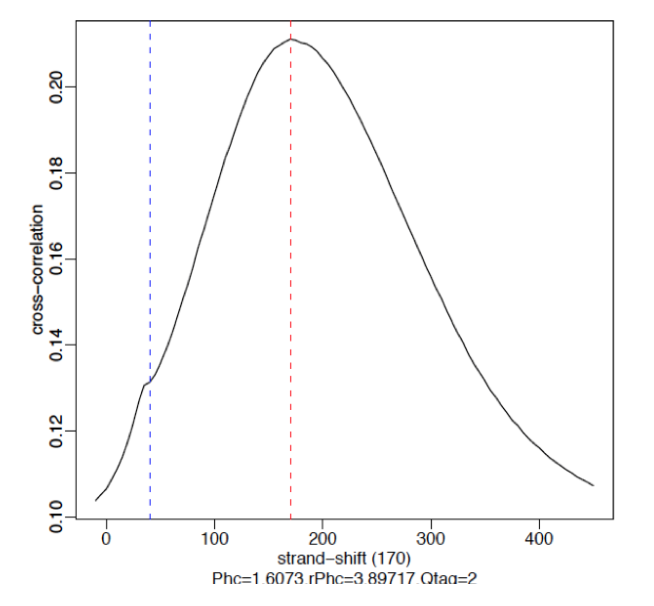

§ Weak Signal: Strongest peak is the blue line (read length) and the true peaks were overshadowed by the read length.

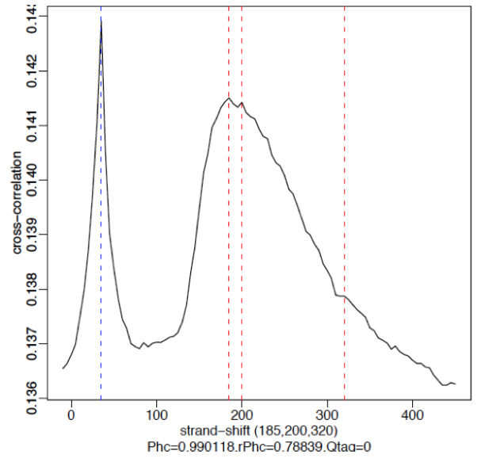

§ No signal: Predominant peak is the blue line (read length) and there are no other significant peaks in the profile. 

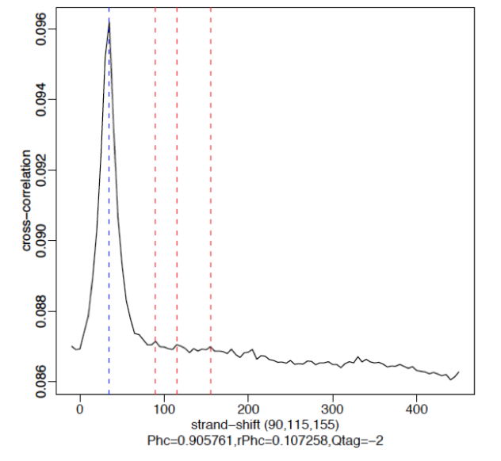


o Running ChIPQC:

§ Create a sample sheet: 

1) Contains metadata info for our dataset. Each row represents a peak set (every ChIP sample), and several columns of required information, which allows us to load the associate data much easier.

**SampleID**: Identifier string for sample

**Tissue, Factor, Condition**: Identifier strings for up to three different factors (You will need to have all 
columns listed. If you don’t have information, then set values to NA)

**Replicate**: Replicate number of sample

**bamReads**: file path for BAM file containing aligned reads for ChIP sample

**ControlID**: an identifier string for the control sample

**bamControl**: file path for bam file containing aligned reads for control sample

**Peaks**: path for file containing peaks for sample

**PeakCaller**: Identifier string for peak caller used. Possible values include “raw”, “bed”, “narrow”, “macs”

2) Make sure the bam files containing all the unique reads are indexed with samtools.

· For **file** In /zfs1/fmu/chipseq_practice/results/sambamba/

*unique.bam; 

do samtools index $file; done


3) Open R environment in bash by loading r/3.5.1 and typing R in the command line<span style="color:#606C71">: 

· > library(ChIPQC) #Enable library

· > samples <- read.csv(‘path/to/samplesheet.csv’) #load sample data

· > chipObj <- ChIPQC(samples, annotation= “<span style="color:red">hg19” )

· > save(chipObj, file= “path/to/chipObj.RData”) #save chipObj to file

· > ChIPQCreport(chipObj<span style="color:black; font-family:ms mincho">，reportName = “<name>”, reportFolder = “path/to/ChIPQCreport”) #create chipqc report

4) Interpret the ChIPQC report (the html file in the bundle): 

· <u>QC summary Table</u>:

o Contains different metrics (SSD, RIP and RiBL)

o Statistics related to the strand cross-correlation

· <u>Mapping, Filtering and Duplication rate</u>:

o Table of mapping quality and duplication rate and distribution of reads in known genomic features

· <u>Blacklisting plot:</u>

<span style="color:black; font-family:courier new">o Showing the effect of blacklisting on the reads in the data

· <u>Heatmap:</u>

<span style="color:black; font-family:courier new">o Uses genomic annotation to show where reads map in terms of genomic features.

· <u>ChIP signal Distribution and Structure:</u>

<span style="color:black; font-family:courier new">o Looks at the inherent peakiness of the samples.

<span style="color:black; font-family:courier new">o **Coverage Histogram:** The x-axis represents the read pileup 
height at a basepair position, and the y-axis represents how many positions have this pileup height (on a log scale). 
A ChIP sample with good enrichment should have a reasonable “tail”, that is more positions 
(higher values on the y-axis) having higher sequencing depth. Low enrichment samples, consisting of mostly background 
reads, will have lower genome wide pile-up.

## Peak profile and ChIP Enrichment:

Based on the metric computed using the supplied peaks.

**Average peak profile plot**: centered on the summits (point of pileup) for each peak, while the shape of these 
profile vary depending on what type of mark is being studied. It is noteworthy that similar marks usually have a 
distinctive profile in successful ChIPs.

**Reads in peaks summary**: ChIP samples with good enrichment will have a higher proportion of their reads overlapping 
called peaks.

**Sample Clustering Plot**: Correlation heatmap is used to see how different replicates are clustered together, 
provided that darker the color, higher the correlation. 


· Handling replicates and Combining Peak Calls à Bedtools

<span style="color:black; font-family:courier new">o Just like any high-throughput experiment, a single assay is almost certainly subject to a substantial amount of variability. That is why it is highly recommended to set up the experimental design with a minimum of 2-3 biological replicates. Ideally, these replicates measuring the same underlying biology should have high consistency, but that is not always the case. Therefore, we require some metrics to evaluate consistency between replicates. Two methods are well used to deal with the replicates.

§ Take overlapping peak calls across replicates and assess the differences in binding regions

§ Employ statistical testing to evaluate the reproducibility between replicates

<span style="color:black; font-family:courier new">o With the first method, we use a tool called Bedtools to determine what peaks are in common between the two replicates for each factor. 

§ Bedtools use genome coordinate information to perform simple arithmetic to obtain all sorts of information.

§ Bedtools work with Bed files, and other file formats with genome coordinate information such as BAM. 

§ #load modules 

$ module load gcc/8.2.0 bedtools/2.27.1


§ # find overlapping peaks between two replicates

# -wo command writes the original file 1 and file 2 entries plus the number of base pairs of overlap between two features.

$ bedtools intersect –a <path/to/1<sup>st</sup>_replicate_file.bam> -b <path/to/2<sup>nd</sup>_replicate_file.bam> -bed -wo > <path/to/output.bed>


<span style="color:black; font-family:courier new">o With the second method involving sophisticated statistics, we implement a tool called IDR to assess the concordance of peak calls between replicates.

§ IDR compares a pair of ranked lists of regions/peaks between replicates and assigns values that reflect its reproducibility. IDR stands for Irreproducible Discovery Rate. E.g. 0.05 IDR means that peak has a 5% chance of being an irreproducible discovery. 

§ IDR has three main components

1) <u>A correspondence curve</u>: a graphical representation of matched peaks as you go down the ranked list.

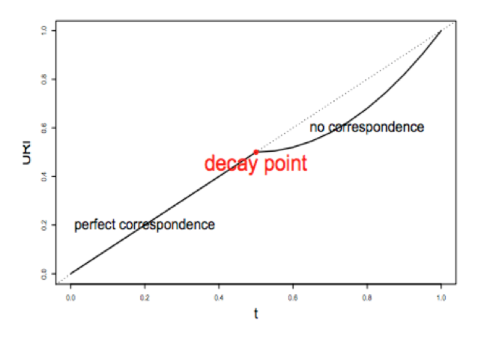

2) <u>An inference procedure</u>: summarizes the proportion of reproducible and irreproducible signals. 

3) <u>Irreproducible Discovery Rate</u>: a derived significance value from the inference procedure and can be used to control the level of irreproducibility rate when selecting signals.

§ IDR pipeline has three main steps :

1) <u>Evaluate Peak consistency between true replicates (mainly focused)</u>: to determine consistency between replicates 

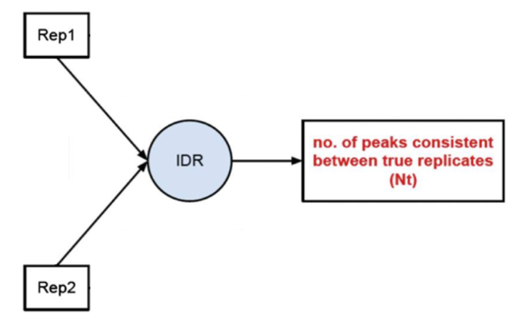

2) <u>Evaluate peak consistency between pooled pseudo-replicates</u>: merge the reads from the replicates and randomly split them into two psudo-replicates. The idea is that if the original replicates are highly concordant, then the pseudo-replicates resulted from shuffling and splitting should have similar number of peaks, suggesting a set of truly good replicates

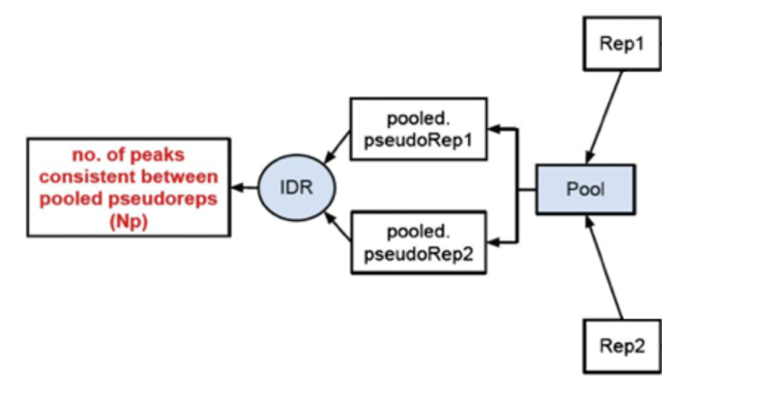

3) <u>Evaluate self-consistency for each individual</u>: this step creates pseudo-replicates for each replicate by randomly splitting the reads and running them through the pipeline. If the IDR on the self-replicates for Replicate 1 results in a peak count similar to self-replicate for Replicate 2, these are truly good replicates.

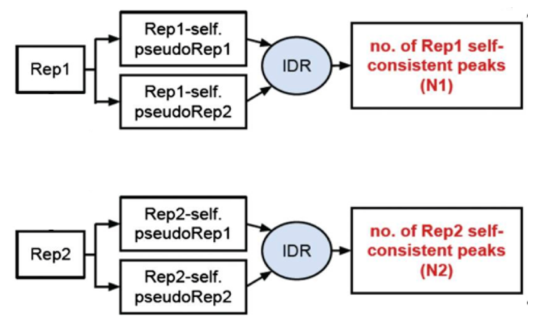

§ We will, however, be focusing on the first step, which is to assess the concordance of the true replicates. 

<span style="color:black; font-family:courier new">o There are a few criteria upon running the IDR. 

§ To run IDR, recommendation is to run the full dataset. 

§ We also need to run MACS2 less stringently to allow a larger set of peaks to be identified for each replicate

§ In addition, the resulting narrowPeak files have to be sorted by the <u>–log10(p-value)</u> column.

<span style="color:black; font-family:courier new">o # Call Peaks using a liberal p-value cutoff

$macs2 callpeak –t <treat_filename.bam> -c <input_control_filename.bam> -f BAM –g hs -n <prefix for output> -B --outdir <foldername> 2> <filename.log>

<span style="color:black; font-family:courier new">o # sort peak by –log10(p-value)

<span style="color:black; font-family:courier new">o $ sort –k8,8nr NAME_OF_INPUT_peaks.narrowPeak > NAME_OF_OUTPUT_peaks.narrowPeak

IDR

`module load gcc/8.2.0 python/anaconda3.6-5.2.0 idr/2.0.3`

`mkdir IDR` creates new directory called IDR in the results directory

`idr --samples Rep1_sorted_peak.narrowPeak Rep2_sorted_peak.narrowPeak --input-file-type narrowPeak --rank p.value --output-file Name_of_file --plot --log-output-file Name_of_file.log`

o The Output file format is similar to the input file type with 
some additional fields. First 10 columns are a standard narrowPeak file and are pertaining to the merged peaks across 
the two replicates. 

Column 5 contains the scaled IDR value. Min(int(log2(-125IDR), 1000)) for example means that peaks with an IDR of 0 
have score of 1000, peaks with an IDR of 0.05 have a score of 

int(-125log2(0.05)) = 540 and IDR of 1.0 has a score of 0.

Columns 11 and 12 correspond to the local and global IDR value respectively. 

Ø Global IDR is the value used to calculate the scaled IDR number in column 5. It is analogous to a multiple hypothesis 
correction on a p-value to compute an FDR.

Ø Local IDR is akin to the posterior probability of a peak belonging to the unreproducible noise component. 
Read [Paper](https://projecteuclid.org/euclid.aoas/1318514284) for more details.

Column 13 – 16 correspond to Replicate 1 peak data and 17 – 20 correspond to Replicate 2 peak data. 

count common peaks for each transcription factor

`wc –l *-idr` 

use ‘awk’ command to filter how many shared regions have an IDR<0.5 (high reproducibility)

`awk ‘{if($5 >= 540) print $0}’ Nanog-idr | wc –l`


o Output plots：

§ There is a single image file(.png), which contains four plots. 

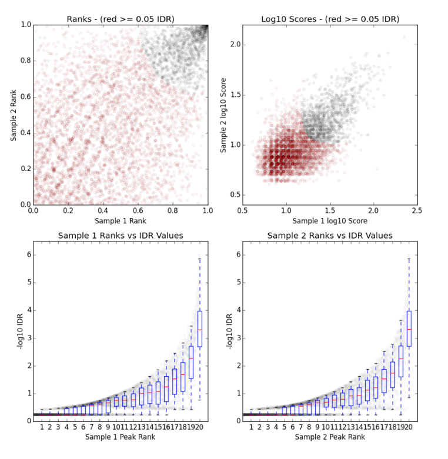

§ **Upper Left**: Replicate 1 peak ranks versus Replicate 2 peak ranks –peaks that do not pass the specified IDR 
threshold are colored red. 

§ **Upper Right**: Replicate 1 log10 peak scores versus Replicate 2 log10 peak scores –peaks that do not pass the 
specified IDR threshold are colored red

§ **Bottom Row**: Peak rank versus IDR scores are plotted in black. The overlayed boxplots display the distribution 
of idr values in each 5% quantile. The IDR values are thresholded at the optimization precision –1e-6 by default 


## Visualization and exploration of ChIP-seq data

For this step, we will generate the bigwig files. From there, the bigwig files will be used for visualizing the 
enrichment patterns at particular locations in the genome and evaluating regions of differential enrichment.
The bigWig format is an indexed binary format useful for dense, continuous data that can be displayed in a genome 
browser (i.e. IGV) as a graph/track, but is also used in the ‘deeptools’ as the input for the visualizations. It 
is converted from the BAM format.

Open interactive session with 6 cores 

Load modules 
```commandline
$ srun -n6 -t02:00:00 --pty --mem 8G bash

$ module load gcc/8.2.0 python/anaconda2.7-5.2.0 deeptools/3.1.2 samtools/1.9
```

In case you haven’t indexed the bam files containing all the unique reads, use samtools to do that.

`for **file** in /zfs1/fmu/chipseq_practice/results/sambamba/*unique.bam; do samtools index $file; done`

To create bigwig files there are two tools that can be used: ‘bamCoverage’ and ‘bamCompare’. The first take in a 
single BAM file and return a bigWig file. The latter allows to normalize two files to each other and return a single 
bigWig file. 

create a bigwig file for Nanog replicate 2 using bamCoverage command. 

See Parameters below 

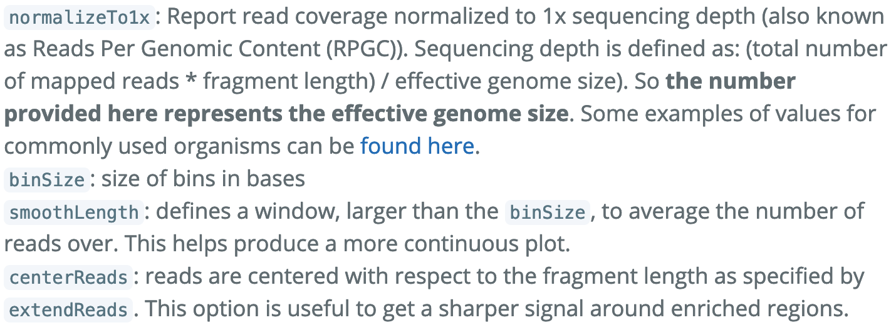

```commandline
$ bamCoverage –b /path/to/filename.bam \

–o <output_file_name.bw> \

--binSize 20 \

--normalizeTo1x 130000000 \

--smoothLength 60 \

--extendReads 150 \

--centerReads \ 

-p 6 2> <name_of_file.log>
```

With the bigwig files, you can use them to look at enrichment patterns in your data at specified regions. 
“Computematrix” accepts the multiple bigWig files and multiple regions files in BED format to create a count matrix, 
which is the intermediate file before plotting the data. You can either use the command to target scaled regions or 
values around a reference point. Computematrix will calculate scores based on the read density values in the 
bigWig files.


```commandline
reference-point \

-b 1000 –a 1000 \

-R <filename.bed> \

-S <filename_of_**all**_replicates.bw> \

-- skipZeros \

-o <output_filename.gz> \

-- outFileSortedRegions <output_filename.bed>
```

The genome regions in BED format can be obtained from the 
[UCSC table browser](http://rohsdb.cmb.usc.edu/GBshape/cgi-bin/hgTables). 

Using the matrix, we can create a profile plot, which essentially is a density plot that evaluates read density across 
all transcription start sites.

profile plot:

```commandline
$plotProfile –m <matrix_filename.gz> \

-out <output_img_filename.png> \

--perGroup \

--colors green purple \

--plotTitle “” --samplesLabel “Rep1” “Rep2” \

-T “<name of the title>”

-z “”
```

heatmap: create profile plot and heat maps in single plot

```commandline
$plotHeatmap –m <matrix_filename.gz> \

-out < output_img_filename.png> \

-- colorMap RdBu \

-- zMin 2 -- zMax 2
```

To gain a more complex picture of biological processes in a cell, you can also compare different datasets obtained by 
Chip-seq. In our case, we have peak calls from two different transcription factors: Nanog and Pou5f1. To look at the 
differences in binding between the two, we will use `bedtools`. 

Before using `bedtools` to obtain overlap, we need to combine information from the replicates of each transcription 
factors by using concatenation (`cat`)

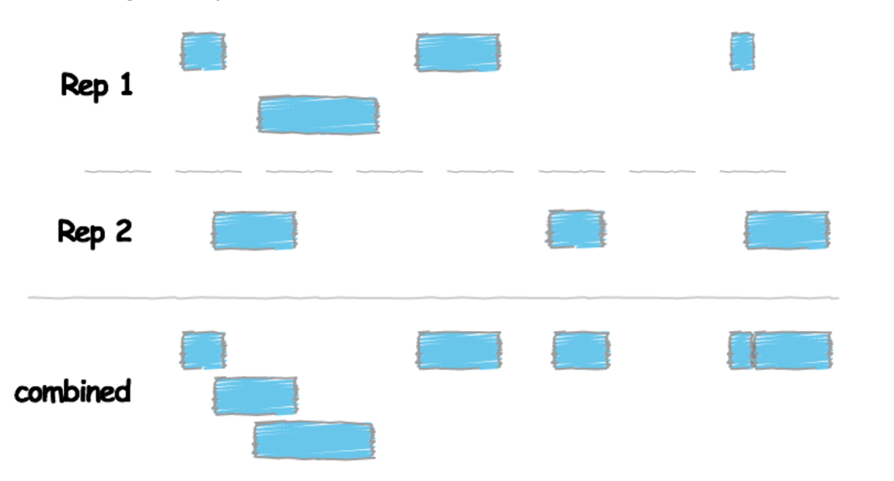

`cat <Rep1_Peak.narrowPeak> <Rep2_Peak.narrowPeak> > <Peaks_Combined.narrowPeak>`

Sort the peak file before merging the peaks. We use “sort” command to sort lines of text in a file. Remember to specify 
where sort keys start and where they end. For an example, `-k1,1` means first sort on the first column, and the 

`-k2, 2n` is to specify sort next on the second column and this column is numeric (n)


`sort –k1,1 –k2,2n <Peaks_Combined.narrowPeak> | bedtools merge –i -> <Peaks_Merged.bed>`

After merging the peaks, the next we are doing is to look for differences in enrichment between different transcription 
factors. The strategy here is to use bedtools intersect and specify modifier –v, which allows us to acquire unique 
peaks that are only present in one sample. 

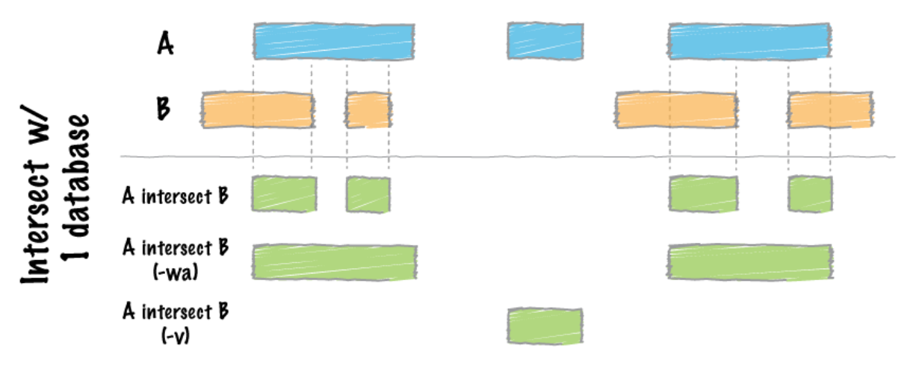

`bedtools intersect –a <Factor1_merged.bed> -b <factor2_merged.bed> -v > <Factor1_only_peaks.bed>`

we can count unique peaks 

`wc –l <Factor1_only_peaks.bed>`

we can visualize read density with commands from deepTools

```commandline
computeMatrix scale-regions -R <Factor1_only_peaks.bed> -S <All_factor1_replicates.bw> <All_factor2_replicates.bw> -- skipZeros –p 6 –a 500 –b 500 –o <output_filename.gz>`

plotProfile –m <output_filename.gz> -out <img_output_filename.png> -- perGroup --plotTitle “” -- samplesLabel “Factor1-replicate1” “Factor1-replicate2” “Factor2-replicate1” “Factor2-replicate2” –T “Title” –z “” -- startLabel “” -- endLabel “” – colors red red darkblue darkblue`
```

## Qualitative Assessment with IGV

o Visualize the alignment using a genome browser – Integrated Genomics Viewer (IGV). IGV allows the exploration of 
large, integrated genomic datasets. It supports wide variety of datatypes, including array-based and next-generation 
sequence data, and genomic annotations, which facilitates invaluable comparisons. The first step of using the IGV to 
annotate our data is to transfer the bigWig and BED files from the cluster to the local computer where the IGV is 
installed. To do that, go back to the previous instructions on how to commute files from remote device to local 
computer using Rsync or Filezilla.

o In the IGV, we will load Human genome (hg19) and then load our bigWig files and BED files. Remember to “Autoscale” 
each track before looking at specific genes. To do that, right click on the left-hand side. There should be many 
option available to you. Check Autoscale if it is not checked.

Motif Discovery, Annotation and Functional Enrichment:

o Since we have identified the binding site, which is the enriched region between our control and the transcription 
factor, we will proceed to the downstream analyses including determining the binding motifs for the protein of interest 
and identifying which genes are associated with the binding sites and exploring the possibility of associated 
enrichment of processes, pathways, or networks.

o To start, we will run an interactive session and proceed to extract the first three columns of the IDR peak calls. 
To do that, we will run the command below.

`cut –f 1,2,3 Nanog-idr-merged.bed > Nanog-idr-merged-great.bed`

Then we use bedtools and specifically the function ‘getfasta’ to retrieve the sequences from a reference fasta file for 
coordinates defined in the BED file.

`bedtools getfasta –fi <Ref_Fasta.fa> -bed Nanog-idr-merged-great.bed –fo Nanog-idr-merged-dreme.fasta`

Next, we transfer the file form the cluster to the local machine using Rsync or Filezilla

o Functional Enrichment Analysis: We will then use [GREAT](http://bejerano.stanford.edu/great/public/html/index.php) to 
perform the functional enrichment analysis. Basically, GREAT will take the list of enriched regions, associate with the 
nearby genes, and then analyzes the gene annotations to assign biological meaning to the data. In GREAT, choose the 
Nanog-idr-merged-great.bed file and check the whole genome for background regions. Click Submit. GREAT provides the 
output in HTML format organized by sections. Next, expand the “job description” section and select 
“View all genomic region-gene association.” Note that each associated gene is listed with location from the 
transcriptions start sites as shown below. You have the option to download the genes associated with the binding 
sites, or you can view all the binding sites on a custom track in the UCSC Genome Browser.

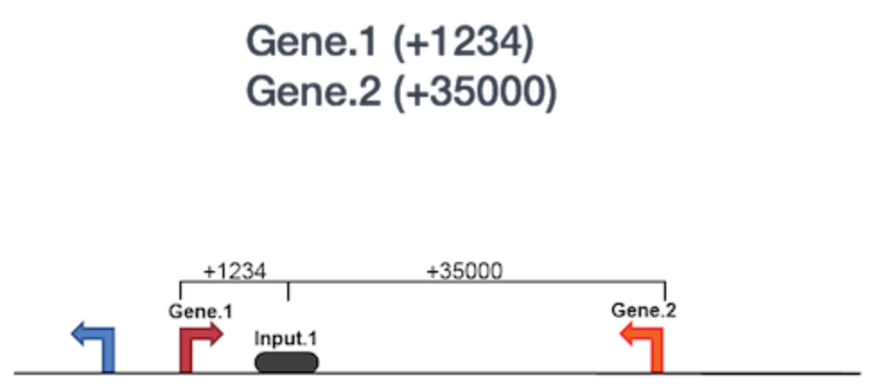

If you scroll down, there will be many more sections available. The “Region-Gene Association Graphs” display the 
summary of the number of genes associated with each binding site and the binding site locations relative to the 
transcription start sites of the associated genes. Below that is the “Global Controls” section, where you can select 
the annotation information to display. Keep the default settings and scroll down to view the information displayed. 
In the next section, you can explore the “GO Biological Process terms” associated with binding sites. You can click 
on any of the term, and it will display a summary information about binding sites for you Transcription factor 
associated with this GO term.

o Motif Discovery: To identify over-represented motifs, we will use DREME, a motif discovery algorithm designed 
to find short, core DNA-binding motifs (4 to 8 nts) of eukaryotic transcription factors and is optimized to handle 
large ChIP-seq datasets. DREME only looks for short motifs, and as a drawback, it is very likely to miss wider motifs. 
Visit [DREME](http://meme-suite.org/tools/dreme) and select the “Nanog-idr-merged-dreme.fasta” as the input. Enter 
your email so you will get a notification when the job is done. Also, you can write a job description to identify the 
task. The job will take some times to run. when it is done, you will receive a HTMl output on the website, which 
provides a list of Discovered Motifs displayed in sequence logos (in both forward and reverse complement i.e. RC) 
along with an E-value for the significance of the result. 

o Motif aligning to the known motifs: Using **Tomtom** (also a part of the meme suite), you can search whether the 
identified motifs resemble the binding motifs of known transcription factors in the databases. Tomtom returns the 
potential matches and provides a statistical measure of motif-motif similarity.

o Click on the Submit/Download button for the motif of your selection in the DREME output

o Select Tomtom as the program and click submit in the dialog box

o Tomtom allows you to select the database you wish to search against. Keep the default, but remember you are able to 
change the options at your own wishes given different circumstances.

o Enter your email address and job description and start the search.

o Wait for Tomtom to email the results if you have your email address filled out.

o The next tool is also a part of the MEME Suite, the MEME-ChIP, and the good news is it is designed specifically for 
ChiP-seq analysis. MEME-ChIP performs DREME and Tomtom analysis in addition to using tools to assess which motifs are 
most centrally enriched (motifs should be centered in the peaks) and to combine related motifs into similar clusters. 
It is capable of identify longer motifs (<30bp).
