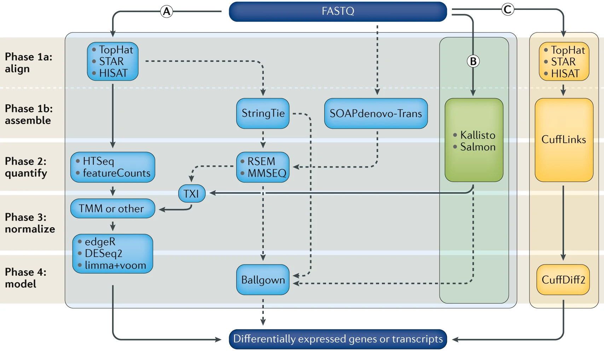

# RNASeq Data Analysis

## Introduction to RNA sequencing

High-throughput sequencing of mRNA (RNA-Seq) has become the standard methods for measuring and comparing the levels of 
gene expression in a wide variety of species and conditions. The RNA-seq method typically consists of identification of 
suitable biological samples (and replicates), isolation of total RNA, enrichment of non-ribosomal RNAs, conversion of 
RNA to cDNA, construction of a fragment library, sequencing on a high-throughput sequencing platform, generation of 
single or paired-end reads of 30–300 base pairs in length, alignment or assembly of these reads, and downstream 
analysis.

RNA-seq experiments must be analyzed with accurate, efficient software that is carefully designed to handle the very 
large sequencing volumes generated by most experiments. The data analysis pipelines can be conceptually divided into six 
steps.

Step 1: Evaluate and manipulate Raw data

Step 2: Map to reference, assess results

Step 3: Assemble transcripts

Step 4: Quantify transcripts

Step 5: Test for differential expression

Step 6: Visualize and perform other downstream analysis

I provided several RNA-seq pipelines with examples scripts using the recent software tools. All software have been 
installed on HTC cluster. If you need personalized consultation for RNASeq data analysis workflow and selection of 
better pipelines, please contact Dr. Fangping Mu at [fangping@pitt.edu](mailto:fangping@pitt.edu).



Computational analysis for differential gene expression (DGE) begins with raw RNA sequencing (RNA-seq) reads in FASTQ 
format and can follow a number of paths. Three popular workflows (A, B and C, represented by the solid lines) are given
as examples, and some of the more common alternative tools (represented by the dashed lines) are indicated. 
In workflow A, aligners such as TopHat, STAR or HISAT2 use a reference genome to map reads to genomic locations, and 
then quantification tools, such as HTSeq and featureCounts, assign reads to features. After normalization (usually 
using methods embedded in the quantification or expression modelling tools, such as trimmed mean of M-values (TMM)) 
gene expression is modelled using tools such as edgeR, DESeq2 and limma+voom, and a list of differentially expressed 
genes or transcripts is generated for further visualization and interpretation. In workflow B, newer, alignment-free 
tools, such as Kallisto and Salmon, assemble a transcriptome and quantify abundance in one step. The output from these 
tools is usually converted to count estimates (using tximport (TXI)) and run through the same normalization and 
modelling used in workflow A, to output a list of differentially expressed genes or transcripts. Alternatively, 
workflow C begins by aligning the reads (typically performed with TopHat, although STAR and HISAT can also be used), 
followed by the use of CuffLinks to process raw reads and the CuffDiff2 package to output transcript abundance 
estimates and a list of differentially expressed genes or transcripts. Other tools in common use include StringTie, 
which assembles a transcriptome model from TopHat (or similar tools) before the results are passed through to RSEM 
or MMSEQ to estimate transcript abundance, and then to Ballgown157 to identify differentially expressed genes or 
transcripts, and SOAPdenovo-trans, which simultaneously aligns and assembles reads for analysis via the path of choice. 
Stark, R., Grzelak, M. & Hadfield, J. RNA sequencing: the teenage years. Nat. Rev. Genet. (2019). 
doi:10.1038/s41576-019-0150-2

## Setting up

Since you are going to be working on our remote cluster, HTC, we first need to log in. Macs have a utility application 
called “Terminal” for performing tasks on the command line (shell), both locally and on remote machines. With Windows, 
You can also use Putty to log in to remote machines from Windows computers.

Type in the following command with your username to login:

```commandline
ssh username@htc.crc.pitt.edu
```
You will receive a prompt for your password, and you should type in your associated password; note that the cursor 
will not move as you type in your password.

A warning might pop up the first time you try to connect to a remote machine, type “Yes” or “Y”.

Once logged in, you should see the command prompt:
```commandline
[fangping@login0b ~]$
```

## Reference Genome

Reference genome - The nucleotide sequence of the chromosomes of a species. Genes are the functional units of a 
reference genome and gene annotations describe the structure of transcripts expressed from those gene loci.

Obtain a reference genome from [Ensembl](https://www.ensembl.org/info/data/ftp/index.html), 
[UCSC](https://hgdownload.cse.ucsc.edu/downloads.html), 
NCBI or [iGenomes](https://support.illumina.com/sequencing/sequencing_software/igenome.html).

Ensembl Homo_sapiens GRCh38 reference genome and various indices have been installed at 
`/bgfs/genomics/refs/rnaseq_refs/Homo_sapiens/Ensembl/GRCh38`

I will show you how to download the human GRCh38 version of the genome from Ensembl.

The complete data from which these files were obtained can be found at: 
[ftp://ftp.ensembl.org/pub/release-100/fasta/homo_sapiens/dna/](ftp://ftp.ensembl.org/pub/release-86/fasta/homo_sapiens/dna/">ftp://ftp.ensembl.org/pub/release-100/fasta/homo_sapiens/dna/). 
You can find various Homo sapiens genome assembly. Which one should I use? The options available can be a bit 
overwhelming. 'dna' - unmasked genomic DNA sequences. 'dna_rm' - masked genomic DNA. Interspersed repeats and low 
complexity regions are detected with the RepeatMasker tool and masked by replacing repeats with 'N's. 
'dna_sm' - soft-masked genomic DNA. All repeats and low complexity regions have been replaced with lowercase 
versions of their nucleic baseFor NGS data pipelines, you can choose "Homo_sapiens.GRCh38.dna.primary_assembly.fa.gz" 
or "Homo_sapiens.GRCh38.dna_sm.primary_assembly.fa.gz" from Ensembl. The files with "sm" in the name are "soft masked" 
which means instead of the repeat regions being given Ns, they are converted to lower-case. These are OK to use because
most major aligners recognize lower-case letters as valid bases. Primary assembly contains all toplevel sequence regions
excluding haplotypes and patches. This file is best used for performing sequence similarity searches where patch and 
haplotype sequences would confuse analysis.

!!! note
    
    DO NOT use 'dna_rm' files as your reference genome.

File names with Toplevel contains all sequence regions flagged as toplevel in an Ensembl schema. 
This includes chromosomes, regions not assembled into chromosomes and N padded haplotype/patch regions. 
DO NOT use these files as your reference genome.

You could use wget to download the Homo_sapiens.GRCh38.dna_sm.primary_assembly.fa.gz file, then unzip/untar.

```commandline
cd /bgfs/genomics/refs/rnaseq_refs/Homo_sapiens/Ensembl # you cannot write to this folder, go to your group's bgfs folder
mkdir GRCh38
cd GRCh38
wget ftp://ftp.ensembl.org/pub/release-100/fasta/homo_sapiens/dna/Homo_sapiens.GRCh38.dna.primary_assembly.fa.gz
gunzip Homo_sapiens.GRCh38.dna.primary_assembly.fa.gz
```

Instead of the above, you might consider getting reference genomes and associated annotations from 
UCSC [http://hgdownload.cse.ucsc.edu/goldenPath/hg38/bigZips/](http://hgdownload.cse.ucsc.edu/goldenPath/hg38/bigZips/)

```commandline
wget <a href="https://hgdownload.cse.ucsc.edu/goldenPath/hg38/bigZips/hg38.fa.gz" title="https://hgdownload.cse.ucsc.edu/goldenPath/hg38/bigZips/hg38.fa.gz">https://hgdownload.cse.ucsc.edu/goldenPath/hg38/bigZips/hg38.fa.gz</a>
gunzip hg38.fa.gz
```

### If I cannot find primary assembly for my species, how should I proceed?

For example, ensembl pig genome assembly 
(<a href="ftp://ftp.ensembl.org/pub/release-92/fasta/sus_scrofa/dna/">ftp://ftp.ensembl.org/pub/release-92/fasta/sus_scrofa/dna/</a> ) 
does not have the primary assembly. For this case, you need to build your own reference genome from chromosomes.

Download "Sus_scrofa.Sscrofa11.1.dna.chromosome.*.fa.gz" from emsembl ftp site. Replace * with 1-18, MT, X, Y and 
non-chromosomal. Unzip all files and concatenate them to generate the primary assembly.

```commandline
cat Sus_scrofa.Sscrofa11.1.dna.chromosome.*.fa > Sscrofa11.fasta
```

## Annotation

Gene annotations - Descriptions of gene/transcript models for a genome. A transcript model consists of the coordinates 
of the exons of a transcript on a reference genome. Additional information such as the strand the transcript is 
generated from, gene name, coding portion of the transcript, alternate transcript start sites, and other information 
may be provided. GTF (.gtf) file is a common file format referred to as Gene Transfer Format used to store gene and 
transcript annotation information.

To obtain known gene/transcript annotations, you can use Ensembl 
(<a href="http://useast.ensembl.org/info/data/ftp/index.html" title="http://useast.ensembl.org/info/data/ftp/index.html">https://useast.ensembl.org/info/data/ftp/index.html</a>) 
or UCSC.

### Use ENSEMBL FTP SITE

Use the following commands to download Ensembl release 100 Homo sapiens GRCh38 gene annotation.

```commandline
wget <a href="ftp://ftp.ensembl.org/pub/release-100/gtf/homo_sapiens/Homo_sapiens.GRCh38.100.gtf.gz" title="ftp://ftp.ensembl.org/pub/release-100/gtf/homo_sapiens/Homo_sapiens.GRCh38.100.gtf.gz">ftp://ftp.ensembl.org/pub/release-100/gtf/homo_sapiens/Homo_sapiens.GRCh38.100.gtf.gz</a>
gunzip Homo_sapiens.GRCh38.100.gtf.gz
```


### Use UCSC TABLE BROWSER

Based on UCSC annotations or several other possible annotation sources collected by UCSC. You might choose this option 
if you want to have a lot of flexibility in the annotations you obtain.

<ul>
	<li>Open the following in your browser: <a href="https://genome.ucsc.edu/" title="https://genome.ucsc.edu/">https://genome.ucsc.edu/</a></li>
	<li>Select 'Tools' and then 'Table Browser' at the top of the page.</li>
	<li>Select 'Mammal', 'Human', and 'Dec. 2013 (GRCh38/hg38)' from the first row of drop down menus.</li>
	<li>Select 'Genes and Gene Predictions' and 'GENCODE v24' from the second row of drop down menus.</li>
	<li>Select ‘knownGene’ from the third row of drop down menus. Select ‘genome’ from the fourth row.</li>
	<li>Select 'GTF - gene transfer format' for output format and enter 'hg38_UCSC_Genes.gtf' for output file.</li>
	<li>Hit the 'get output' button and save the file. Make note of its location.</li>
</ul>

### Important note on chromosome naming conventions

In order for your RNA-seq analysis to work, the chromosome names in your .gtf file must match those in your reference 
genome (i.e. your reference genome fasta file). Unfortunately, Ensembl, NCBI, and UCSC can not agree on how to name the 
chromosomes in many species, so this problem may come up often. You can avoid this by getting a complete reference 
genome and gene annotation package from the same source (e.g., Ensembl) to maintain consistency.

### Important note on reference genome builds

Your annotations must correspond to the same reference genome build as your reference genome fasta file. e.g., both 
correspond to UCSC human build 'hg38', NCBI human build 'GRCh38', etc. Even if both your reference genome and 
annotations are from UCSC or Ensembl they could still correspond to different versions of that genome. This would 
cause problems in any RNA-seq pipeline.

There are several commons sources to obtain the reference genome, each with minor (but important differences). The 
following summarizes some of the commonly selected options and notes and distinguishing features (e.g. use of ‘chr’ 
in chromosome names, naming style for unplaced contigs, inclusion of alternative haplotype sequences, use and nature 
of “decoy” sequences, use of lowercase to indicate repeat elements in the genome, etc.).

<table>
	<thead>
		<tr>
			<th>Name (link)</th>
			<th>Description</th>
		</tr>
	</thead>
	<tbody>
		<tr>
			<td><a href="ftp://ftp.1000genomes.ebi.ac.uk/vol1/ftp/technical/reference/GRCh38_reference_genome/">1000 Genomes reference</a></td>
			<td>Used in this course. The 1000g reference names chromosomes as follows (chr1, chr2, .., chr22, chrX, chrY, chrM). This reference includes “decoy” sequences (mostly low complexity sequences) that have been added to the standard genome build sequence. This reduces misalignment of reads that would otherwise get placed somewhere they don’t belong. The developer of the BWA aligner documents use of this version of the reference genome. This reference includes the alternative contigs.</td>
		</tr>
		<tr>
			<td><a href="ftp://ftp.ensembl.org/pub/release-100/fasta/homo_sapiens/dna/">Ensembl reference</a></td>
			<td>Ensembl names the chromosomes as follows (1, 2, .., 22, X, Y, MT). The names of some unplaced contigs also differ. This reference does NOT have the decoy sequences. This reference includes the alternative contigs.</td>
		</tr>
		<tr>
			<td><a href="https://hgdownload.soe.ucsc.edu/goldenPath/hg38/chromosomes/">UCSC reference</a></td>
			<td>The UCSC reference names chromosomes as follows (chr1, chr2, .., chr22, chrX, chrY, chrM). This reference does NOT have the decoy sequences. This reference includes the alternative contigs.</td>
		</tr>
		<tr>
			<td><a href="ftp://ftp.ncbi.nih.gov/genomes/Homo_sapiens">NCBI reference</a></td>
			<td>NCBI names the chromosomes as follows (chr1, chr2, .., chr22, chrX, chrY, chrMT). This reference does NOT include the decoy sequences. This reference includes the alternative contigs. The major annotation centers such as UCSC and Ensembl start with raw files from NCBI (<a href="ftp://ftp.ncbi.nlm.nih.gov/genomes/all/GCA/000/001/405/">Various Human Assemblies</a>). Most other people do not use these NCBI files directly but rather get a version of the files from UCSC, Ensembl, etc.</td>
		</tr>
		<tr>
			<td><a href="https://gdc.cancer.gov/about-data/data-harmonization-and-generation/gdc-reference-files">Genomic Data Commons (GDC) reference</a></td>
			<td>The GDC reference names chromosomes as follows (chr1, chr2, .., chr22, chrX, chrY, chrM). The GDC created their own version of the reference for harmonized analysis of the TCGA and other large cancer sequencing projects. This reference includes “decoy” sequences. This reference does NOT include the alternative contigs. Unique to this reference is the inclusion of several virus sequences for viruses with known or suspected roles in cancer (e.g. HPV, EBV, etc.).</td>
		</tr>
	</tbody>
</table>

## Indexing

Within your ‘ref’ directory, there are two files ‘Homo_sapiens.GRCh38.dna.primary_assembly.fa’ and 
‘Homo_sapiens.GRCh38.100.gtf’.

All aligners require the reference sequence to be indexed -- this is a process that creates additional files that 
describe the reference file, such as where each chromosome is located in the file. Knowing this information speeds 
up alignment.

In this step, user supplied the reference genome sequences (FASTA file) and annotations (GTF file), from which aligner 
generate genome indexes that are utilized in the mapping step. The genome indexes are saved to disk and need only be 
generated once for each genome/annotation combination.

At each aligner’s website, a limited collection of genome indexes is available. For example, 
STAR (<a href="http://labshare.cshl.edu/shares/gingeraslab/www-data/dobin/STAR/STARgenomes/" title="http://labshare.cshl.edu/shares/gingeraslab/www-data/dobin/STAR/STARgenomes/">http://labshare.cshl.edu/shares/gingeraslab/www-data/dobin/STAR/STARgeno...</a>), 
HISAT2 (<a href="https://ccb.jhu.edu/software/hisat2/index.shtml" title="https://ccb.jhu.edu/software/hisat2/index.shtml">https://ccb.jhu.edu/software/hisat2/index.shtml</a>), 
however, it is strongly recommended that users generate their own genome indexes with most up-to-date assemblies and 
annotations.

Consult aligner manual to generate genome indexes. Provided is an example to generate HISAT2 indexes for 
Homo_sapiens.GRCh38.86 genome and annotation.

Extract splice sites and exons from GRCh38.86 annotation file. Run the following command on HTC login node.

```commandline
Phantom-Macbook-Pro:~ fangping$ ssh fangping@htc.crc.pitt.edu
fangping@htc.crc.pitt.edu's password:
Last login: Mon Jul 13 15:49:23 2020 from 10.25.0.128
[fangping@login0b ~]$ cd /bgfs/genomics/refs/rnaseq_refs/Homo_sapiens/Ensembl/GRCh38 # go to your refs folder
[fangping@login0b GRCh38]$ module load hisat2/2.2.0
[fangping@login0b GRCh38]$ extract_splice_sites.py Homo_sapiens.GRCh38.100.gtf > grch38.ss
[fangping@login0b GRCh38]$ extract_exons.py Homo_sapiens.GRCh38.100.gtf > grch38.exon
```

Type ls, you can find two new files grch38.ss and grch38.ss

```commandline
[fangping@login0b GRCh38]$ ls grch38.*
grch38.exon  grch38.ss
```

To build HISAT2 index, you need to submit the following slurm job to HTC cluster.

```commandline
#!/bin/bash
#
#SBATCH --job-name=hisat2_index
#SBATCH -N 1 # Ensure that all cores are on one machine
#SBATCH -t 3-00:00 # Runtime in D-HH:MM

#SBATCH --cpus-per-task=16 # Request that ncpus be allocated per process.
#SBATCH --mem=230g # Memory pool for all cores (see also --mem-per-cpu)
#SBATCH --output=hisat2_build.out

module load hisat2/2.2.0

hisat2-build -p 16 --ss grch38.ss --exon grch38.exon Homo_sapiens.GRCh38.dna.primary_assembly.fa grch38_tran
```

!!! note

    WARNING: In order to index the entire human genome, HISAT2 requires at least 160GB of RAM, and several hours.

To create or edit files we will need to use a text editor. When working remotely, we need a text editor that functions 
from the command line interface. Within these editors, since you cannot ‘point-and-click’, you must navigate the 
interface using the arrow keys and shortcuts.

While there are simpler editors available for use (i.e. nano), most computational scientists tend to favor editors 
that have greater functionality. Some popular editors include Emacs, Vim, or a graphical editor such as Gedit. These 
are editors which are generally available for use on high-performance compute clusters. You can use nano to generate 
slurm job script.

```commandline
[fangping@login0b GRCh38]$ nano hisat2_build.sbatch
```

Copy the above job script, and paste to the screen (Command + v). Ctrl + o to write to the file, and then Ctrl + x to 
exit.

To submit the job to the HTC cluster.

```commandline
[fangping@login0b GRCh38]$ sbatch hisat2_build.sbatch
Submitted batch job 1058651
```

This job can take several hours. When the job is finished, you should find eight files named grch38_tran.1.ht2 to 
grch38_tran.8.ht2 with the ref directory. These are the HISAT2 index files.

STAR is a splice-aware aligner that will produce gapped alignments to handle reads that span exon-intron junctions. 
Thus, it is only appropriate when an annotated reference genome is available. To build STAR index, submit the following 
slurm job to HTC cluster.

```commandline
#!/bin/bash
#
#SBATCH --job-name=STAR_index
#SBATCH -N 1 # Ensure that all cores are on one machine
#SBATCH -t 3-00:00 # Runtime in D-HH:MM

#SBATCH --cpus-per-task=16 # Request that ncpus be allocated per process.
#SBATCH --mem=230g # Memory pool for all cores (see also --mem-per-cpu)
#SBATCH --output=star_index.out

module load star/2.7.5a

mkdir -p grch38_star_index_2.7.5a

STAR --runMode genomeGenerate --runThreadN 16 \
  --genomeDir ./grch38_star_index_2.7.5a/ \
  --genomeFastaFiles Homo_sapiens.GRCh38.dna.primary_assembly.fa \
  --sjdbGTFfile Homo_sapiens.GRCh38.100.gtf
```


## RNA-seq Data

The test data consists of 6 RNA-seq samples from the following paper.

Pulikkan JA, Hegde M, Ahmad HM, Belaghzal H et al. CBFβ-SMMHC Inhibition Triggers Apoptosis by Disrupting MYC Chromatin 
Dynamics in Acute Myeloid Leukemia. Cell 2018 Jun 28;174(1):172-186.e21. 
PMID: <a href="https://www.ncbi.nlm.nih.gov/pubmed/29958106" title="Link to PubMed record">29958106</a>

In the experiment, ME-1 cells were treated with DMSO/ AI-10-49 (1uM) for six hours, followed by RNA isolation. RNA 
libraries were sequenced using 90bp paired end reads on an Illumina HiSeqTM 2000.Three independent experiments were 
conducted for DMSO as well as AI-10-49 treatments. For more description of the experiment see the PubMed entry 
29958106 and for raw data see the GEO entry GSE101788.

<a href="https://www.ncbi.nlm.nih.gov/geo/query/acc.cgi?acc=GSE101788">https://www.ncbi.nlm.nih.gov/geo/query/acc.cgi?acc=GSE101788</a>

Click the above link and click “SRA Run Selector” at the bottom. Click "Accession List" to download SRR_Acc_List.txt 
and "Metadata" to download SraRunTable.txt

You can download the FASTQ files from the Sequence Read Archive, the identifiers would be SRA run IDs, e.g. SRR5861494. 
You should have two files for a paired-end experiment for each ID, SRR5861494_1.fastq.gz and SRR5861494_2.fastq.gz, 
which give the first and second read for the paired-end fragments.

```commandline
cd /bgfs/genomics/fangping/RNASeq # go to a folder
mkdir fastqs
```

Choose a method from this <a href="/managingdata">managing and moving data</a> and transfer the SRR_Acc_List.txt and 
SraRunTable.txt from your computer to the new folder.

To extract fastq files from the GEO data, use NCBI's program toolkit. It's already installed on HTC cluster and can be 
loaded with module load sra-toolkit/2.10.8. Default configuration of sra-toolkit will use your home directory ~/ncbi 
as your download/cache area for downloaded files and references. Your home directory has 75GB quota.

You should run the configuration tool to set up your download/cache are.

```commandline
[fangping@login0b fastqs]$ module load sra-toolkit/2.10.8
[fangping@login0b fastqs]$ vdb-config -i # run this command once
```

The fastq-dump command produces two compressed fastq files for each dataset, for the forward and reverese reads. 
Within your fastqs folder, generate a text file fastq_dump.sbatch with the following contents. Then submit the job to 
the HTC cluster.

```commandline
sbatch fastq_dump.sbatch

[fangping@login0b fastqs]$ cat fastq_dump.sbatch
#!/bin/bash
#
#SBATCH --job-name=fastq_dump
#SBATCH -N 1
#SBATCH --cpus-per-task=1 # Request that ncpus be allocated per process.
#SBATCH -t 1-00:00 # Runtime in D-HH:MM
#SBATCH --output=fastq_dump-%A_%a.out
#SBATCH --array=0-5 # job array index

module load sra-toolkit/2.10.8

names=($(cat SRR_Acc_List.txt))

echo ${names[${SLURM_ARRAY_TASK_ID}]}

prefetch ${names[${SLURM_ARRAY_TASK_ID}]}

vdb-validate ${names[${SLURM_ARRAY_TASK_ID}]}

fastq-dump --split-e --origfmt --gzip ${names[${SLURM_ARRAY_TASK_ID}]}
```


Check fastq-dump options at <a href="https://ncbi.github.io/sra-tools/fastq-dump.html. ">https://ncbi.github.io/sra-tools/fastq-dump.html. </a> 
You can also run "fastq-dump -h" to check options. --split-e 3-way splitting for mate-pairs. For each spot, if there 
are two biological reads satisfying filter conditions, the first is placed in the `*_1.fastq` file, and the second is 
placed in the `*_2.fastq` file. If there is only one biological read satisfying the filter conditions, it is placed in 
the `*.fastq` file.All other reads in the spot are ignored. `--origfmt` Defline contains only original sequence name. 
`--gzip` Compress output using gzip.

This job uses job array to submit and manage collections of similar jobs quickly and easily. 
Refer to <a href="/multiplejobs">this documentation</a>.

### Your own data

If you received your own data, contact the data provider to understand whether the data is paired-end or single-end 
sequencing reads, strand-specific or non-strand-specific RNAseq. Common preprocessing tasks are listed below.

Unzip fastq.gz to fastq files.

```commandline
gunzip filename.fastq.gz
```

Merge multilanes fastq files.

```commandline
cat 1_S1_L001_R1_001.fastq 1_S1_L002_R1_001.fastq 1_S1_L003_R1_001.fastq 1_S1_L004_R1_001.fastq > 1_R1.fastq
```

or

```commandline
zcat 1_L001_R1_001.fastq.gz 1_L002_R1_001.fastq.gz 1_L003_R1_001.fastq.gz 1_L004_R1_001.fastq.gz | gzip > 1_R1.fastq.gz
```

Convert fastq file to fastq.gz file.

```commandline
gzip 1_R1.fastq
```

If you have many samples to merge, job arrays are recommended. For example, the following batch job merge 10 four lanes 
samples.

```commandline
#!/bin/bash
#
#SBATCH --job-name=cat
#SBATCH -N 1
#SBATCH --cpus-per-task=1 # Request that ncpus be allocated per process.
#SBATCH -t 1-00:00 # Runtime in D-HH:MM
#SBATCH --output=cat-%A_%a.out
#SBATCH --array=1-10 # job array index

zcat ${SLURM_ARRAY_TASK_ID}_L001_R1_001.fastq.gz ${SLURM_ARRAY_TASK_ID}_L002_R1_001.fastq.gz ${SLURM_ARRAY_TASK_ID}_L003_R1_001.fastq.gz ${SLURM_ARRAY_TASK_ID}_L004_R1_001.fastq.gz | gzip > ${SLURM_ARRAY_TASK_ID}_R1.fastq.gz
```

## PreAlignment QC

To get a sense of your data quality before alignment, 
[FastQC](http://www.bioinformatics.babraham.ac.uk/projects/fastqc/) provides a simple way to do some quality control 
checks on raw sequence data coming from high throughput sequencing pipelines. 
[Video tutorial of FastQC](http://www.youtube.com/watch?v=bz93ReOv87Y)

Under your RNASeq folder, there is a single folder fastqs. Let's create two folder jobs and results.

```commandline
[fangping@login0b RNASeq]$ mkdir jobs
[fangping@login0b RNASeq]$ mkdir results
[fangping@login0b RNASeq]$ ls
fastqs  jobs  results
```

You can write your jobs scripts in jobs folder:

```commandline
cd jobs 
```

Submit the following batch job to run FastQC on your fastq files

```commandline
[fangping@login0b jobs]$ cat 1.fastqc.sbatch
#!/bin/bash
#
#SBATCH --job-name=fastqc
#SBATCH -c 1
#SBATCH -t 1-00:00 # Runtime in D-HH:MM
#SBATCH --output=fastqc-%A_%a.out
#SBATCH --array=0-5 # job array index

module purge
module load fastqc/0.11.9

names=($(cat ../fastqs/SRR_Acc_List.txt))

echo ${names[${SLURM_ARRAY_TASK_ID}]}

mkdir -p ../results/fastqc

fastqc -o ../results/fastqc ../fastqs/${names[${SLURM_ARRAY_TASK_ID}]}_1.fastq.gz
fastqc -o ../results/fastqc ../fastqs/${names[${SLURM_ARRAY_TASK_ID}]}_2.fastq.gz

[fangping@login0b jobs]$ sbatch 1.fastqc.sbatch # submit the job
```

You can download the *_fastqc.html files within ../results/fastqc to view the FastQC report. You can also use the
interactive desktop on open ondemand to view the html files.

## Trimming Adaptor

FastQC gave you warning when overrepresented sequences were in first 200,000 sequences. The overrepresented 
sequences can provide you the information which adaptors are used.

Here is the documentation of Illumina Adaptor 
Sequences: <a href="https://support.illumina.com/bulletins/2016/12/what-sequences-do-i-use-for-adapter-trimming.html" title="What sequences do I use for adaptor trimming?">What 
sequences do I use for adaptor trimming?</a>

Some third-party tools require the adapter sequence for trimming be specified separately. The recommended sequences to 
use for each Illumina kit are as follows.

TruSeq LT and TruSeq HT-based kits:

Read 1: AGATCGGAAGAGCACACGTCTGAACTCCAGTCA

Read 2: AGATCGGAAGAGCGTCGTGTAGGGAAAGAGTGT

ScriptSeq and TruSeq DNA Methylation:

Read 1: AGATCGGAAGAGCACACGTCTGAAC

Read 2: AGATCGGAAGAGCGTCGTGTAGGGA

TruSeq Small RNA:

TGGAATTCTCGGGTGCCAAGG

TruSeq Ribo Profile:

AGATCGGAAGAGCACACGTCT

AmpliSeq, Nextera, Nextera DNA Flex, Nextera DNA, Nextera XT, Nextera Enrichment, Nextera Rapid Capture Enrichment, 
TruSight Enrichment, TruSight Rapid Capture Enrichment, TruSight HLA:

CTGTCTCTTATACACATCT

Nextera Mate Pair:

CTGTCTCTTATACACATCT+AGATGTGTATAAGAGACAG

Here is a 
[documentation to De-Mystify Illumina TruSeq DNA Adapters](http://tucf-genomics.tufts.edu/documents/protocols/TUCF_Understanding_Illumina_TruSeq_Adapters.pdf)

Trim Galore! is a wrapper script to automate quality and adapter trimming as well as quality control. Trim Galore! will
analyse the first 1 million sequences of the first specified file and attempt to find the first 12 or 13bp of the 
following standard adapters:

Illumina: AGATCGGAAGAGC

Small RNA: TGGAATTCTCGG

Nextera: CTGTCTCTTATA

If no adapter can be detected within the first 1 million sequences Trim Galore defaults to --illumina. The 
auto-detection behaviour can be overruled by specifying an adapter sequence manually or by 
using --illumina, --nextera or --small_rna.

You can use the following job arrays to trim adaptors from the 6 samples. The sample names are listed in 
file ../fastqs/SRR_Acc_List.txt.

```commandline
[fangping@login0b jobs]$ cat 2.trim.sbatch
#!/bin/bash
#
#SBATCH --job-name=trim
#SBATCH -c 1
#SBATCH -t 1-00:00 # Runtime in D-HH:MM
#SBATCH --output=trim-%A_%a.out
#SBATCH --array=0-5 # job array index

module load trimgalore/0.6.5

names=($(cat ../fastqs/SRR_Acc_List.txt))

echo ${names[${SLURM_ARRAY_TASK_ID}]}

mkdir -p ../results/trim_galore

trim_galore --paired \
  --output_dir ../results/trim_galore \
  ../fastqs/${names[${SLURM_ARRAY_TASK_ID}]}_1.fastq.gz \
  ../fastqs/${names[${SLURM_ARRAY_TASK_ID}]}_2.fastq.gz
```


When the job is completed, check the naming patterns of trim_galore results in ../results/trim_galore folder.

Cutadapt is tool specifically designed to remove adapters from NGS data. To see the full list of help and options, 
read this [document](http://cutadapt.readthedocs.io/en/stable/guide.html)

For paired-end data containing Illumina TruSeq adapters, the command line looks as follows:

```commandline
cutadapt \
            -a AGATCGGAAGAGCACACGTCTGAACTCCAGTCA -A AGATCGGAAGAGCGTCGTGTAGGGAAAGAGTGT \
            -o trimmed.1.fastq.gz -p trimmed.2.fastq.gz \
            reads.1.fastq.gz reads.2.fastq.gz
```

To run on HTC cluster, submit the following job.

```commandline
#!/bin/bash
#
#SBATCH --job-name=cutadapt
#SBATCH -n 1
#SBATCH -t 1-00:00 # Runtime in D-HH:MM
#SBATCH --output=cutadapt.out
 
module load cutadapt/1.18
 
cutadapt -a AGATCGGAAGAGCACACGTCTGAACTCCAGTCA -A AGATCGGAAGAGCGTCGTGTAGGGAAAGAGTGT -o SRR1039508_1.trimmed.fastq.gz -p SRR1039508_2.trimmed.fastq.gz SRR1039508_1.fastq.gz SRR1039508_2.fastq.gz
```

The output of this step will be trimmed FASTQ files for each data set.

### Comments

<a href="http://www.ecseq.com/support/ngs/trimming-adapter-sequences-is-it-necessary" title="http://www.ecseq.com/support/ngs/trimming-adapter-sequences-is-it-necessary">http://www.ecseq.com/support/ngs/trimming-adapter-sequences-is-it-necessary</a>

Adapter contamination will lead to NGS alignment errors and an increased number of unaligned reads, since the 
adapter sequences are synthetic and do not occur in the genomic sequence. There are applications 
(e.g. small RNA sequencing) where adapter trimming is highly necessary. With a fragment size of around 24 
nucleotides, one will definitely sequence into the 3' adapter. But there are also applications 
(transcriptome sequencing, whole genome sequencing, etc.) where adapter contamination can be expected to be so 
small (due to an appropriate size selection) that one could consider to skip the adapter removal and thereby 
save time and efforts.

## Alignment

Alignment is the process of taking the short reads from the FASTQ and places them in the correct location in the 
genome. However, there exist a variety of aligners that will accomplish this goal. Two major types of aligners are 
non-splice aware aligner (e.g., BWA, Bowtie, etc) and splice aware aligner (e.g., STAR, HISAT2, etc). To align human 
RNA-seq data to human genome, splice aware aligner is required. All the aligners are capable of taking advantage 
of multi-threading: splitting up the work of alignment across multiple cores.

### HISAT2 alignment

HISAT2 is a fast and sensitive alignment program for mapping next-generation sequencing reads 
(whole-genome, transcriptome, and exome sequencing data) against the general human population 
(as well as against a single reference genome). HISAT2 uses a graph-based alignment and has succeeded HISAT and 
TOPHAT2. The output of this step will be a SAM/BAM file for each data set.

You can perform alignments with HISAT2 to the genome and transcriptome. Refer to HISAT2 manual for a more detailed 
explanation: <a href="https://ccb.jhu.edu/software/hisat2/manual.shtml" title="https://ccb.jhu.edu/software/hisat2/manual.shtml">https://ccb.jhu.edu/software/hisat2/manual.shtml</a>

First, begin by making the appropriate reference genome directory. You can build your own reference genome. For this 
tutorial, you will generate a soft link to an existing GRCh38 reference genome that I have built.

```commandline
[fangping@login0b RNASeq]$ cd results/
[fangping@login0b results]$ mkdir reference_genome
[fangping@login0b results]$ ln -s /bgfs/genomics/refs/rnaseq_refs/Homo_sapiens/Ensembl/GRCh38 GRCh38
```


Submit the following job to HTC cluster to align the RNA-seq data to the human genome. The job script 3.hisat2.sbatch 
is under the `jobs` folder.

```commandline
[fangping@login0b jobs]$ cat 3.hisat2.sbatch

#!/bin/bash
#
#SBATCH -N 1 # Ensure that all cores are on one machine
#SBATCH -t 3-00:00 # Runtime in D-HH:MM
#SBATCH -J hisat2_human_samples
#SBATCH --cpus-per-task=4 # Request that ncpus be allocated per process.
#SBATCH --mem=60g # Memory pool for all cores (see also --mem-per-cpu)

#SBATCH --output=hisat2-%A_%a.out
#SBATCH --array=0-5 # job array index

module purge
module load hisat2/2.2.0

names=($(cat ../fastqs/SRR_Acc_List.txt))

echo ${names[${SLURM_ARRAY_TASK_ID}]}

mkdir -p ../results/hisat2

hisat2 -p 4 --dta \
  -x ../results/reference_genome/GRCh38/grch38_tran \
  -1 ../results/trim_galore/${names[${SLURM_ARRAY_TASK_ID}]}_1_val_1.fq.gz \
  -2 ../results/trim_galore/${names[${SLURM_ARRAY_TASK_ID}]}_2_val_2.fq.gz \
  -S ../results/hisat2/${names[${SLURM_ARRAY_TASK_ID}]}.sam
```

Options specified as follows:

<ul>
	<li>'-p 4' tells HISAT2 to use 4 CPUs for bowtie alignments.</li>
	<li>'--rna-strandedness RF' specifies strandedness of RNAseq library. You can specify RF if the TruSeq strand-specific library was used to make the sequences. See here for options. <a href="https://github.com/griffithlab/rnaseq_tutorial/blob/master/manuscript/supplementary_tables/supplementary_table_5.md" title="https://github.com/griffithlab/rnaseq_tutorial/blob/master/manuscript/supplementary_tables/supplementary_table_5.md">https://github.com/griffithlab/rnaseq_tutorial/blob/master/manuscript/su...</a></li>
	<li>'--dta' Reports alignments tailored for transcript assemblers.</li>
	<li>'-x /path/to/hisat2/index' The HISAT2 index filename prefix (minus the trailing .X.ht2) built earlier including splice sites and exons.</li>
	<li>'-1 /path/to/read1.fastq.gz' The read 1 FASTQ file, optionally gzip(.gz) or bzip2(.bz2) compressed.</li>
	<li>'-2 /path/to/read2.fastq.gz' The read 2 FASTQ file, optionally gzip(.gz) or bzip2(.bz2) compressed.</li>
	<li>'-S /path/to/output.sam' The output SAM format text file of alignments.</li>
</ul>

HISAT2 generates a summary of the alignments, which is in file hisat2.out (specified as #SBATCH --output=hisat2.out). 
Notice the number of total reads, reads aligned and various metrics regarding how the reads aligned to the reference.

### STAR alignment

To use STAR to map reads to the genome, create a directory mkdir STAR_alignment and submit the following jobs.

```commandline
[fangping@login0b jobs]$ cat 3.star.sbatch
#!/bin/bash
#
#SBATCH -N 1 # Ensure that all cores are on one machine
#SBATCH -t 3-00:00 # Runtime in D-HH:MM
#SBATCH -J star_human_samples
#SBATCH --cpus-per-task=4 # Request that ncpus be allocated per process.
#SBATCH --mem=60g # Memory pool for all cores (see also --mem-per-cpu)

#SBATCH --output=star-%A_%a.out
#SBATCH --array=0-5 # job array index

module purge
module load star/2.7.5a

names=($(cat ../fastqs/SRR_Acc_List.txt))

echo ${names[${SLURM_ARRAY_TASK_ID}]}

mkdir -p ../results/star

STAR --genomeDir ../results/reference_genome/GRCh38/grch38_star_index_2.7.5a/ \
 --runThreadN 4 \
 --readFilesIn ../results/trim_galore/${names[${SLURM_ARRAY_TASK_ID}]}_1_val_1.fq.gz \
 ../results/trim_galore/${names[${SLURM_ARRAY_TASK_ID}]}_2_val_2.fq.gz \
 --readFilesCommand zcat \
 --outFileNamePrefix ../results/star/${names[${SLURM_ARRAY_TASK_ID}]}

# change output file name
mv ../results/star/${names[${SLURM_ARRAY_TASK_ID}]}Aligned.out.sam ../results/star/${names[${SLURM_ARRAY_TASK_ID}]}.sam
```

Note: If you are aligning several experiments in a row, add the option "--genomeLoad LoadAndKeep" and STAR will load 
the genome index into shared memory so that it can use it for the next time you run the program.

Note: old versions of STAR do not allow running multiple STAR jobs from the same work directory. STAR will generate 
a temporary folder (_STARtmp/), and multiple jobs running from the same work directory will overwrite each other’s 
temporary files. You can see the following fatal error from the job output: "EXITING because of FATAL ERROR: number of 
bytes expected from the BAM bin does not agree with the actual size on disk: 253154045 0 48". Under this situation, 
each sample has to be run in a different directory.

## SAM to BAM Conversion

This step is to convert HISAT2 sam files to bam files and sort by aligned position. Submit the following batch job.

```commandline
[fangping@login0b jobs]$ cat 4.samtools.sbatch
#!/bin/bash
#
#SBATCH --job-name=samtools
#SBATCH -c 4
#SBATCH -t 1-00:00 # Runtime in D-HH:MM
#SBATCH --output=samtools-%A_%a.out
#SBATCH --array=0-5 # job array index

module purge
module load gcc/8.2.0 samtools/1.10

names=($(cat ../fastqs/SRR_Acc_List.txt))

echo ${names[${SLURM_ARRAY_TASK_ID}]}

samtools sort -@ 4 \
 -o ../results/hisat2/${names[${SLURM_ARRAY_TASK_ID}]}.bam \
 ../results/hisat2/${names[${SLURM_ARRAY_TASK_ID}]}.sam

# generate bam index

samtools index ../results/hisat2/${names[${SLURM_ARRAY_TASK_ID}]}.bam

# remove the big sam files to save space

rm ../results/hisat2/${names[${SLURM_ARRAY_TASK_ID}]}.sam
```
You can now remove these .sam files to save storage space.

## Post-Alignment Quality check

You can use FastQC to perform basic QC of your BAM file. This will give you output very similar to when you ran FastQC 
on your fastq files.

Some tools, such as IGV, require bam file to be indexed. We can use samtools index for this purpose.

### RSeQC

RSeQC package provides a number of useful modules that can comprehensively evaluate high throughput sequence
data especially RNA-seq data.

infer_experiment.py can "guess" how RNA-seq sequencing were configured, particularly how reads were stranded for 
strand-specific RNA-seq data, through comparing the “strandness of reads” with the “strandness of transcripts”.

Once logged in the HTC cluster, you should see the command prompt:

```commandline
[fangping@login0b ~]$
```

Note the @login0b, and you are on the HTC login node.

To get a computation node to run interactive session, you type the following command on the command prompt 
`srun -c 1 --pty bash` to start an interactive session. You can adjust parameters to request more resources. The string 
of characters before the command prompt will change when you are on a computation node.

```commandline
[fangping@login0b hisat2]$ srun -c 1 --pty bash
srun: job 1052589 queued and waiting for resources
srun: job 1052589 has been allocated resources
[fangping@n432 hisat2]$ module load rseqc/2.6.6
[fangping@n432 hisat2]$ infer_experiment.py -r ../reference_genome/GRCh38/grch38.100.bed12 -i SRR5861494.bam -s 400000
Reading reference gene model ../reference_genome/GRCh38/grch38.100.bed12 ... Done
Loading SAM/BAM file ...  Total 400000 usable reads were sampled

This is PairEnd Data
Fraction of reads failed to determine: 0.1164
Fraction of reads explained by "1++,1--,2+-,2-+": 0.4468
Fraction of reads explained by "1+-,1-+,2++,2--": 0.4367
[fangping@n432 hisat2]$ exit
exit
[fangping@login0b hisat2]$
```

The following is an example of reverse strand-specific RNASeq paired end data. The first read aligns to the strand 
opposite the original RNA transcript, and the second read aligns to the same strand as the original RNA transcript. 
The strand-specific information is required for the next steps of RNASeq data analysis. The following example is 
cufflinks `fr_firststrand` library type or "stranded = reverse" option in HTSeq or "-s 2" in featureCounts.

```commandline
This is PairEnd Data
Fraction of reads failed to determine: 0.0282
Fraction of reads explained by "1++,1--,2+-,2-+": 0.0039
Fraction of reads explained by "1+-,1-+,2++,2--": 0.9679
```

The `/bgfs/genomics/refs/rnaseq_refs/Homo_sapiens/Ensembl/GRCh38/grch38.100.bed12` is generated from 
Homo_sapiens.GRCh38.100.gtf 
using [this script](https://github.com/ExpressionAnalysis/ea-utils/blob/master/clipper/gtf2bed). 
A copy is located at `/bgfs/genomics/refs/rnaseq_refs/gtf2bed.pl`

```commandline
[fangping@login0b ~]$ cd /bgfs/genomics/refs/rnaseq_refs/Homo_sapiens/Ensembl/GRCh38
[fangping@login0b GRCh38]$ ../../../gtf2bed.pl Homo_sapiens.GRCh38.100.gtf > grch38.100.bed12
```

## Assemble and quantify expressed genes and transcripts.

StringTie is a fast and highly efficient assembler of RNA-Seq alignments into potential transcripts. Refer to the 
[Stringtie manual for a more detailed explanation](https://ccb.jhu.edu/software/stringtie/index.shtml?t=manual)

Stringtie assemble and quantify expressed genes and transcripts in three steps. Refer to HISAT2 and Stringtie 
publication (pubmed: 27560171) for the explanation of the three steps. “The alignments are passed to StringTie for 
transcript assembly. StringTie assembles the genes for each data set separately, estimating the expression levels of 
each gene and each isoform as it assembles them. After assembling each sample, the full set of assemblies is passed 
to StringTie's merge function, which merges together all the gene structures found in any of the samples. This step is
required because transcripts in some of the samples might be only partially covered by reads, and as a consequence 
only partial versions of them will be assembled in the initial StringTie run. The merge step creates a set of 
transcripts that is consistent across all samples, so that the transcripts can be compared in subsequent steps. The 
merged transcripts are then fed back to StringTie one more time so that it can re-estimate the transcript abundances 
using the merged structures. The re-estimation uses the same algorithm as the original assembly, but reads may need to 
be re-allocated for transcripts whose structures were altered by the merging step.”

Submit the following job to assemble transcripts for each sample.

```commandline
[fangping@login0b jobs]$ cat 6.stringtie.1.sbatch
#!/bin/bash
#
#SBATCH --job-name=stringtie_1
#SBATCH -c 4
#SBATCH -t 1-00:00 # Runtime in D-HH:MM
#SBATCH --output=stringtie_1-%A_%a.out
#SBATCH --array=0-5 # job array index

module purge
module load stringtie/2.1.3b

names=($(cat ../fastqs/SRR_Acc_List.txt))

echo ${names[${SLURM_ARRAY_TASK_ID}]}

mkdir -p ../results/stringtie

stringtie -p 4 \
  -G ../results/reference_genome/GRCh38/Homo_sapiens.GRCh38.100.gtf \
  -o ../results/stringtie/${names[${SLURM_ARRAY_TASK_ID}]}.gtf \
  -l ${names[${SLURM_ARRAY_TASK_ID}]} \
  ../results/hisat2/${names[${SLURM_ARRAY_TASK_ID}]}.bam
```

**Generate a text file named mergelist.txt with the following contents.**

```commandline
../results/stringtie/SRR5861494.gtf
../results/stringtie/SRR5861495.gtf
../results/stringtie/SRR5861496.gtf
../results/stringtie/SRR5861497.gtf
../results/stringtie/SRR5861498.gtf
../results/stringtie/SRR5861499.gtf
```

**Submit the following job to merge transcripts from all samples.**

```commandline
[fangping@login0b jobs]$ cat 6.stringtie.2.sbatch
#!/bin/bash
#
#SBATCH --job-name=stringtie_2
#SBATCH -c 4
#SBATCH -t 1-00:00 # Runtime in D-HH:MM
#SBATCH --output=stringtie_merge.out

module purge
module load stringtie/2.1.3b

stringtie --merge -p 4 \
  -G ../results/reference_genome/GRCh38/Homo_sapiens.GRCh38.100.gtf \
  -o ../results/stringtie/stringtie_merged.gtf \
  mergelist.txt
```

!!! note

    In the third step, submit the following job to estimate transcript abundances and create table counts for post 
    analysis.

```commandline
[fangping@login0b jobs]$ cat 6.stringtie.3.sbatch
#!/bin/bash
#
#SBATCH --job-name=stringtie_3
#SBATCH -c 4
#SBATCH -t 1-00:00 # Runtime in D-HH:MM
#SBATCH --output=stringtie_3-%A_%a.out
#SBATCH --array=0-5 # job array index

module purge
module load stringtie/2.1.3b

names=($(cat ../fastqs/SRR_Acc_List.txt))

echo ${names[${SLURM_ARRAY_TASK_ID}]}

mkdir -p ../results/stringtie/ballgown

stringtie -e -B -p 4 \
  -G ../results/stringtie/stringtie_merged.gtf \
  -o ../results/stringtie/ballgown/${names[${SLURM_ARRAY_TASK_ID}]}/${names[${SLURM_ARRAY_TASK_ID}]}.gtf \
  -A ../results/stringtie/ballgown/${names[${SLURM_ARRAY_TASK_ID}]}/gene_abundances.tsv \
  ../results/hisat2/${names[${SLURM_ARRAY_TASK_ID}]}.bam
```

Extra options with the above commands are specified below:

<ul>
	<li>'-p 4' tells Stringtie to use 4 CPUs. Stringtie jobs are not computational intensive. Requesting fewer CPUs and walltime can allow the job to be run through <a href="https://core.sam.pitt.edu/HTCCluster#Backfill">backfill</a></li>
	<li>'-G ' reference annotation to use for guiding the assembly process (GTF/GFF3)</li>
	<li>'-e' only estimate the abundance of given reference transcripts (requires -G)</li>
	<li>'-B' enable output of Ballgown table files which will be created in the same directory as the output GTF (requires -G, -o recommended)</li>
	<li>'-o' output path/file name for the assembled transcripts GTF (default: stdout)</li>
	<li>'-A' output path/file name for gene abundance estimates</li>
</ul>

The primary output of StringTie is a Gene Transfer Format (GTF) file that contains details of the transcripts that 
StringTie assembles from RNA-Seq data. Transcript abundance is reported in FPKM and TPM. FPKM: Fragments per 
kilobase of transcript per million read pairs. This is the number of pairs of reads aligning to this feature, 
normalized by the total number of fragments sequenced (in millions) and the length of the transcript (in kilobases). 
TPM: Transcripts per million. This is the number of transcripts from this particular gene normalized first by gene
length, and then by sequencing depth (in millions) in the sample.

If StringTie is run with the -A <gene_abund.tab> option, it returns a file containing gene abundances. 
For details on the Stringtie output files refer to 
[the Stringtie manual](https://ccb.jhu.edu/software/stringtie/index.shtml?t=manual#output).

We can use these files to perform various comparisons of expression estimation tools 
(e.g. stringtie, kallisto, raw counts) and metrics (e.g. FPKM vs TPM).

### Counting reads from stringtie outputs

A Python script (prepDE.py) from StringTie is provided to extract the read count information directly from the files 
generated by StringTie (run with the -e parameter). <a href="https://ccb.jhu.edu/software/stringtie/index.shtml?t=manual#deseq" title="https://ccb.jhu.edu/software/stringtie/index.shtml?t=manual#deseq">https://ccb.jhu.edu/software/stringtie/index.shtml?t=manual#deseq</a>

Use the following scripts to extract the read count information from the ballgown directory.

```commandline
[fangping@login0b jobs]$ srun -c 1 --pty bash
srun: job 1053698 queued and waiting for resources
srun: job 1053698 has been allocated resources
[fangping@n435 jobs]$ module load stringtie/2.1.3b
[fangping@n435 jobs]$ prepDE.py -i ../results/stringtie/ballgown -g ../results/stringtie/gene_count_matrix.csv -t ../results/stringtie/transcript_count_matrix.csv
[fangping@n435 jobs]$ exit
exit
[fangping@login0b jobs]$
```

Two files gene_count_matrix.csv and transcript_count_matrix.csv are generated from the StringTie output files.

## Counting reads in features

Differential analysis tools, such as edgeR, work on a table of integer read counts, with rows corresponding to genes 
and columns to independent libraries. The counts represent the total number of reads aligning to each gene 
(or other genomic locus). htseq-count is a tool that work on alignments to produce raw counts instead of FPKM/TPM 
values for differential expression analysis. Refer to the HTSeq documentation for a more detailed explanation: 
<a href="http://www-huber.embl.de/users/anders/HTSeq/doc/count.html" title="http://www-huber.embl.de/users/anders/HTSeq/doc/count.html">http://www-huber.embl.de/users/anders/HTSeq/doc/count.html</a>

Run htseq-count and calculate gene-level counts. Submit the following job to HTC cluster:

```commandline
[fangping@login0b jobs]$ cat 5.htseq.sbatch
#!/bin/bash
#
#SBATCH --job-name=htseq
#SBATCH -c 1
#SBATCH --mem=16g
#SBATCH -t 1-00:00 # Runtime in D-HH:MM
#SBATCH --output=htseq-%A_%a.out
#SBATCH --array=0-5 # job array index

module purge
module load htseq/0.11.2

names=($(cat ../fastqs/SRR_Acc_List.txt))

echo ${names[${SLURM_ARRAY_TASK_ID}]}

mkdir -p ../results/htseq

htseq-count --format bam \
  --order pos \
  --stranded=no \
  --mode intersection-strict \
  --minaqual 1 \
  --type exon \
  --idattr gene_id \
  ../results/hisat2/${names[${SLURM_ARRAY_TASK_ID}]}.bam \
  ../results/reference_genome/GRCh38/Homo_sapiens.GRCh38.100.gtf \
  > ../results/htseq/${names[${SLURM_ARRAY_TASK_ID}]}_gene.tsv
```

Extra options specified below:

<ul>
	<li>'--format' specify the input file format one of BAM or SAM. Since we have BAM format files, select 'bam' for this option.</li>
	<li>'--order' provide the expected sort order of the input file. Previously we generated position sorted BAM files so use 'pos'.</li>
	<li>'--mode' determines how to deal with reads that overlap more than one feature. We believe the 'intersection-strict' mode is best.</li>
	<li>'--stranded' specifies whether data is stranded or not. The TruSeq strand-specific RNA libraries suggest the 'reverse' option for this parameter.</li>
	<li>'--minaqual' will skip all reads with alignment quality lower than the given minimum value</li>
	<li>'--type' specifies the feature type (3rd column in GFF file) to be used. (default, suitable for RNA-Seq and Ensembl GTF files: exon)</li>
	<li>'--idattr' The feature ID used to identity the counts in the output table. The default, suitable for RNA-SEq and Ensembl GTF files, is gene_id.</li>
</ul>

The Subread package comprises a suite of software programs for processing next-gen sequencing read data. featureCounts 
is a software program developed for counting reads to genomic features such as genes, exons, promoters and genomic 
bins. Using featureCounts to count reads to genes, submit the following job to HTC cluster.

```commandline
[fangping@login0b jobs]$ cat 5.featurecounts.sbatch
#!/bin/bash
#
#SBATCH --job-name=featurecounts
#SBATCH -c 4
#SBATCH -t 1-00:00 # Runtime in D-HH:MM
#SBATCH --output=featurecounts-%A_%a.out
#SBATCH --array=0-5 # job array index

module purge
module load subread/2.0.1

names=($(cat ../fastqs/SRR_Acc_List.txt))

echo ${names[${SLURM_ARRAY_TASK_ID}]}

mkdir -p ../results/featurecounts

featureCounts -T 4 -s 0 \
   -t exon \
   -g gene_id \
   -a ../results/reference_genome/GRCh38/Homo_sapiens.GRCh38.100.gtf \
   -o ../results/featurecounts/${names[${SLURM_ARRAY_TASK_ID}]}_gene.tsv \
   ../results/hisat2/${names[${SLURM_ARRAY_TASK_ID}]}.bam
```

**Comments about normalization:**

The most common application of RNA-seq is to estimate gene and transcript expression. This application is primarily 
based on the number of reads that map to each transcript sequence. The simplest approach to quantification is to 
aggregate raw counts of mapped reads using programs such as HTSeq-count. This gene-level (rather than transcript-level) 
quantification approach utilizes a gene transfer format (GTF) file containing the genome coordinates of exons and genes,
and often discard multireads. Raw read counts alone are not sufficient to compare expression levels among samples, as 
these values are affected by factors such as transcript length, total number of reads, and sequencing biases. The 
measure RPKM (reads per kilobase of exon model per million reads) is a within-sample normalization method that will 
remove the feature-length and library-size effects. This measure and its subsequent derivatives FPKM (fragments per 
kilobase of exon model per million mapped reads), a within-sample normalized transcript expression measure analogous 
to RPKs, and TPM (transcripts per million) are the most frequently reported RNA-seq gene expression values. Correcting 
for gene length is not necessary when comparing changes in gene expression within the same gene across samples, but it 
is necessary for correctly ranking gene expression levels within the sample to account for the fact that longer genes 
accumulate more reads. The within-sample and between-sample comparisons are confusing.

Differential expression analysis requires that gene expression values should be compared among samples. 
RPKM, FPKM, and TPM normalize away the most important factor for comparing samples, which is sequencing depth, 
whether directly or by accounting for the number of transcripts, which can differ significantly between samples. 
These approaches rely on normalizing methods that are based on total or effective counts, and tend to perform poorly 
when samples have heterogeneous transcript distributions, that is, when highly and differentially expressed features 
can skew the count distribution. Normalization methods that take this into account are TMM, DESeq, PoissonSeq and 
UpperQuartile, which ignore highly variable and/or highly expressed features.

## RSEM

RSEM is a software package for estimating gene and isoform expression levels from single-end or paired-end RNA-Seq 
data. The software works with transcriptome sequences and does not require a reference genome. It can either perform 
the read alignment step prior to quantification, or take an alignment (bam) file as input, so long as the alignment 
settings are appropriate for RSEM. Currently, RSEM can perform the alignment step with three different aligners: 
bowtie, bowtie2, or STAR. It uses the Expectation Maximization (EM) algorithm to estimate abundances at the isoform 
and gene levels.

If an annotated reference genome is available, RSEM can use a gtf file representation of those annotations to 
extract the transcript sequences for which quantification will be performed, and build the relevant genome and 
transcriptome indices. If this is done and the alignment step is implemented within RSEM, the option is available to 
also write the read alignments in genomic coordinates, permitting visualization of expression data in a browser such 
as IGV. If no reference genome is available, one must supply RSEM a fasta file of transcript sequences. In addition, 
one can supply information that groups transcripts by gene, such that gene-level expression estimates.

The example workflows below are demonstrated as sbatch scripts for using with the SLURM job scheduling engine.

STAR is a splice-aware aligner that will produce gapped alignments to handle reads that span exon-intron junctions. 
Thus, it is only appropriate when an annotated reference genome is available. STAR performs two-pass iterative mapping 
that identifies novel splice sites, and uses the updated splicing information to generate transcriptome 
(as well as genomic) alignments. Use rsem-prepare-reference to prepare transcript references for RSEM:

```commandline
[fangping@login0b jobs]$ cat 3.rsem.star.index.sbatch
#!/bin/bash

#SBATCH -N 1 # Ensure that all cores are on one machine
#SBATCH -t 3-00:00 # Runtime in D-HH:MM
#SBATCH -J rsemindex_star
#SBATCH --cpus-per-task=6 # Request that ncpus be allocated per process.
#SBATCH --mem=60g # Memory pool for all cores (see also --mem-per-cpu)
#SBATCH --output=rsemindex_star.out

module purge
module load gcc/8.2.0 rsem/1.3.1
module load star/2.7.5a

mkdir -p ../results/reference_genome/rsem

rsem-prepare-reference -p 6 --star \
  --gtf ../results/reference_genome/GRCh38/Homo_sapiens.GRCh38.100.gtf \
  ../results/reference_genome/GRCh38/Homo_sapiens.GRCh38.dna.primary_assembly.fa \
  ../results/reference_genome/rsem/rsem_star_2.7.5a_index

```

If one does not have a reference genome, bowtie and bowtie2 are the other available aligner options. Note that, if one
has an annotated genome and prefers mapping directly to the transcript sequences, one can also use these aligners. 
For RSEM to work properly when estimating expression from alignments to transcript sequences, those alignments must 
be ungapped. Bowtie is an ungapped aligner. While bowtie2 default behavior is to do gapped alignments, RSEM implements 
specific command line arguments such that it is run in an ungapped fashion. It has been shown that using bowtie2 this 
way is slightly more sensitive than bowtie, so we recommend its use over bowtie unless there are project-specific 
reasons for using the former. Use rsem-prepare-reference to prepare transcript references for RSEM:

```commandline
[fangping@login0b jobs]$ cat 3.rsem.bowtie2.index.sbatch
#!/bin/bash

#SBATCH -N 1 # Ensure that all cores are on one machine
#SBATCH -t 3-00:00 # Runtime in D-HH:MM
#SBATCH -J rsemindex_bowtie2
#SBATCH --cpus-per-task=6 # Request that ncpus be allocated per process.
#SBATCH --mem=60g # Memory pool for all cores (see also --mem-per-cpu)
#SBATCH --output=rsemindex_bowtie2.out

module purge
module load gcc/8.2.0 rsem/1.3.1
module load bowtie2/2.4.1

module load python/bioconda-3.7-2019.03 # bowtie2 2.4.1 needs python3

mkdir -p ../results/reference_genome/rsem

rsem-prepare-reference -p 6 --bowtie2 \
  --gtf ../results/reference_genome/GRCh38/Homo_sapiens.GRCh38.100.gtf \
  ../results/reference_genome/GRCh38/Homo_sapiens.GRCh38.dna.primary_assembly.fa \
  ../results/reference_genome/rsem/rsem_bowtie2_index
```

### Estimate expression from STAR alignments

One quantifies abundances of the transcripts in the RNA-seq dataset with the RSEM "rsem-calculate-expression" function. 
Submit the following jobs to the HTC cluster.

```commandline
[fangping@login0b jobs]$ cat 3.rsem.star.expression.sbatch
#!/bin/bash
#
#SBATCH -N 1 # Ensure that all cores are on one machine
#SBATCH -t 3-00:00 # Runtime in D-HH:MM
#SBATCH -J rsem_star_expression
#SBATCH --cpus-per-task=4 # Request that ncpus be allocated per process.
#SBATCH --mem=60g # Memory pool for all cores (see also --mem-per-cpu)

#SBATCH --output=rsem-star-expression-%A_%a.out
#SBATCH --array=0-5 # job array index

module purge
module load star/2.7.5a
module load gcc/8.2.0 rsem/1.3.1

names=($(cat ../fastqs/SRR_Acc_List.txt))

echo ${names[${SLURM_ARRAY_TASK_ID}]}

mkdir -p ../results/rsem

rsem-calculate-expression --paired-end --star \
    --star-gzipped-read-file \
    -p 4 \
    ../results/trim_galore/${names[${SLURM_ARRAY_TASK_ID}]}_1_val_1.fq.gz \
    ../results/trim_galore/${names[${SLURM_ARRAY_TASK_ID}]}_2_val_2.fq.gz \
    ../results/reference_genome/rsem/rsem_star_2.7.5a_index \
    ../results/rsem/${names[${SLURM_ARRAY_TASK_ID}]}_rsem_star
```

### Align reads with bowtie2 and estimate expression

Submit the following jobs to the HTC cluster.

```commandline
[fangping@login0b jobs]$ cat 3.rsem.bowtie2.expression.sbatch
#!/bin/bash
#
#SBATCH -N 1 # Ensure that all cores are on one machine
#SBATCH -t 3-00:00 # Runtime in D-HH:MM
#SBATCH -J rsem_bowtie2_expression
#SBATCH --cpus-per-task=4 # Request that ncpus be allocated per process.
#SBATCH --mem=60g # Memory pool for all cores (see also --mem-per-cpu)

#SBATCH --output=rsem-bowtie2-expression-%A_%a.out
#SBATCH --array=0-5 # job array index

module purge
module load gcc/8.2.0 rsem/1.3.1

module load bowtie2/2.4.1

module load python/bioconda-3.7-2019.03 # bowtie2 2.4.1 needs python3

names=($(cat ../fastqs/SRR_Acc_List.txt))

echo ${names[${SLURM_ARRAY_TASK_ID}]}

mkdir -p ../results/rsem

rsem-calculate-expression --bowtie2 \
    --num-threads 4 \
    --paired-end \
    ../results/trim_galore/${names[${SLURM_ARRAY_TASK_ID}]}_1_val_1.fq.gz \
    ../results/trim_galore/${names[${SLURM_ARRAY_TASK_ID}]}_2_val_2.fq.gz \
    ../results/reference_genome/rsem/rsem_bowtie2_index \
    ../results/rsem/${names[${SLURM_ARRAY_TASK_ID}]}_rsem_bowtie2
```

The results of a RSEM run are written out in files that have the prefix indicated in the "rsem-calculate-expression" 
command.

The main outputs of interest are the files containing the quantification results at the gene and isoform levels. The 
names of these files for each dataset are of the form:

dataset_prefix.isoforms.results

dataset_prefix.genes.results

These are tab-delimited files and contain expression estimates for each isoform ("transcript_id") or gene ("gene_id") 
as "expected_count", and also as TPM (Transcripts Per Million) and FPKM (Fragments Per Kilobase of transcript per 
Million mapped reads) numbers.

## Pseudo-alignment approach

Two alternative approaches are available for reference-based RNASeq analysis. Traditionally, an annotated genome is 
available and reads are mapped to the genome with a gapped mapper. Next (novel) transcript discovery and quantification 
can proceed with or without an annotation file. Novel transcripts are then functionally annotated.

In recent years, pseudo-alignment approaches, such as Salmon and kallisto, are proposed. If no novel transcript 
discovery is needed, reads can be mapped to the reference transcriptome using an ungapped aligner. Transcript 
identification and quantification can occur simultaneously. Transcript identification and quantification become 
important challenges for alternatively expressed genes.

### Using Salmon for transcript expression abundance estimation from RNA-seq data

#### Obtain transcript sequences in fasta format

Note that we already have fasta sequences for the reference genome sequence. However, Kallisto works directly on target
cDNA/transcript sequences. Remember also that we have transcript models for genes. These transcript models were 
downloaded from Ensembl in GTF format. This GTF contains a description of the coordinates of exons that make up each 
transcript, but it does not contain the transcript sequences themselves. So currently we do not have transcript 
sequences needed by Kallisto. There are many places we could obtain these transcript sequences. For example, we could 
download them directly in Fasta format from the 
<a href="http://www.ensembl.org/info/data/ftp/index.html">Ensembl FTP site</a>.

```commandline
https://www.ensembl.org/info/data/ftp/index.html

[fangping@login0b ~]$ cd /bgfs/genomics/refs/rnaseq_refs/Homo_sapiens/Ensembl/GRCh38
[fangping@login0b GRCh38]$ wget ftp://ftp.ensembl.org/pub/release-100/fasta/homo_sapiens/cdna/Homo_sapiens.GRCh38.cdna.all.fa.gz
[fangping@login0b GRCh38]$ gunzip Homo_sapiens.GRCh38.cdna.all.fa.gz
```

#### Build a salmon transcriptome index

The mapping-based mode of Salmon runs in two phases; indexing and quantification. The indexing step is independent of 
the reads, and only need to be run one for a particular set of reference transcripts. The quantification step, 
obviously, is specific to the set of RNA-seq reads and is thus run more frequently.

<a href="https://github.com/COMBINE-lab/salmon">https://github.com/COMBINE-lab/salmon</a>

Specifically, there are 3 possible ways in which the salmon index can be created:

cDNA-only index : salmon_index - <a href="https://combine-lab.github.io/salmon/getting_started/">https://combine-lab.github.io/salmon/getting_started/</a>. 
This method will result in the smallest index and require the least resources to build, but will be the most prone to
possible spurious alignments.

SA mashmap index: salmon_partial_sa_index - (regions of genome that have high sequence similarity to the transcriptome) 
Details can be found in this README and using this script. While running mashmap can require considerable resources, 
the resulting decoy files are fairly small. This will result in an index bigger than the cDNA-only index, but still 
much smaller than the full genome index below. It will confer many, though not all, of the benefits of using the 
entire genome as a decoy sequence.

SAF genome index: salmon_sa_index - (the full genome is used as decoy) - The tutorial for creating such an index can be 
found here. This will result in the largest index, but likely does the best job in avoiding spurious alignments to 
annotated transcripts.

To build an cDNA-only index for the transcriptome, submit the following job to HTC cluster.

```commandline
[fangping@login0b GRCh38]$ mkdir salmon_1.1.0
[fangping@login0b GRCh38]$ cd salmon_1.1.0/
[fangping@login0b salmon_1.1.0]$ cat salmon_index.sbatch
#!/bin/bash
#
#SBATCH --job-name=salmon_index
#SBATCH -N 1 # Ensure that all cores are on one machine
#SBATCH -t 3-00:00 # Runtime in D-HH:MM

#SBATCH --cpus-per-task=4 # Request that ncpus be allocated per process.
#SBATCH --output=salmon_index.out

module load salmon/1.1.0

salmon index -t ../Homo_sapiens.GRCh38.cdna.all.fa -i grch38_index
```

To build SAF genome salmon_sa_index - (the full genome is used as decoy), run the following script to generate 
`GRCh38.gentrome.fa.gz` and `GRCh38.decoys.txt`

```commandline
grep "^>" Homo_sapiens.GRCh38.dna.primary_assembly.fa | cut -d " " -f 1 > GRCh38.decoys.txt
sed -i 's/>//g' GRCh38.decoys.txt
cat Homo_sapiens.GRCh38.cdna.all.fa Homo_sapiens.GRCh38.dna.primary_assembly.fa | gzip > GRCh38.gentrome.fa.gz
```


Then submit the following job to the HTC cluster.

```commandline
[fangping@login0b salmon_1.1.0]$ cat salmon_sa_index.sbatch
#!/bin/bash
#
#SBATCH --job-name=salmon_sa_index
#SBATCH -N 1 # Ensure that all cores are on one machine
#SBATCH -t 3-00:00 # Runtime in D-HH:MM

#SBATCH --cpus-per-task=6 # Request that ncpus be allocated per process.
#SBATCH --output=salmon_sa_index.out

module load salmon/1.1.0

salmon index -p 6 --gencode -t ../GRCh38.gentrome.fa.gz \
  -d ../GRCh38.decoys.txt -i grch38_sa_index
```


#### Quantifying in mapping-based mode

Then, you can quantify any set of reads (say, paired-end reads in files reads1.fq and reads2.fq) directly against this 
index using the Salmon quant command. Submit the following job array to run salmon quant:

```commandline
[fangping@login0b jobs]$ cat 3.salmon.sbatch
#!/bin/bash
#
#SBATCH -N 1 # Ensure that all cores are on one machine
#SBATCH -t 3-00:00 # Runtime in D-HH:MM
#SBATCH -J salmon_human_samples
#SBATCH --cpus-per-task=4 # Request that ncpus be allocated per process.
#SBATCH --mem=60g # Memory pool for all cores (see also --mem-per-cpu)

#SBATCH --output=salmon-%A_%a.out
#SBATCH --array=0-5 # job array index

module purge
module load salmon/1.1.0

names=($(cat ../fastqs/SRR_Acc_List.txt))

echo ${names[${SLURM_ARRAY_TASK_ID}]}

mkdir -p ../results/salmon

salmon quant --threads 4 \
  -i ../results/reference_genome/GRCh38/salmon_1.1.0/grch38_sa_index \
  -l A \
  -1 ../results/trim_galore/${names[${SLURM_ARRAY_TASK_ID}]}_1_val_1.fq.gz \
  -2 ../results/trim_galore/${names[${SLURM_ARRAY_TASK_ID}]}_2_val_2.fq.gz \
  --validateMappings -o ../results/salmon/${names[${SLURM_ARRAY_TASK_ID}]}
```

### Using Kallisto for transcript expression abundance estimation from RNA-seq data

For more information on Kallisto, refer to the [Kallisto Project page](https://pachterlab.github.io/kallisto/about.html) 
and the [Kallisto Manual page](https://pachterlab.github.io/kallisto/manual.html).

### Build a Kallisto transcriptome index

Remember that Kallisto does not perform alignment or use a reference genome sequence. Instead, it performs 
pseudo-alignment to determine the compatibility of reads with targets (transcript sequences in this case). However, 
similar to alignment algorithms like HISAT2 or STAR, Kallisto requires an index to assess this compatibility 
efficiently and quickly. First process the transcriptome fasta file downloaded to build a transcriptome index that 
kallisto needs with the kallisto "index" function; we name the index file "grch38_index":

```commandline
[fangping@login0b GRCh38]$ mkdir kallisto
[fangping@login0b GRCh38]$ cd kallisto
[fangping@login0b kallisto]$ cat kallisto_index.sbatch
#!/bin/bash
#
#SBATCH --job-name=kallisto_index
#SBATCH -N 1 # Ensure that all cores are on one machine
#SBATCH -t 3-00:00 # Runtime in D-HH:MM

#SBATCH --cpus-per-task=4 # Request that ncpus be allocated per process.
#SBATCH --output=kallisto_index.out

module load kallisto/0.46.1

kallisto index -i grch38_index ../Homo_sapiens.GRCh38.cdna.all.fa
```

Generate transcript abundance estimates for all samples using Kallisto.

```commandline
[fangping@login0b jobs]$ cat 3.kallisto.sbatch
#!/bin/bash
#
#SBATCH -N 1 # Ensure that all cores are on one machine
#SBATCH -t 3-00:00 # Runtime in D-HH:MM
#SBATCH -J kallisto_human_samples
#SBATCH --cpus-per-task=4 # Request that ncpus be allocated per process.
#SBATCH --mem=60g # Memory pool for all cores (see also --mem-per-cpu)

#SBATCH --output=kallisto-%A_%a.out
#SBATCH --array=0-5 # job array index

module purge
module load kallisto/0.46.1

names=($(cat ../fastqs/SRR_Acc_List.txt))

echo ${names[${SLURM_ARRAY_TASK_ID}]}

mkdir -p ../results/kallisto

kallisto quant --threads 4 \
 -i ../results/reference_genome/GRCh38/kallisto/grch38_index \
 -o ../results/kallisto/${names[${SLURM_ARRAY_TASK_ID}]} \
 ../results/trim_galore/${names[${SLURM_ARRAY_TASK_ID}]}_1_val_1.fq.gz \
 ../results/trim_galore/${names[${SLURM_ARRAY_TASK_ID}]}_2_val_2.fq.gz
```

The main output of the kallisto quantification are the abundance estimates in the "abundance.tsv" file. For each
transcript ("target_id"), abundance is reported in “estimated counts” (est_counts) and in Transcripts Per Million (tpm).

## nf-core RNASeq nextflow pipeline

nf-core is a community effort to collect a curated set of NGS analysis pipelines built using Nextflow. We have 
installed some pipelines on HTC cluster.

Check the nf-core RNASeq-1.3 pipeline to analyze RNA sequencing data.

## Differential Expression

Various bioconductor packages have been developed for differential analysis.

Bioconductor package tximport can be used to import and summarize transcript-level abundance estimates for transcript- 
and gene-level analysis with Bioconductor packages, such as edgeR, DESeq2, and limma-voom.

DESeq2 and edgeR are two popular Bioconductor packages for analyzing differential expression, which take as input a 
matrix of read counts mapped to particular genomic features (e.g., genes). Make use of the raw counts you generate 
above using htseq-count or using prepDE.py on StringTie outputs.

You can use RStudio Server on Open Ondemand for this task. Point your web browser to ondemand.htc.crc.pitt.edu, logon 
using your Pitt Credentials. Then Click Interactive Apps -> RStudio Server, choose R 4.0.0. The following code 
blocks are R codes. You can run these codes through pasting them to the R console.

### Differential expression using DESeq2

The goal of RNA-seq is often to perform differential expression testing to determine which genes or transcripts are 
expressed at different levels between conditions. These findings can offer biological insight into the processes 
affected by the condition(s) of interest.

In the above examples, output quantifications can be at either transcript-level or gene-level.

[tximport](http://bioconductor.org/packages/release/bioc/vignettes/tximport/inst/doc/tximport.html) imports 
transcript-level estimates from various external software and optionally summarizes abundances, counts,
and transcript lengths to the gene-level (default) or outputs transcript-level matrices.

Supported software (i.e. the type argument):
- salmon 
- sailfish 
- alevin 
- kallisto 
- rsem 
- stringtie

Transcripts need to be associated with gene IDs for gene-level summarization. For Salmon, Sailfish, and kallisto the 
files only provide the transcript ID. We first make a `data.frame` called `tx2gene` with two columns: 1) 
transcript ID and 2) gene ID. The column names do not matter but this column order must be used. The transcript ID 
must be the same one used in the abundance files.

```commandline

library(GenomicFeatures)

txdb <- makeTxDbFromGFF(file="/bgfs/genomics/refs/rnaseq_refs/Homo_sapiens/Ensembl/GRCh38/Homo_sapiens.GRCh38.100.gtf")

keytypes(txdb)
columns(txdb)

k <- keys(txdb, keytype = "TXNAME")
tx2gene <- select(txdb, k, "GENEID", "TXNAME")
head(tx2gene)
write.csv(tx2gene,file="tx2gene.csv",row.names = FALSE,quote=FALSE)

tx2gene <- read.delim("/bgfs/genomics/refs/rnaseq_refs/Homo_sapiens/Ensembl/GRCh38/tx2gene.csv",sep=",")
```

The pseudo-counts generated by Salmon are represented as normalized TPM (transcripts per million) counts and map to 
transcripts. These need to be converted into non-normalized count estimates for performing DESeq2 analysis. To use 
DESeq2 we also need to collapse our abundance estimates from the transcript level to the gene-level. We will be using 
the R Bioconductor package tximport to do all of the above and get set up for DESeq2.

The first thing we need to do is create a variable that contains the paths to each of our `quant.sf` files. Then we will 
add names to our quant files which will allow us to easily discriminate between samples in the final output matrix.

```commandline
## List all directories containing data  
samples <- list.files(path = "/bgfs/genomics/fangping/RNASeq/results/salmon", full.names = F)

## Obtain a vector of all filenames including the path
files <- file.path("/bgfs/genomics/fangping/RNASeq/results/salmon",samples, "quant.sf")
names(files) <- samples

library(tximport)
tx2gene <- read.delim("/bgfs/genomics/refs/rnaseq_refs/Homo_sapiens/Ensembl/GRCh38/tx2gene.csv",sep=",")
txi <- tximport(files,type="salmon",tx2gene = tx2gene,ignoreTxVersion = TRUE)
attributes(txi)
# Look at the counts
head(txi$counts)
```


kallisto abundance.h5 files can be imported by setting type to "kallisto".

```commandline
samples <- list.files(path = "/bgfs/genomics/fangping/RNASeq/results/kallisto", full.names = F)
files <- file.path("/bgfs/genomics/fangping/RNASeq/results/kallisto", samples, "abundance.h5")
names(files) <- samples
txi.kallisto <- tximport(files, type = "kallisto", txOut = TRUE)
head(txi.kallisto$counts)
```


StringTie t_data.ctab files giving the coverage and abundances for transcripts can be imported by setting type to 
stringtie.


```commandline
samples <- list.files(path = "/bgfs/genomics/fangping/RNASeq/results/stringtie/ballgown", full.names = F)
files <- file.path("/bgfs/genomics/fangping/RNASeq/results/stringtie/ballgown", samples, "t_data.ctab")
txi.stringtie <- tximport(files, type = "stringtie", tx2gene = tx2gene)
head(txi.stringtie$counts)
```


RSEM sample.genes.results files can be imported by setting type to "rsem", and txIn and txOut to FALSE.

```commandline
samples <- list.files(path = "/bgfs/genomics/fangping/RNASeq/results/rsem", full.names = F,pattern="*_rsem_star.genes.results")
samples <- gsub("_rsem_star.genes.results","",samples)

files <- file.path("/bgfs/genomics/fangping/RNASeq/results/rsem", paste0(samples, "_rsem_star.genes.results"))
names(files) <- samples
txi.rsem <- tximport(files, type = "rsem", txIn = FALSE, txOut = FALSE)
head(txi.rsem$counts)
```

RSEM sample.isoforms.results files can be imported by setting type to "rsem", and txIn and txOut to TRUE.

Create a metadata table. You can also generate this table in a csv file and use read.csv to read the file.

```commandline
sampletype <- factor(c(rep("control",3), rep("treatment", 3)))
meta <- data.frame(sampletype, row.names = colnames(txi$counts))
> meta
           sampletype
SRR5861494    control
SRR5861495    control
SRR5861496    control
SRR5861497  treatment
SRR5861498  treatment
SRR5861499  treatment
```


Create DESeqDataSet object

Build a DESeqDataSet from txi, providing also the sample information and a design formula. The DESeqDataSetFromTximport
function will take the txi$counts values and use the round function to round them to nearest integer as documented 
here. The design indicates how to model the samples, here, that we want to measure the difference in expression between
pre-lesion and adjacent normal tissue in a paired-sample design

```commandline
library(DESeq2)

dds = DESeqDataSetFromTximport(txi, colData = meta, ~ sampletype)
```

### htseq-count input

You can use the function DESeqDataSetFromHTSeqCount if you have used htseq-count from the HTSeq python package.

```commandline
filename <- list.files(path = "/bgfs/genomics/fangping/RNASeq/results/htseq", full.names = F)
samplename <- gsub("_gene.tsv","",filename)
sampleCondition <- factor(c(rep("control",3), rep("treatment", 3)))

sampleTable <- data.frame(sampleName = samplename,
                          fileName = filename,
                          condition = sampleCondition)
> sampleTable
  sampleName            fileName condition
1 SRR5861494 SRR5861494_gene.tsv   control
2 SRR5861495 SRR5861495_gene.tsv   control
3 SRR5861496 SRR5861496_gene.tsv   control
4 SRR5861497 SRR5861497_gene.tsv treatment
5 SRR5861498 SRR5861498_gene.tsv treatment
6 SRR5861499 SRR5861499_gene.tsv treatment
```

Then we build the DESeqDataSet using the following function:

```commandline
library("DESeq2")
ddsHTSeq <- DESeqDataSetFromHTSeqCount(sampleTable = sampleTable,directory = "/bgfs/genomics/fangping/RNASeq/results/htseq",design= ~ condition)
ddsHTSeq
```

featureCounts input

DESeq2 does not provide a function to load featureCounts data. We can write one based on DESeqDataSetFromHTSeqCount.

featureCounts output format:

```commandline
[fangping@login0b featurecounts]$ head SRR5861494_gene.tsv
# Program:featureCounts v2.0.1; Command:"featureCounts" "-T" "4" "-s" "0" "-t" "exon" "-g" "gene_id" "-a" "../results/reference_genome/GRCh38/Homo_sapiens.GRCh38.100.gtf" "-o" "../results/featurecounts/SRR5861494_gene.tsv" "../results/hisat2/SRR5861494.bam"
Geneid    Chr    Start    End    Strand    Length    ../results/hisat2/SRR5861494.bam
ENSG00000223972    1;1;1;1;1;1;1;1;1    11869;12010;12179;12613;12613;12975;13221;13221;13453    12227;12057;12227;12721;12697;13052;13374;14409;13670    +;+;+;+;+;+;+;+;+    1735    0
ENSG00000227232    1;1;1;1;1;1;1;1;1;1;1    14404;15005;15796;16607;16858;17233;17606;17915;18268;24738;29534    14501;15038;15947;16765;17055;17368;17742;18061;18366;24891;29570    -;-;-;-;-;-;-;-;-;-;-    1351    54
ENSG00000278267    1    17369    17436    -    68    6
ENSG00000243485    1;1;1;1;1    29554;30267;30564;30976;30976    30039;30667;30667;31109;31097    +;+;+;+;+    1021    0
ENSG00000284332    1    30366    30503    +    138    0
ENSG00000237613    1;1;1;1;1    34554;35245;35277;35721;35721    35174;35481;35481;36073;36081    -;-;-;-;-    1219    0
ENSG00000268020    1    52473    53312    +    840    0
ENSG00000240361    1;1;1;1    57598;58700;62916;62949    57653;58856;64116;63887    +;+;+;+    1414    0
```

Write a new function to read DESeq DataSet from featureCounts results.

```commandline
DESeqDataSetFromFeatureCounts <- function (sampleTable, directory = ".", design, ignoreRank = FALSE, ...)
{
    if (missing(design))
        stop("design is missing")
    l <- lapply(as.character(sampleTable[, 2]), function(fn) read.table(file.path(directory, fn), skip=2))
    if (!all(sapply(l, function(a) all(a$V1 == l[[1]]$V1))))
        stop("Gene IDs (first column) differ between files.")
    tbl <- sapply(l, function(a) a$V7)
    colnames(tbl) <- sampleTable[, 1]
    rownames(tbl) <- l[[1]]$V1
    rownames(sampleTable) <- sampleTable[, 1]
    dds <- DESeqDataSetFromMatrix(countData = tbl, colData = sampleTable[,
        -(1:2), drop = FALSE], design = design, ignoreRank, ...)
    return(dds)
}
```

We skip two header lines, and read Geneid (V1) and counts (V7).

```commandline
filename <- list.files(path = "/bgfs/genomics/fangping/RNASeq/results/featurecounts", full.names = F,pattern="*_gene.tsv$")
samplename <- gsub("_gene.tsv","",filename)
sampleCondition <- factor(c(rep("control",3), rep("treatment", 3)))

sampleTable <- data.frame(sampleName = samplename,
                          fileName = filename,
                          condition = sampleCondition)

library("DESeq2")
ddsFC <- DESeqDataSetFromFeatureCounts(sampleTable = sampleTable,directory = "/bgfs/genomics/fangping/RNASeq/results/featurecounts",design= ~ condition)
ddsFC

counts(ddsFC)
```

Differential expression analysis

Run DESeq2 analysis using DESeq, which performs (1) estimation of size factors, (2) estimation of dispersion, then (3) 
Negative Binomial GLM fitting and Wald statistics. The results tables (log2 fold changes and p-values) can be generated 
using the results function.

```commandline
dds = DESeq(dds)
```

We set the adjusted p-value cutoff (FDR) to be 0.05, hence we change the default significance cutoff used for 
optimizing the independent filtering alpha from 0.1 to 0.05

```commandline
res <- results(dds, alpha = 0.05)

summary(res)

> summary(res)

out of 19488 with nonzero total read count
adjusted p-value < 0.05
LFC > 0 (up)       : 3752, 19%
LFC < 0 (down)     : 3779, 19%
outliers [1]       : 9, 0.046%
low counts [2]     : 5428, 28%
(mean count < 2)
[1] see 'cooksCutoff' argument of ?results
[2] see 'independentFiltering' argument of ?results
```

Check [DESeq2 vignettes](https://bioconductor.org/packages/devel/bioc/vignettes/DESeq2/inst/doc/DESeq2.html) 
for further analysis and data visualization.

You can use biomaRt package to convert Ensembl IDs to gene names.

### Differential expression using edgeR

An example of creating a DGEList for use with edgeR from txi.

```commandline
library(edgeR)

cts <- txi$counts
normMat <- txi$length

# Obtaining per-observation scaling factors for length, adjusted to avoid
# changing the magnitude of the counts.
normMat <- normMat/exp(rowMeans(log(normMat)))
normCts <- cts/normMat

# Computing effective library sizes from scaled counts, to account for
# composition biases between samples.
eff.lib <- calcNormFactors(normCts) * colSums(normCts)

# Combining effective library sizes with the length factors, and calculating
# offsets for a log-link GLM.
normMat <- sweep(normMat, 2, eff.lib, "*")
normMat <- log(normMat)

group <- c(rep("control",3),rep("treatment",3))

# Creating a DGEList object for use in edgeR.
y <- DGEList(cts,group=group)
y <- scaleOffset(y, normMat)
# filtering
keep <- filterByExpr(y)

## Warning in filterByExpr.DGEList(y): All samples appear to belong to the same
## group.

y <- y[keep, ]
# y is now ready for estimate dispersion functions see edgeR User's Guide
```
