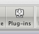
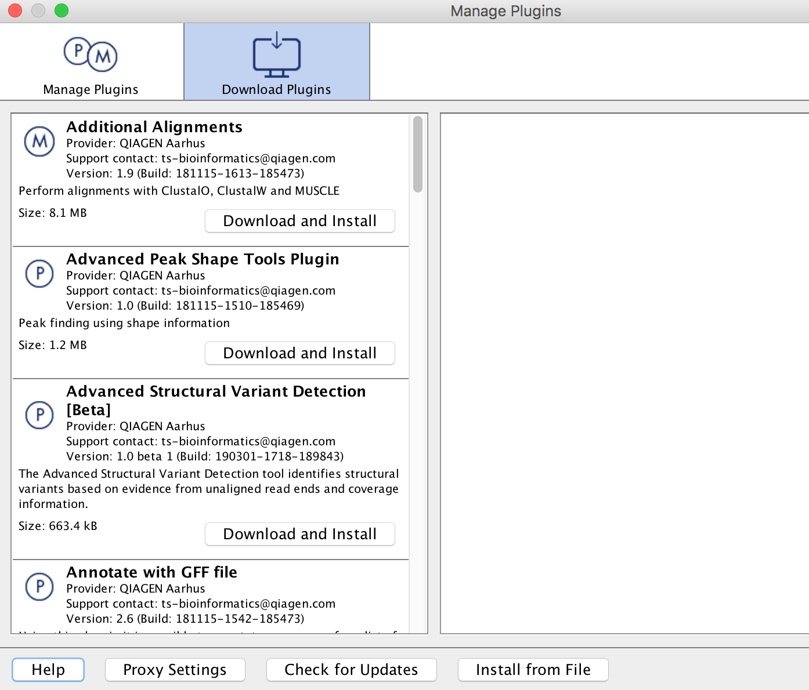
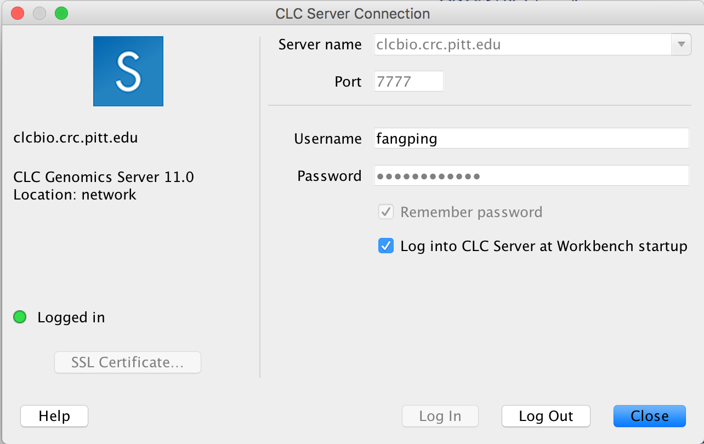
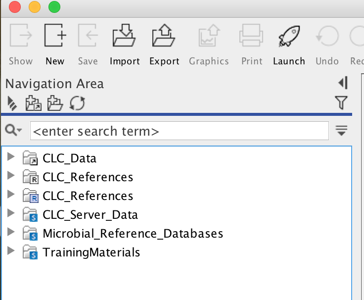
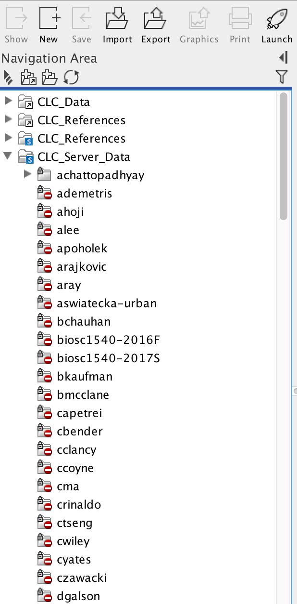
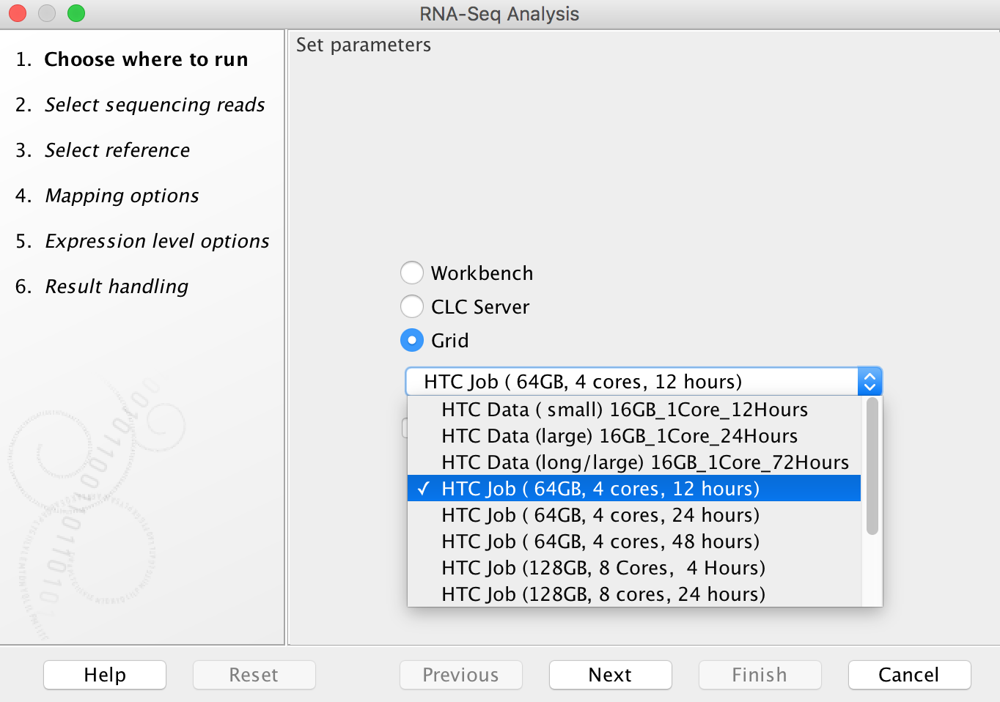
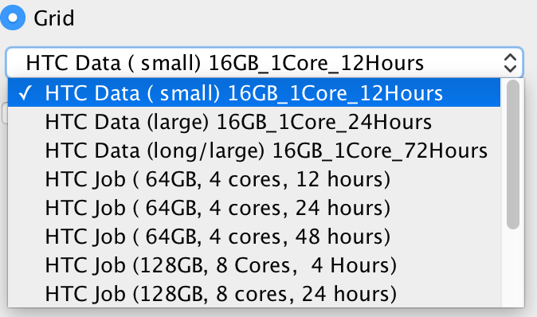
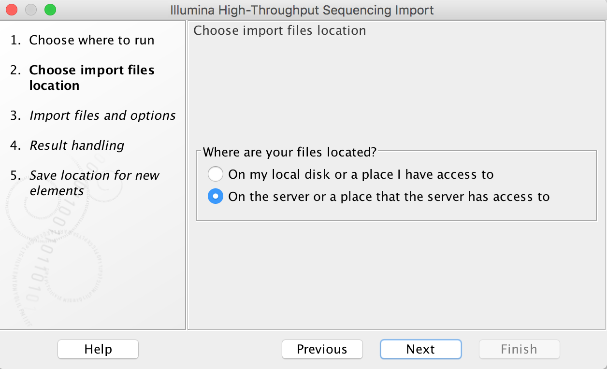
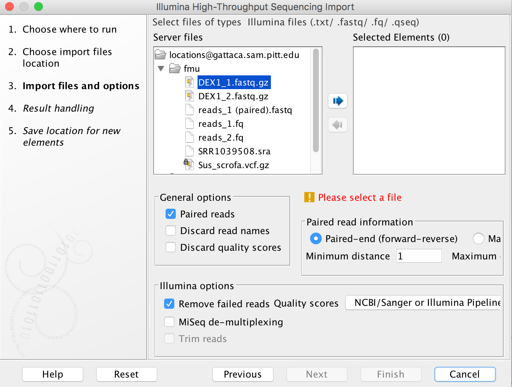

# CLCBio Genomics Server

Integrating with the CLCbio Genomics Server
-------------------------------------------

> This page contains directions on how to connect your CLCbio Genomics Workbench to the CLCbio Genomics Server installation on HTC cluster, allowing you to offload analyses to the cluster

### Compatibility

We currently maintain one clcbio server: clcbio.crc.pitt.edu.

*   clcbio.crc.pitt.edu runs CLC Genomics Server 25.0.
*   CLC Genome Finishing Server Extension and CLC Microbial Genomics Server Extension are enabled on clcbio.crc.pitt.edu.
*   CLC Assembly Cell 5.0.3 is available on HTC cluster.

The following are the corresponding client applications for CLC Genomics Server 25.0 clcbio.crc.pitt.edu

*   QIAGEN CLC Genomics Workbench 25.0
*   QIAGEN CLC Main Workbench 25.0
*   QIAGEN CLC Command Line Tools 25.0

CLC Genomics Server 25.0 is compatible with GCE version 25.0.

### Server plugins (clcbio.crc.pitt.edu)

Additional Alignments Server Plugin

*   Annotate with GFF file server plugin
*   Biomedical Genomics Analysis Server Plugin
*   CLC Single Cell Analysis Server Extension
*   Cloud Server Plugin
*   Ingenuity Pathway Analysis Server Plugin
*   Long Read Support Server Plugin (Beta)
*   Transcript Discovery Server Plugin
*   Whole Genome Alignment Server Plugin

### Commercially available Server Extensions (clcbio.crc.pitt.edu)

*   CLC Genome Finishing Server Extension
*   CLC Microbial Genomics Server Extension

CLC workbench download link
---------------------------

### CLC Genomics Workbench 25.0 for clcbio.crc.pitt.edu  
Version: 25.0

*   [Download macOS Installer - 292.9 MB (.dmg)](http://download.clcbio.com/CLCGenomicsWorkbench/25.0/CLCGenomicsWorkbench_25_0_x86_64.dmg)
*   [Download macOS Apple Silicon installer (.dmg)](https://download.clcbio.com/clcgenomicswb/25.0/CLCGenomicsWorkbench_25_0_aarch64.dmg)
*   [Download Linux 64 bit installer - 320.2 MB (.sh)](http://download.clcbio.com/CLCGenomicsWorkbench/25.0/CLCGenomicsWorkbench_25_0_64.sh)
*   [Download Windows 64 bit installer - 279.4 MB (.exe](http://download.clcbio.com/CLCGenomicsWorkbench/25.0/CLCGenomicsWorkbench_25_0_64.exe))

* * *

1.  Ensure you have the most up-to-date version of the CLCbio Genomics Workbench (the software should tell you if there's a more recent version when you start it, or you can check [the CLCbio website](https://digitalinsights.qiagen.com/technical-support/contact-support/)). [Register CLC Genomics workbench](https://hsls.libguides.com/molbio) and follow the steps to connect to CLCBio workbench license server.
    
2.  If you have not already done so, request a user account/allocation on the Center for Research Computing and Data (CRCD) cluster by [filling out the required information](https://crc.pitt.edu/node/5996). Principal Investigator must be Pitt faculty, and faculty email is the faculty's pitt email. The faculty member is notified via email.
    
3.  If your computer is not connected to the Pitt network (e.g. you are working from home or on a trip), or you are working from a laptop that is connected to the UPMC network, make sure you setup [Pitt SSLVPN](https://crc.pitt.edu/resources/htc-cluster/access-htc), so that you can communicate with the Center for Research Computing and Data (CRCD) cluster (clcbio servers are using HTC cluster). Make sure that "Server URL" (4) is sremote.pitt.edu, and "Please select a Role" (14) is Firewall-SAM-USERS-Pulse. Note that there are many different VPN roles. Only Firewall-SAM-USERS-Pulse role can connect to CRC clusters. If your VPN is installed by system administrators and you are not sure what role is used, open Pulse Secure, and click + sign and follow the instructions in these figures (https://crc.pitt.edu/resources/htc-cluster/access-htc ).
    
4.  Start up the CLC Genomics Workbench
    
5.  If you would like to use extra plugins, click the Plug-ins button () in the toolbar at the top of the CLC Genomics Workbench window. This will bring up the _Manage Plugins_ dialog box. Find the Plugin, click the _Download and Install_ button, and then close the _Manage Plugins_ dialog box and restart the CLC Genomics Workbench (choose _Yes_ when the dialog box comes up that asks if you want to restart the workbench now). If you are using Windows machine, you may need to start CLC Genomics workbench as administrator to install Plugins.
    
     
    
6.  From the File menu, choose the "CLC Server Connection" option. The **Server name** is _clcbio.crc.pitt.edu_, and the **Port** is 7777. Fill in your Pitt username and password, then check off the boxes to have this information saved, and to have the software automatically log in to the server (assuming the software you are using is on your own computer, and not a publicly accessible machine). Please note that username is case sensitive and all letters are in lowercase. Refer to the image below for an example of how the settings in this box should look:  
     
    
7.  Your workbench software will now attempt to connect to the CLCbio Genomics Server installation on CRC cluster. One of the only noticeable changes will be the appearance of new folders in your Navigation Area. You can find one folder named CLC\_Server\_Data with a blue S on the folder icon:
    
     
    
    This is the data folder on CRC cluster, and inside it you will find folders corresponding to your group, which you should have access to (the name convention is first letter of first name + last name of the faculty):
    
    
    
    This folder is your group's working directory. Copying files in the workbench from your local folders to the folders on the server will copy your data over to CRC (again, file permissions have been set to restrict access to your data to only those members of your group - if you need any special permissions, or if you do not find a folder matching your group, [please open a support ticket](https://crc.pitt.edu/tickets) ). Note that this folder is on Pitt CRC's BeeGFS parallel file system. CRC's formal policy for data storage is no charge for data storage up to 5 TB per PI. This folder is separate from each PI’s normal HPC storage on BeeGFS parallel file system.
    
8.  Computational genomics tasks require various reference genome. CLC\_References with a blue S on the folder icons are the folders for reference genomes. CLC\_Referenes are associated with Biomedical Genomics Server, and its contents include human, mouse and rat genomes. Reference genomes for the other species are installed inside Genomes folder under CLC\_References. If you need any special reference genome, [please open a support ticket](https://crc.pitt.edu/tickets)).
    
9.  Running an analysis on HTC cluster operates in much the same fashion as running an analysis on your own computer, however in the dialog box that opens (when you first select a tool to run), you will now see additional options:
    
    
    
    To run on HTC cluster, always select the "Grid" option (do not attempt to run analyses using the "CLC Server" option as, counterintuitively, these will fail). The drop-down menu under the "Grid" option allows you to select an appropriate grid present, to control how many cores are assigned to your job and how long the job will need to run:
    
    
    
    "HTC Data" Grid options are designed for data import/export. Only 16 GB RAM, 1 core is assigned to the jobs. In our experience, most RNA-Seq Analysis jobs do not require more than 24 hours to complete (really most of them finish in less than 4 hours) using "HTC Job (64GB, 4 cores, 24 hours)". Aligning large exome data sets to a reference genome typically can be done using 8 cores in about 4 hours (even data sets with up to 100x coverage). Aligning whole genome data sets (especially those with high coverage) is best done with 16 cores, and will typically require something less than 24 hours (recent alignments of 100x whole genome data - nearly 1 billion reads - have been completed in 12 hours using 16 cores, and even larger data sets - 1.5 billion reads - completed in 24 hours using 16 cores). Note however that variant calling requires much more time than alignment (sometimes requiring almost twice as much time), but does not use as many cores. In our experience, variant calling for whole exome data sets typically takes on the order of 6 hours (using 4 cores), while variant calling for whole genome data sets takes more like 30 hours (using 4 cores). Minimizing the number of cores your jobs use, and the amount of time blocked off for your jobs is essential, as there are limited resources currently available to the CLC server.
    
10.  If you think your job requires a grid preset that is not currently available, please send Dr. Fangping Mu an email: [fangping@pitt.edu](mailto:fangping@pitt.edu) Currently, CLC usage is managed differently from the normal account setup process for the HPC. CLC Usage is shown as user clcgenomics under cluster htc. Every faculty account automatically receives an initial allocation of 25,000 service units. Service units (SUs) correspond roughly with compute hours on a core. Accounts with an allocation of 25,000 SUs will now receive an e-mail before their annual renewal date asking them to submit DOIs for publications that used CRC resources. Faculty can submit [a short proposal](https://crc.pitt.edu/apply) requesting more computing time. [See the guidelines for proposals](https://crc.pitt.edu/Pitt-CRC-Allocation-Proposal-Guidelines). Please acknowledge CRC support and add the generated publication to [our doi tracker](https://crc.pitt.edu/doi). Otherwise your allocation won't be renewed for another cycle. To Acknowledge Pitt CRC in your research papers, please include this language in the paper's Acknowledgements: "This research was supported in part by the University of Pittsburgh Center for Research Computing and Data, RRID:SCR\_022735, through the resources provided. Specifically, this work used the HTC cluster, which is supported by NIH award number S10OD028483."  
    Exceeding Usage Limits will cause Job Pending Status AssocGrpCPURunMinutesLimit, and your jobs will wait in the queue forever. There are a few possible reasons: (1) Your allocation proposal is expired. Check this with crc-usage. You can [submit a new proposal or renew](https://crc.pitt.edu/apply) for a standard allocation of 10K service units. (2) Your allocation has been spent completely. You will need to submit a request for supplemental service units.
    
11.  When your data is on the server or a place that the server has access to, you can choose a Grid preset.
    
    
    
    Import tools can be used to simultaneously convert data from FASTQ format (for example) to the CLCbio format and transfer the CLCbio format file to the server. We can assign each group (faculty) an import/export directory on bgfs /bgfs/. Member of the group shared this import/export directory with read/write permissions. [Please open a support ticket](https://crc.pitt.edu/tickets) if you do not find a folder matching your group.
    
    
    
12.  Once you start a job running on HTC cluster, you will see the usual progress bars in the _Process_ section of the Toolbox. When the job status is listed as "Running", you can close your Workbench software, and the job will continue running on the remote server. When you relaunch your workbench, it will again connect to the server (as long as you checked "Automatic login" above - otherwise you can manually log in again), and the status of your job will be updated.
    
13.  Working directory and Import/export directory are assigned on /bgfs. Note that this /bgfs is not backed up, so you will need to be diligent and back up to your own personal drives.
    
14.  At the moment, the CLCbio software does not provide fine control of data access at the individual user level. The access permissions are enforced at the group level. What this means is that if User\_A and User\_B are both within Group\_Z, then both will have read/write access to data stored within the Group\_Z directory.
    
15.  Each group from the schools of health sciences is assigned a group quota of 5TB on bgfs. If your group requires more disk space on bgfs, please contact us.
    
16.  If you have any problems with this procedure, or your jobs will not execute, please submit a CRC support ticket [online](https://crc.pitt.edu/tickets) (login required).
