# Genome Browser

IGV
---

The Integrative Genomics Viewer (IGV) is a high-performance, easy-to-use, interactive tool for the visual exploration of genomic data. The original IGV is a Java desktop application. You can run IGV as a VNC application through Open Ondemand.

Logon ondemand.htc.crc.pitt.edu. Click Interactive Apps -> IGV on htc:

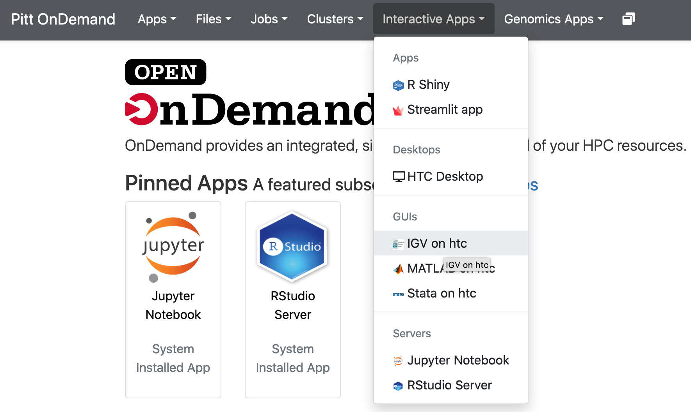

Select IGV version, Number of Hours and Number of cores. Click Launch:

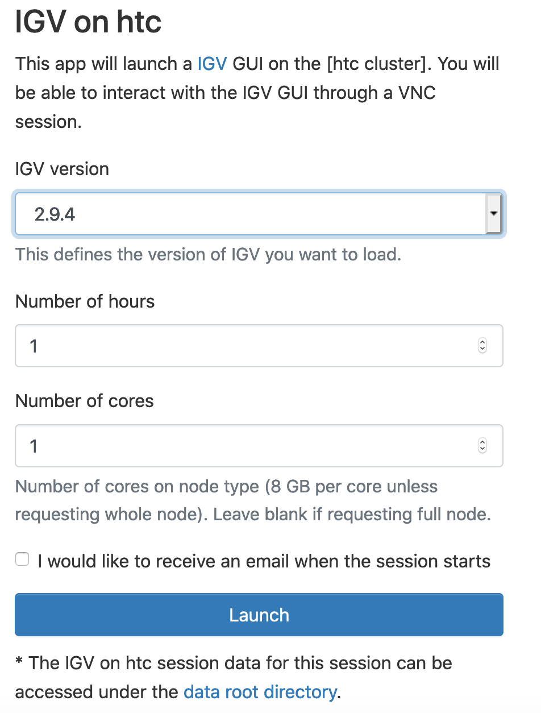

Choose your genome at the top left cornet. I have selected Human (hg38). File -> Load from File... and navigate to your CRC folder. In the screenshot, I have navigated to ```/bgfs/genomics/fangping/nf-core-rnaseq/results/star/bigwig```, and selected 6 bigWig files.

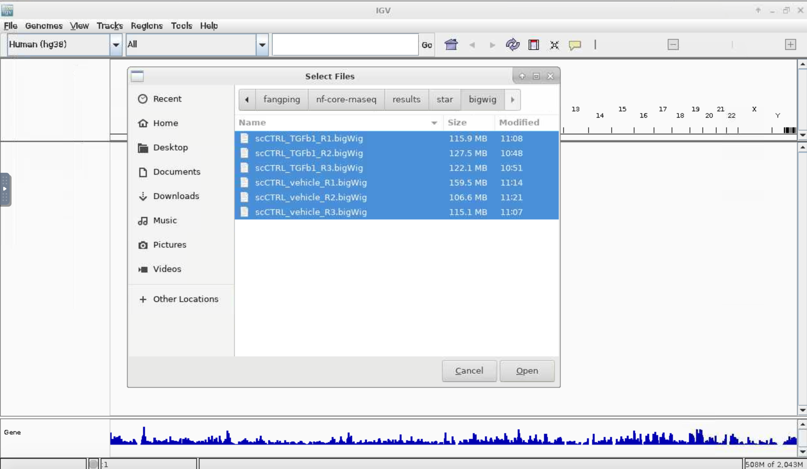

Type a gene name in top middle text field. I have used GAPDH.

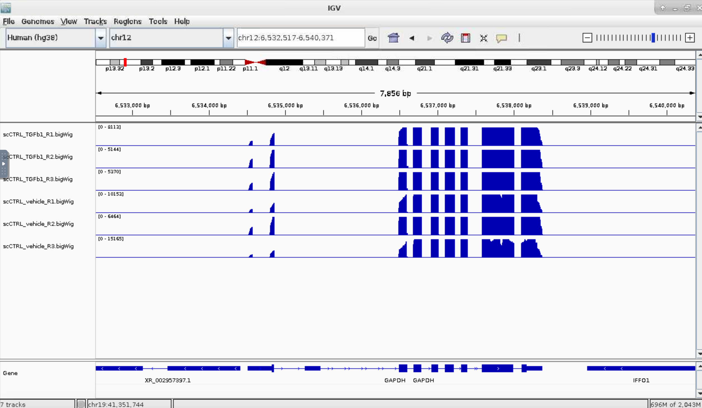

IGV\_webapp
-----------

The IGV-Web app is a pure-client "genome browser" application based on igv.js. IGV-web is a web application.

Logon ondemand.htc.crc.pitt.edu. Click Genomics Apps -> IGV webapp:

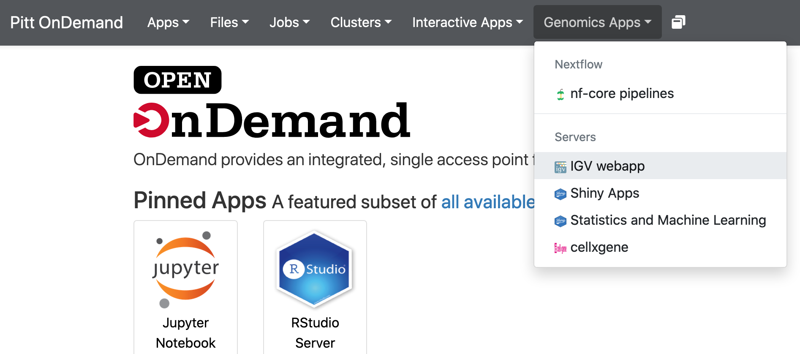

Select IGV webapp version, Number of cores and Number of hours. Click Launch:

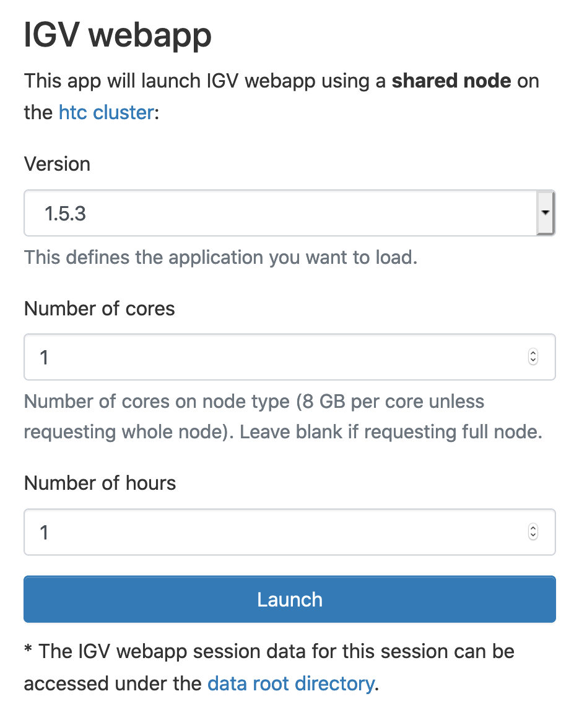

This will launch IGV-webapp using a shared node on the htc cluster.

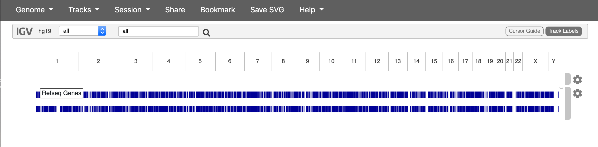

Choose your genome at the top left corner. To add files on CRC storage as track, select Tracks -> URL ... Get the absolute path of your file, for example,

```/bgfs/genomics/fangping/nf-core-rnaseq/results/star/bigwig/scCTRL_TGFb1_R1.bigWig```,

then add data in front. Use that address, i.e.,

```data/bgfs/genomics/fangping/nf-core-rnaseq/results/star/bigwig/scCTRL_TGFb1_R1.bigWig```,

as Track URL.

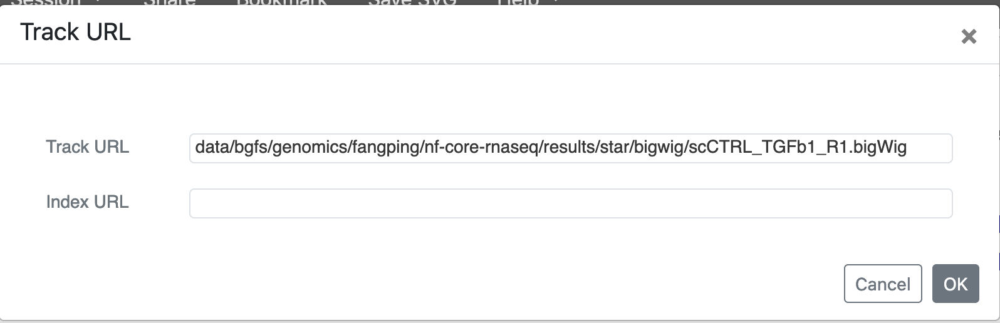

When track has index, you should provide Index URL. For example, bam file /bgfs/genomics/fangping/nf-core-rnaseq/results/star/scCTRL\_TGFb1\_R1.markdup.sorted.bam and its index file /bgfs/genomics/fangping/nf-core-rnaseq/results/star/scCTRL\_TGFb1\_R1.markdup.sorted.bam.bai. You should use:

Track URL: ```data/bgfs/genomics/fangping/nf-core-rnaseq/results/star/scCTRL_TGFb1_R1.markdup.sorted.bam```  
Index URL: ```data/bgfs/genomics/fangping/nf-core-rnaseq/results/star/scCTRL_TGFb1_R1.markdup.sorted.bam.bai```

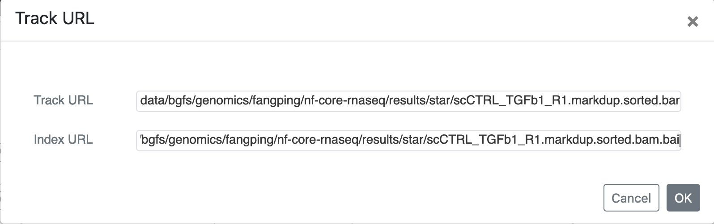

Type a gene name in top middle text field. I have used GAPDH.

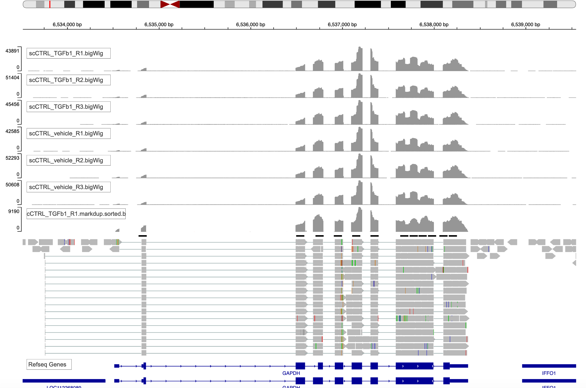

To save and share the session, choose Session -> Save ...., and save the json file to your local computer.

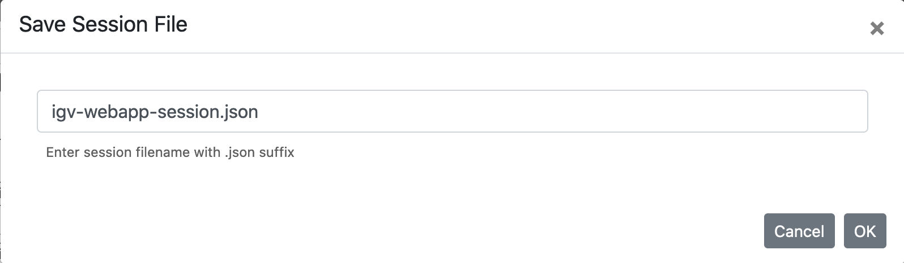

You can send this json file to your collaborator to reproduce the IGV session. Choose Session -> Local File ... to load the session.

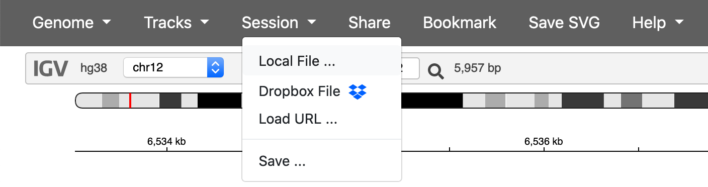

You can upload [this file](../_assets/img/advanced-genomics-support/igv-webapp-session.json) to generate the above session.