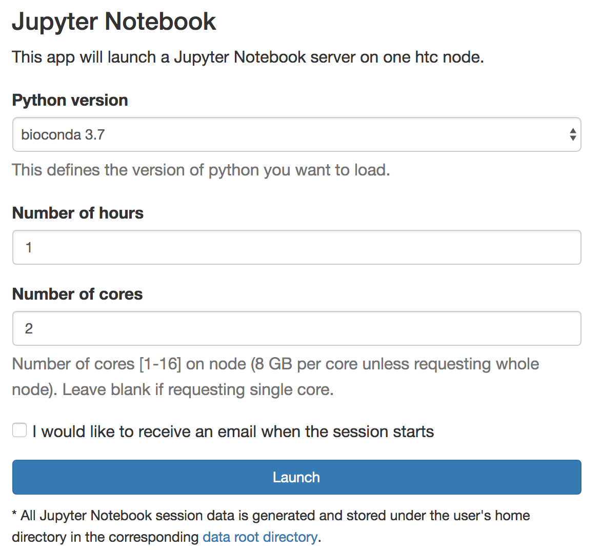

# Single Cell Data Analaysis

Spring 2023 CRC Bioinformatics workshops

<p><span><strong>10X Genomics single cell techniques </strong> </span><br />
Monday, March 27, 2023, 1:00pm - 2:30pm<br />
This workshop will illustrate the technological basis of 10x Genomics single cell analysis. Several chemistries for applications beyond single cell RNA-Seq and the sequencing read architecture of each application will be discussed. Presented by <strong>Richard Duerr</strong></p>

<p><span><strong>Single-cell Analysis with Seurat </strong> </span><br />
Tuesday, March 28, 2023, 1:00pm - 4:00pm<br />
This workshop will briefly review the cellranger pipelines to process raw reads into expression values. The hands-on training will include reading the count data in R, quality control, normalization, dimensionality reduction, cell clustering, and finding marker genes. The Seurat pipeline will be covered. We will also focus on trajectory analysis with Monocle3.<strong> </strong>Presented by <a href="/node/289"><strong>Dhivyaa Rajasundaram</strong></a></p>

<p><span><strong>Single-Cell Analysis with Bioconductor </strong> </span><br />
Tuesday, April 4, 2023, 1:00pm - 4:00pm<br />
This workshop will teach how to perform scRNAseq analysis using Bioconductor. The training will include many aspects of analysis such as normalization, cell type annotation of clusters, and pseudo-bulk differential gene expression. Similarities and differences to the Seurat pipeline will be mentioned.<strong> </strong>Presented by <strong>Paul Cantalupo (Genomics Analysis Core)</strong></p>

<p><span><strong>Annotating single-cell transcriptomics </strong> </span><br />
Thursday, April 6, 2023, 1:00pm - 4:00pm<br />
Single-cell transcriptomics can quantitatively measure and identify cell types and dynamics based on gene expression profiles. Accurate annotation of cells is the foremost step for downstream analyses. In this workshop, we will focus on how to annotate different cell populations in human biospecimens using automatic or manual approaches, and detect cellular states for biological interpretation. We will also discuss the recommendations, challenges, and best practices for the selection of reference databases, probability models, and relevant computational tools.&nbsp;Presented by <strong>Riyue Bao</strong></p>

<p><span><strong>Advanced Single-Cell Analysis </strong> </span><br />
Tuesday, April 11, 2023, 1:00pm - 4:00pm<br />
This advanced workshop will focus on the analysis of multi-omics data and its integration (e.g. CITE-seq, multiome, and DOGMA-seq). The hands-on training will include background introduction and a step-by-step R pipeline with real applications from immunology.<strong> </strong>Presented by <strong>Wei Chen</strong></p>

<p><span><strong>Deep learning for scRNASeq analysis </strong> </span><br />
Tuesday, April 25, 2023, 1:00pm - 4:00pm<br />
This workshop will review the deep learning algorithms (variational autoencoder, autoencoder, generative adversarial network and supervised DL models ) and their applicability in the single cell RNA-seq processing pipeline. The hands-on training will provide examples to run deep learning RNASeq algorithms.<strong>. </strong>Presented by<strong> Yufei Huang</strong></p>

[Recordings and workshop materials](https://pitt-my.sharepoint.com/:f:/g/personal/fangping_pitt_edu/EiPJnsf4SjRCv3HZDxCMVI4BtPjwGGijolCEF79hAj9RXA)


## old materials

## Analysis of Single Cell RNASeq

Today it is possible to obtain genome-wide transcriptome data from single cells using high-throughput 
sequencing (scRNA-seq). scRNA-seq is a new technology, first publication in 2009. scRNA-seq measures the 
distribution of expression levels for each gene across a population of cells scRNA-seq allows to study new 
biological questions in which cell-specific changes in transcriptome are important, e.g. cell type identification, 
heterogeneity of cell responses, stochasticity of gene expression, inference of gene regulatory networks across the 
cells. Currently, there are several different protocols in use, e.g. SMART-seq2, CELL-seq and Drop-seq. There are also 
commercial platforms available, including the Fluidigm C1, Wafergen ICELL8 and the 10X Genomics Chromium.

### Cell Ranger

The data analysis pipeline of single cell RNASeq starts with the creation of a DGE matrix, which contains gene counts 
in each cell, from the raw sequencing files. Cell Ranger is a set of analysis pipelines that process Chromium Single 
Cell 3’ RNA-seq output to align reads, generate gene-cell matrices and perform clustering and gene expression analysis.

From the Cell Ranger manual:

Cell Ranger includes four main gene expression pipelines:

<ol>
	<li>
	cellranger mkfastq wraps Illumina's bcl2fastq to correctly demultiplex Chromium-prepared sequencing samples and to convert barcode and read data to FASTQ files.
	</li>
	<li>
	cellranger count takes FASTQ files from cellranger mkfastq and performs alignment, filtering, and UMI counting. It uses the Chromium cellular barcodes to generate gene-barcode matrices and perform clustering and gene expression analysis. count can take input from multiple sequencing runs on the same library.
	</li>
	<li>
	cellranger aggr aggregates outputs from multiple runs of cellranger count, normalizing those runs to the same sequencing depth and then recomputing the gene-barcode matrices and analysis on the combined data. aggr can be used to combine data from multiple samples into an experiment-wide gene-barcode matrix and analysis.
	</li>
	<li>
	cellranger reanalyze takes gene-barcode matrices produced by cellranger count or cellranger aggr and reruns the dimensionality reduction, clustering, and gene expression algorithms using tunable parameter settings.
	</li>
</ol>

These pipelines combine Chromium-specific algorithms with the widely used RNA-seq aligner STAR. Output is delivered 
in standard BAM, MEX, CSV, HDF5 and HTML formats that are augmented with cellular information.

10x pipelines require sequencer FASTQs (with embedded barcodes) as input. The location of the 10x barcode varies 
depending on product and reagent version.

[Single Cell Gene Expression Datasets](https://support.10xgenomics.com/single-cell-gene-expression/datasets)

We download Chromium Demonstration (v3 Chemistry) > Cell Ranger 3.0.0 > 10k PBMCs from a Healthy Donor 
(v3 chemistry) and analyze this data using CellRanger on HTC cluster.

Description of this dataset:

Peripheral blood mononuclear cells (PBMCs) from a healthy donor (the same cells were used to generate 
pbmc_1k_v2, pbmc_10k_v3). PBMCs are primary cells with relatively small amounts of RNA (~1pg RNA/cell).

11,769 cells detected<br />
Sequenced on Illumina NovaSeq with approximately 54,000 reads per cell<br />
28bp read1 (16bp Chromium barcode and 12bp UMI), 91bp read2 (transcript), and 8bp I7 sample barcode<br />
run with --expect-cells=10000

```commandline
wget http://s3-us-west-2.amazonaws.com/10x.files/samples/cell-exp/3.0.0/pbmc_10k_v3/pbmc_10k_v3_fastqs.tar
tar xvf pbmc_10k_v3_fastqs.tar
```

Check the data:
```commandline
zcat pbmc_10k_v3_S1_L001_I1_001.fastq.gz |head -n 20
```

This is 8bp I7 sample barcode.
```commandline
zcat pbmc8k_S1_L007_R1_001.fastq.gz |head -n 20
```

This is 28bp read1 (16bp Chromium barcode and 12bp UMI).
```commandline
zcat pbmc_10k_v3_S1_L001_R2_001.fastq.gz |head -n 20
```

This is 91bp read2 (transcript).

To analyze the dataset, submit the following job to HTC cluster.
```commandline
#!/bin/bash
#
#SBATCH -t 3-00:00 # Runtime in D-HH:MM
#SBATCH --job-name=pbmc10k_cellranger
#SBATCH -c 16
#SBATCH --mem=120g

module load cellranger/3.0.2

cellranger count --id pbmc_10k_v3 \
    --fastqs pbmc_10k_v3_fastqs \
    --transcriptome=/bgfs/genomics/refs/CellRanger/refdata-cellranger-GRCh38-3.0.0 \
    --localcores=16 \
    --localmem=119 #--jobmode=slurm --maxjobs=8
```

`--localcores=$SLURM_CPUS_PER_TASK` used the allocated cores to perform computation. If your sample is large, you can 
use slurm to submit extra jobs `--jobmode=slurm --maxjobs=8`. This will submit extra 4 core jobs, and maximum number of 
jobs is 8.

If you get raw sequence data, an extra step `mkfastq` is required. You can use the following job template.


```commandline
#!/bin/bash
#
#SBATCH -N 1 # Ensure that all cores are on one machine
#SBATCH -t 2-00:00 # Runtime in D-HH:MM
#SBATCH --job-name=cellrangermkfatsq
 
#SBATCH --cpus-per-task=4 # Request that ncpus be allocated per process.
#SBATCH --mem=60g # Memory pool for all cores (see also --mem-per-cpu)
 
module load cellranger/3.0.2
 
cellranger mkfastq --id=sampleID \
         --run=/path/to/your/sequence/data/ \
         --samplesheet=/path/to/your/sequence/data/input_samplesheet.csv \
         --localcores=$SLURM_CPUS_PER_TASK \
         --localmem=59
```

Under pbmc_10k_v3/outs, there is file named web_summary.html, which is a summary HTML file containing summary metrics 
and automated secondary analysis results. The pbmc_10k_v3/outs/raw_feature_bc_matrix contains every barcode from fixed 
list of known-good barcode sequences. This includes background and non-cellular barcodes. 
The pbmc_10k_v3/outs/filtered_feature_bc_matrix cntains only detected cellular barcodes.

### Secondary Analysis in R

For 10x genomics single cell RNASeq data, your best option is definitely processing the raw data using the 10x 
Genomics free proprietary software Cell Ranger. It uses STAR to map. However, I would not trust Cell Rangers analysis 
beyond QC readouts, after generating the raw and filtered UMI matrices. The rest of the analysis is applied on this 
matrix file. QC determines which cells to exclude from downstream analysis because of various reasons like the
suspicion of doublets or cellular stress. Normalization and scaling are then performed to compensate for the sparsity 
of data because of the low mRNA capture rate. Then, dimension reduction is done based on the most differentially 
expressed genes. Finally, if done correctly, visualization of the data will result in plots showing the relatedness of
each cell to its neighbor in two- or three-dimensional space. You can process the unfiltered matrix with an 
R Bioconductor package like Seurat or Monocle 2. Both are very easy to use, were designed to be compatible with 
data from droplet devices like 10X, and can give you more reliable results and control over your workflow than 
CellRanger will.

### Seurat

You can use RStudio server on ondemand to perform Seurat analysis. Point firefox or Chrome web browser to 
ondemand.htc.crc.pitt.edu. click Interactive Apps &gt; RStudio Server, choose R version 3.6.0.

Open Rmarkdown file /bgfs/genomics/fangping/scRNASeq/pbmc10k_tutorial.Rmd, and follow the steps. You can get the 
following [results](https://crc.pitt.edu/content/seurat).


### Scanpy

Scanpy is a scalable toolkit for analyzing single-cell gene expression data. It includes preprocessing, 
visualization, clustering, pseudotime and trajectory inference and differential expression testing. The 
Python-based implementation efficiently deals with datasets of more than one million cells.


You can use jupyter notebook on ondemand to run interactive sessions. I show you how to install local python 
packages in virtual environment and generate ipykernel to be used on jupyter notebook on ondemand.


Logon HTC login node, load the proper python module python/bioconda-3.7-2019.03


```commandline
module load python/bioconda-3.7-2019.03

conda create -n scanpy python=3.6

source activate scanpy

conda install seaborn scikit-learn statsmodels numba pytables

conda install -c conda-forge python-igraph louvain

pip install scanpy

conda install ipykernel

environment location: /ihome/fmu/fmu/.conda/envs/scanpy

python -m ipykernel install --user --name scanpy

(scanpy) [fmu@login0b ~]$ python -m ipykernel install --user --name scanpy

Installed kernelspec scanpy in /ihome/fmu/fmu/.local/share/jupyter/kernels/scanpy
```

Copy `/bgfs/genomics/fangping/scRNASeq/pbmc10k.ipynb` to your home directory.

Logon ondemand ondemand.htc.crc.pitt.edu, Interactive Apps > Jupyter Notebook

Select Python version bioconda 3.7, choose Number of hours and Number of cores, click Launch



Connect to jupyter notebook and open `pbmc10k.ipynb`, click Kernel > Change kernel > scanpy to activate the 
scanpy ipykernel.


Follow the steps. You can get the following [results](https://crc.pitt.edu/content/scanpy).
