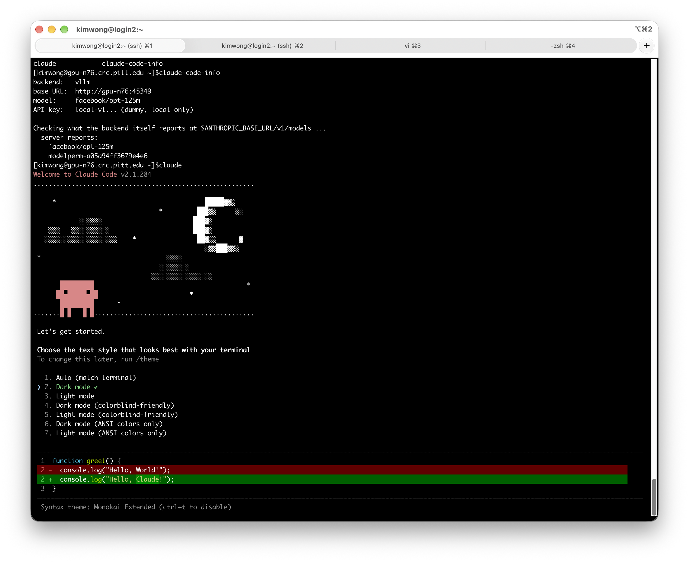

# Claude Code on CRCD

[Claude Code](https://docs.claude.com/en/docs/claude-code/overview) is an agentic coding tool that
runs in your terminal: it reads and edits files, runs commands, and works through tasks rather than
just answering questions. The `claude-code` module points it at a model **you are hosting on a CRCD
GPU** instead of at Anthropic's API, so your prompts and your code stay on the cluster.

The module does the whole setup for you. It loads a backend — [vLLM](vllm-module.md) or
[llama.cpp](llamacpp-module.md) — starts the server, injects the flags that tool calling needs, and
points Claude Code at the result.

!!! important "Load `claude-code` first, not the backend"

    `claude-code` can only inject the tool-calling flags *before* the backend server starts. If you
    load `vllm` or `llamacpp` yourself and then load `claude-code`, you get a warning and a server
    that cannot call tools — which makes Claude Code unable to function as an agent at all.

    Load `claude-code` and let it load the backend for you.

## Before you start

You need an interactive allocation with a GPU. Claude Code is a terminal interface, so this is an
interactive workflow — a batch job has nothing to attach to.

```bash
srun -M gpu -p rtx6k -n16 --gres=gpu:1 -t 2:00:00 --pty bash
```

Bear the cost in mind: the GPU bills for the full walltime whether you are typing or thinking.
A coding session that runs all afternoon on a large card is expensive, so ask for the time you
expect to use and stop when you are done. See [Service Units](../../slurm/service-units.md).

The backend's own prerequisites still apply. For vLLM that includes creating the Hugging Face cache
directory once, if you have never used it:

```bash
mkdir -p ~/.cache/huggingface
```

## Quick start

```bash
export CLAUDECODE_BACKEND="vllm"
export CLAUDECODE_VLLM_TOOL_PARSER="hermes"
module load claude-code
```

The backend starts first, then `claude-code` reports what it has been pointed at:

```
vLLM (container) starting on gpu-n76:45349 (model: facebook/opt-125m)
Base URL: http://gpu-n76:45349  |  run 'vllm-status' to check readiness, 'vllm-stop' to end it early.
claude-code -> vllm at http://gpu-n76:45349 (model: facebook/opt-125m)
Run 'claude' to start a session, or 'claude-code-info' to see this config again.
```

Wait for `vllm-status` to report `UP` — the module returns your prompt before the model has
finished loading — then start a session:

```bash
claude
```

On a first run Claude Code asks you to pick a text style for your terminal. Choose one; `/theme`
changes it later. No login prompt appears, because the module sets `CLAUDE_CODE_SKIP_AUTH_LOGIN=1`.

!!! important "Start `claude` from your project directory"

    Claude Code asks you to confirm the folder it is working in, and in that folder it can read,
    edit and execute files. Launched from your home directory it is asking for all of it. `cd` to
    the project you want it to work on first.

    The header line reads `API Usage Billing` — that is Claude Code's label for key-based
    authentication, not a sign that Anthropic is charging you. Requests are going to your own
    GPU job.



The default model is a tiny placeholder, useful only for confirming the plumbing works. For real
work, set the backend's model variable as well — see below.

!!! warning "`CLAUDECODE_VLLM_TOOL_PARSER` is required with the vLLM backend"

    vLLM needs a tool-call parser matched to your model's family, and there is no safe default to
    guess: the wrong one produces garbled tool calls rather than a clean error. The module refuses
    to load without it.

    The llama.cpp backend needs no equivalent — its `--jinja` flag works for any model and is
    injected automatically.

## Choosing a model

Claude Code leans heavily on tool use — reading files, editing them, running commands — so **pick a
model with strong tool-calling support**. A model that chats well but calls tools poorly will feel
broken rather than merely weak, and tool-calling reliability is trained separately from code
quality: a *coder*-tuned model is not automatically the better agent. See the failure below for
what that looks like in practice.

```bash
# vLLM backend
export CLAUDECODE_BACKEND="vllm"
export VLLM_MODEL="Qwen/Qwen2.5-Coder-32B-Instruct"
export CLAUDECODE_VLLM_TOOL_PARSER="hermes"
export VLLM_DOWNLOAD_DIR=/vast/<group>/$USER/vllm

module load claude-code
```

```bash
# llama.cpp backend
export CLAUDECODE_BACKEND="llamacpp"
export LLAMACPP_MODEL="ggml-org/Qwen2.5-Coder-32B-Instruct-GGUF:Q4_K_M"
export LLAMACPP_DOWNLOAD_DIR=/vast/<group>/$USER/llamacpp

module load claude-code
```

Every variable from the backend's own page still applies, because `claude-code` loads that module
rather than replacing it. Use [Step 1 of Inference Servers](inference-server.md) to check your model
fits the card you requested — a 32B model in 16-bit needs about 68 GB, so one RTX PRO 6000 or a
quantized GGUF on something smaller.

### Tool-call parsers by model family

| Model family | `CLAUDECODE_VLLM_TOOL_PARSER` |
| --- | --- |
| Hermes-series (Nous Hermes 2 Pro / 3), Qwen2 / 2.5 | `hermes` |
| Llama 3.1 / 3.3 | `llama3_json` |
| Llama 4 | `llama4_pythonic` |
| Mistral / Mistral-Nemo | `mistral` |
| IBM Granite | `granite` |
| InternLM2 | `internlm` |
| anything else | check the [vLLM tool-calling documentation](https://docs.vllm.ai/en/latest/features/tool_calling/) |

Some families — `llama3_json`, `mistral`, `granite` — also work better with a matching
`--chat-template` from vLLM's `examples/` directory. Add it through `VLLM_EXTRA_ARGS` if tool calls
work but seem unreliable after setting the parser correctly.

!!! failure "Did not work: the tool call printed instead of running"

    With `Qwen/Qwen2.5-Coder-32B-Instruct` and `CLAUDECODE_VLLM_TOOL_PARSER="hermes"`, the model
    answered the question and then printed its tool call as plain text instead of invoking it:

    ```
    Let's execute this command using the Bash tool:

    {"name": "Bash", "arguments": {"command": "for i in {2..10..2}; do echo $i; done", ...}}

    ✻ Cooked for 7s · done
    ```

    The command never ran — and note how this fails: the answer looks plausible, something
    resembling a tool call appears, and the session reports `done`. It is easy to mistake for
    success.

    **The setup is not broken.** Pasting that same JSON back in as a prompt makes the tool run
    normally:

    ```
    ❯ {"name": "Bash", "arguments": {"command": "for i in {2..10..2}; do echo $i; done", ...}}

    2
    4
    6
    8
    10
    ```

    So vLLM's parser and Claude Code's tool loop both work. The problem is the model: it put the
    call in its message text rather than in the structured field the parser reads, and it does so
    inconsistently — the same session produced both outcomes.

    What to do about it:

    1. **Try a different model.** This is the most likely fix. A *coder*-tuned model is not
       automatically a good agent — tool-calling reliability is trained separately from code
       quality. `Qwen/Qwen2.5-32B-Instruct` or a Hermes-series model are worth comparing against
       the Coder variant.
    2. **Add a matching `--chat-template`** through `VLLM_EXTRA_ARGS`, from vLLM's `examples/`
       directory. If the template does not wrap tool calls the way the parser expects, this is
       where the mismatch lives.
    3. **Switch to the llama.cpp backend**, whose `--jinja` flag handles tool calling without a
       parser selection at all:

        ```bash
        export CLAUDECODE_BACKEND="llamacpp"
        export LLAMACPP_MODEL="ggml-org/Qwen2.5-Coder-32B-Instruct-GGUF:Q4_K_M"
        module load claude-code
        ```

    Whichever you try, test with something trivial first — ask it to list a directory — and check
    the command actually ran. Because the failure is intermittent, one success does not prove the
    pairing is reliable.

## Configuration

Set these before `module load claude-code`.

| Variable | Purpose | Default |
| --- | --- | --- |
| `CLAUDECODE_BACKEND` | `vllm` or `llamacpp` | `vllm` |
| `CLAUDECODE_VLLM_TOOL_PARSER` | **Required with the vLLM backend.** Parser matching your model family | none — the load fails without it |
| `CLAUDECODE_MODEL` | Model name sent to the backend in requests | the backend's `VLLM_MODEL` / `LLAMACPP_MODEL` |
| `CLAUDECODE_API_KEY` | Local placeholder key | `local-vllm` or `local-llamacpp` |
| `CLAUDECODE_BIN_DIR` | Alternate directory holding the `claude` binary | this version's install directory |

Claude Code's own environment variables still work, and are read when you run `claude` rather than
at module load. `CLAUDE_CODE_MAX_OUTPUT_TOKENS` is the useful one — local models often have a
smaller output budget than Anthropic's hosted models:

```bash
export CLAUDE_CODE_MAX_OUTPUT_TOKENS=8192
claude
```

## Checking what's running

```bash
claude-code-info
```

```
backend:   vllm
base URL:  http://gpu-n76:45349
model:     facebook/opt-125m
API key:   local-vl... (dummy, local only)

Checking what the backend itself reports at $ANTHROPIC_BASE_URL/v1/models ...
  server reports:
    facebook/opt-125m
    modelperm-a05a94ff3679e4e6
```

It prints the backend, base URL, and model Claude Code is configured to use, then queries the
backend's own `/v1/models` and shows what the server actually reports, so you can spot a mismatch. A mismatch is the usual cause of a confusing
"model not found" error — particularly with llama.cpp, where the served name does not always match
`$LLAMACPP_MODEL` exactly.

The backend's own helpers are loaded too:

```bash
vllm-status        # or llamacpp-status
vllm-stop          # or llamacpp-stop
```

## What talks to the internet

The point of this setup is that inference happens on your GPU. The module sets
`CLAUDE_CODE_DISABLE_NONESSENTIAL_TRAFFIC=1` to suppress telemetry and update checks, and
`ANTHROPIC_BASE_URL` points at your own job, so request traffic goes to the cluster rather than to
Anthropic.

Two things still reach outward, both from the backend rather than from Claude Code: downloading
model weights from Hugging Face on first use, and nothing else once the model is cached locally.
If you need a fully offline run, stage the model first and use `VLLM_OFFLINE` or
`LLAMACPP_OFFLINE` — see the backend pages.

!!! warning "Your backend is still reachable from the rest of the cluster"

    `CLAUDECODE_API_KEY` is a local placeholder, not a secret. Ports are open within the CRCD
    environment, so anyone who finds your backend's host and port can send requests that bill
    against your allocation. Keep the session short and stop the server when you finish. See
    [Keeping your endpoint private](inference-server.md).

## Stopping

Exit your `claude` session, then stop the backend:

```bash
vllm-stop        # or llamacpp-stop
```

Ending the Slurm session stops the server too.

## Troubleshooting

| Symptom | Cause | What to do |
| --- | --- | --- |
| `CLAUDECODE_BACKEND must be 'vllm' or 'llamacpp'` | Typo, or a stale value from an earlier session | `unset CLAUDECODE_BACKEND` to fall back to the default |
| `The vllm/llamacpp backend did not report a base URL` | The backend failed to start | Scroll up for its own error — usually the Slurm-allocation or GPU check it runs itself |
| `API Error: 400 "auto" tool choice requires --enable-auto-tool-choice and --tool-call-parser to be set` | The parser was not set before vLLM started | Set `CLAUDECODE_VLLM_TOOL_PARSER`, then `module unload vllm claude-code` and reload |
| `vllm is already loaded in this session` | The backend was loaded before `claude-code` | `module unload <backend> claude-code`, then load `claude-code` alone, or start a fresh shell |
| Claude Code reports a model not found | The served name differs from `CLAUDECODE_MODEL` | Run `claude-code-info`, set `CLAUDECODE_MODEL` to the exact string it reports, and reload |
| Tool calls silently do nothing on the llama.cpp backend | `--jinja` missing, because llamacpp was loaded first | Start from a fresh shell and load `claude-code` before the backend |
| Every message reprocesses the whole conversation, getting slower each turn | Prefix-cache defeat from a per-request header | The module sets `CLAUDE_CODE_ATTRIBUTION_HEADER=0` to prevent this; check nothing in your `.bashrc` or `~/.claude/settings.json` overrides it |
| Claude Code opens a browser or asks for an Anthropic login | A stale config from a non-module install | The module sets `CLAUDE_CODE_SKIP_AUTH_LOGIN=1`; remove any old `~/.claude.json` or `~/.claude/settings.json` |

If you are stuck, submit a [help ticket](https://services.pitt.edu/TDClient/33/Portal/Requests/TicketRequests/NewForm?ID=yXkHi62rHa8_&RequestorType=Service)
with the output of `claude-code-info` and the backend's log file.

## Related

<div class="grid cards" markdown>

-   :material-server-network: **The serving workflow**

    ---

    Hardware sizing, finding your server, and the other ways to reach it.

    [Inference Servers](inference-server.md)

-   :material-speedometer: **The vLLM backend**

    ---

    Every `VLLM_*` variable, including offline models and extra arguments.

    [vLLM](vllm-module.md)

-   :material-file-code: **The llama.cpp backend**

    ---

    Quantized GGUF models, context size, and concurrency.

    [llama.cpp](llamacpp-module.md)

-   :material-cash: **What a session costs**

    ---

    An interactive GPU session bills for its full walltime.

    [Service Units](../../slurm/service-units.md)

</div>
