# Inference Servers on the GPU Cluster

An inference server loads a model onto a GPU once, then answers requests over HTTP for as long
as the job runs. Instead of paying the model-loading cost on every script invocation, you submit
one Slurm job that holds the GPU and serves an HTTP endpoint, then point as many clients at it as
you like — a notebook, an R session, a batch of analysis scripts, or your laptop.

Most of the servers documented here expose an **OpenAI-compatible API**, so any client library
that talks to OpenAI can talk to your server by changing the base URL.

!!! danger "Never run a server on a login node"

    Login nodes are shared by everyone and have no GPUs. A server process started there will be
    killed. Always request a GPU through Slurm first, as shown below.

The workflow is the same regardless of which framework or access method you choose:

1. Pick hardware that fits your model.
2. Submit a job that starts the server.
3. Find the node and port it landed on.
4. Connect a client.
5. Cancel the job when you're finished.

## Before you start

You need an allocation on the `gpu` cluster. If jobs sit in `PD` state with reason
`AssocGrpBillingMinutes`, you have no service units to draw from — request an allocation with a
[Service Request Form](https://crc.pitt.edu/service-request-forms).

Model weights are large and your home directory has a 75 GB quota, so send downloads elsewhere
before you start. The variable to set depends on the framework:

| Framework | Cache variable | Covers |
| --------- | -------------- | ------ |
| vLLM | `VLLM_DOWNLOAD_DIR` | Weights, plus the compiled-kernel cache in a `vllm-cache/` subdirectory |
| llama.cpp | `LLAMACPP_DOWNLOAD_DIR` | Downloaded GGUF files |
| Ollama | — | Models go to `~/.ollama/models`; see the [Ollama](ollama.md) page |

```bash
export VLLM_DOWNLOAD_DIR=/vast/<group>/$USER/vllm
```

Use your group's `/vast` (our recommendation) or `/ix1` space for weights you'll reuse, or `$SLURM_SCRATCH` for
one-off experiments. See [Storage Tiers](../../hardware_profiles/storage.md) and
[Scratch Space](../../slurm/scratch-storage.md).

Gated models on Hugging Face (the Llama family, for example) require you to accept the license on
the model's page and supply a token (keep this info private and secure; treat it like a password). For vLLM, pass it as `VLLM_HF_TOKEN`:

```bash
export VLLM_HF_TOKEN=hf_xxxxxxxxxxxxxxxxxxxx
```

Alternatively, run `huggingface-cli login` once in the shell before loading the module. Keep the
token out of scripts you commit or share.

## Step 1. Choose hardware for your model

Weights in 16-bit precision occupy roughly 2 GB per billion parameters, and the KV cache for
in-flight requests needs headroom on top of that. Plan on filling no more than about 80% of a
GPU card's VRAM with weights.

| Model size (16-bit) | Approx. weights | Fits on | [Slurm directives](../../slurm/batch-jobs.md)|
| ------------------- | --------------- | ------- | ------- |
| 7–8 B | ~16 GB | 1× L40S | `-p l40s --gres=gpu:1` |
| 13–14 B | ~28 GB | 1× L40S | `-p l40s --gres=gpu:1` |
| 30–34 B | ~68 GB | 1× RTX PRO 6000, or 2× L40S | `-p rtx6k --gres=gpu:1` |
| 70 B | ~140 GB | 2× RTX PRO 6000, 4× L40S, or 1× H200 | `-p rtx6k --gres=gpu:2` |
| 100 B+ | 200 GB+ | 8× H200 or 8× A100 80 GB NVLink | `-p h200 --gres=gpu:8` |

Quantized weights (AWQ, GPTQ, 8-bit, or GGUF) cut these figures by half or more, which often moves
a model down a tier. Full per-partition specifications, including the `--constraint` values for
pinning a specific card or host CPU, are on the [GPU cluster](../../hardware_profiles/gpu.md) page.

!!! note "Multiple cards need to be told to cooperate"

    Requesting `--gres=gpu:4` does not by itself spread a model across four cards. Each framework
    has its own flag — `--tensor-parallel-size` for vLLM, `--split-mode` for llama.cpp. Set it to
    match the number of GPUs you requested. For models spanning many cards, the `h200` and
    `a100_nvlink` partitions connect their GPUs with NVLink and will outperform PCIe partitions.

## Step 2. Launch the server

Ready-to-run templates are installed on the cluster. Copy a template to your own space and edit it:

```bash
cp /software/rhel9/manual/install/inference-templates/vllm/vllm_l40s.slurm ~/my_server.slurm
```

The annotated versions below show what each template does, so you can adapt them.

=== "vLLM"

    High-throughput serving with continuous batching and an OpenAI-compatible API. This is the
    default choice for serving a Hugging Face model to more than one client.

    **Loading the `vllm` module starts a server.** There is no separate launch command. The module
    reads its `VLLM_*` settings once, at load time, chooses a free port itself, and exports the
    address it picked. It also refuses to load outside a Slurm allocation, so you cannot start one
    on a login node by accident.

    For interactive work, the commands below can be executed on the terminal commandline:

    ```bash
    srun -M gpu -p l40s -n16 --gres=gpu:1 -t 8:00:00 --pty bash
    mkdir -p ~/.cache/huggingface        # first time only; always bound, even with VLLM_DOWNLOAD_DIR set
    export VLLM_MODEL="meta-llama/Llama-3.1-8B-Instruct"
    export VLLM_DOWNLOAD_DIR=/vast/<group>/$USER/vllm
    module load vllm/0.29.0
    vllm-status                      # readiness; large models take a few minutes
    curl "$VLLM_BASE_URL/v1/models"
    ```

    The module leaves `$VLLM_BASE_URL`, `$VLLM_HOST`, `$VLLM_SERVER_PORT`, `$VLLM_LOGFILE`, and
    `$VLLM_PID` in your shell, and gives you `vllm-status` and `vllm-stop`. Full reference:
    [Using the vllm module](vllm-module.md).

    For a long-lived server you want a batch job instead, which needs two things the interactive
    path gets for free — a way for clients to discover the port, and something to stop the script
    from exiting:

    ```bash
    #!/bin/bash
    #SBATCH --job-name=vllm_server
    #SBATCH --cluster=gpu
    #SBATCH --partition=l40s
    #SBATCH --nodes=1
    #SBATCH --cpus-per-task=16
    #SBATCH --gres=gpu:1
    #SBATCH --mem=120G
    #SBATCH --time=8:00:00
    #SBATCH --output=%x_%j.out

    # Every VLLM_* export must come before the module load
    export VLLM_MODEL="meta-llama/Llama-3.1-8B-Instruct"
    export VLLM_DOWNLOAD_DIR=/vast/<group>/$USER/vllm
    export VLLM_API_KEY="$INFERENCE_TOKEN"        # closes the endpoint
    export VLLM_EXTRA_ARGS="--tensor-parallel-size 1"

    module purge
    module load vllm/0.29.0

    # Publish the port the module chose, so clients elsewhere can find it
    scontrol update JobId="$SLURM_JOB_ID" Comment="$VLLM_SERVER_PORT"

    # Hold the allocation open: the server runs in the background, so if this script
    # reaches the end, SLURM ends the job and the server goes with it
    while kill -0 "$VLLM_PID" 2>/dev/null; do sleep 60; done
    ```

    The installed templates add readiness polling and per-job API key generation around this
    skeleton.

    !!! warning "Exports have to precede the module load"

        `VLLM_MODEL`, `VLLM_DOWNLOAD_DIR`, `VLLM_EXTRA_ARGS`, and `VLLM_HF_TOKEN` are read at load
        time only. Setting one afterward changes nothing until you `module unload vllm` and load it
        again. With no `VLLM_MODEL` set you get `facebook/opt-125m`, a tiny model whose only
        purpose is to prove the plumbing works.

    Anything vLLM itself accepts can go in `VLLM_EXTRA_ARGS`, including
    `--tensor-parallel-size` for multiple GPUs, `--max-model-len`, and
    `--gpu-memory-utilization`.

    !!! note "Tool calling needs extra flags"

        An agent client that wants the model to call tools needs `--enable-auto-tool-choice` and a
        `--tool-call-parser` matched to the model's family. There is no safe default — the wrong
        parser produces garbled tool calls rather than a clean error. The
        [`claude-code`](claude-code.md) module injects both for you; set them yourself through
        `VLLM_EXTRA_ARGS` if you are building your own agent.

    **Serving a model already staged on disk.** `VLLM_MODEL` also accepts an absolute path.
    A value starting with `/` is detected automatically: the module binds that directory into
    the container and forces offline mode, so nothing is downloaded and no HuggingFace token is
    needed even for a gated model.

    ```bash
    export VLLM_MODEL="/software/rhel9/manual/models/llama-3.1-8b-instruct"
    module load vllm/0.29.0
    ```

    Prefer a staged model when one exists. It starts faster, needs no network, doesn't consume
    your storage quota, and sidesteps license gating. Set `VLLM_OFFLINE=1` to force offline mode
    for a repo id as well.

    !!! tip "Pointing at the right folder"

        If you stage a model yourself with `huggingface-cli`, use `--local-dir`. A plain
        `download` leaves the files nested under `models--org--name/snapshots/<hash>/`, and
        `VLLM_MODEL` needs that innermost directory, not the top of the cache. A missing
        `config.json` warning in the log is the symptom of pointing one level too high.

=== "Ollama"

    Simplest option for interactive experimentation and for pulling community models by name.
    Lower throughput than vLLM under concurrent load, and no authentication.

    Ollama is installed as a Singularity image with ready-to-submit batch templates, one per
    partition:

    ```bash
    sbatch /software/rhel9/manual/install/ollama/ollama-0.11.10_l40s.slurm
    ```

    | Template | Partition | GPU |
    | -------- | --------- | --- |
    | `ollama-0.11.10_l40s.slurm` | `l40s` | 1 × L40S, 48 GB |
    | `ollama-0.11.10_a100_80gb.slurm` | `a100_nvlink` | 1 × A100, 80 GB |

    Each picks a free port, publishes it to the job's `Comment` field, and runs the server in the
    foreground for the job's four-hour walltime. Copy one to your own space to change the walltime
    or partition.

    Models download to `~/.ollama/models`, against your 75 GB home quota. Pull them from your
    client rather than from a separate session, and see the [Ollama](ollama.md) page for the R and
    Python clients, model management, and the quota.

    !!! note "A newer module exists but does not start a server"

        `module spider ollama` reports an `ollama/0.32.5` module. Unlike the
        [vllm](vllm-module.md) and [llama.cpp](llamacpp-module.md) modules, it only adds the
        `ollama` binary to your `PATH`. The templates above are the verified route.

=== "llama.cpp"

    Best fit for quantized GGUF models, including running a large model on a single smaller card.
    Very low startup latency, and it ships a browser chat interface.

    **Loading the `llamacpp` module starts a server**, the same way the `vllm` module does. It
    picks a free port, exports `$LLAMACPP_BASE_URL`, and gives you `llamacpp-status` and
    `llamacpp-stop`. It refuses to load outside a Slurm allocation or without a GPU.

    For interactive work:

    ```bash
    srun -M gpu -p rtx6k -n16 --gres=gpu:1 -t 8:00:00 --pty bash
    export LLAMACPP_MODEL="ggml-org/gemma-3-4b-it-qat-GGUF:Q4_0"
    module load llamacpp/0.5.0
    llamacpp-status                  # READY, STARTING or DOWN
    echo $LLAMACPP_BASE_URL
    ```

    `LLAMACPP_MODEL` takes any Hugging Face GGUF repo in `repo:tag` form, where the tag selects the
    quantization — use the form shown on the model's Hugging Face page. Full reference:
    [Using the llamacpp module](llamacpp-module.md).

    Once `llamacpp-status` reports `READY`, the endpoint works from anywhere on the cluster. Note
    that `model` is optional in the request body, since the server has only one loaded:

    ```bash
    curl "$LLAMACPP_BASE_URL/v1/chat/completions" \
      -H "Content-Type: application/json" \
      -d '{"messages": [{"role": "user", "content": "Hello!"}]}'
    ```

    For a long-lived server, use a batch job. There is no `$LLAMACPP_PID`, so readiness and
    liveness both go through `llamacpp-status`:

    ```bash
    #!/bin/bash
    #SBATCH --job-name=llamacpp_server
    #SBATCH --cluster=gpu
    #SBATCH --partition=l40s
    #SBATCH --gres=gpu:1
    #SBATCH --cpus-per-task=16
    #SBATCH --mem=120G
    #SBATCH --time=8:00:00
    #SBATCH --output=%x_%j.out

    export LLAMACPP_MODEL="ggml-org/gemma-3-4b-it-qat-GGUF:Q4_0"
    export LLAMACPP_DOWNLOAD_DIR=/vast/<group>/$USER/llamacpp
    export LLAMACPP_EXTRA_ARGS="-c 16384 -np 4"

    module purge
    module load llamacpp/0.5.0

    until llamacpp-status | head -n1 | grep -q '^READY'; do sleep 10; done

    # Publish the port; only LLAMACPP_BASE_URL is exported, so split it out
    HOSTPORT="${LLAMACPP_BASE_URL#http://}"
    scontrol update JobId="$SLURM_JOB_ID" Comment="${HOSTPORT##*:}"

    while llamacpp-status | head -n1 | grep -qE '^(READY|STARTING)'; do sleep 60; done
    ```

    `-c` sets the context window and `-np` the number of concurrent request slots; anything
    `llama-server` accepts can go in `LLAMACPP_EXTRA_ARGS`. For a local `.gguf` file, set
    `LLAMACPP_OFFLINE=1` alongside an absolute path in `LLAMACPP_MODEL`.

    !!! warning "This server is unauthenticated, and accepts any origin"

        llama.cpp logs it at startup: no API key is set and CORS allows all origins. Any user
        anywhere in the CRCD environment who finds the host and port can send requests that bill
        against your allocation. Keep these jobs short and cancel them when you finish. Use vLLM
        with `--api-key` for anything long-lived.

!!! warning "Avoid preemptible partitions for servers"

    A preempted job takes your endpoint down mid-request. Run servers on regular partitions. See
    [Preemptible Partitions](../../slurm/preempt.md).

After you have adapted the template to your liking, submit the job to Slurm:

```bash
sbatch ~/my_server.slurm
```

## Step 3. Find the host and port

--8<-- "inference-discovery.md"

## Step 4. Connect a client

Cross-cluster access is intentional and ports are open within the CRCD environment, so a server on
the `gpu` cluster is reachable from HTC, SMP, OnDemand sessions, and login nodes without any
tunneling. Choose the tab matching where your client runs.

=== "Another cluster node"

    From a login node or any interactive job, check that the server is up:

    ```bash
    curl -s -H "Authorization: Bearer $(cat ~/.crcd_inference/token_1230409)" \
         http://gpu-n56:53021/v1/models
    ```

    Drop the header if you started the server without an API key.

    Then use it from Python:

    ```python
    from pathlib import Path
    from openai import OpenAI

    client = OpenAI(
        base_url="http://gpu-n56:53021/v1",
        api_key=open(f"{Path.home()}/.crcd_inference/token_1230409").read().strip(),
    )

    resp = client.chat.completions.create(
        model="meta-llama/Llama-3.1-8B-Instruct",
        messages=[{"role": "user", "content": "Summarize this abstract: ..."}],
    )
    print(resp.choices[0].message.content)
    ```

    This is the pattern to use for batch analysis: submit your server once, then submit many
    lightweight CPU-only jobs on HTC that all query the same endpoint. Those client jobs need no
    GPU, so they queue quickly and cost far less.

=== "Jupyter on OnDemand"

    Launch **Jupyter** from the OnDemand dashboard at
    [ondemand.htc.crc.pitt.edu](https://ondemand.htc.crc.pitt.edu). An HTC session is the right
    choice and the cheap one: the GPU work is happening in your server job, so the notebook needs
    no GPU of its own. It will also refuse to host a server itself, since the `vllm` module
    requires a visible GPU.

    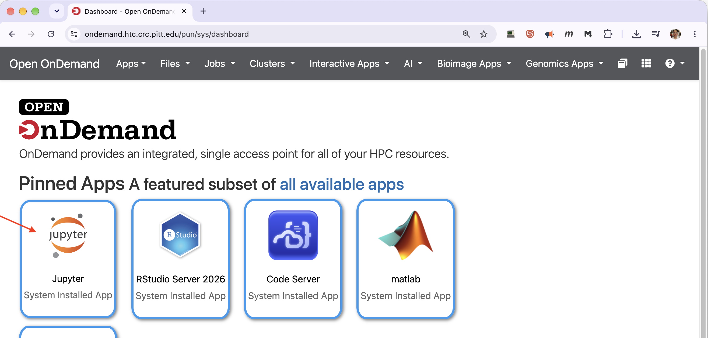

    The default **Python 3 (ipykernel)** kernel does not include the `openai` package, so a client
    cell fails before it ever reaches your server:

    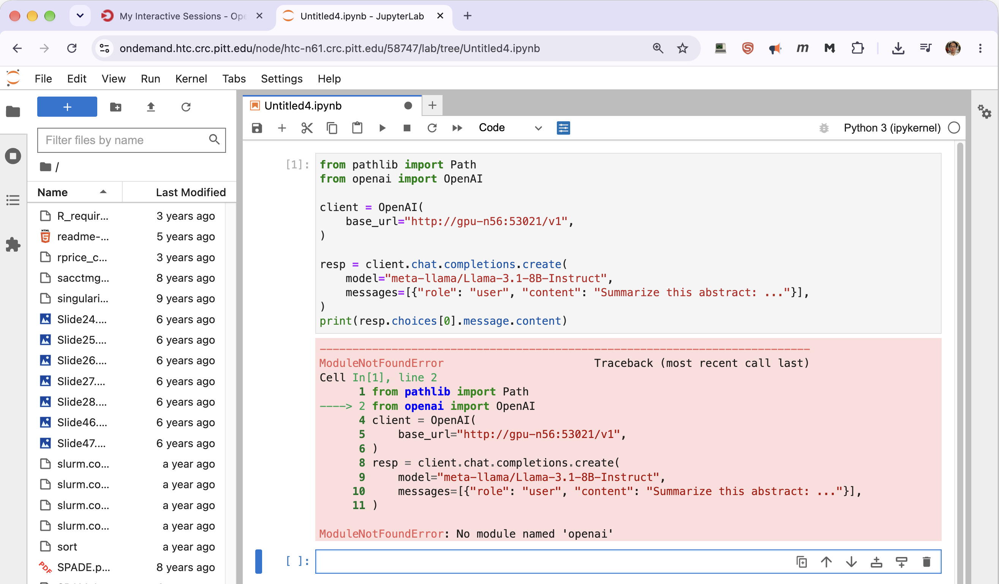

    This is a kernel problem, not a server problem. Build a virtual environment with the client
    library in it and register it as a Jupyter kernel. You only do this once per account.

    ??? note "One-time setup: a kernel with the `openai` package"

        **Open a terminal inside JupyterLab** from the Launcher, under **Other**. This gives you a
        shell on the same node your session is running on.

        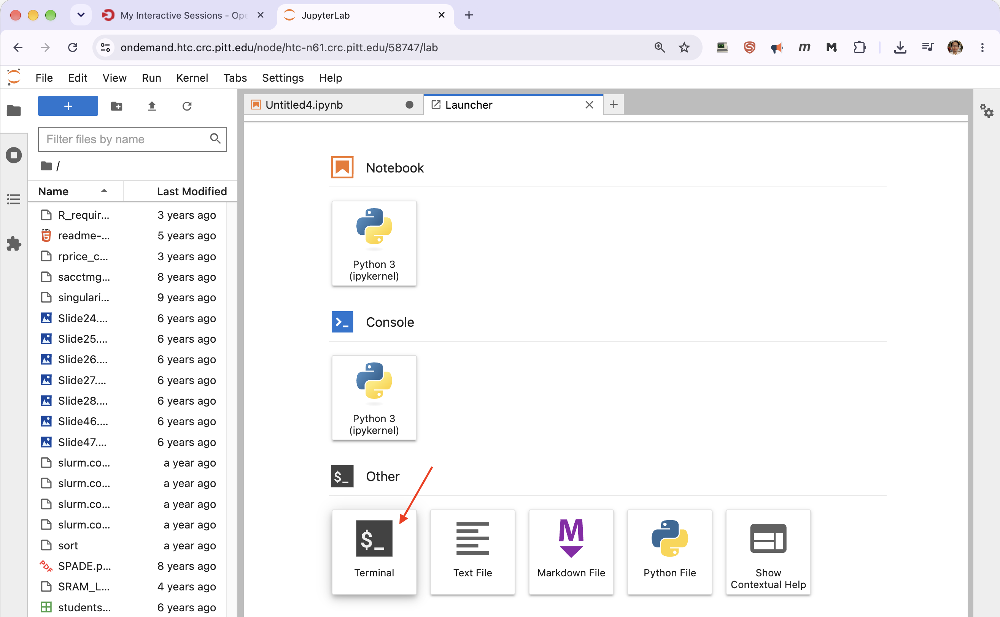

        **Create the environment and install the client.** Build the venv with the same Python the
        session is using — `module list` will show it — so the kernel stays compatible. Put it
        somewhere persistent such as `~/envs`, not in scratch.

        ```bash
        module list                                  # confirm the session's Python
        python3 -m venv ~/envs/openai-env
        source ~/envs/openai-env/bin/activate
        pip install openai ipykernel
        ```

        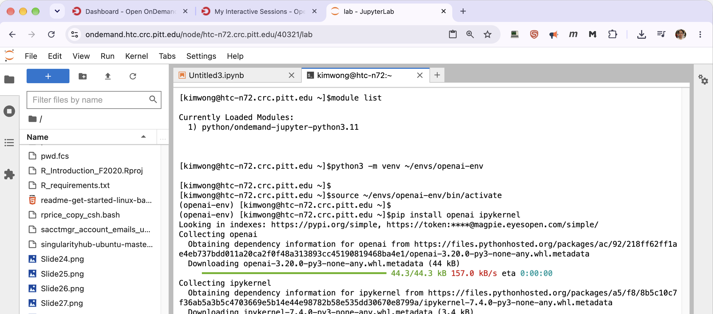

        **Register it as a kernel.** `ipykernel` is what makes the environment visible to
        JupyterLab:

        ```bash
        python -m ipykernel install --user --name openai-env \
               --display-name "Python (openai-env)"
        ```

        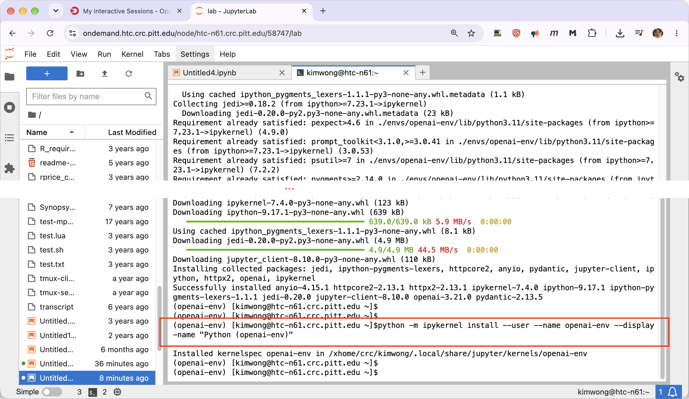

        **Refresh the browser tab.** "Python (openai-env)" now appears in the Launcher and in the
        kernel picker of any open notebook. Select it for your notebook, or switch an existing
        notebook with the kernel selector at the top right.

        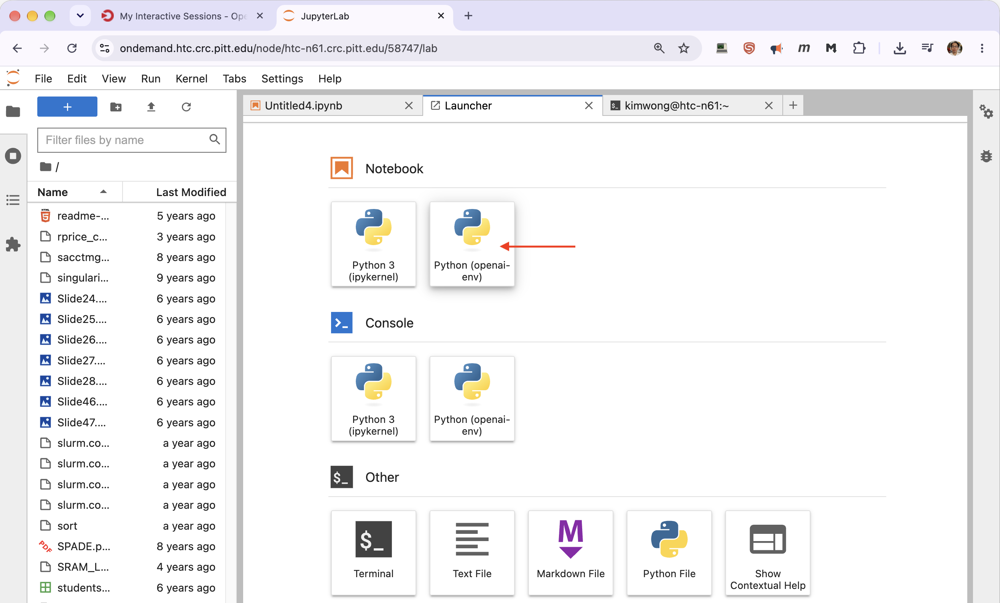

        Later sessions need none of this — the registered kernel persists. Reactivate the venv in a
        terminal only when you want to `pip install` something more into it.

    With that kernel selected, point the client at the address from Step 3:

    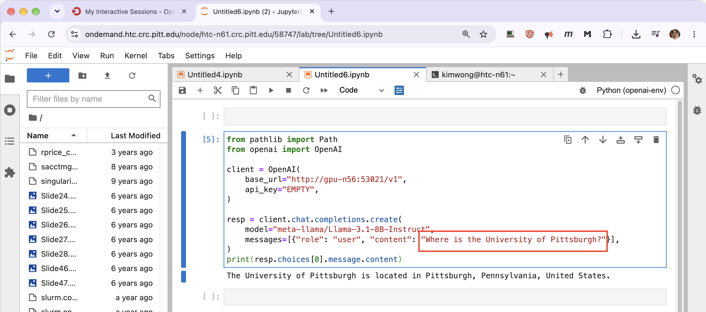

    ```python
    from openai import OpenAI

    client = OpenAI(
        base_url="http://gpu-n56:53021/v1",
        api_key="EMPTY",        # or the contents of your token file, if the server has one
    )

    resp = client.chat.completions.create(
        model="meta-llama/Llama-3.1-8B-Instruct",
        messages=[{"role": "user", "content": "Where is the University of Pittsburgh?"}],
    )
    print(resp.choices[0].message.content)
    ```

    Note the two halves: the notebook is on an HTC node, the server is on `gpu-n56`. Cross-cluster
    access is what makes that work.

    !!! warning "The server's variables are not in your notebook"

        `$VLLM_BASE_URL` and friends exist only in the shell of the server job. A notebook kernel
        inherits nothing from them — and environment variables you export in a JupyterLab terminal
        do not reach an already-running kernel either. Either paste the address in, or have the
        notebook look it up:

        ```python
        import subprocess
        out = subprocess.run(
            ["squeue", "-M", "gpu", "--me", "--states=R", "-h", "-O", "NodeList,Comment"],
            capture_output=True, text=True).stdout.split()
        base_url = f"http://{out[0]}:{out[1]}/v1"
        ```

    `api_key` must be a non-empty string even when the server has no key set, which is why vLLM's
    convention is the literal `"EMPTY"`. If you started the server with `--api-key`, read the value
    from the token file named in the job's output instead.

    See [Jupyter on OnDemand](../../web-portals/jupyter-ondemand.md) for session options.

=== "RStudio on OnDemand"

    Launch **RStudio Server** from the OnDemand dashboard at
    [ondemand.htc.crc.pitt.edu](https://ondemand.htc.crc.pitt.edu). As with Jupyter, an HTC session
    is the right choice and the cheap one: the GPU work happens in your server job, so the R session
    needs no GPU of its own.

    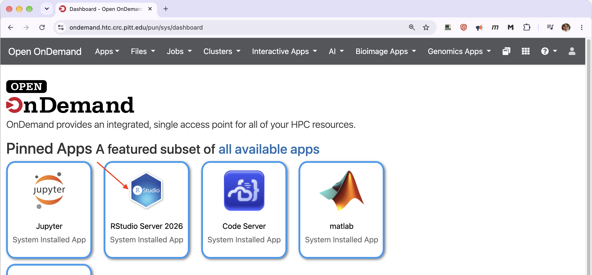

    A stock R installation has nothing that can talk to an OpenAI-compatible endpoint, so a first
    attempt fails at the `library()` call rather than at the server:

    ```r
    library(ellmer)
    #> Error in library(ellmer) : there is no package called 'ellmer'
    ```

    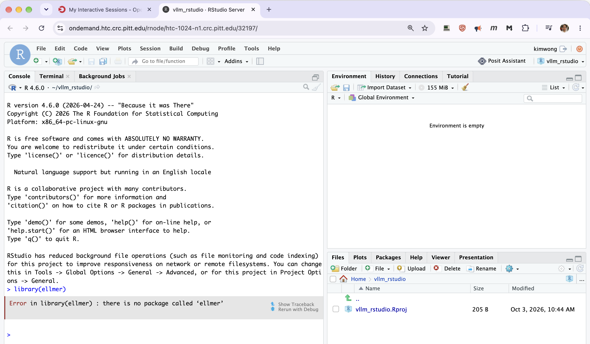

    As with the Jupyter kernel, this is a client-side problem. Install a client package once and
    every later session has it.

    ??? note "One-time setup: installing an R client package"

        **Check your session first.** Run these three in the Console before installing anything:

        ```r
        R.version.string      # ellmer needs a recent R
        .libPaths()           # where packages will be installed
        getOption("repos")    # whether a CRAN mirror is configured
        ```

        `.libPaths()` returns two entries: your personal library under your home directory, and the
        site library that ships with the R module, for example

        ```
        [1] "/xhome/<group>/<username>/R/x86_64-pc-linux-gnu-library/4.6"
        [2] "/software/rhel9/manual/install/r/4.6.0/lib64/R/library"
        ```

        Installs land in the first one. Note the trailing `4.6`: the path is tied to the R version, so
        a session running a different R will not see packages installed under another. If you later
        switch R versions, reinstall.

        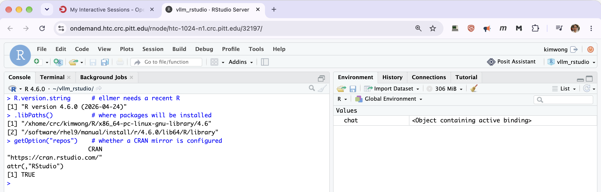

        **Install the client.**

        ```r
        install.packages("ellmer")
        ```

        On CRCD this pulls in `httr2` and `rlang`; the rest of the chain is already in the system
        library. CRAN is configured site-wide, so the download works without any setup. Packages are
        built from source rather than installed as binaries, so expect a few minutes of compiler
        output scrolling past — that is normal, not an error.

        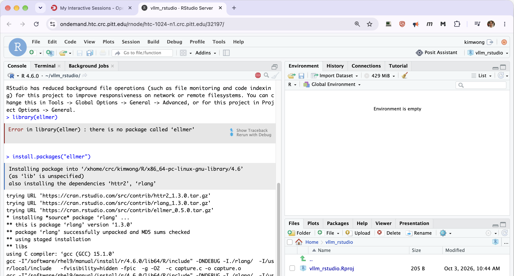

        **Nothing to register.** Unlike JupyterLab, R needs no equivalent of a kernel: the personal
        library is on `.libPaths()` automatically in every later session on the same R version. Use
        the **Terminal** pane beside the Console only if you prefer installing from a shell.

    With the package available, point it at the address from Step 3:

    ```r
    library(ellmer)

    # The server has no API key, but ellmer insists on one. Supplying it through the
    # environment avoids the deprecated api_key argument.
    Sys.setenv(OPENAI_API_KEY = "EMPTY")

    chat <- chat_openai(
      base_url = "http://gpu-n64:60439/v1",
      model    = "meta-llama/Llama-3.1-8B-Instruct"
    )
    chat$chat("Where is the University of Pittsburgh?")
    ```

    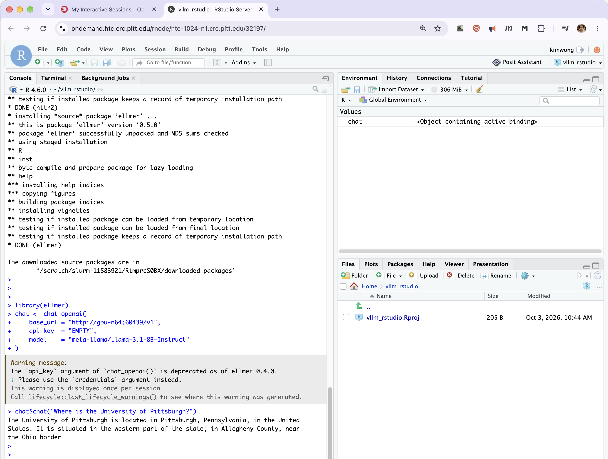

    As with the notebook, the two halves sit on different clusters: the R session on an HTC node,
    the server on `gpu-n56`. Cross-cluster access is what makes that work.

    The key must be a non-empty string even when the server has no key set, hence the literal
    `"EMPTY"`. If you started the server with `--api-key`, use that value instead, reading it from
    the token file named in the job's output.

    !!! note "Why not the `api_key` argument?"

        `chat_openai()` still accepts `api_key`, but as of `ellmer` 0.4.0 it is deprecated and warns
        once per session:

        ```
        Warning message:
        The `api_key` argument of `chat_openai()` is deprecated as of ellmer 0.4.0.
        i Please use the `credentials` argument instead.
        ```

        The call works regardless. Setting `OPENAI_API_KEY` as above sidesteps the argument
        entirely and stays quiet. `credentials` is the documented replacement if you prefer to pass
        the key explicitly — check `?chat_openai` for the form your installed version expects, since
        this part of the `ellmer` API is still moving.

    !!! warning "The server's variables are not in your R session"

        `$VLLM_BASE_URL` and friends exist only in the shell of the server job. An R session
        inherits nothing from them. Either paste the address in, or have R look it up:

        ```r
        out <- system2("squeue",
                       c("-M", "gpu", "--me", "--states=R", "-h", "-O", "NodeList,Comment"),
                       stdout = TRUE)
        out <- out[!grepl("^CLUSTER:", out) & nzchar(trimws(out))]
        parts <- strsplit(trimws(out[1]), "\\s+")[[1]]
        base_url <- sprintf("http://%s:%s/v1", parts[1], parts[2])
        base_url
        ```

        The `CLUSTER:` filter matters because `squeue -M` prefixes its output with a cluster header
        line that `-h` does not always suppress.

    ??? tip "Alternatives if `ellmer` will not install"

        **Use `httr2` directly.** The endpoint is plain JSON over HTTP, so no LLM-specific package
        is required:

        ```r
        library(httr2)

        body <- list(
          model = "meta-llama/Llama-3.1-8B-Instruct",
          messages = list(list(role = "user", content = "Where is the University of Pittsburgh?"))
        )

        resp <- request("http://gpu-n64:60439/v1/chat/completions") |>
          req_headers(`Content-Type` = "application/json") |>
          req_body_json(body) |>
          req_perform()

        resp_body_json(resp)$choices[[1]]$message$content
        ```

        **If `install.packages()` cannot reach CRAN**, check `getOption("repos")` first. CRCD
        configures a mirror site-wide and compute nodes can reach it, so an unset or overridden
        `repos` option in your own `.Rprofile` is the more likely cause than a missing network
        route.

        **If compilation fails** on `curl` or `openssl`, the development headers are missing from
        the session. Loading an R module that bundles them, or asking CRCD for a prebuilt binary,
        is faster than fighting it.

    See [RStudio Server on the GPU Cluster](../ondemand-rstudio-gpu.md) for session options.

=== "A browser (OnDemand node proxy)"

    OnDemand can proxy any port on any compute node, so you can reach your server from a browser
    without a tunnel. Build the URL from the node and port in Step 3, using **`/rnode/`** and the
    node's fully qualified name:

    ```
    https://ondemand.htc.crc.pitt.edu/rnode/gpu-n64.crc.pitt.edu/60439/v1/models
    ```

    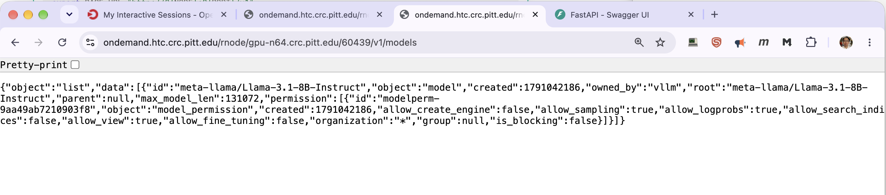

    You must be logged in to OnDemand in the same browser for the proxy to authorize you.

    !!! note "Use `/rnode/`, not `/node/`"

        OnDemand exposes two proxy paths. `/rnode/` is the one that works for an inference server
        on CRCD; `/node/` does not, even though you will see it in the address bar of OnDemand's own
        Jupyter sessions.

    **The path matters too.** vLLM serves no page at the root, so a URL ending at the port returns
    vLLM's own 404 body:

    ```json
    {"detail":"Not Found"}
    ```

    That is a success signal for the proxy — OnDemand reached your server and the server replied.
    Add a real path:

    | Path | What you get |
    | ---- | ------------ |
    | `/v1/models` | JSON listing the served model, its `max_model_len`, and its permissions. The quickest confirmation that the server is up |
    | `/health` | Empty `200` once the model has finished loading |

    If the server was started with `--api-key`, a browser cannot send the authorization header, so
    these paths return `401`. Use `curl` from a cluster node instead, or run without a key when you
    only want to poke at it from a browser.

    !!! failure "Did not work: vLLM's `/docs` page"

        vLLM's interactive API documentation does not render behind the proxy. The page frame loads
        and then fails:

        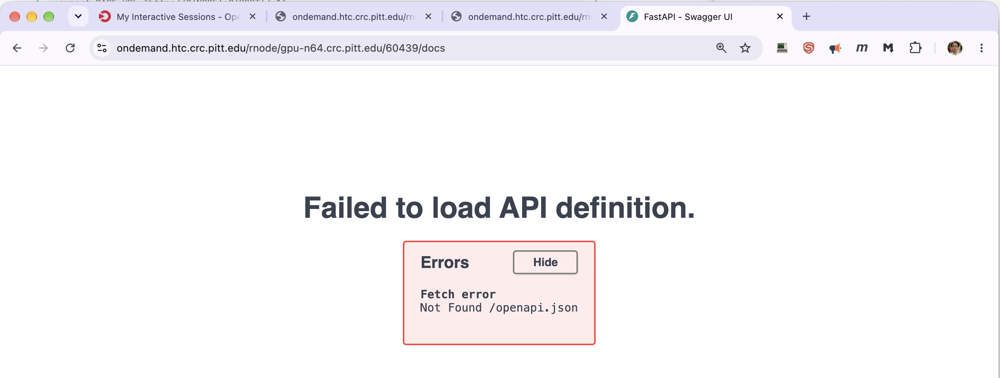

        Swagger fetches its specification from `/openapi.json` at the domain root, which resolves to
        OnDemand rather than to your server. `/rnode/` does not fix this.

        The page itself is fine — it is only the proxy's path prefix that breaks it. Over an SSH
        tunnel there is no prefix and `/docs` works normally, so use that route if you want the
        interactive documentation.

    **llama.cpp ships a chat interface**, and it does render through the proxy — so this is the way
    to chat with a model from a browser with nothing installed locally. Point at the root path,
    keeping the trailing slash:

    ```
    https://ondemand.htc.crc.pitt.edu/rnode/gpu-n79.crc.pitt.edu/27508/
    ```

    

    The model selector shows what the server has loaded, and each message is annotated with token
    counts and throughput:

    

    !!! warning "Keep the trailing slash"

        Without it the browser resolves the interface's asset paths one level too high and you get a
        blank page. This is also why `curl` on the root is a poor test — llama.cpp answers a bare
        `GET /` with `415 text/plain`, which looks like a failure but isn't. Use a browser.

    That interface has no authentication. Anyone logged in to OnDemand who knows your node and
    port can open the same chat window and spend your allocation.

=== "Your laptop (SSH tunnel)"

    Compute nodes aren't reachable from off-cluster, so forward the port through a login node.

    **Run this on your laptop, not on a login node.** It opens a listening port on whichever
    machine you type it on, so running it on the cluster would only forward a port the cluster can
    already reach.

    ```bash
    ssh -N -L 8000:gpu-n64:60439 <pittID>@h2p.crc.pitt.edu
    ```

    Reading the arguments:

    | Part | Meaning |
    | ---- | ------- |
    | `8000` | A free port **on your laptop**. Pick anything above 1024; it needn't match the server's |
    | `gpu-n56:53021` | Your server's node and port from Step 3, resolved **from the login node**, which is why the compute node name works here |
    | `h2p.crc.pitt.edu` | The login node doing the forwarding. This is a round-robin alias, so you may land on any of the login nodes |
    | `-N` | Forward only, don't open a shell |

    The command prints nothing and does not return — that is correct. Leave it running and open a
    second terminal for your work.

    Check the tunnel by asking the server for its model list, either with `curl` or in a browser:

    ```bash
    curl http://localhost:8000/v1/models
    ```

    ```
    http://localhost:8000/v1/models
    ```

    !!! tip "`/v1` is a base URL, not a page"

        `http://localhost:8000/v1` is what you give a client library as its `base_url`. Opening it
        in a browser returns `{"detail":"Not Found"}`, because vLLM has no route at `/v1` itself —
        the same 404 you get from the bare root. That response still means the tunnel is working.
        Append a real path such as `/models`.

    **A browser interface, with nothing to install.** Over a tunnel there is no path prefix, so
    vLLM's built-in API documentation at `http://localhost:8000/docs` loads and works:

    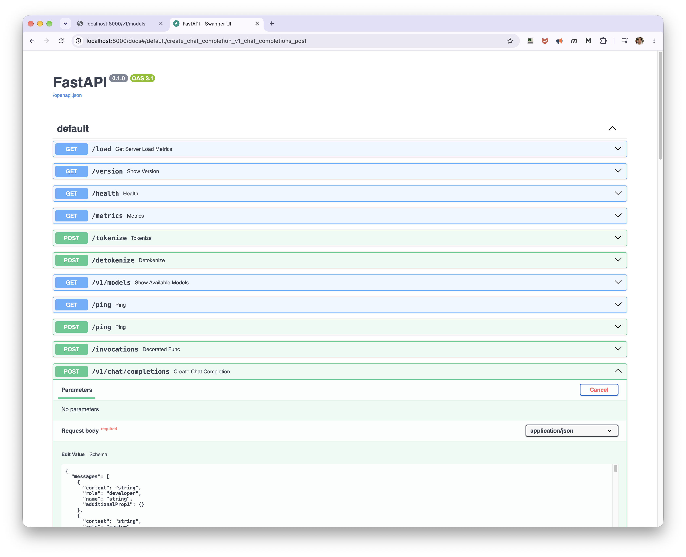

    Expand **POST /v1/chat/completions**, click **Try it out**, replace the placeholder request body,
    and click **Execute**. A minimal body:

    ```json
    {
      "model": "meta-llama/Llama-3.1-8B-Instruct",
      "messages": [{"role": "user", "content": "Where is the University of Pittsburgh?"}]
    }
    ```

    The `model` value has to match what `/v1/models` reports, and the sample body that Swagger
    pre-fills uses `"role": "developer"` with `"string"` placeholders — replace them. It is an API
    explorer rather than a chat window, but it needs no client library and no extra software.

    The same tunnel also serves any desktop application that accepts an OpenAI-compatible endpoint:
    point it at `http://localhost:8000/v1` with the key `EMPTY`, or your real key if the server has
    one.

    You'll need to be on Wireless-PittNet or the University VPN for the `ssh` to connect at all.
    Stop the tunnel with `Ctrl+C` when you're done; it dies with the server job in any case. See
    [SSH Connection Using a Terminal](../../web-portals/terminal.md).

=== "Claude Code"

    [Claude Code](claude-code.md) is an agentic coding tool that reads and edits files and runs
    commands. The `claude-code` module points it at a model you are hosting on a CRCD GPU rather
    than at Anthropic's API.

    It is the one client that sets up the server for you: load `claude-code` and it loads a
    backend, starts it, and injects the flags that tool calling requires.

    ```bash
    export CLAUDECODE_BACKEND="vllm"
    export CLAUDECODE_VLLM_TOOL_PARSER="hermes"
    export VLLM_MODEL="Qwen/Qwen2.5-Coder-32B-Instruct"
    module load claude-code
    claude
    ```

    !!! important "Load `claude-code` before the backend, not after"

        If you have already loaded `vllm` or `llamacpp` in this session — following Step 2, for
        instance — unload it first. `claude-code` can only inject the tool-calling flags before the
        backend server starts, and without them Claude Code cannot use tools at all.

    Full reference, including the tool-call parser table: [Claude Code on CRCD](claude-code.md).

=== "VS Code"

    With a Remote-SSH session on the cluster, VS Code forwards ports from the remote host
    automatically. Open the **Ports** panel, add the server's port, and reach it at
    `localhost:<port>` on your machine. See [VS Code](../../applications/coding/vscode.md).

## Step 5. Stop the server

A server job holds its GPU and bills service units for the full walltime whether it's answering
requests or sitting idle. GPU jobs are billed per card, so an idle 8-card server is expensive.
Cancel it as soon as you're done:

```bash
scancel -M gpu 1230409
```

Set `--time` to what you actually need rather than the maximum. For a long-running service, it's
usually cheaper to relaunch on demand than to hold a card overnight.

## Keeping your endpoint private

All ports are open within the CRCD environment, which is what makes cross-cluster clients easy —
and it also means any user on any cluster could send requests to an unauthenticated server. Your
allocation pays for their tokens, and your prompts and completions pass through a process they
could query.

- Always set an API key where the server supports one. For vLLM, export `VLLM_API_KEY` before
  loading the module. Put llama.cpp and Ollama behind a key-checking proxy if the endpoint
  matters.
- Generate the key per job rather than reusing a fixed string, as the templates above do.
- Store it in a file with restrictive permissions, not in a script or a notebook cell. The
  templates write it to `~/.crcd_inference/token_<jobid>` and delete it when the job ends.
- Don't serve models or data with licensing or privacy restrictions without confirming the terms.
  For restricted data, contact CRCD before you begin.

!!! warning "Don't pass the key as a command-line flag"

    vLLM also accepts `--api-key` through `VLLM_EXTRA_ARGS`, and it works — but the key then sits
    in the process's command line, where anyone who can list processes on that node reads it:

    ```console
    [kimwong@gpu-n79 ~]$ ps -eo pid,user,args | grep -- '--api-key'
    1850563 kimwong  /usr/bin/python3 /usr/local/bin/vllm serve meta-llama/Llama-3.1-8B-Instruct \
             --port 52615 --host 0.0.0.0 --download-dir /vast/crcd/kimwong/vllm --api-key gopitt
    ```

    `VLLM_API_KEY` keeps it out of the process table. Both enforce the key identically —
    unauthenticated requests get `{"error":"Unauthorized"}` either way.

!!! tip "Rejected requests show up in the log"

    vLLM records the source address of every request, so `$VLLM_LOGFILE` tells you whether anyone
    else has been probing your endpoint:

    ```
    INFO:     10.201.0.25:49632 - "GET /v1/models HTTP/1.1" 401 Unauthorized
    INFO:     10.201.0.25:38664 - "GET /v1/models HTTP/1.1" 200 OK
    ```

## Troubleshooting

| Symptom | Likely cause | What to do |
| ------- | ------------ | ---------- |
| Job stays `PD` with `(Resources)` | Requested partition is busy | Target a partition with more free cards, or fewer GPUs |
| Job stays `PD` with `AssocGrpBillingMinutes` | No allocation or expired | Submit a [Service Request Form](https://crc.pitt.edu/service-request-forms) |
| `Connection refused` from a client | Server still loading, or bound to localhost | Check the job output; confirm `--host 0.0.0.0` |
| `CUDA out of memory` at startup | Model too large for the cards | Fewer layers, a quantized model, more GPUs, or a larger-VRAM partition |
| Empty `Comment` from `squeue` | Job hasn't reached the `scontrol update` line | Wait a moment and rerun; check the output file for errors |
| `must be run inside a SLURM allocation` | Loaded the `vllm` module on a login node | Start an interactive session or submit a batch job first |
| `No GPU is visible to this job` | Allocation has no GPU attached | Add `--gres=gpu:1`; an HTC or SMP session cannot host the server |
| `mount source ...\.cache/huggingface doesn't exist` | First-ever use. The module binds `~/.cache/huggingface` on every launch, whether or not `VLLM_DOWNLOAD_DIR` is set | `mkdir -p ~/.cache/huggingface`, then load the module again. The templates do this for you |
| `VLLM_MODEL looks like a local path but no such directory exists` | Wrong path, or storage not mounted on the node you landed on | Confirm the path is readable from inside a job, not just from a login node |
| Server serves `facebook/opt-125m` | `VLLM_MODEL` unset, or set after the module load | Export it first, then `module unload vllm && module load vllm/0.29.0` |
| Batch job ends seconds after starting | Script fell off the end; the module backgrounds the server | Block on `$VLLM_PID` as the templates do |
| `vllm-status` reports still starting | Normal for large models | Wait; check `$VLLM_LOGFILE` for progress |
| `{"error":"Unauthorized"}` from vLLM | Missing or wrong API key | Send `Authorization: Bearer <key>`; compare against the token file named in the job output |
| `{"detail":"Not Found"}` in a browser | Connection succeeded; vLLM serves no page at `/` or `/v1` | Append a real path, e.g. `/v1/models`. Through the OnDemand proxy, also check you used `/rnode/` |
| Server vanished mid-session | Walltime expired, or job was preempted | Check `sacct -M gpu -j <jobid>`; avoid preemptible partitions |

If you're stuck, submit a [help ticket](https://services.pitt.edu/TDClient/33/Portal/Requests/TicketRequests/NewForm?ID=yXkHi62rHa8_&RequestorType=Service)
and include the job ID and the job's output file.

## Related

<div class="grid cards" markdown>

-   :material-expansion-card-variant: **Pick a GPU**

    ---

    Per-partition cards, VRAM, cores, and `--constraint` values.

    [GPU cluster](../../hardware_profiles/gpu.md)

-   :material-book-open-variant: **vllm module reference**

    ---

    Every `VLLM_*` variable, `vllm-status`, and `vllm-stop`.

    [Using the vllm module](vllm-module.md)

-   :material-console: **Ollama specifics**

    ---

    Pulling models, and the R and Python clients CRCD has preinstalled.

    [Ollama](ollama.md)

-   :material-cash: **What a job costs**

    ---

    GPU jobs are billed per card for their full walltime.

    [Service Units](../../slurm/service-units.md)

-   :material-package-variant-closed: **Bring your own server**

    ---

    Build a container for a framework CRCD doesn't provide as a module.

    [Introduction to Singularity](../singularity.md)

</div>
