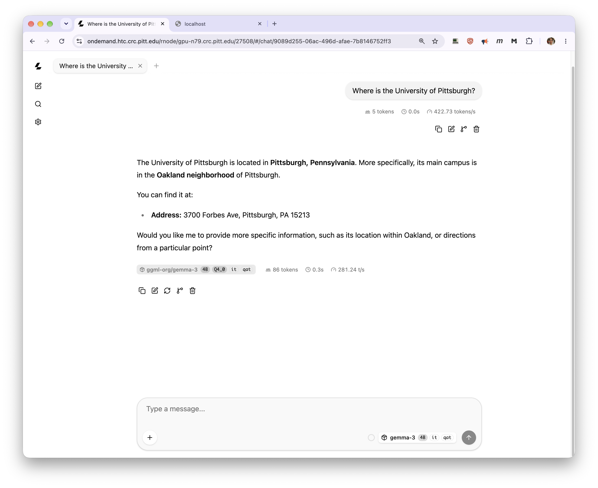
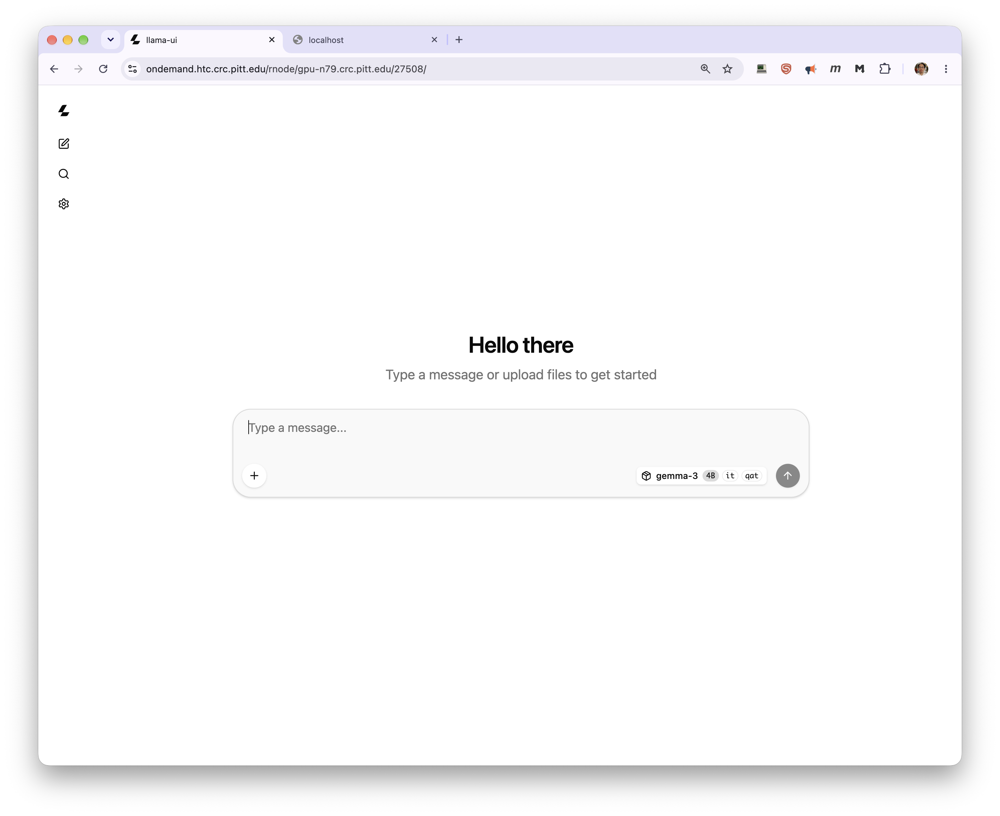

# Using the llamacpp module

This module starts a private llama.cpp inference server for your job
and gives you a URL to send requests to. It's for **your own job**
only — it's not a shared/always-on service.

For choosing a GPU, reaching your server from elsewhere on the
cluster, and connecting clients, see
[Inference Servers on the GPU Cluster](inference-server.md).

## Quick start

You need an interactive or batch SLURM job with a GPU attached. This
will not work on a login node.

```bash
srun -M gpu -p rtx6k -n16 --gres=gpu:1 -t02:00:00 --pty bash

module load llamacpp/0.5.0
```

That's it — you'll see something like:

```
llama.cpp (container) starting - run 'llamacpp-status' to check readiness.
Base URL: http://gpu-n80:27555
```

The module loads its own container runtime, so you don't need to load
Apptainer or Singularity yourself.

Keep an eye on the walltime you ask for. A GPU job bills for its full
walltime whether or not it's answering requests, so request what you
actually need and stop the server when you're done.

A small default model loads if you don't ask for anything else. To
pick your own model, set `LLAMACPP_MODEL` **before** loading the
module:

```bash
export LLAMACPP_MODEL="ggml-org/gemma-3-4b-it-qat-GGUF:Q4_0"
module load llamacpp/0.5.0
```

Any Hugging Face GGUF repo works — use the `repo:tag` form shown on
the model's Hugging Face page (the `:tag` picks a quantization).

!!! tip "Switching models"

    Set `LLAMACPP_MODEL` to something else and load the module again.
    The running server is stopped before the new one starts:

    ```
    [kimwong@gpu-n80.crc.pitt.edu ~]$ module load llamacpp/0.5.0
    Stopped llama.cpp server (PID 3886172).

    llama.cpp (container) starting - run 'llamacpp-status' to check readiness.
    Base URL: http://gpu-n80:27744
    ```

    The port changes each time, so re-read `$LLAMACPP_BASE_URL` and
    update any client pointing at the old one.

!!! warning "Avoid preemptible partitions"

    A preempted job takes your endpoint down mid-request. Run servers
    on regular partitions. See
    [Preemptible Partitions](../../slurm/preempt.md).

## Checking readiness

Downloading and loading a model can take a while the first time.
Poll with:

```bash
llamacpp-status
```

- `READY - http://gpu-n80:27555` — you're good to go
- `STARTING - ...` — still downloading/loading, try again shortly
- `DOWN - ...` — it crashed; the message tells you where the log is

## What you get after loading

The module sets these in your shell:

- `$LLAMACPP_BASE_URL` — full URL to your server, e.g. `http://gpu-n80:27555`
- `$LLAMACPP_LOGFILE` — path to the server's log

There is no `$LLAMACPP_PID`, and the host and port aren't exported
separately. A batch script that needs the port can split it out of the
base URL:

```bash
HOSTPORT="${LLAMACPP_BASE_URL#http://}"
NODE="${HOSTPORT%%:*}"
PORT="${HOSTPORT##*:}"
```

Because there's no PID to watch, `llamacpp-status` is the only way for
a script to tell whether the server is still alive. A batch job that
needs to stay up for the server's lifetime can block on it:

```bash
while llamacpp-status | head -n1 | grep -qE '^(READY|STARTING)'; do
    sleep 60
done
```

## Sending requests

The module sets `$LLAMACPP_BASE_URL` for you:

```bash
curl "$LLAMACPP_BASE_URL/v1/chat/completions" \
  -H "Content-Type: application/json" \
  -d '{"messages": [{"role": "user", "content": "Hello!"}]}'
```

It's an OpenAI-compatible API, so most OpenAI client libraries work
by pointing `base_url` at `$LLAMACPP_BASE_URL` and using any
placeholder API key (no key is required by default). `model` is
optional in the request body, since the server has only one loaded.

!!! warning "This server is unauthenticated and accepts any origin"

    llama.cpp logs this at startup:

    ```
    W srv  llama_server: security: no API key is set and CORS allows all origins
    ```

    Ports are open within the CRCD environment, so anyone who finds
    your host and port can send requests that bill against your
    allocation, and any web page can call the endpoint from a browser.
    Keep these jobs short, cancel them when you finish, and use
    [vllm](vllm.md) with `--api-key` for anything long-lived or
    sensitive.

## Chat in your browser

llama.cpp ships a web chat interface, served at the root of your
server's URL. You can reach it through OnDemand's node proxy without
a tunnel or any local software — build the URL from your base URL,
keeping the **trailing slash**:

```
https://ondemand.htc.crc.pitt.edu/rnode/gpu-n79.crc.pitt.edu/27508/
```



You must be logged in to OnDemand in the same browser. The model
selector shows what the server has loaded, and each message is
annotated with token counts and throughput.



!!! warning "Keep the trailing slash"

    Without it the browser resolves the interface's asset paths one
    level too high and you get a blank page. A bare `curl` on the root
    is also a poor test — the server answers `GET /` with
    `415 text/plain`, which looks like a failure but isn't.

An SSH tunnel works too, if you'd rather not go through OnDemand:

```bash
ssh -N -L 8080:gpu-n79:27508 <pittID>@h2p.crc.pitt.edu
```

Then open `http://localhost:8080/` on your own machine. Run that
command on your laptop, not on a login node. See
[Inference Servers](inference-server.md) for the other access routes.

!!! danger "The chat interface is unauthenticated"

    It inherits the server's lack of authentication. Anyone logged in
    to OnDemand who knows your node and port can open the same
    interface and spend your allocation. Keep these jobs short and
    cancel them when you finish.

## Using a gated or private model

Some Hugging Face repos require authentication:

```bash
export LLAMACPP_HF_TOKEN="hf_xxx"
export LLAMACPP_MODEL="meta-llama/some-gated-repo-GGUF:Q4_0"
module load llamacpp/0.5.0
```

Keep the token private and treat it like a password.

## Using your own local GGUF file

If you already have a `.gguf` file (e.g. on air-gapped clusters with
no outbound network access):

```bash
export LLAMACPP_OFFLINE=1
export LLAMACPP_MODEL="/vast/$USER/models/my-model.gguf"
module load llamacpp/0.5.0
```

## Where models are downloaded

By default models land under `$HOME`, which has a 75 GB quota. Point
`LLAMACPP_DOWNLOAD_DIR` at your group's space **before** loading the
module:

```bash
export LLAMACPP_DOWNLOAD_DIR=/vast/<group>/$USER/llamacpp
export LLAMACPP_MODEL="ggml-org/gemma-3-4b-it-qat-GGUF:Q4_0"
module load llamacpp/0.5.0
```

Files arrive in Hugging Face cache layout, and a repo may hold more
than one file — this one brings a 2.5 GB GGUF plus an 851 MB
multimodal projector, 3.2 GB in total:

```
/vast/<group>/$USER/llamacpp/
└── models--ggml-org--gemma-3-4b-it-qat-GGUF/
    ├── blobs/
    ├── refs/
    └── snapshots/bbcac0d.../
        ├── gemma-3-4b-it-qat-Q4_0.gguf -> ../../blobs/ee91c3e...
        └── mmproj-model-f16-4B.gguf    -> ../../blobs/c5271ca...
```

The `.gguf` entries under `snapshots/<hash>/` are symlinks into
`blobs/`. If you later want to serve one as a local file with
`LLAMACPP_OFFLINE=1`, use the path inside `snapshots/<hash>/` — not
the blob, whose filename is a checksum.

## Common tweaks

```bash
export LLAMACPP_EXTRA_ARGS="-c 16384 -np 4"   # bigger context, 4 concurrent request slots
module load llamacpp/0.5.0
```

`-c/--ctx-size` controls the context window (`-c 0` uses the model's
full native context); `-np/--parallel` controls how many requests it
can serve at once. Anything accepted by `llama-server --help` can go
in `LLAMACPP_EXTRA_ARGS`.

## Shutting down

```bash
llamacpp-stop        # stop the server, keep the module loaded
```

`module unload llamacpp` and `module purge` also stop it, and report
the PID they killed:

```
[kimwong@gpu-n80.crc.pitt.edu ~]$ module purge
Stopped llama.cpp server (PID 3879397).
```

Ending your SLURM session stops the server too, so you won't leave
anything running behind.

If you run `llamacpp-stop` and then unload, the unload reports
`No pidfile ...; nothing to stop` — that is informational, not an
error; the server was already stopped. Unloading the module also
removes the container-runtime modules it brought in with it.

## Troubleshooting

- **"must be loaded inside a SLURM job"** — you're on a login node.
  Start an interactive session or submit a batch job first.
- **"No GPU is visible to this job"** — your allocation doesn't have a
  GPU attached. Re-request your session with a GPU, e.g. add
  `--gres=gpu:1` to your `salloc`/`srun`/`sbatch` command, then load
  the module again.
- **Nothing happening for a while** — check `llamacpp-status`; a large
  model's first download can take several minutes.
- **Port already in use** — shouldn't happen; the launch script
  probes for a free port and retries automatically. If you still hit
  this, check `$LLAMACPP_LOGFILE` for details.
- **`"llama-server": executable file not found in $PATH`** — this is
  an install issue, not something you can fix from a job. It means
  the site's `.sif` doesn't have `llama-server` set up as its
  entrypoint the way the official image does. Flag it to whoever
  maintains the module.
- **`error while loading shared libraries: libllama-server-impl.so:
  cannot open shared object file`** — also a site install issue, not
  something fixable from a job. The site's `.sif` was built from an
  upstream llama.cpp image that's missing a library it needs (a known
  upstream packaging bug). Flag it to whoever maintains the module;
  they'll need to rebuild the `.sif` from a different image tag.
