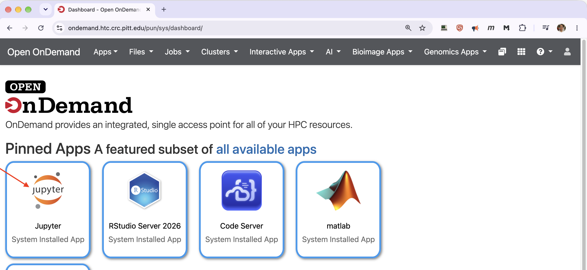
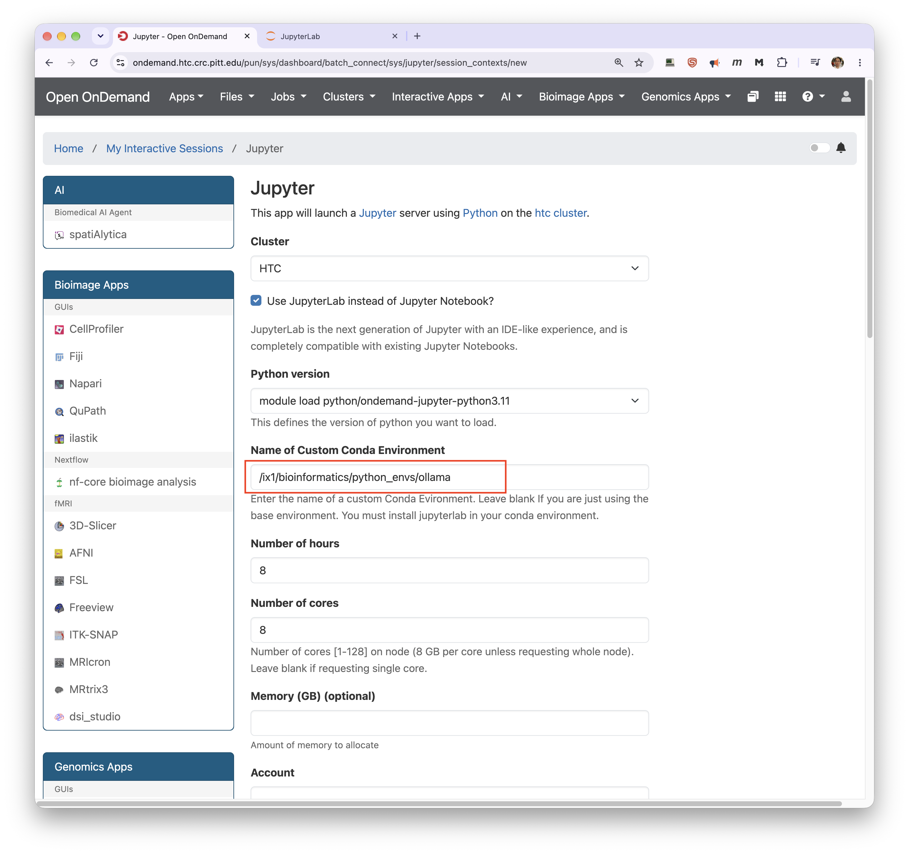
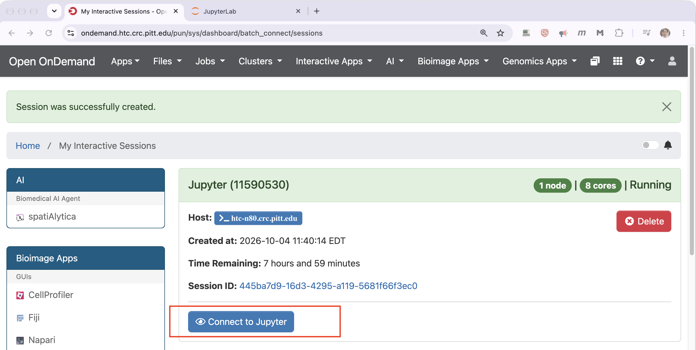
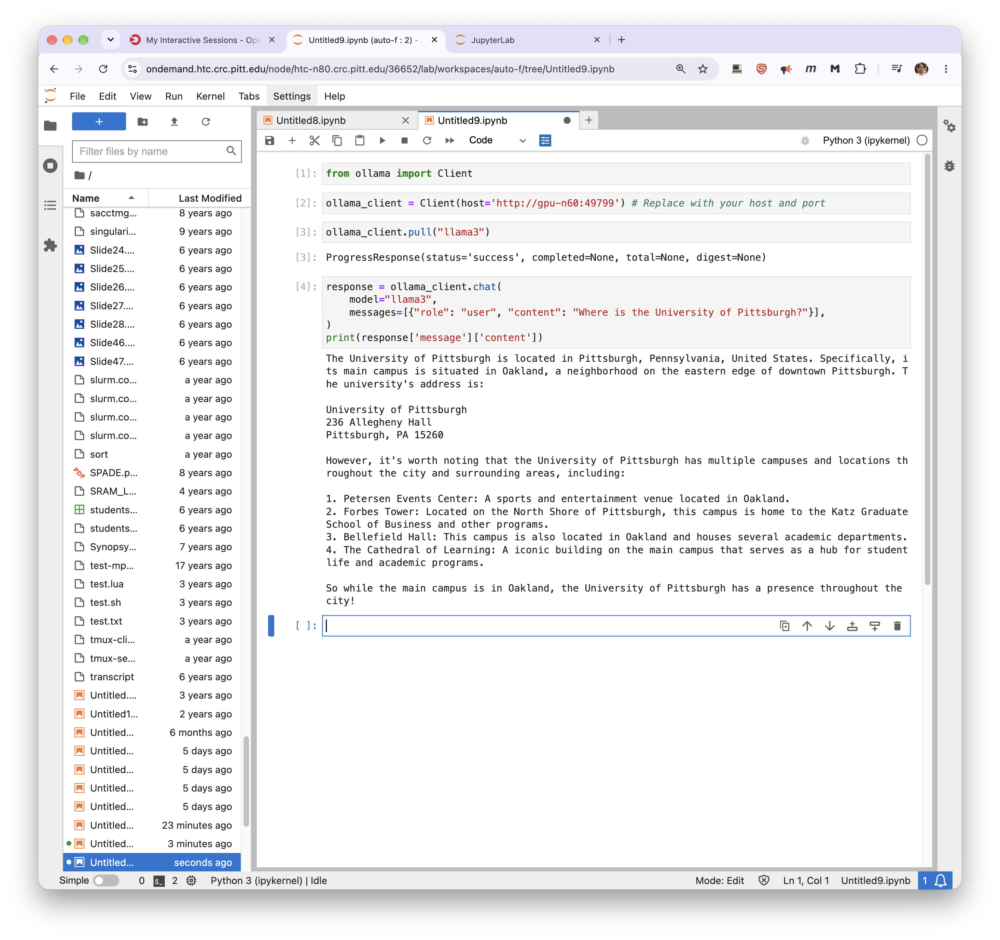
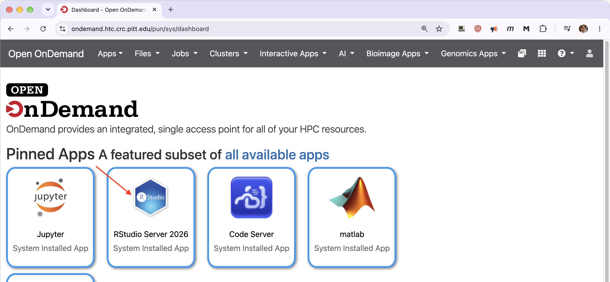
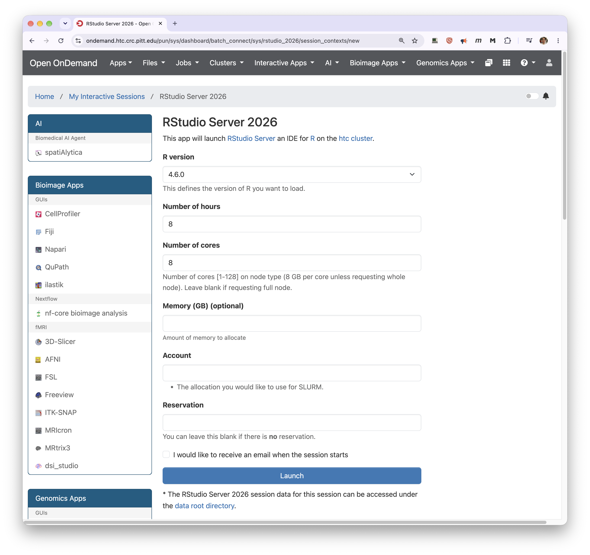
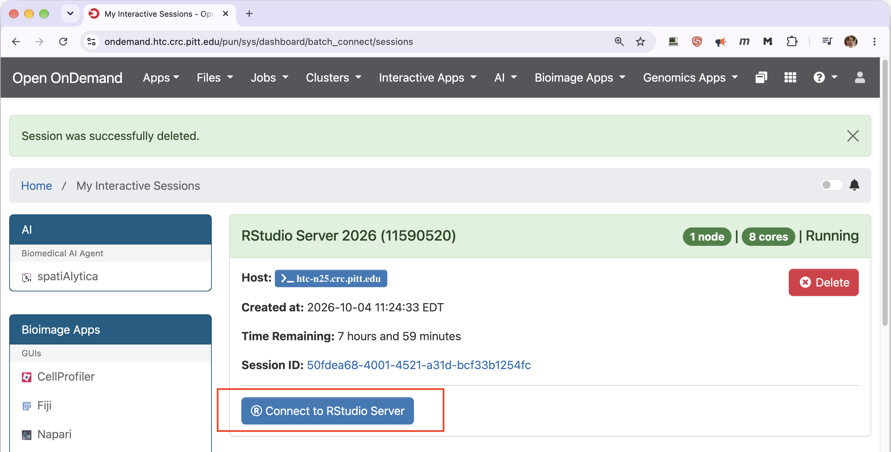
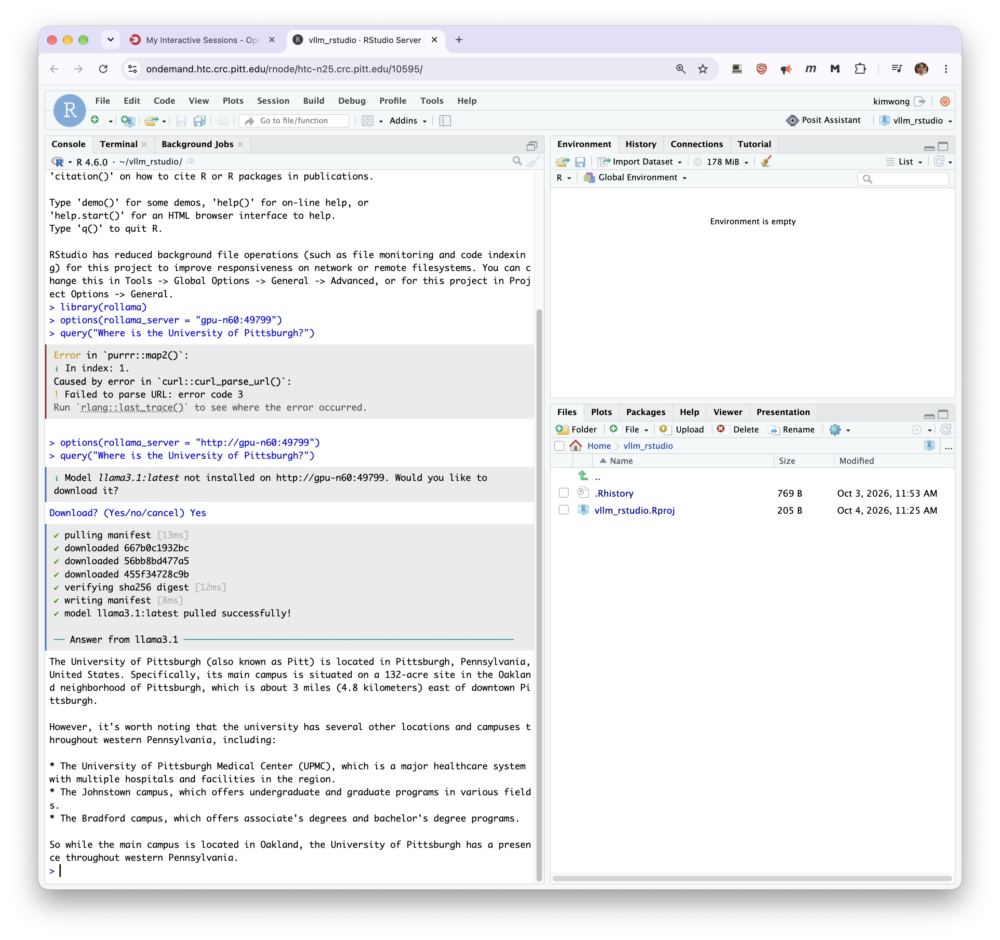

# Ollama

Ollama runs large language models behind an HTTP API. It is the easiest of the CRCD serving
options for pulling community models by name, and it has first-class R and Python clients.

This page covers what is specific to Ollama. For choosing hardware, reaching a server from
elsewhere on the cluster, service-unit costs, and the other access routes, see
[Inference Servers on the GPU Cluster](inference-server.md).

!!! warning "Ollama has no authentication"

    All ports are open within the CRCD environment, so any user who finds your server's host and
    port can send requests that bill against your allocation. Keep these jobs short, cancel them
    when you are done, and use [vLLM](vllm.md) with an API key for anything long-lived.

## Before you start

You need an allocation on the `gpu` cluster. Models download to `~/.ollama/models` by default,
and your home directory has a 75 GB quota:

```console
[kimwong@login2 ~]$ ls -l ~/.ollama
total 11
-rw-------. 1 kimwong sam 387 Oct  4 11:20 id_ed25519
-rw-r--r--. 1 kimwong sam  81 Oct  4 11:20 id_ed25519.pub
drwxr-xr-x. 4 kimwong sam   4 Oct  4 11:28 models
```

A handful of large models will fill that. Check it with `du -sh ~/.ollama/models` and remove what
you are not using with `ollama rm`. Relocating the model directory means setting `OLLAMA_MODELS`
and making sure the new path is visible inside the container — ask CRCD before relying on that for
a large model.

## Starting the server

Submit one of the installed batch templates:

```bash
sbatch /software/rhel9/manual/install/ollama/ollama-0.11.10_l40s.slurm
```

| Template | Partition | GPU |
| -------- | --------- | --- |
| `ollama-0.11.10_l40s.slurm` | `l40s` | 1 × L40S, 48 GB |
| `ollama-0.11.10_a100_80gb.slurm` | `a100_nvlink` | 1 × A100, 80 GB |

Both request 16 cores, 125 GB of host memory, and a four-hour walltime. Each picks a free port,
publishes it to the job's `Comment` field, and runs the server in the foreground for the job's
walltime. Copy one to your own space if you need different values:

```bash
cp /software/rhel9/manual/install/ollama/ollama-0.11.10_l40s.slurm ~/my_ollama.slurm
```

!!! danger "Don't start a server outside Slurm"

    Always start the server through a batch job or an interactive session. A server process on a
    login node competes with every other user on that node and will be killed.

!!! note "Other versions are installed"

    The install directory also holds a `0.19.0` image with its own templates, and
    `module spider ollama` reports an `ollama/0.32.5` module. That module only adds the `ollama`
    binary to your `PATH` — it does not start a server, unlike the
    [vllm](vllm.md) and llamacpp modules. The `0.11.10` templates above are the ones
    verified for this page; check with CRCD before moving to a newer version. Note also that
    `ollama-0.11.10_a100_80gb.slurm` requests the `a100_nvlink` partition despite its name.

## Finding the server address

--8<-- "inference-discovery.md"

If you have several jobs running, add the job name. The templates above use
`ollama_0.11.10_server_job`:

```console
[kimwong@login2 ~]$ squeue -M gpu --me --name=ollama_0.11.10_server_job --states=R -h -O NodeList,Comment
gpu-n60             49799
```

That server is at `http://gpu-n60:49799`.

## Pulling models

The easiest route is through the client, from the same notebook or R session you are working in —
no separate session required:

```python
ollama_client.pull("llama3")
```

`rollama` goes further and offers to pull a missing model when you first query it.

To use the `ollama` command line instead, get an interactive session on SMP or HTC — not a login
node — and point the CLI at your running server:

```bash
srun -M smp -p smp -n4 --mem=16G -t 4:00:00 --pty bash
module load singularity/4.3.2
singularity shell /software/rhel9/manual/install/ollama/ollama-0.11.10.sif
singularity$ export OLLAMA_HOST=gpu-n60:49799
singularity$ ollama pull llama4:scout
```

Replace `gpu-n60:49799` with your own server's address.

## Connecting from Jupyter

=== "1. Launch Jupyter"

    From the OnDemand dashboard at [ondemand.htc.crc.pitt.edu](https://ondemand.htc.crc.pitt.edu),
    open **Jupyter**. An HTC session is the right choice: the GPU work happens in your Ollama job.

    

=== "2. Choose the environment"

    CRCD provides a conda environment with the `ollama` Python package already installed. Enter it
    in **Name of Custom Conda Environment**:

    ```
    /ix1/bioinformatics/python_envs/ollama
    ```

    

=== "3. Connect"

    

=== "4. Query the server"

    

    ```python
    from ollama import Client

    ollama_client = Client(host='http://gpu-n60:49799')   # your host and port
    ollama_client.pull("llama3")

    response = ollama_client.chat(
        model="llama3",
        messages=[{"role": "user", "content": "Where is the University of Pittsburgh?"}],
    )
    print(response['message']['content'])
    ```

??? note "Building your own environment instead"

    If you would rather not use the shared environment:

    ```bash
    module load python/ondemand-jupyter-python3.11
    conda create --prefix=/ix1/<group>/python_envs/ollama python=3.11
    source activate /ix1/<group>/python_envs/ollama
    pip install ollama jupyterlab
    ```

    JupyterLab must be installed in the environment for OnDemand to use it as a custom conda
    environment.

## Connecting from RStudio

=== "1. Launch RStudio"

    Open **RStudio Server 2026** from the OnDemand dashboard.

    

=== "2. Pick a version"

    

=== "3. Connect"

    

=== "4. Query the server"

    

    ```r
    library(rollama)
    options(rollama_server = "http://gpu-n60:49799")
    query("Where is the University of Pittsburgh?")
    ```

    If the model is not on the server yet, `rollama` offers to download it and then answers.

!!! failure "Did not work: a server address without `http://`"

    `rollama` needs the scheme. Without it:

    ```r
    > options(rollama_server = "gpu-n60:49799")
    > query("Where is the University of Pittsburgh?")
    Error in `purrr::map2()`:
    i In index: 1.
    Caused by error in `curl::curl_parse_url()`:
    ! Failed to parse URL: error code 3
    ```

    Add the prefix and it works:

    ```r
    options(rollama_server = "http://gpu-n60:49799")
    ```

    The Python client is the same — `Client(host='http://gpu-n60:49799')`.

## Stopping the server

A GPU job bills for its full walltime whether or not it is answering requests, so cancel it as
soon as you are finished:

```bash
scancel -M gpu 4187449
```

## Troubleshooting

| Symptom | Likely cause | What to do |
| ------- | ------------ | ---------- |
| `Failed to parse URL: error code 3` | Server address is missing `http://` | Add the scheme |
| Empty `Comment` from `squeue` | Job is still starting | Wait a moment and rerun |
| `Connection refused` | Wrong address, or the job has ended | Recheck with `squeue`; the port changes every time the job restarts |
| Model not found | Not pulled on this server | `pull()` it from your client, or use the CLI route above |
| Home directory full | Models accumulating in `~/.ollama/models` | `du -sh ~/.ollama/models`, then `ollama rm` what you don't need |

If you are stuck, submit a [help ticket](https://services.pitt.edu/TDClient/33/Portal/Requests/TicketRequests/NewForm?ID=yXkHi62rHa8_&RequestorType=Service)
with the job ID and the job's output file.

## Related

<div class="grid cards" markdown>

-   :material-server-network: **The general workflow**

    ---

    Hardware sizing, access routes, costs, and the other serving options.

    [Inference Servers](inference-server.md)

-   :material-speedometer: **Higher throughput**

    ---

    vLLM serves many clients at once and supports an API key.

    [Using the vllm module](vllm.md)

-   :material-expansion-card-variant: **Pick a GPU**

    ---

    Per-partition cards, VRAM, and constraints.

    [GPU cluster](../../hardware_profiles/gpu.md)

-   :material-cash: **What a job costs**

    ---

    GPU jobs are billed per card for their full walltime.

    [Service Units](../../slurm/service-units.md)

</div>
