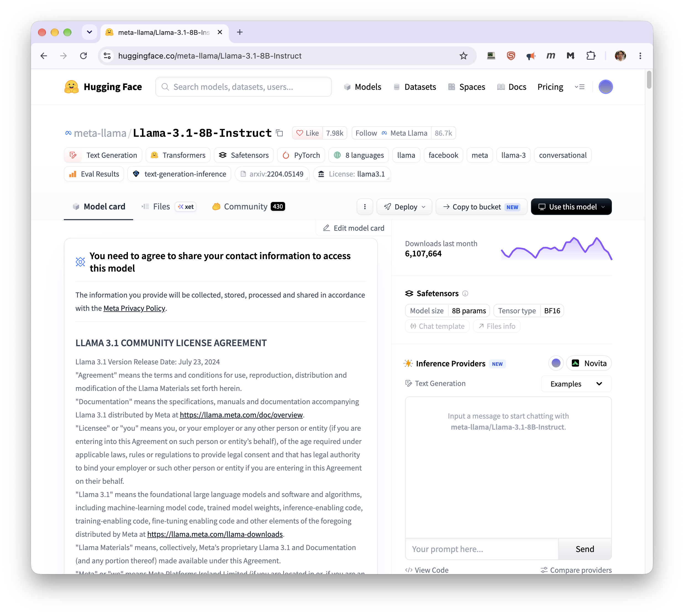
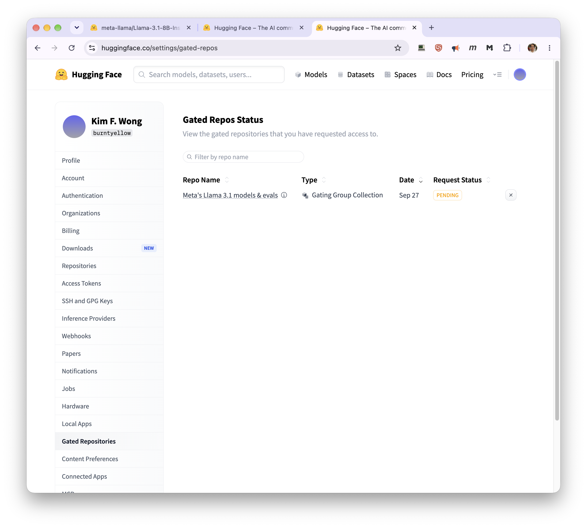

# Using the vllm module

Loading this module starts a vLLM inference server of your own and
gives you a URL to talk to it. Unloading it (or ending your job) shuts
the server down again.

For choosing a GPU, reaching your server from elsewhere on the
cluster, and connecting clients, see
[Inference Servers on the GPU Cluster](inference-server.md).

## Before you start

- You must be inside an active SLURM allocation — an interactive
  session (`salloc`, `srun --pty bash`) or a batch job. Loading this
  module on a login node will fail with a clear error telling you so.
- Your allocation needs an actual GPU (e.g. `srun --gres=gpu:1 ...`).
  If none is visible, loading the module fails immediately with a
  clear error rather than starting anything.
- If you're serving a gated or private HuggingFace model (most Llama
  models, some others), you'll need a [HuggingFace token](https://huggingface.co/docs/hub/en/security-tokens) — see
  `VLLM_HF_TOKEN` below.

## Quick start

```bash
srun -M gpu -p rtx6k -n16 --gres=gpu:1 -t02:00:00 --pty bash
module load vllm/0.29.0
```

With nothing else set, this loads a small default model just to
confirm everything works, and prints something like:

```
vLLM (container) starting on gpu-n74:41317 (model: facebook/opt-125m)
Base URL: http://gpu-n74:41317  |  run 'vllm-status' to check readiness, 'vllm-stop' to end it early.
```

A GPU job bills for its full walltime whether or not it's answering
requests, so ask for what you actually need and stop the server when
you're done. The default model here is tiny — for a plumbing test a
smaller partition such as `l40s` or `a100` will also queue faster than
`rtx6k`.

!!! failure "Did not work"
    If this is your first time using vLLM, you may encounter the error below:

    ```bash
    [kimwong@gpu-n78.crc.pitt.edu ~]$module load vllm/0.29.0
    Lmod has detected the following error:  Failed to start vLLM:
    WARN: vLLM container exited immediately on port 52055 (attempt 1), log tail:
    WARNING: skipping mount of /xhome/crc/kimwong/.cache/huggingface: stat /xhome/crc/kimwong/.cache/huggingface: no such file or directory
    INFO: Terminating squashfuse_ll after timeout
    ...
    INFO: Timeouts can be caused by a running background process
    FATAL: container creation failed: mount hook function failure: mount /xhome/crc/kimwong/.cache/huggingface->/xhome/crc/kimwong/.cache/huggingface error: while
    mounting /xhome/crc/kimwong/.cache/huggingface: mount source /xhome/crc/kimwong/.cache/huggingface doesn't exist
    ERROR: vLLM failed to start after 5 attempts.
    ```

    The error can be fixed by creating the cache folder:

    ```bash
    [kimwong@gpu-n78.crc.pitt.edu ~]$mkdir -p ~/.cache/huggingface
    [kimwong@gpu-n78.crc.pitt.edu ~]$module load vllm/0.29.0
    vLLM (container) starting on gpu-n78:52071 (model: facebook/opt-125m)
    Base URL: http://gpu-n78:52071  |  run 'vllm-status' to check readiness, 'vllm-stop' to end it early.
    [kimwong@gpu-n78.crc.pitt.edu ~]$
    ```

    The container binds `~/.cache/huggingface` on every launch, whether
    or not you've set `VLLM_DOWNLOAD_DIR`, so the directory has to
    exist even when your models live somewhere else.

!!! warning "Avoid preemptible partitions"

    A preempted job takes your endpoint down mid-request. Run servers
    on regular partitions. See
    [Preemptible Partitions](../../slurm/preempt.md).

## Loading a real model

Set `VLLM_MODEL` *before* loading the module:

```bash
export VLLM_MODEL="meta-llama/Llama-3.1-8B-Instruct"
module load vllm/0.29.0
```

All the environment variables below work the same way: set them, then
load the module. The module reads them once, at load time — changing
them afterward has no effect until you unload and reload.

!!! failure "Did not work"
    The Llama 3.1 model requires accepting the license agreement. If you have not 
    done this previously, login to Hugging Face and accept the terms. There's an 
    approval process that may take some time.

    === "Submit License Agreement"
        

    === "Wait for Approval"
        


## Using a model that's already on disk (no internet access)

If you're on a cluster that can't reach huggingface.co, `VLLM_MODEL`
can be a local path instead of a repo id — just point it at a
directory that already has the model's files in it:

```bash
export VLLM_MODEL="/software/rhel9/manual/models/llama-3.1-8b-instruct"
module load vllm/0.29.0
```

That's it — a path starting with `/` is detected automatically. The
module makes sure the container can see that directory and tells vLLM
not to bother trying the network, so there's no hanging or timeout
waiting on a connection that isn't there.

If the model directory doesn't exist at all, loading fails
immediately with a clear error. If it exists but looks incomplete (no
`config.json`), you'll get a warning in the log — usually that means
you pointed at the wrong folder inside a HuggingFace cache download
(the cache nests things under `models--org--name/snapshots/<hash>/` —
you want that innermost `snapshots/<hash>/` folder, or better, ask
whoever downloaded the model to use `--local-dir` instead, which skips
that nesting entirely).

Getting a model onto the cluster in the first place is a separate,
one-time step someone with network access needs to do — ask your
cluster admin if you're not sure how models get staged for offline use
at your site.

## Keeping your server private

The server is yours alone in the sense that it runs in your job and
bills against your allocation — but it is **not** private by default.
Ports are open within the CRCD environment, so any user on any cluster
who finds the host and port can send requests that you pay for.

Close it with an API key, set before loading the module:

```bash
export VLLM_API_KEY=abc123
module load vllm/0.29.0
```

Requests without the key are then refused:

```console
[kimwong@login2 ~]$ curl http://gpu-n74:60545/v1/models
{"error":"Unauthorized"}
[kimwong@login2 ~]$ curl -s -H "Authorization: Bearer abc123" http://gpu-n74:60545/v1/models
{"object":"list","data":[{"id":"meta-llama/Llama-3.1-8B-Instruct", ...
```

!!! warning "Don't pass the key as a command-line flag"

    vLLM also accepts `--api-key` through `VLLM_EXTRA_ARGS`, and it
    enforces the key identically — but the key then sits in the
    process's command line, where anyone able to list processes on that
    node can read it:

    ```console
    [kimwong@gpu-n79 ~]$ ps -eo pid,user,args | grep -- '--api-key'
    1850563 kimwong  /usr/bin/python3 /usr/local/bin/vllm serve meta-llama/Llama-3.1-8B-Instruct --port 52615 --host 0.0.0.0 --download-dir /vast/crcd/kimwong/vllm --api-key gopitt
    ```

    `VLLM_API_KEY` keeps it out of the process table. Use that.

!!! tip "Rejected requests show up in the log"

    vLLM records the source address and status of every request, so
    `$VLLM_LOGFILE` tells you whether anyone else has been probing your
    endpoint:

    ```
    INFO:     10.201.0.25:49632 - "GET /v1/models HTTP/1.1" 401 Unauthorized
    INFO:     10.201.0.25:38664 - "GET /v1/models HTTP/1.1" 200 OK
    ```

## Environment variables

### Commonly used

| Variable | What it does | Default |
|---|---|---|
| `VLLM_MODEL` | HuggingFace model id, or a local path (starting with `/`) to a pre-downloaded model — see above | `facebook/opt-125m` |
| `VLLM_HF_TOKEN` | Your HuggingFace token, for gated/private models. Not needed if you've already run `huggingface-cli login` in this shell. Treat it like a password, and redact it before pasting a log into a ticket. | none |
| `VLLM_API_KEY` | API key the server will require on every request — see "Keeping your server private" above | none (server is open) |
| `VLLM_DOWNLOAD_DIR` | Where model weights *and* vLLM's compiled-kernel cache get stored. Your home directory has a 75 GB quota, which one large model will exhaust, so point this at your group's `/vast` or `/ix1` space. | HF/vLLM's default caches under `$HOME` |
| `VLLM_EXTRA_ARGS` | Extra flags passed straight to vLLM, e.g. `"--max-model-len 8192 --gpu-memory-utilization 0.9"` | none |

`VLLM_DOWNLOAD_DIR` covers both halves: it becomes vLLM's
`--download-dir` for weights, and the module points
`VLLM_CACHE_ROOT` at a `vllm-cache/` subdirectory inside it for
compiled kernels and autotune results.

Anything in `VLLM_EXTRA_ARGS` is appended to a command line that
already carries `--host`, `--port` and `--download-dir`, so there's no
need to set those yourself — and overriding `--port` will confuse the
status and stop helpers.

### Occasionally useful

| Variable | What it does |
|---|---|
| `VLLM_EXCLUDE_PORTS` | Space-separated extra ports to avoid (8000 is always avoided automatically) |
| `VLLM_IMAGE` | Path to a different `.sif` image, if you need a build other than this module's default |
| `VLLM_OFFLINE` | Force offline mode even when `VLLM_MODEL` looks like a repo id rather than a path (a local path already forces this automatically) |

### Advanced (you likely won't need these)

`VLLM_CONTAINER_GPU_FLAG`, `VLLM_CONTAINER_BINDS`, `VLLM_CONTAINER_ARGS`,
`VLLM_CONTAINER_RUNTIME`, `VLLM_APPTAINER_MODULE` — these exist for
working around site-specific container quirks. Run `module help vllm`
for what each one does.

## What you get after loading

The module sets these in your shell:

- `$VLLM_BASE_URL` — full URL to your server, e.g. `http://gpu-n74:41317`
- `$VLLM_HOST`, `$VLLM_SERVER_PORT` — the same, split apart
- `$VLLM_LOGFILE` — path to the server's log, under
  `~/.vllm/<jobid>/`, so logs from different jobs don't collide
- `$VLLM_PID` — the server's process ID

`$VLLM_PID` is worth knowing about for batch jobs: the server runs in
the background, so a batch script that loads the module and then ends
would let SLURM close the job and take the server with it. Block on the
PID to hold the allocation open:

```bash
while kill -0 "$VLLM_PID" 2>/dev/null; do sleep 60; done
```

See [Inference Servers](inference-server.md) for a complete batch
example.

## Checking readiness

Big models can take a few minutes to load. Run:

```bash
vllm-status
```

It reports whether the server is still starting up, up and serving, or
has crashed, and prints the last 15 lines of the log either way:

```
[kimwong@gpu-n74.crc.pitt.edu ~]$ vllm-status
vLLM is UP on gpu-n74:34249
--- last 15 lines of /xhome/crc/kimwong/.vllm/4242266/vllm_1791296929_2671854.log ---
...
(APIServer pid=2671882) INFO:     Application startup complete.
(APIServer pid=2671882) INFO:     127.0.0.1:33490 - "GET /health HTTP/1.1" 200 OK
```

## Talking to the server

Once it's up, it's a normal OpenAI-compatible endpoint:

```bash
curl "$VLLM_BASE_URL/v1/models"

curl "$VLLM_BASE_URL/v1/chat/completions" \
  -H "Content-Type: application/json" \
  -d '{
        "model": "meta-llama/Llama-3.1-8B-Instruct",
        "messages": [{"role": "user", "content": "Hello!"}]
      }'
```

Use the model id you actually set in `VLLM_MODEL` — vLLM registers the
model under that name. If you set `VLLM_API_KEY`, add
`-H "Authorization: Bearer <your key>"` to both.

## Shutting it down

```bash
vllm-stop            # stop the server, keep the module loaded
# or
module unload vllm   # stop it and unload the module
```

If you end your SLURM session without doing either, SLURM cleans the
server up automatically when the job exits — you won't leave anything
running behind.

If you run `vllm-stop` and then unload, the unload prints
`No pidfile found; nothing to stop.` before saying the server stopped.
That pair looks contradictory but is harmless — the server was already
stopped by `vllm-stop`.

## Troubleshooting

- **"must be run inside a SLURM allocation"** — you're on a login
  node. Start an interactive session or submit a batch job first.
- **"No GPU is visible to this job"** — your allocation doesn't have
  a GPU attached. Re-request your session with a GPU, e.g. add
  `--gres=gpu:1` to your `salloc`/`srun`/`sbatch` command, then load
  the module again.
- **Nothing happening for a while** — check `vllm-status`; large
  models can genuinely take several minutes to load, this is normal.
- **`mount source ~/.cache/huggingface doesn't exist`** — create the
  directory with `mkdir -p ~/.cache/huggingface` and load again. It is
  bound on every launch, even if `VLLM_DOWNLOAD_DIR` points your
  models elsewhere.
- **`{"error":"Unauthorized"}`** — the server has an API key set and
  your request didn't carry it. Send
  `Authorization: Bearer <your key>`.
- **"VLLM_MODEL looks like a local path but no such directory exists"**
  — either the path is wrong, or it exists but isn't visible from the
  compute node you landed on (e.g. it's on storage only mounted on
  some nodes). Double check the exact path and that it's reachable
  from inside a job, not just from the login node.
- **A warning about a missing `config.json`** — you likely pointed at
  the wrong folder inside a HuggingFace-style cache directory; see
  "Using a model that's already on disk" above for which folder you
  actually want.
- **401/403 errors in the log while downloading the model** (only
  relevant if you're using an HF repo id with network access, not a
  local path) — the model is gated. Set `VLLM_HF_TOKEN`, or request
  access to the model on HuggingFace first.
- **Out of memory** — try a smaller model, or lower memory usage with
  `export VLLM_EXTRA_ARGS="--gpu-memory-utilization 0.85"` (or lower)
  before loading.
- **Something seems stuck or wrong after a failed load** — `module
  unload vllm` then `module load vllm/0.29.0` again; the module always
  looks for a fresh free port, so this is safe to retry.
