# Remote Development with VS Code

You can use Visual Studio Code with CRCD in a couple of ways. Pick based on how much
setup you can handle and whether you'd rather work in a browser or in your own local
VS Code:

| Method | Where VS Code runs | Best when |
| ------ | ------------------ | --------- |
| [Code Server](#code-server) | In your browser, via Open OnDemand | You want the quickest start with minimal installation |
| [Remote tunnel](#remote-tunnel) | Your **local** VS Code, connected to a compute node | You want to use your own VS Code, extensions, and settings against cluster resources |

The first one run through [**Open OnDemand**](../../getting-started/open-ondemand.md)
and need no local setup. The remote tunnel is the most powerful but the most involved.

## Code-Server

[Code-Server](https://github.com/coder/code-server) runs VS Code on a compute
node and serves it to your browser.

Once you login to [https://ondemand.htc.crc.pitt.edu](https://ondemand.htc.crc.pitt.edu) using your Pitt credentials
(username in lowercase + Pitt password), you can click on Code Server from the Pinned Apps (Step 1) to bring 
up a form (Step 2) where you can specify how many CPU cores you need and the duration of your session to **Launch** 
a job to the job scheduler (Step 3). After Slurm allocates the requested resource, you will be presented with a
widget to **Connect to VS Code** (Step 4).

=== "Step 1"
    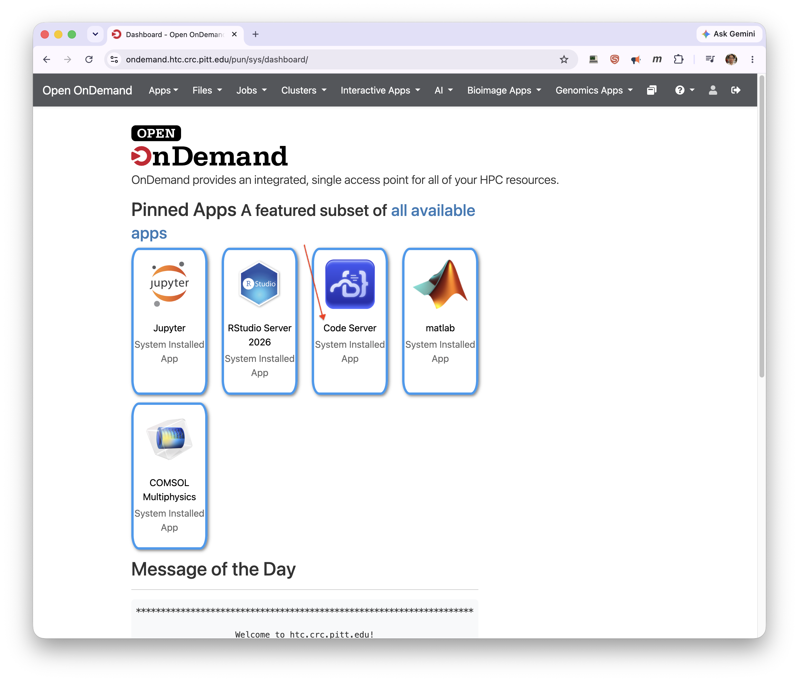

=== "Step 2"
    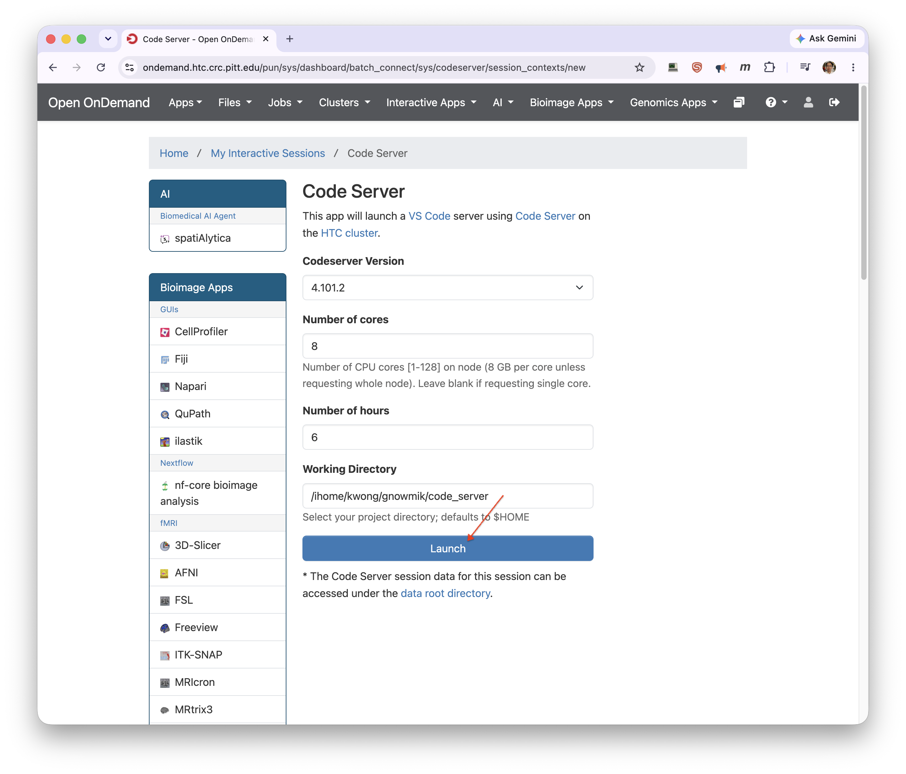

=== "Step 3"
    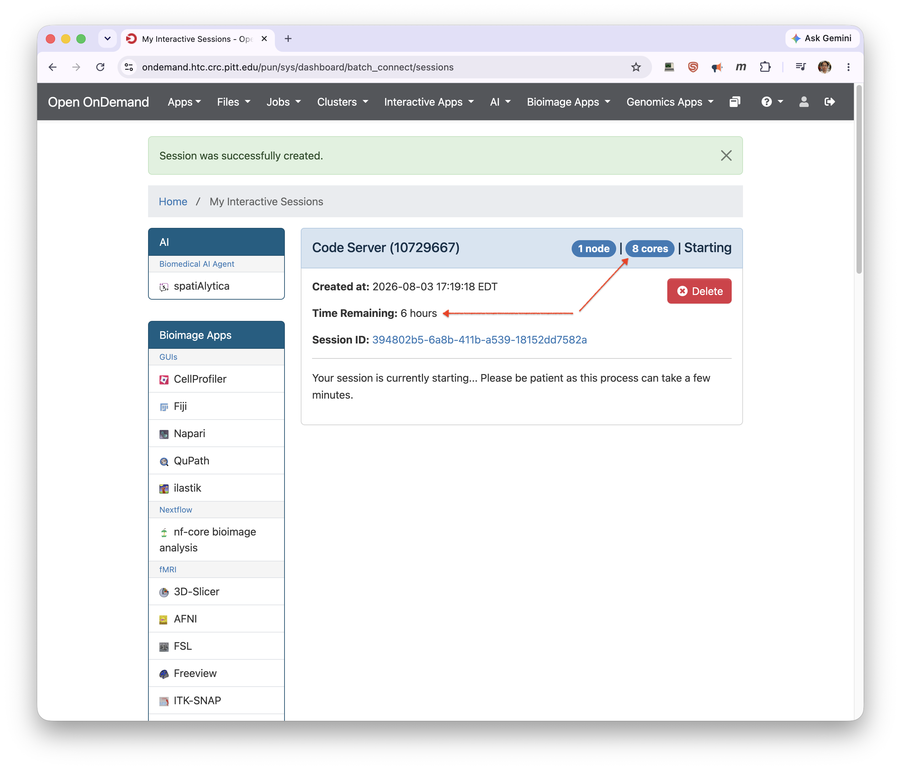

=== "Step 4"
    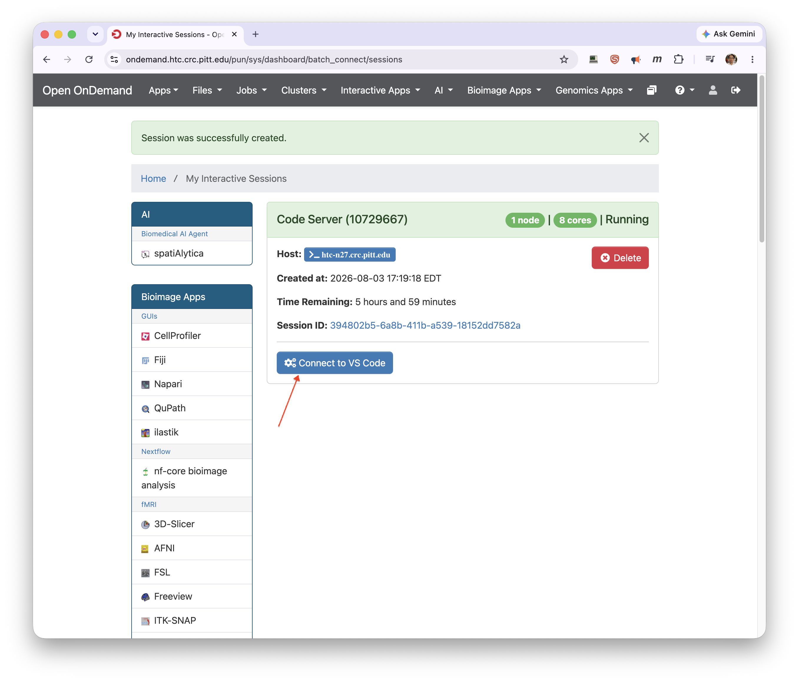

A connection to VS Code will bring up a new browser window displaying the familiar VS Code 
interface (Step 5), where from the Extensions Marketplace you can install
Jupyter (Step 6) or Python (Step7) or any other available extensions discovered
through the search box.

=== "Step 5"
    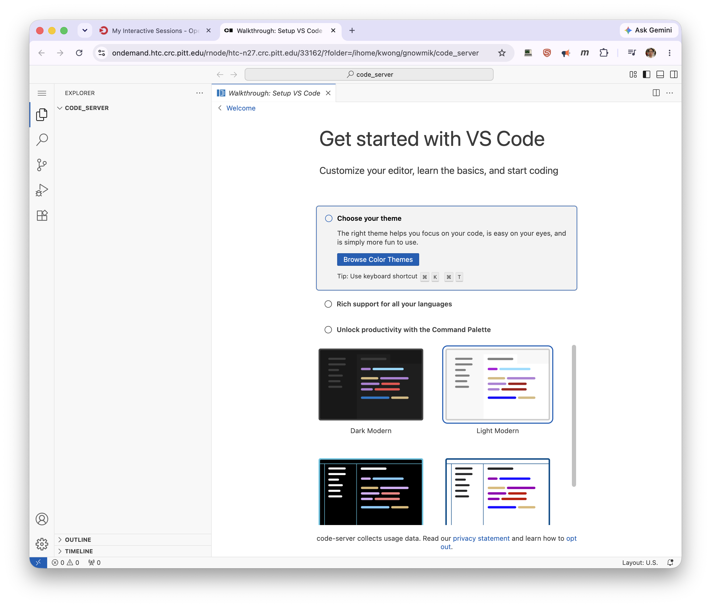

=== "Step 6"
    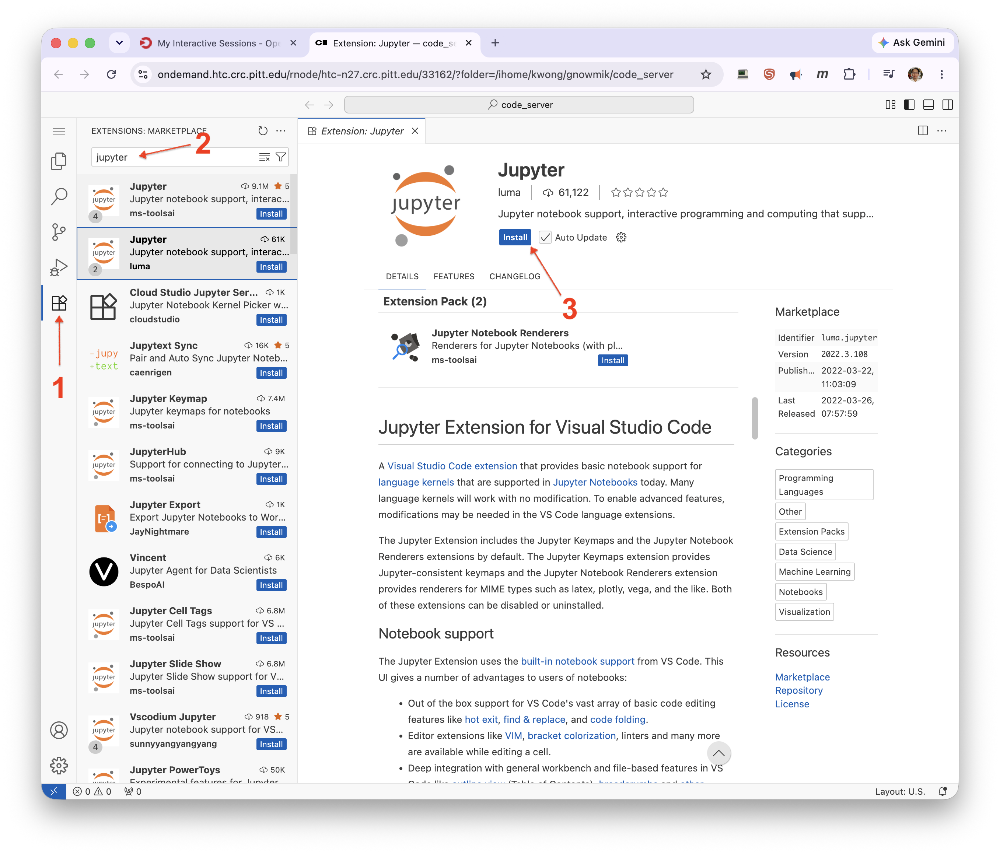

=== "Step 7"
    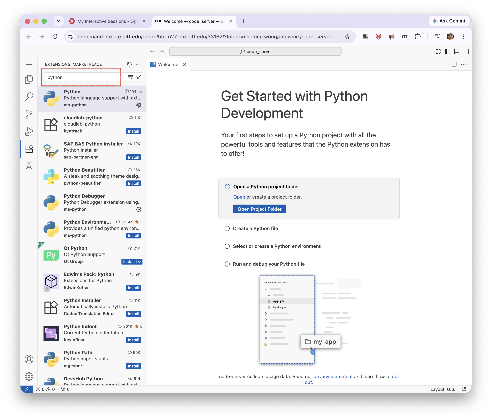

Extensions are stored under `~/.local/share/code-server`.

## Remote tunnel

This approach connects the VS Code installed on your **local computer** to a CRCD compute
node using the Remote-SSH extension.

!!! note "This is the advanced option"
    It requires passwordless SSH key setup and an SSH config. If you just want to access VS Code
    quickly, use the Code Server approach described above.

**Prerequisites**

- The latest [**VS Code**](https://code.visualstudio.com/) on your local computer.
- The [**Remote Development Extension Pack**](https://marketplace.visualstudio.com/items?itemName=ms-vscode-remote.vscode-remote-extensionpack).

### ^^One-time setup^^

**1. Set up passwordless SSH.** The remote tunnel requires the public key from your local 
computer to be installed on the CRCD login node (added to `$HOME/.ssh/authorized_keys`) so that 
you can connect directly without a password. The public key of the CRCD login node also needs to 
be added to `$HOME/.ssh/authorized_keys` so that you can login to an allocated compute node 
without a password. This works because your account on the compute nodes uses the same private key
that was generated on the login node. Both steps are covered
in [Passwordless SSH](../../getting-started/passwordless-ssh.md).

**2. Add an SSH config.** On your local computer, add to `$HOME/.ssh/config` the following settings
 (replace `<username>` with your Pitt username):

```text
Host htc
  HostName htc.crc.pitt.edu
  User <username>
  ControlMaster auto
  ControlPath ~/.ssh/master-%r@%h:%p

Host htcx
  ProxyCommand ssh htc 'nc $(squeue --me --name=tunnel --states=R -h -O NodeList,Comment)'
  StrictHostKeyChecking no
  User <username>

Host gpux
  ProxyCommand ssh htc 'nc $(squeue -M gpu --me --name=tunnel --states=R -h -O NodeList,Comment)'
  StrictHostKeyChecking no
  User <username>
```

!!! note "For Windows OS"
    If `ControlMaster` isn't available on your machine, omit the `ControlMaster`
    and `ControlPath` lines from the `Host htc` block; the rest is unchanged.

**3. Create the tunnel Slurm job script.** On the CRCD login node, create a file 
with the following content, depending on if you need a CPU or a GPU node:

=== "tunnel_CPU.slurm"
    ```bash
    #!/bin/bash
    #SBATCH --output="tunnel.log"
    #SBATCH --job-name="tunnel"
    #SBATCH --time=4:00:00
    #SBATCH --cpus-per-task=2
    #SBATCH --mem-per-cpu=8G
    
    module load python   # any Python module works; used only to find a free port
    
    # find an open port and record it in the job's Comment field
    PORT=$(python -c 'import socket; s=socket.socket(); s.bind(("", 0)); print(s.getsockname()[1]); s.close()')
    scontrol update JobId="$SLURM_JOB_ID" Comment="$PORT"
    
    # start an sshd on that port, using your key as the host key
    echo "Starting sshd on port $PORT"
    /usr/sbin/sshd -D -p ${PORT} -f /dev/null -h ${HOME}/.ssh/id_ed25519
    ```
    Update the Slurm directives for time, CPU and memory as needed for your coding session.

=== "tunnel_GPU.slurm"
    ```bash
    #!/bin/bash
    #SBATCH --output="tunnel.log"
    #SBATCH --job-name="tunnel"
    #SBATCH --time=6:00:00
    #SBATCH --cluster=gpu
    #SBATCH --partition=l40s     # a100 | l40s | h200 | rtx6k
    #SBATCH --gres=gpu:1
    #SBATCH --cpus-per-task=2
    #SBATCH --mem-per-cpu=8G

    module load python   # any Python module works; used only to find a free port

    # find an open port and record it in the job's Comment field
    PORT=$(python -c 'import socket; s=socket.socket(); s.bind(("", 0)); print(s.getsockname()[1]); s.close()')
    scontrol update JobId="$SLURM_JOB_ID" Comment="$PORT"

    # start an sshd on that port, using your key as the host key
    echo "Starting sshd on port $PORT"
    /usr/sbin/sshd -D -p ${PORT} -f /dev/null -h ${HOME}/.ssh/id_ed25519
    ```
    Update the Slurm directives for time, CPU, memory, and the number of GPUs as needed for your coding 
    session. See the [GPU cluster](../../hardware_profiles/gpu.md) page for available partitions.


### ^^Establishing Tunnel^^

These steps below are necessary for each coding session. From your local terminal, connect to the htc cluster 

```bash
ssh -X gnowmik@htc.crc.pitt.edu
```

and submit the tunnel job to Slurm:

=== "For a CPU node"
    ```bash
    [gnowmik@login3 vscode_tunnel]$ sbatch tunnel_CPU.slurm
    sbatch: You have specified NO/WRONG partition, so defaulting to the htc partition.
    Submitted batch job 10734140
    [gnowmik@login3 vscode_tunnel]$ squeue -M htc -u $USER
    CLUSTER: htc
                 JOBID PARTITION     NAME     USER ST       TIME  NODES NODELIST(REASON)
              10734140       htc   tunnel  gnowmik  R    1:12:58      1 htc-n77
    [gnowmik@login3 vscode_tunnel]$
    ```
=== "For a GPU node"
    ```bash
    [gnowmik@login3 vscode_tunnel]$ sbatch tunnel_GPU.slurm
    Submitted batch job 3416144 on cluster gpu
    [gnowmik@login3 vscode_tunnel]$ squeue -M gpu --me
    CLUSTER: gpu
                 JOBID PARTITION     NAME     USER ST       TIME  NODES NODELIST(REASON)
               3416144      l40s   tunnel  gnowmik  R       0:06      1 gpu-n59
    [gnowmik@login3 vscode_tunnel]$
    ```

Once the job runs, open VS Code on your local computer (Step 1) and connect via **Remote Explorer**
using `htcx` as the SSH target for a CPU node or `gpux` as the SSH target for a GPU node (Step 3). 
If you do not have the Remote Development extension installed,
you will need to do that first (Step 2) before you have access to the **Remote Explorer** widget. A
successful connection will show a status with 0 errors or warnings in the lower left corner of the 
GUI. You can use the navigation widget to display the remote filesystem (Step 4) and open your code
that has the supported extension installed (Step 5). 

!!! tip "Tunnel failed"
    If you attempt to establish a tunnel before the Slurm job enters the Running state, you 
    will see the error shown in the **Error** tab below.


=== "Step 1"
    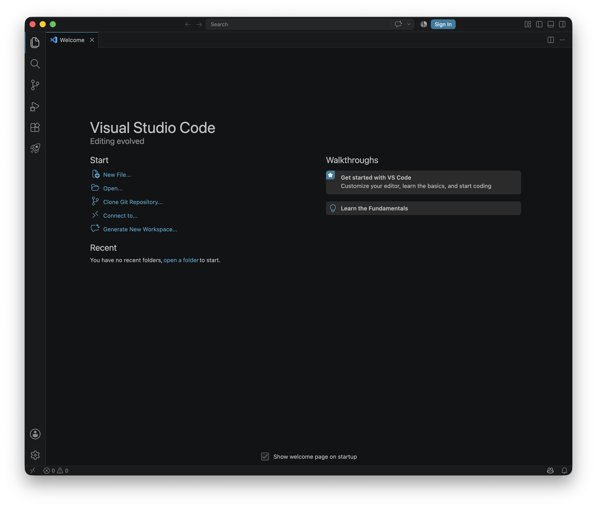

=== "Step 2"
    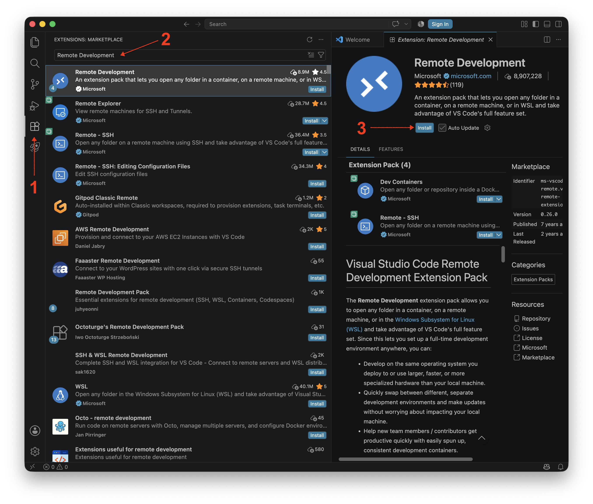

=== "Step 3"
    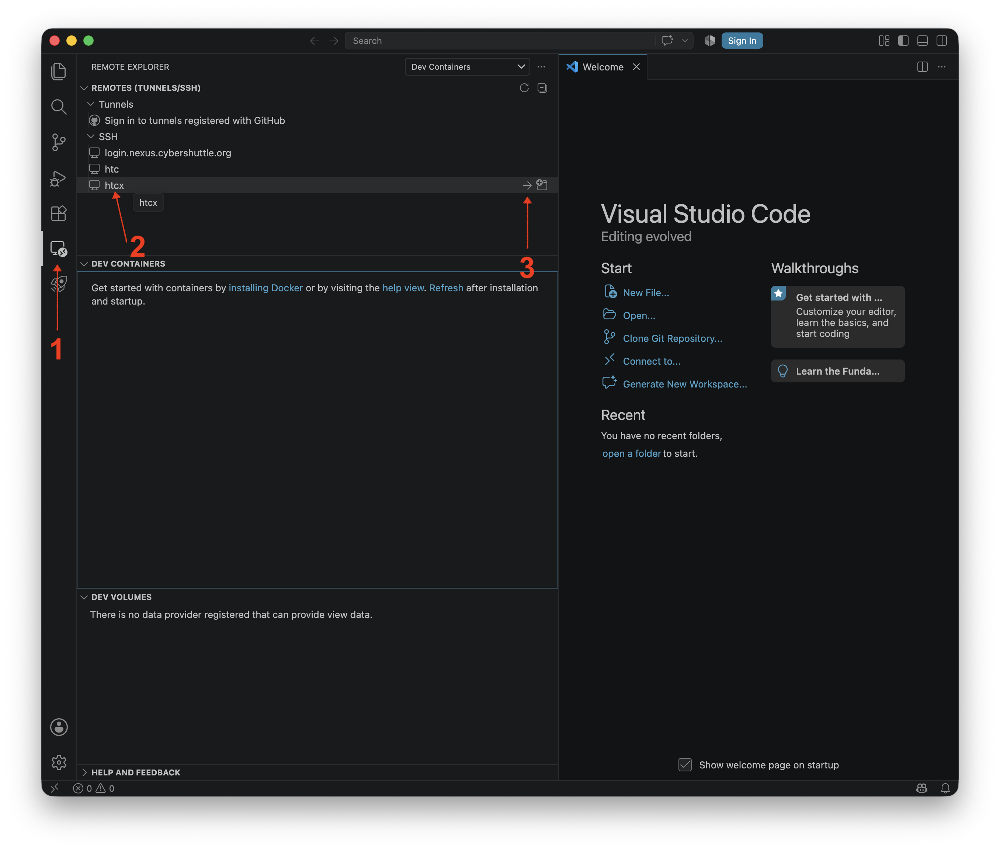

=== "Step 4"
    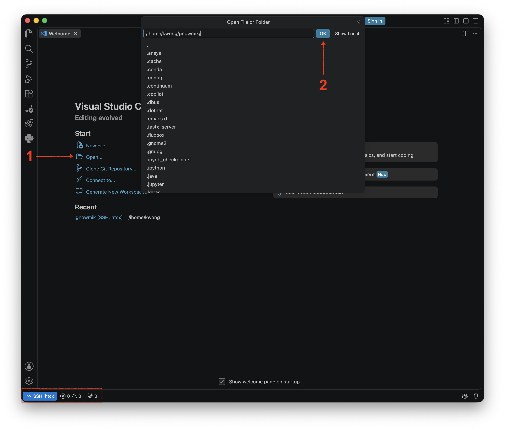

=== "Step 5"
    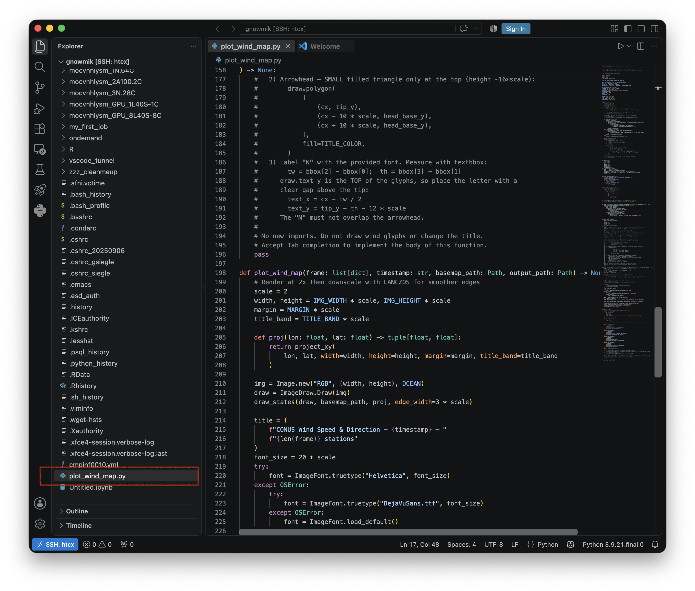

=== "Error"
    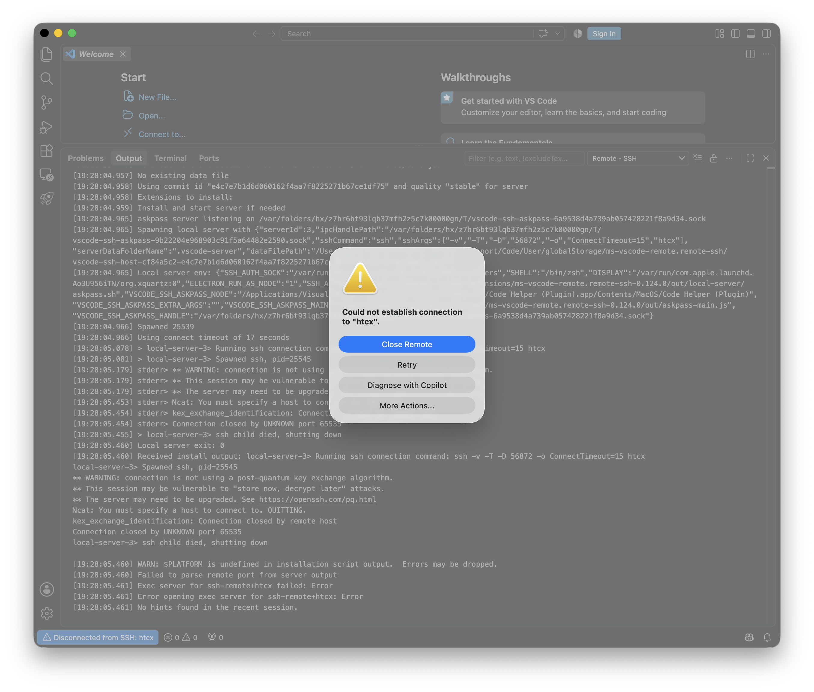

To end your session, click on the connection shown in the lower left corner of the panel and 
select **Close Remote Connection**.

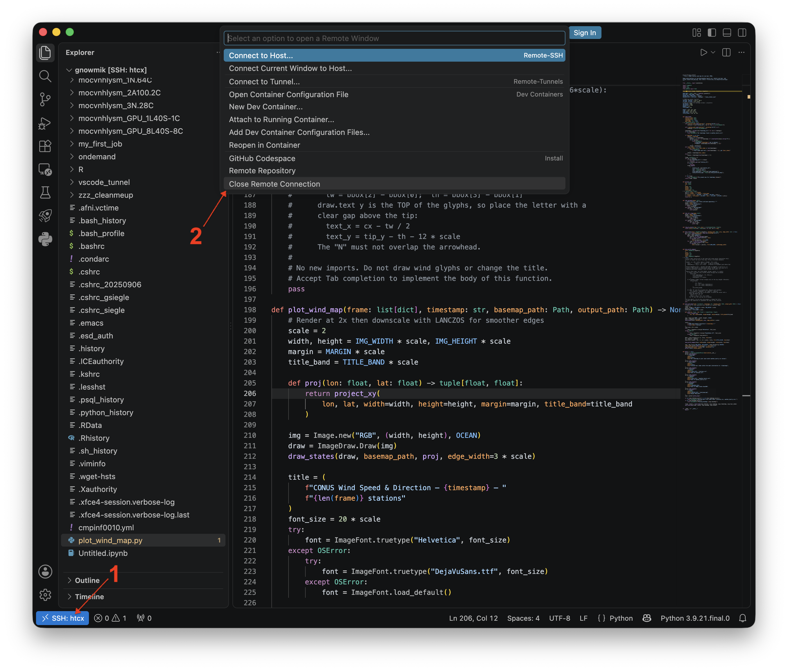

**Reminder:** Closing the Remote Connection does not end your Slurm job. You need to cancel the job to shutdown 
everything; otherwise, the job will continue to run and consume Service Units until hitting 
the walltime.

=== "For CPU node"
    ```bash
    [gnowmik@login3 vscode_tunnel]$ squeue -M htc -u $USER
    CLUSTER: htc
                 JOBID PARTITION     NAME     USER ST       TIME  NODES NODELIST(REASON)
              10734140       htc   tunnel  gnowmik  R    1:36:58      1 htc-n77
    [gnowmik@login3 vscode_tunnel]$ scancel -M htc 10734140
    [gnowmik@login3 vscode_tunnel]$ squeue -M htc -u $USER
    CLUSTER: htc
                 JOBID PARTITION     NAME     USER ST       TIME  NODES NODELIST(REASON)
    ```

=== "For GPU node"
    ```bash
    [gnowmik@login3 vscode_tunnel]$ squeue -M gpu -u $USER
    CLUSTER: gpu
                 JOBID PARTITION     NAME     USER ST       TIME  NODES NODELIST(REASON)
               3416144      l40s   tunnel  gnowmik  R      11:04      1 gpu-n59
    [gnowmik@login3 vscode_tunnel]$ scancel -M gpu 3416144
    [gnowmik@login3 vscode_tunnel]$ squeue -M gpu -u $USER
    CLUSTER: gpu
                 JOBID PARTITION     NAME     USER ST       TIME  NODES NODELIST(REASON)
    ```

## Related

<div class="grid cards" markdown>

-   :material-web:{ .lg .middle } __Browser access__

    ---

    Code Server, VNC, and other apps through Open OnDemand.

    [:octicons-arrow-right-24: Open OnDemand](../getting-started/open-ondemand.md)

-   :material-key:{ .lg .middle } __Set up SSH keys__

    ---

    Passwordless SSH, required for the remote tunnel.

    [:octicons-arrow-right-24: Passwordless SSH](../getting-started/passwordless-ssh.md)

-   :material-console:{ .lg .middle } __Interactive sessions__

    ---

    Other ways to get a shell on a compute node.

    [:octicons-arrow-right-24: Interactive Jobs](interactive-jobs.md)

</div>
