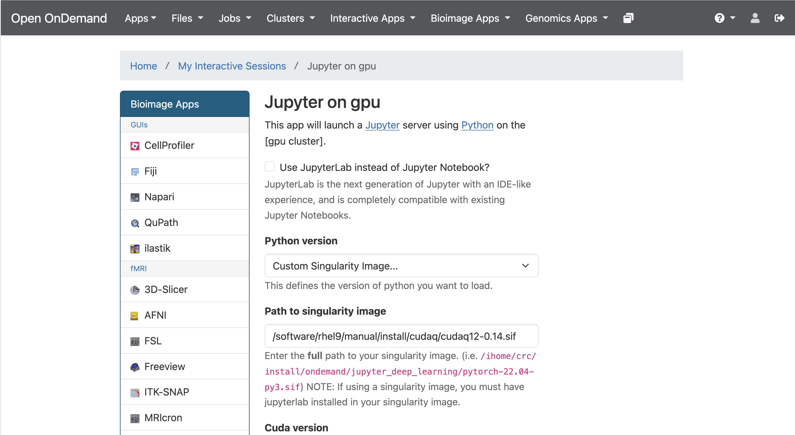
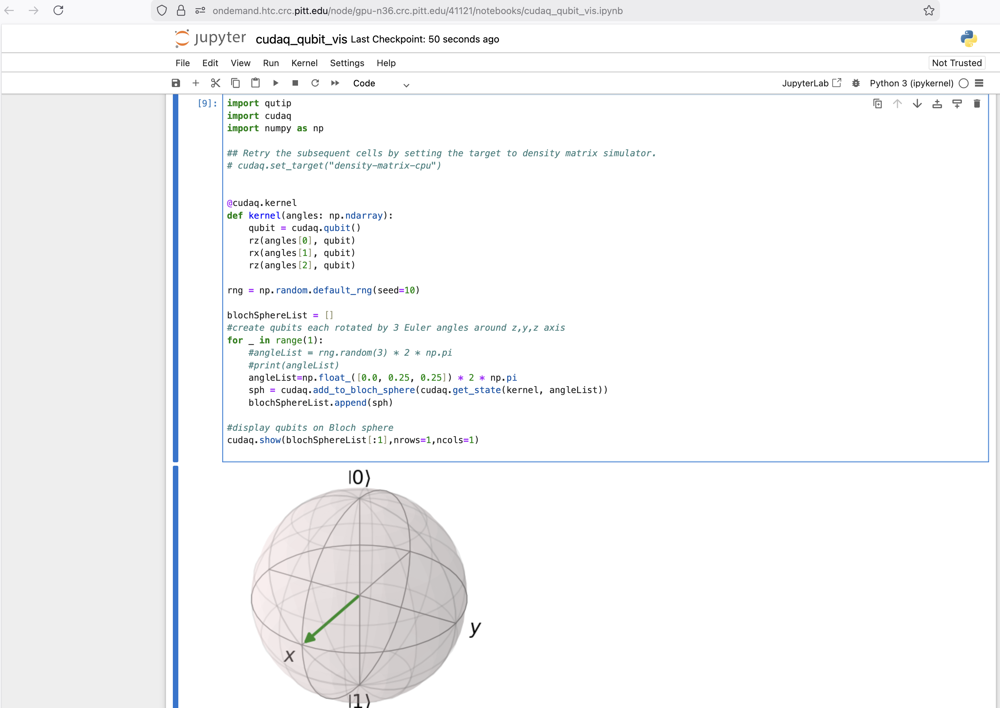

# NVIDIA CUDA-Q
CUDA-Q offers a unified programming model for hybrid application development in quantum computing.  

Availability
------------

You can use

```
module spider cudaq
```

to view available modules and show how to load the module.

```
module spider cudaq

-------------------------------------------------------------------------------
  cudaq:
-------------------------------------------------------------------------------
    Description:
      NVIDIA CUDAQ, GPUs needed for best performance.

     Versions:
        cudaq/0.12
        cudaq/0.14

-------------------------------------------------------------------------------
  For detailed information about a specific "cudaq" package (including how to load the modules) use the module's full name.
  Note that names that have a trailing (E) are extensions provided by other modules.
  For example:

     $ module spider cudaq/0.14
```
## Usage
-----

CUDA-Q can be launched in two different ways; through Jupyter on Open OnDemand or through the terminal.

### Run CUDA-Q on the GPU cluster in Jupyter

To benefit from best performance, it is recommended to run CUDA-Q with GPU support. In order to launch Jupyter on the GPU cluster, please visit [Jupyter on GPU documentation](../web-portals/https://crc-pages.pitt.edu/user-manual/web-portals/open-ondemand/#jupyter-notebooklab-on-gpu).

To connect to the GPU cluster via OnDemand, point your browser to https://ondemand.htc.crc.pitt.edu.

Select Interactive Apps > Jupyter on gpu from the top menu in the Dashboard window.

In the screen that opens, select the "Custom Singularity Image..." option under "Python version" and specify the path to the pre-installed CUDA-Q singularity image ('/software/rhel9/manual/install/cudaq/cudaq12-0.14.sif') as shown below. Specify additional options as needed.



Click the blue Launch button to start your Jupyter session. You may have to wait in the queue for resources to be available.

When your session starts, click the blue 'Connect to Jupyter' button. A new window opens with the Jupyter interface. Click on 'New' to select the Python3 kernel. You can then open and run CUDA-Q notebooks as shown below.



 

You can also install and use your own singularity image for the Jupyter session as described above. The pre-installed image on the cluster already contains all the standard packages and modules needed for standard application development in CUDA-Q such as numpy, scipy, cupy, matplotlib, et cetera. 

### Interactive Mode in Terminal

In order to configure CUDA-Q, first make sure to allocate and login to a GPU node, either through an interactive session as shown below or inside a Slurm job script.

 #for example, ```crc-interactive -g```

then load the corresponding module. # e.g., ```module load cudaq/0.14```

Follow the instruction prompt after loading the module to execute the CUDA-Q image within singularity in interactive bash mode. Then you can execute CUDA-Q python scripts with the command 'python3 <myScript.py>' as shown below.

Example python scripts can be found under the folder $CUDAROOT/examples.
  
```
[chx33@gpu-n36 ~]$ module load cudaq/0.14
Run 'singularity exec --nv $CUDAQ bash' to enter interactive mode.
Use 'singularity exec --nv $CUDAQ <COMMAND>' in your Slurm job script.
Example scripts are located in $CUDAQROOT/examples
DO NOT run on the login node!
Run 'singularity exec --nv $CUDAQ bash' to enter interactive mode.
Use 'singularity exec --nv $CUDAQ <COMMAND>' in your Slurm job script.
Example scripts are located in $CUDAQROOT/examples
DO NOT run on the login node!
[chx33@gpu-n36 ~]$ cd $CUDAQROOT/examples
[chx33@gpu-n36 examples]$ ls
cudaq_fourier_inv.py  cudaq_h.py             cudaq.sh
cudaq_fourier.py      cudaq_kernel_vis.py    cudaq_shor.py
cudaq_getstate.py     cudaq_observe.py       cudaq_state.py
cudaq_ghz.ipynb       cudaq_qubit_vis.ipynb  cudaq_teleport.py
cudaq_ghz.py          cudaq_qubit_vis.py     cudaq_vector.py
cudaq_grover.ipynb    cudaq_reset.py         CUDAQ-workshop-2025.pptx
cudaq_grover.py       cudaq_sample.py        Untitled.ipynb
[chx33@gpu-n36 examples]$ singularity exec --nv $CUDAQ bash
Singularity> python3 cudaq_fourier.py 
     ╭───╮╭───╮╭───────────╮╭────────────╮                       
q0 : ┤ x ├┤ h ├┤ r1(1.571) ├┤ r1(0.7854) ├───────────────────────
     ╰───╯╰───╯╰─────┬─────╯╰─────┬──────╯╭───╮╭───────────╮     
q1 : ────────────────●────────────┼───────┤ h ├┤ r1(1.571) ├─────
     ╭───╮                        │       ╰───╯╰─────┬─────╯╭───╮
q2 : ┤ x ├────────────────────────●──────────────────●──────┤ h ├
     ╰───╯                                                  ╰───╯

[ 0.35+0.j   -0.25-0.25j -0.  +0.35j  0.25-0.25j -0.35+0.j    0.25+0.25j
  0.  -0.35j -0.25+0.25j]
```

