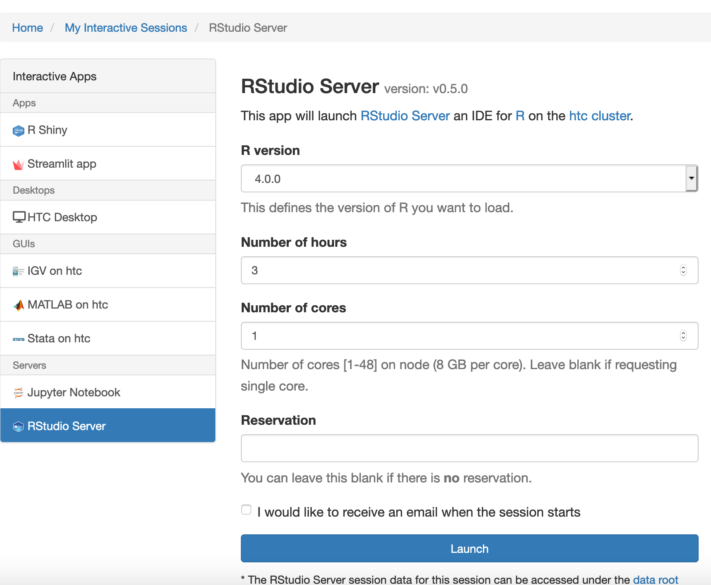
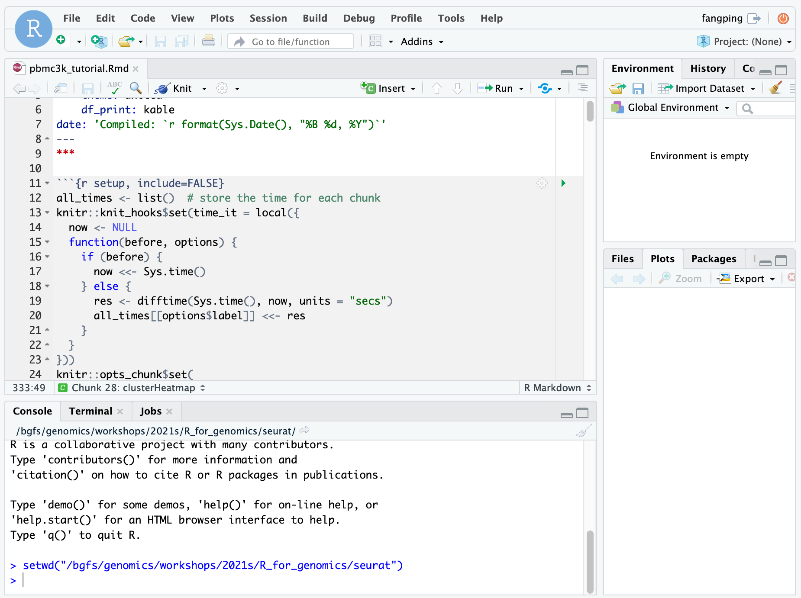
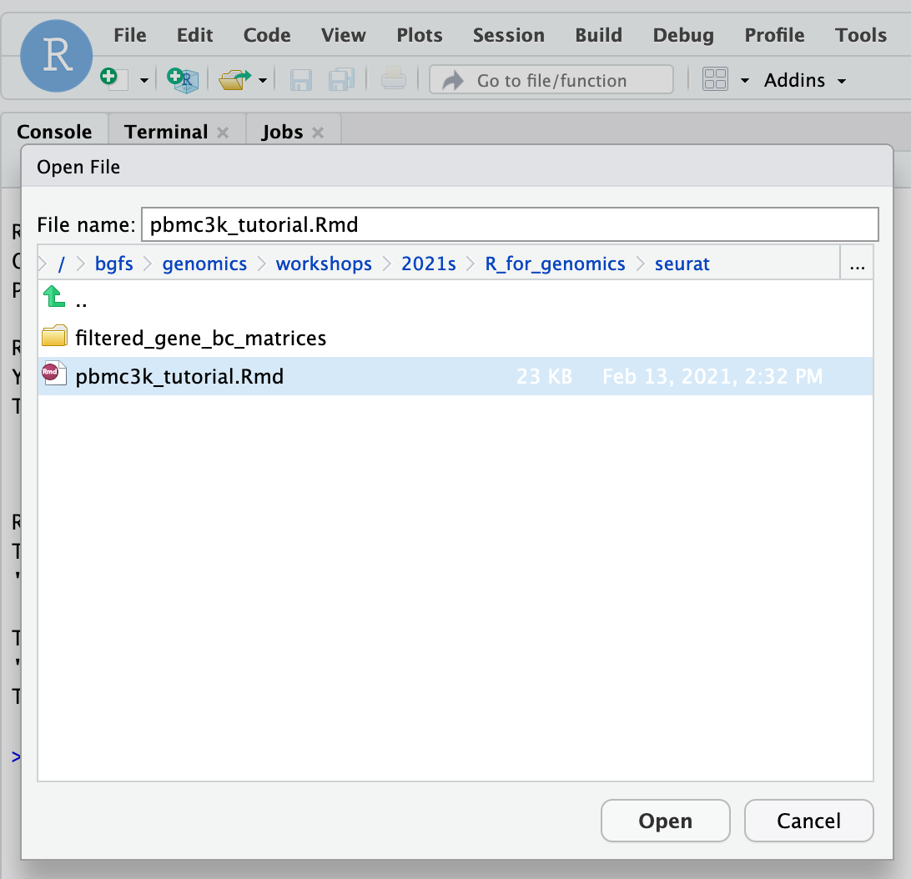
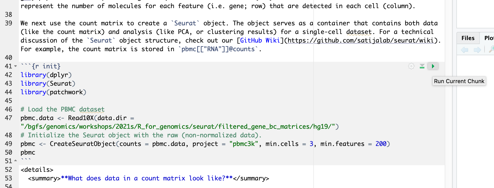
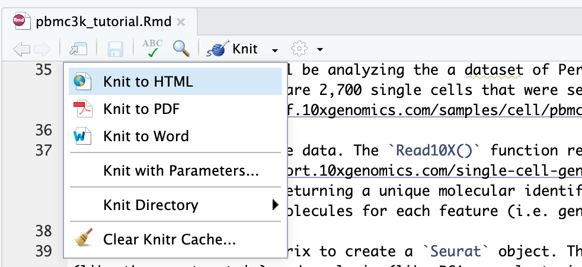
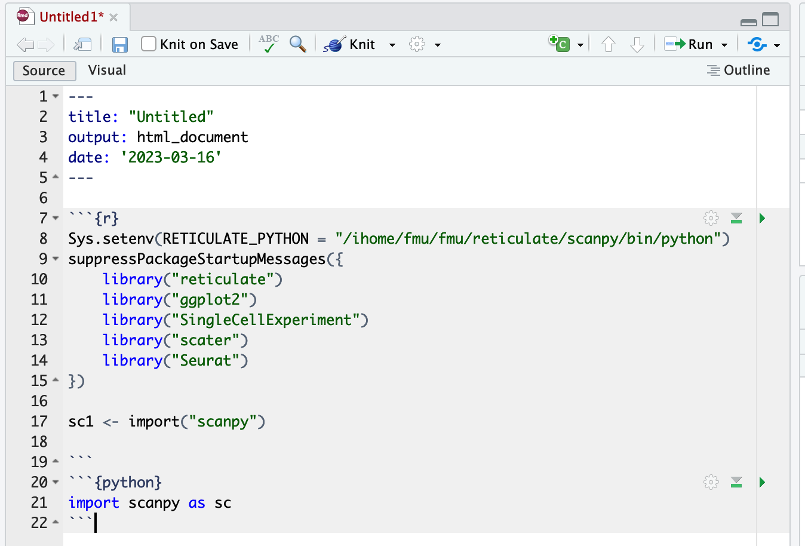
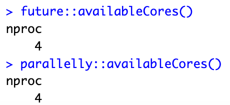

# R and RStudio
R is a language and environment for statistical computing and graphics. R is an integrated suite of software facilities for data manipulation, calculation and graphical display. R is available as Free Software under the terms of the Free Software Foundation’s GNU General Public License in source code form.

Availability
------------

You can use

```
module spider r
```

to view available modules and

```
module spider r/version
```

to show how to load the module.

```
----------------------------------------------------------------------------
  r:
----------------------------------------------------------------------------
     Versions:
        r/3.3.2\_genomics
        r/3.3.2
        r/3.4.1
        r/3.4.2
        r/3.5.1
        r/3.5.2\_openmpi\_no-pmi-back
        r/3.5.2\_openmpi
        r/3.5.2
        r/3.5.3
        r/3.6.0
        r/4.0.0
```
Usage
-----

R software can be launched in two different ways; through Rstudio on Open OnDemand and through the terminal.

### Rstudio

In order to access Rstudio, please visit [Open Ondemand documentation](../web-portals/open-ondemand.md).

To connect to the HTC cluster via OnDemand, point your browser to https://ondemand.htc.crc.pitt.edu.

Select Interactive Apps > RStudio Server from the top menu in the Dashboard window.

In the screen that opens, specify the R version, time limit.



Click the blue Launch button to start your RStudio session. You may have to wait in the queue for resources to be available.

When your session starts, click the blue Connect to RStudio Server button. A new window opens with the RStudio interface.



The R version 4.0.0 loads gcc/8.2.0 r/4.0.0 module on HTC cluster. Within each R module, various R packages and bioconductor packages have been installed. Within the R console, load the library to check whether it is already installed. If you need specific R packages, submit a help ticket.

You can also install your own R packages. R searches the user’s path for libraries followed by the root installation. R will stop searching when it finds the first instance of the library within the path hierarchy.Use “.libPaths()” to check the searching path.

### Terminal Acess

In order to configure your environment for R, run the following command:

module spider r/version #for example, ```module spider r/4.0.0```

then load the corresponding module. # e.g., ```module load gcc/8.2.0 r/4.0.0```

```
[fangping@login0b ~]$ module spider r/4.0.0

----------------------------------------------------------------------------------------------------------------
  r: r/4.0.0
----------------------------------------------------------------------------------------------------------------
    Description:
      R is a language and environment for statistical computing and graphics.

     Other possible modules matches:
        advisor, albacore, amber, ancestrymap, annovar, arboreto, aria2, arpack, atacseq\_harvard, ...

    You will need to load all module(s) on any one of the lines below before the "r/4.0.0" module is available to load.

      gcc/8.2.0

----------------------------------------------------------------------------------------------------------------
  To find other possible module matches do:
      module -r spider '.*r/4.0.0.*'

[fangping@login0b ~]$ module load gcc/8.2.0 r/4.0.0
[fangping@login0b ~]$
```

Using R
-------

### Running R interactively on RStudio Server

This is a typical RStudio interface that should be familiar to most users. Please note the the current working directory of the RStudio session is your home directory. You can use \`setwd(dir)\` to set the working directory to \`dir\`.

More info on RStudio and its use can be found on the [RStudio official support page](https://support.rstudio.com/hc/en-us/categories/200035113-Documentation).

To get started, click ```File -> Open File...``` and navigate to ```/bgfs/genomics/workshops/2021s/R_for_genomics/seurat``` and open pbmc3k\_tutorial.Rmd markdown file.



This ```pbmc3k_tutorial.Rmd``` material is prepared using the “rmarkdown” library. To run a code chunk, ```click Run Current Chunk```.



To convert R Markdown to HTML or pdf, you can render or knit an R Markdown document to a web friendly, html format using the R knitr package. Press "Knit" and select "Knit to HTML"



### Running R interactively on terminal

Request a single core or multiple cores (-c n) if running parallel R,
```
[fangping@login0b ~]$ srun -c 2 -t 01:00:00 --pty bash
srun: job 199424 queued and waiting for resources
srun: job 199424 has been allocated resources
[fangping@htc-n109 ~]$
```
When the compute node is ready, loading R module and launch R,
```
[fangping@htc-n109 ~]$ module load gcc/8.2.0 r/4.0.0
[fangping@htc-n109 ~]$ R

R version 4.0.0 (2020-04-24) -- "Arbor Day"
Copyright (C) 2020 The R Foundation for Statistical Computing
Platform: x86\_64-pc-linux-gnu (64-bit)

R is free software and comes with ABSOLUTELY NO WARRANTY.
You are welcome to redistribute it under certain conditions.
Type 'license()' or 'licence()' for distribution details.

  Natural language support but running in an English locale

R is a collaborative project with many contributors.
Type 'contributors()' for more information and
'citation()' on how to cite R or R packages in publications.

Type 'demo()' for some demos, 'help()' for on-line help, or
'help.start()' for an HTML browser interface to help.
Type 'q()' to quit R.

>
```
### Submitting batch jobs

There are two primary commands to use when submitting R scripts: Rscript and R CMD BATCH. Both commands will execute the passed script but differ in the way they process output.

When utilizing R CMD BATCH all output will be directed to an .Rout file named after your script unless otherwise specified. For example:
```
#!/bin/bash
#SBATCH --job-name R\_ExampleJob
#SBATCH --nodes=1
#SBATCH -c 1
#SBATCH --time=01:00:00

module load gcc/8.2.0 r/4.0.0

R CMD BATCH test.R test.txt
# R CMD BATCH test.R #output will be directed to test.Rout
```
In the above example, output for the job will be found in the file test.txt. Plots will be directed to Rplots.pdf in the current directory.

To pass arguments to the script, they need to be specified after R CMD BATCH but before the script to be executed, and preferably preceded with --args as follows:
```
#!/bin/bash
#SBATCH --job-name R\_ExampleJob
#SBATCH --nodes=1
#SBATCH -c 1
#SBATCH --time=01:00:00

module load gcc/8.2.0 r/4.0.0

R CMD BATCH "--args argument1 argument2 argument3" Rcode.R Rcodeoutput.txt

In your Rcode.R, use the following code template to accept arguments.

args <- commandArgs(trailingOnly = TRUE)
argument1 = args\[1\]
argument2 = args\[2\]
argument3 = args\[3\]
```
Using Rscript to execute R scripts differs from R CMD BATCH in that all output and errors from the script are directed to STDOUT and STDERR in a manner similar to other programs.
```
#!/bin/bash
#SBATCH --job-name R\_ExampleJob
#SBATCH --nodes=1
#SBATCH -c 1
#SBATCH --time=01:00:00
#SBATCH --error=TestJob.%J.stderr
#SBATCH --output=TestJob.%J.stdout

module load gcc/8.2.0 r/4.0.0

Rscript test.R
```
In the above example, STDOUT will be directed to the output file TestJob.%J.stdout and STDERR directed to TestJob.%J.stderr.

To pass arguments to the script when using Rscript, the arguments will follow the script name as in the example below:
```
#!/bin/bash
#SBATCH --job-name R\_ExampleJob
#SBATCH --nodes=1
#SBATCH -c 1
#SBATCH --time=01:00:00
#SBATCH --error=TestJob.%J.stderr
#SBATCH --output=TestJob.%J.stdout

module load gcc/8.2.0 r/4.0.0

Rscript test.R argument1 argument2 argument3
```
Installing local R packages
---------------------------

R comes with a single library ```$R_HOME/library``` which contains the standard and recommended packages. We also installs popular R packages into the site located at ```$R_HOME/library```.

```
[fangping@login0b ~]$ module load gcc/8.2.0 r/4.0.0
[fangping@login0b ~]$ echo $R_HOME
/ihome/crc/install/gcc-8.2.0/r/4.0.0/lib64/R
```
After launching an R session, users can check the library path as follows.
```
[fmu@login0b ~]$ module load gcc/8.2.0 r/4.0.0
[fmu@login0b ~]$ R

R version 4.0.0 (2020-04-24) -- "Arbor Day"
...

> .libPaths()
\[1\] "/ihome/fmu/fmu/R/x86\_64-pc-linux-gnu-library/4.0"
\[2\] "/ihome/crc/install/gcc-8.2.0/r/4.0.0/lib64/R/library"
>
```
### Cran packages

To install local R packages, use install.package() command.
```
> install.packages("tidygenomics")
```
For the first time local installation, it will give a warning as follows,

Warning in install.packages("tidygenomics") :
```lib = "/ihome/crc/install/gcc-8.2.0/r/4.0.0/lib64/R/library"``` is not writable
Would you like to use a personal library instead? (yes/No/cancel) yes
Would you like to create a personal library
```~/R/x86_64-pc-linux-gnu-library/4.0```
to install packages into? (yes/No/cancel) yes

Answer yes, and it will create the directory and install the package in the directory.

### Bioconductor packages

To install bioconductor packages, use BiocManager::install() command.
```
> BiocManager::install("scater")
```
### Packages from GitHub

Users can install R packages directly from Github using devtools package as follows
```
> devtools::install_github("aertslab/SCENIC")
```
Compiling Rcpp packages
-----------------------

Sometimes R code just isn’t fast enough. Rcpp makes it easy to connect C++ to R. To use Rcpp on the HPC clusters, you need to compile the source C++ codes, and call them from R.

To compile funcs.cpp only once:

```
> library(Rcpp)
> sourceCpp("funcs.cpp",rebuild = TRUE,cacheDir="~/Rcpp_lib/mylib/Rcpp_lib")
```
To load the compiled cpp library within your R code:
```
> sourceCpp("funcs.cpp", rebuild = FALSE,cacheDir="~/Rcpp_lib/mylib/Rcpp_lib")
```
Using Python with reticulate
----------------------------

The steps include installing Python, configuring a Python environment with packages and reticulate.

### Installing miniconda
```
[fmu@login0b ~]$ wget https://repo.anaconda.com/miniconda/Miniconda3-py39_4.12.0-Linux-x86_64.sh
[fmu@login0b python]$ bash Miniconda3-py39_4.12.0-Linux-x86_64.sh -b -p /ihome/fmu/fmu/reticulate/scanpy -s
PREFIX=/ihome/fmu/fmu/reticulate/scanpy
Unpacking payload ...
...
```
### Configuring a Python environment with packages
```
[fmu@login0b ~]$ cd /ihome/fmu/fmu/reticulate/scanpy/bin
[fmu@login0b bin]$ ./pip install 'scanpy\[leiden\]'
...
```
### Using python with reticulate
```
> Sys.setenv(RETICULATE\_PYTHON = "/ihome/fmu/fmu/reticulate/scanpy/bin/python")
> library(reticulate)
> sc1 <- import("scanpy")
```
If you are using RMarkdown through RStudio server, you can also import python packages in a Python chunk. A Python chunk begins with \`\`\`{python}.



High throughput computing jobs
------------------------------

Your R script likely reads in data, processes it, and creates a result. You will need to modify this script to accept variable arguments.

The following is an example R script code.R.
```
args <- commandArgs(trailingOnly = TRUE)
bamfile = args\[1\] # the first argument is the location of a bam file
bamfile.labels <- gsub(".bam", "", basename(bamfile))
pdf(paste(bamfile.labels,".pdf",sep="")) # plots will be directed to this pdf file
# Your codes to handle bamfile
dev.off() # close pdf device
```
We can write slurm job script to run as a job array. Each task in a job array will run the same R script and use the job array task ID to handle a specific file.

job.sbatch
```
#!/bin/bash
#
#SBATCH --job-name=qc
#SBATCH -c 1
#SBATCH -t 1-00:00 # Runtime in D-HH:MM
#SBATCH --output=qc\_%a.out
#SBATCH --array=0-10 # job array index

module load gcc/8.2.0 r/4.0.0

echo ${SLURM_ARRAY_TASK_ID}

R CMD BATCH "--args /bgfs/sam/fangping/myproject/bowtie2/${SLURM_ARRAY_TASK_ID}_bowtie2.bam" code.R ${SLURM_ARRAY_TASK_ID}.Rout
```
Note that in this case, we specified slurm option``` #SBATCH --array=0-10``` to run 11 independent tasks in parallel. Under folder ```/bgfs/sam/fangping/myproject/bowtie2/```, there are 11 bam files ```0_bowtie2.bam``` to ```10_bowtie2.bam```. Each task will generate a unique log file ```0.Rout``` to ```10.Rout```, so we can look at those and see if any of the tasks failed. Each task will generate a unique pdf file ```0_bowtie2.pdf``` to ```10_bowtie2.pdf```.

Submit Job Array to Scheduler

We can now submit our job.sbatch script to the slurm scheduler to run the job array. It will launch all 11 tasks at the same time (some might sit in the queue while others are going to run right away). To submit, run:

sbatch job.sbatch

Parallel processing
-------------------

Don't assume that you should allocate as many CPUs as possible to a parallel workload. Parallel efficiency often drops and in some cases allocating more CPUs may actually extend runtimes. If you use/implement parallel algorithms please measure scaling before submitting large numbers of such jobs.

R parallel packages (parallel, doParallel, ...) often overload their job allocation because they are using the detectCores() function from the parallel package to determine how many worker processes to use. However, this function returns the number of physical CPUs on a compute node irrespective of how many have been allocated to a job. BiocParallel is not aware of slurm and by default tries to use most of the CPUs on a node irrespetive of the slurm allocation. This can lead to overloaded jobs. Therefore, if not all CPUs are allocated to a job the job will be overloaded and perform poorly.

### The number of allocated CPUs

Jobs should use the following function to automatically detect the number of allocated CPUs.

If you are using RStudio server on Open Ondemand, or you are using ```-c``` or ```--cpus-per-task``` to allocate multiple cores, you can use ```future::availableCores()``` or ```parallelly::availableCores()``` to detect the number of allocated CPUs.



```
[fangping@login0b ~]$ srun -c 4 --pty bash
srun: job 207156 queued and waiting for resources
srun: job 207156 has been allocated resources
[fangping@htc-n22 ~]$ module load gcc/8.2.0 r/4.0.0
[fangping@htc-n22 ~]$ R
R version 4.0.0 (2020-04-24) -- "Arbor Day"
...
> ncpus <- future::availableCores()
> ncpus
nproc
    4
> 
```
If you are using -n or --tasks-per-node to allocate multiple tasks, you can use as.integer(Sys.getenv("SLURM\_JOB\_CPUS\_PER\_NODE")) to detect the number of allocated CPUs.
```
[fangping@login0b ~]$ srun -n 4 --pty bash
srun: job 207157 queued and waiting for resources
srun: job 207157 has been allocated resources
[fangping@htc-n29 ~]$ module load gcc/8.2.0 r/4.0.0
[fangping@htc-n29 ~]$ R

R version 4.0.0 (2020-04-24) -- "Arbor Day"
...

> ncpus <- future::availableCores()
> ncpus
nproc
    1
> ncores <- as.integer(Sys.getenv("SLURM_JOB_CPUS_PER_NODE"))
> ncores
[1] 4
>
```
For BiocParallel, you can use register(MulticoreParam(workers = future::availableCores()), default=TRUE) to register allocated cores.
```
> library(BiocParallel)
> registered()
$MulticoreParam
class: MulticoreParam
  bpisup: FALSE; bpnworkers: 22; bptasks: 0; bpjobname: BPJOB
  bplog: FALSE; bpthreshold: INFO; bpstopOnError: TRUE
  bpRNGseed: ; bptimeout: 2592000; bpprogressbar: FALSE
  bpexportglobals: TRUE
  bplogdir: NA
  bpresultdir: NA
  cluster type: FORK

…

> register(MulticoreParam(workers = future::availableCores()), default=TRUE)
> registered()
$MulticoreParam
class: MulticoreParam
  bpisup: FALSE; bpnworkers: 4; bptasks: 0; bpjobname: BPJOB
  bplog: FALSE; bpthreshold: INFO; bpstopOnError: TRUE
  bpRNGseed: ; bptimeout: 2592000; bpprogressbar: FALSE
  bpexportglobals: TRUE
  bplogdir: NA
  bpresultdir: NA
  cluster type: FORK
…
>
```
The number of detected cores can then be used in your codes,
```
ncpus <- future::availableCores()
```
# or ncpus <- as.integer(Sys.getenv("SLURM\_JOB\_CPUS\_PER\_NODE"))
```
options(mc.cores = ncpus)
mclapply(..., mc.cores = ncpus)
makeCluster(ncpus)
```
A very convenient way to do parallel computations is provided by the [foreach](https://cran.r-project.org/web/packages/foreach/index.html) package. Here is a simple example.
```
> library(foreach)
> library(doParallel)
Loading required package: iterators
Loading required package: parallel
> library(doMC)
> registerDoMC(cores=future::availableCores())
> future::availableCores()
nproc
    4
> max.eig <- function(N, sigma) {
+      d <- matrix(rnorm(N**2, sd = sigma), nrow = N)
+      #
+      E <- eigen(d)$values
+      #
+      abs(E)[[1]]
+  }
> library(rbenchmark)
> benchmark(
+      foreach(n = 1:100) %do% max.eig(n, 1),
+      foreach(n = 1:100) %dopar% max.eig(n, 1)
+ )
                                      test replications elapsed relative
1    foreach(n = 1:100) %do% max.eig(n, 1)          100  26.836    1.697
2 foreach(n = 1:100) %dopar% max.eig(n, 1)          100  15.816    1.000
  user.self sys.self user.child sys.child
1    26.733    0.102      0.000     0.000
2     1.338    0.905     27.148     4.849
>
```
%do% evaluates the expression sequentially, while %dopar% evaluates it in parallel.

Note that with 4 cores we got a speedup of only 1.7 relative to sequential resulting in a low parallel efficiency. This is a cautionary note to carefully test scaling of parallel code.

A second way to run foreach in parallel is to generate a cluster. Note that when you are done, you need to shut down the cluster.
```
> library(doParallel)
> cl <- makeCluster(future::availableCores())
> registerDoParallel(cl)
> benchmark(
+      foreach(n = 1:100) %do% max.eig(n, 1),
+      foreach(n = 1:100) %dopar% max.eig(n, 1)
+ )
                                      test replications elapsed relative
1    foreach(n = 1:100) %do% max.eig(n, 1)          100  26.627    1.471
2 foreach(n = 1:100) %dopar% max.eig(n, 1)          100  18.102    1.000
  user.self sys.self user.child sys.child
1    26.600    0.028          0         0
2     2.707    0.183          0         0
> stopCluster(cl)
>
```