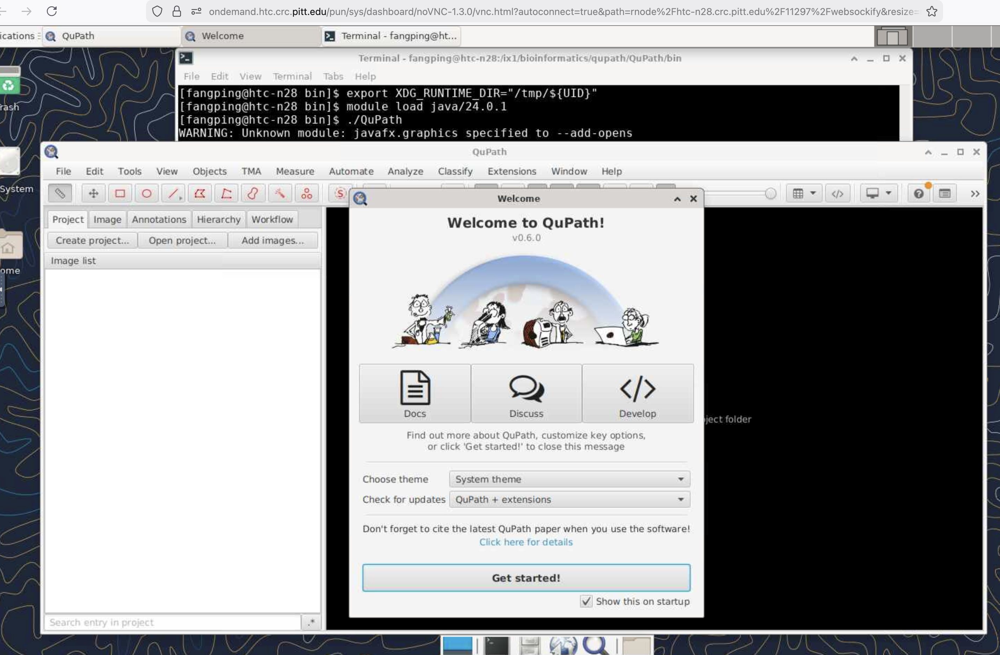
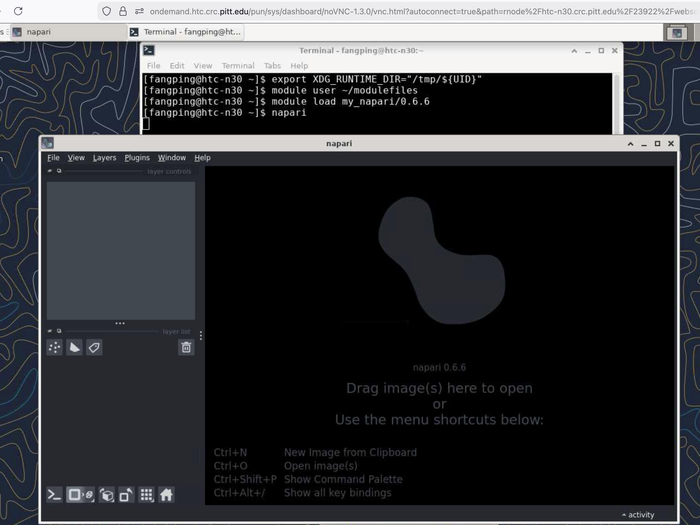

# Biomedical Image Analysis

## How to install and run your own version of biomedical image analysis tools?

There are multiple complexes to handle biomedical image analysis tools on HPC environments. In general, the software runs as a desktop software application. Most of the software also provide plugins, and these plugins can only be installed in a specific folder. 

## 1.	QuPath

QuPath is an open-source software for bioimage analysis. QuPath is often used for whole slide images common in pathology, but it can be used for other microscopy images too. Indeed, QuPath was published and designed under the merits of being user-friendly and specific for visualization and computational challenges posed by whole slide images. Furthermore, it includes features with batch-processing and scripting functionality. The software runs as a desktop software application.

Copy /software/rhel9/manual/install/qupath/0.6.0/QuPath-v0.6.0-Linux.tar.xz to your own folder.

```commandline
[fangping@login3 qupath]$ pwd
/ix1/bioinformatics/qupath # replace this folder to your own folder
[fangping@login3 qupath]$ cp /software/rhel9/manual/install/qupath/0.6.0/QuPath-v0.6.0-Linux.tar.xz .
[fangping@login3 qupath]$ tar xf QuPath-v0.6.0-Linux.tar.xz
[fangping@login3 qupath]$ ls
QuPath  QuPath-v0.6.0-Linux.tar.xz
```

Logon ondemand.htc.crc.pitt.edu, Click Interactive Apps -> Desktop, Choose Number of Hours and Number of Cores, click Launch.

```commandline
[fangping@htc-n28 ~]$ cd /ix1/bioinformatics/qupath/QuPath/ # go to your path
[fangping@htc-n28 QuPath]$ ls
bin  lib
[fangping@htc-n28 QuPath]$ cd bin
[fangping@htc-n28 bin]$ ls
QuPath
[fangping@htc-n28 bin]$ export XDG_RUNTIME_DIR="/tmp/${UID}" 
[fangping@htc-n28 bin]$ module load java/24.0.1
[fangping@htc-n28 bin]$ ./QuPath
```


You will be running your own version of QuPath. You can use the GUI to install your own plugins.

Note that QuPath includes features with batch-processing and scripting functionality. Thus you can submit batch jobs to run the scripts.

## 2. Napari

napari is a fast, interactive, multi-dimensional image viewer for Python. It's designed for browsing, annotating, and analyzing large multi-dimensional images. It's built on top of Qt (for the GUI), vispy (for performant GPU-based rendering), and the scientific Python stack (numpy, scipy).

https://napari.org/dev/tutorials/fundamentals/installation.html

```commandline
[fangping@login3 ~]$ # install a miniconda environment
[fangping@login3 ~]$ cd /software/rhel9/manual/build/python
[fangping@login3 python]$ bash Miniconda3-py311_24.4.0-0-Linux-x86_64.sh -b -p /ix1/bioinformatics/napari/0.6.6/python3.11
PREFIX=/ix1/bioinformatics/napari/0.6.6/python3.11
…
[fangping@login3 python]$ cd /ix1/bioinformatics/napari/0.6.6/python3.11/bin
[fangping@login3 bin]$ # install napari using this miniconda environment
[fangping@login3 bin]$ ./python -m pip install "napari[all]"
…
Successfully installed IPython-9.7.0 …
```

You can also create your own napari module.

```commandline
[fangping@login3 bin]$ mkdir -p ~/modulefiles
[fangping@login3 bin]$ cd ~/modulefiles/
[fangping@login3 modulefiles]$ mkdir my_napari
[fangping@login3 modulefiles]$ cd my_napari/
[fangping@login3 my_napari]$ vi 0.6.6.lua # create 0.6.6.lua with the following contents
[fangping@login3 my_napari]$ cat 0.6.6.lua
-- Package Root
local package_root = "/ix1/bioinformatics/napari/0.6.6/python3.11"

-- Description
whatis("Name: " .. myModuleName())
whatis("Version: 0.6.6")
whatis("Description:  Napari 0.6.6.")

-- Environment Variables

-- PATH Inclusions
prepend_path("PATH", pathJoin(package_root, "bin"))
prepend_path("LIBRARY_PATH", pathJoin(package_root, "lib"))
prepend_path("LD_LIBRARY_PATH", pathJoin(package_root, "lib"))
```
Replace the above /ix1/bioinformatics/napari/0.6.6/python3.11 to your own folder.

Logon ondemand.htc.crc.pitt.edu, Interactive Apps -> Desktop, Choose Number of Hours and Number of Cores, click Launch.

```commandline
export XDG_RUNTIME_DIR="/tmp/${UID}"
module use ~/modulefiles
module load my_napari/0.6.6
napari
```

