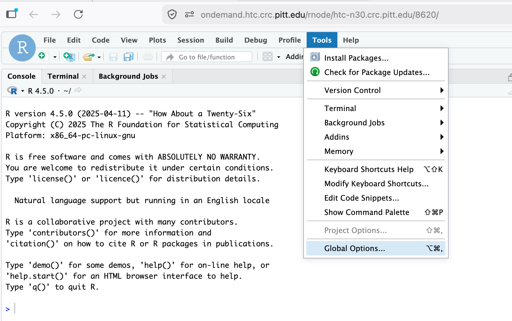
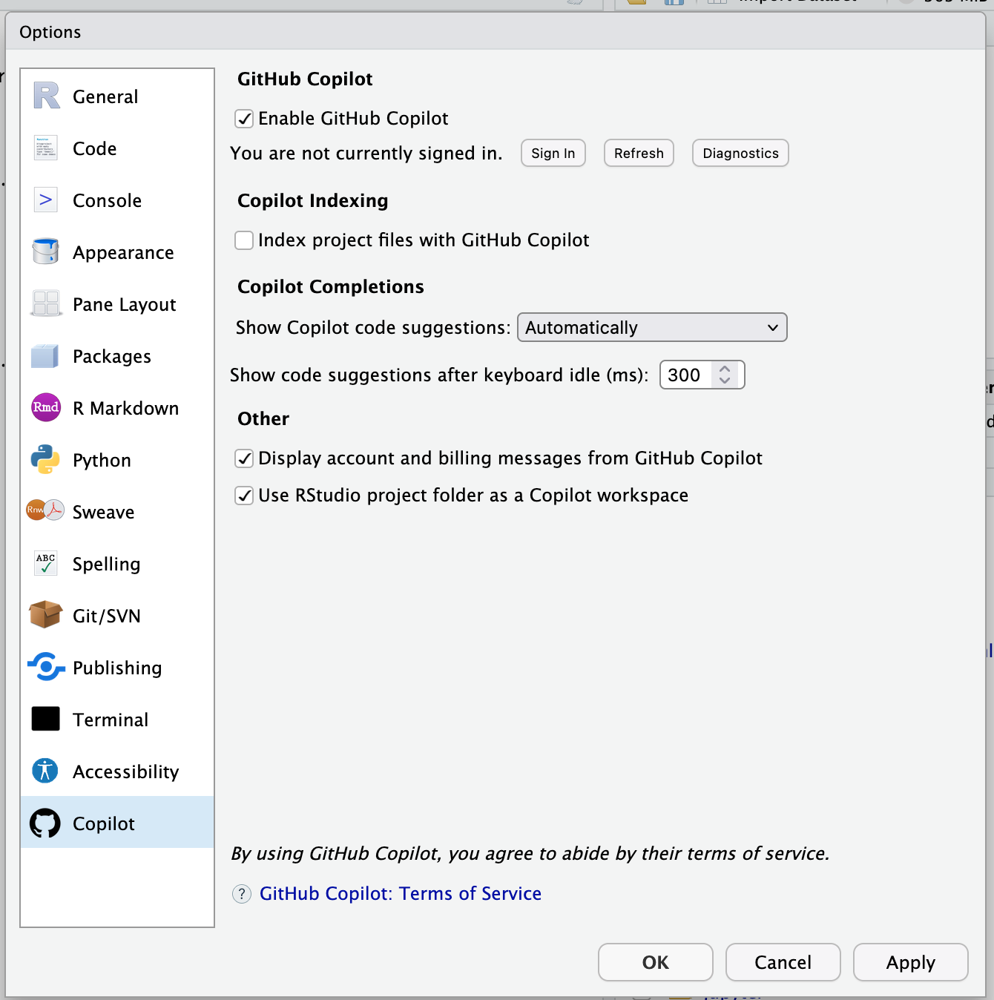
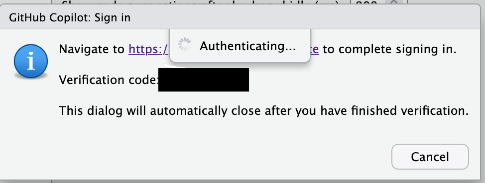
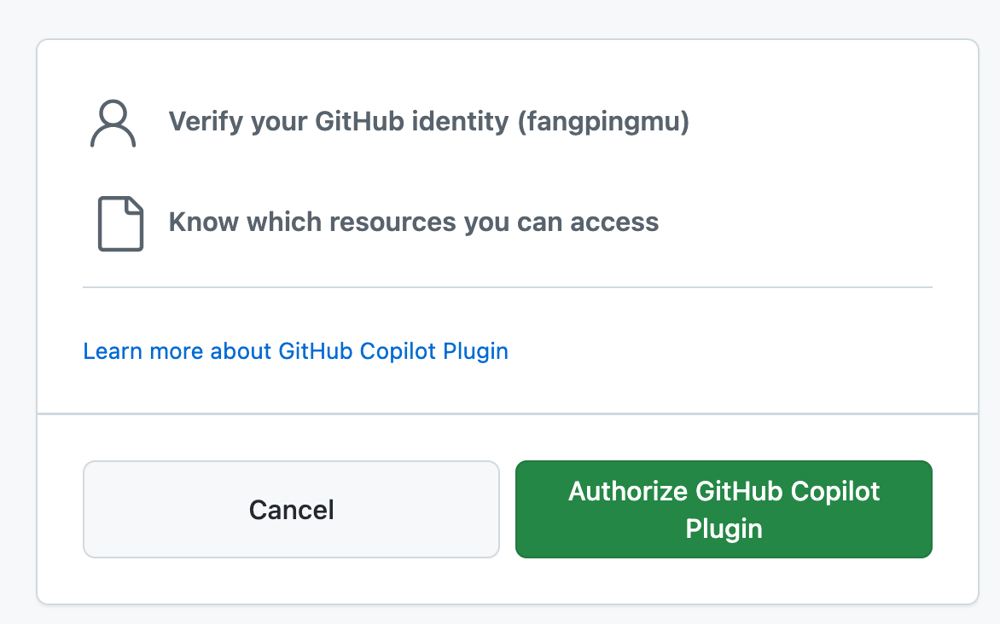
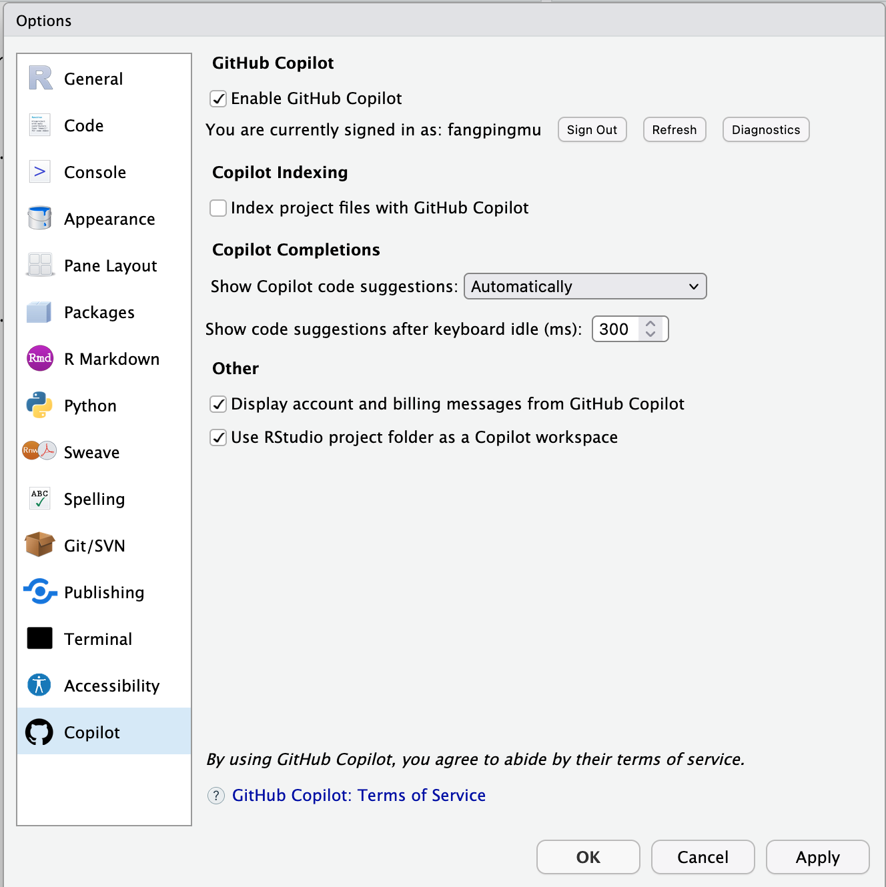
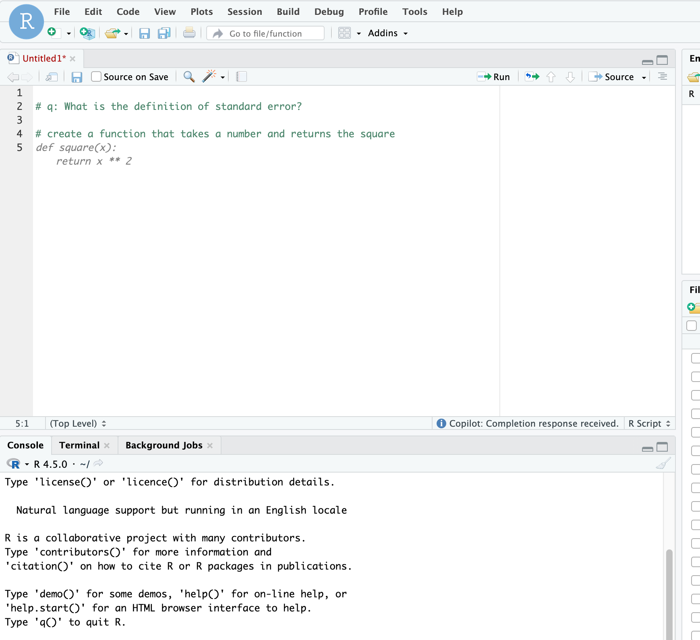

# GitHub Copilot

GitHub Copilot is an AI-powered pair programmer developed by GitHub and OpenAI that assists developers by generating code, providing suggestions, and explaining code snippets directly within IDEs.

How to create your GitHub account via the GitHub website

https://services.pitt.edu/TDClient/33/Portal/KB/ArticleDet?ID=430

GitHub Copilot offers a free tier, officially dubbed GitHub Copilot Free, providing limited, complimentary AI-powered coding assistance. It includes basic code completions, Chat features, and Copilot Edits with usage caps (e.g., approximately 2,000 completions and 50 chat messages per month). 

Students and faculty can use GitHub Copilot for free as part of the GitHub Education program. For more information, see the GitHub Education page.

https://github.com/education

https://services.pitt.edu/TDClient/33/Portal/Requests/ServiceDet?ID=342

Available for free to verified students, teachers, and open-source maintainers. $19/month/user for usage outside the classroom.

## GitHub Copilot in RStudio server

GitHub Copilot is available as an opt-in integration in RStudio Server.

https://docs.posit.co/ide/user/ide/guide/tools/copilot.html

Start RStudio Server 2025 from https://ondemmand.htc.crc.pitt.edu

