# nf-core Pipelines

Nextflow is a reactive workflow framework and a programming DSL that eases the writing of data-intensive computational pipelines.

*   Programming language to handle computational workflows, based on Groovy/Java
*   Well suited for complex and highly parallel Bioinformatics workflows
*   Easy to run/use
*   Handles interaction with compute infrastructure, runs just about anywhere

[nf-core](https://nf-co.re/) is a community effort to collect a curated set of analysis [pipelines](https://nf-co.re/pipelines) built using Nextflow.

I built a web application through open ondemand:

*   Choose a pipeline
*   Fill the launch form for that pipeline.
*   Launch the pipeline with your choices to the HTC cluster

Point your browser to https://ondemand.htc.crc.pitt.edu

1. Click Genomics Apps -> nf-core pipelines

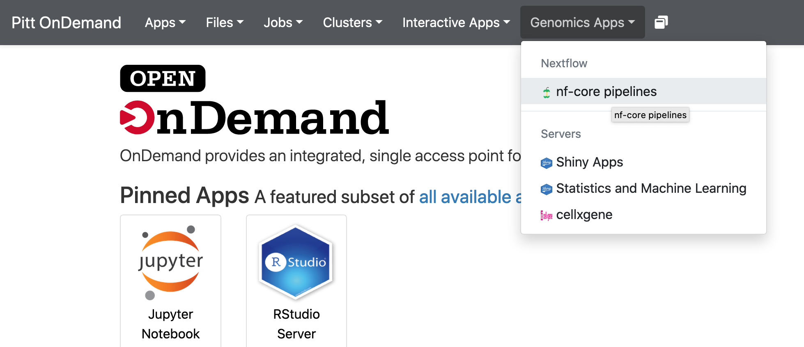

2. Choose a pipelne, for example, rnaseq 2.0, click Launch

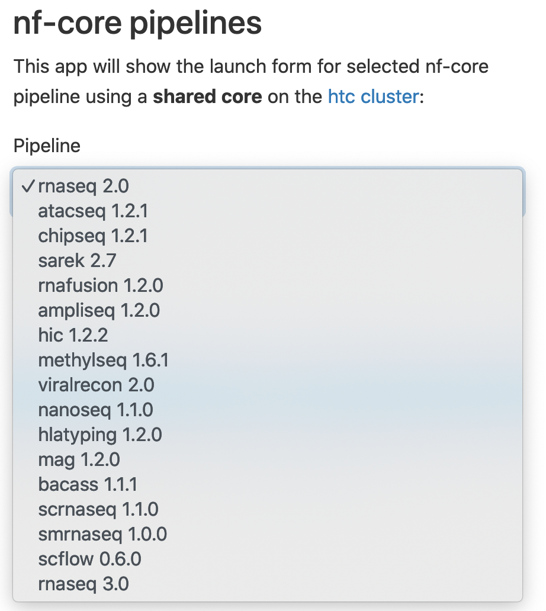

3. Click Connect to Nextflow

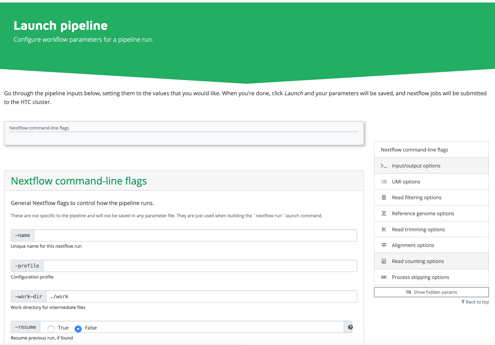

4. Fill the webform, and click "Launch Workflow".

## Guidelines

1. /ix1/bioinformatics/nf-core/nf-core-rnaseq is an example of nf-core rnaseq 3.22.2.
2. You will need to create a samplesheet with information about the samples you would like to analyse before running the pipeline. Use this parameter to specify its location. Provide the absolute path to input. As shown in the above screenshot, I have provided /ix1/bioinformatics/nf-core/nf-core-rnaseq/samples.csv.
3. Parent path of the samplesheet is used to run the pipeline. -work-dir and outdir is relative to the parent path. In the above screenshot, parent path is /ix1/bioinformatics/nf-core/nf-core-rnaseq. Thus the working directory is /ix1/bioinformatics/nf-core/nf-core-rnaseq/work, and the outdir is /ix1/bioinformatics/nf-core/nf-core-rnaseq/results
4. After you click Launch, nf-params.json and job.sbatch will be created in the parent path. job.sbatch will be automatically submitted to run the nf-core pipeline. 
5. The default config file is /software/rhel9/manual/install/nf-core/pipelines/config/htc.config. If you keep -profile empty, the default config file will be used. You can also create your own config file and provide the absolute path to -profile. In the above screenshot, I have provided /ix1/bioinformatics/nf-core/nf-core-rnaseq/htc.config, in which I have modified clusterOptions to use a specific slurm account.

[nf-core/rnaseq](https://nf-co.re/rnaseq/2.0)
---------------------------------------------

RNA sequencing analysis pipeline using STAR, RSEM, HISAT2 or Salmon with gene/isoform counts and extensive quality control.

1. Logon ondemand.htc.crc.pitt.edu, Click Files -> Home Directory, Click Change directory and go to your bgfs or zfs folder. You can go to ```/bgfs/genomics/fangping/nf-core-rnaseq``` to see an example.

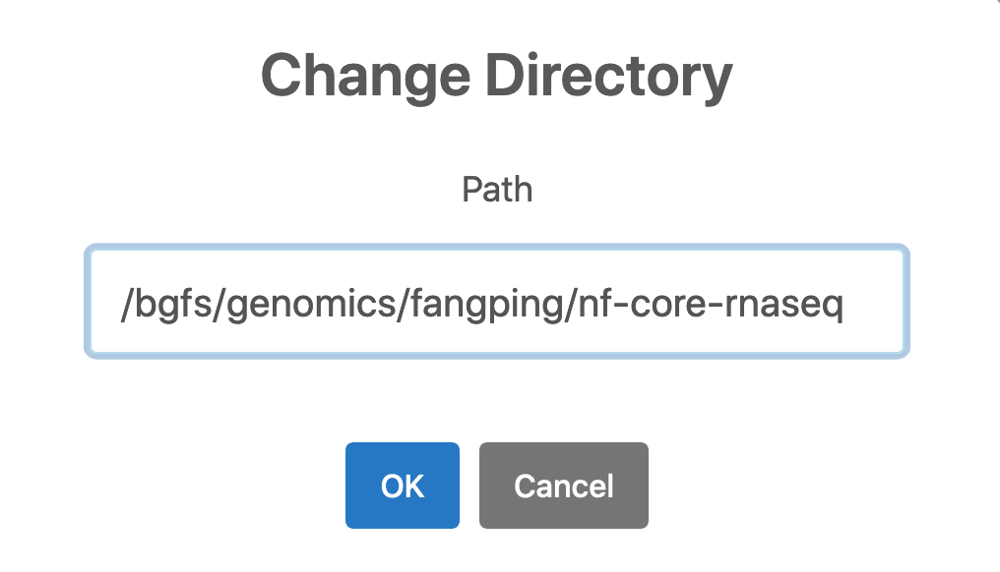

Create a folder fastqs, and transfer your fastqs to this folder. 6 paired-end fastqs from GSE155987 have been downloaded to ```/bgfs/genomics/fangping/nf-core-rnaseq/fastqs```.

Differential Gene Expression Analysis Reveals Global LMTK2 Regulatory Network and Its Role in TGF-β1 Signaling. Cruz DF, Mitash N, Mu F, Farinha CM, Swiatecka-Urban A. Front Oncol. 2021 Mar 18;11:596861. doi: 10.3389/fonc.2021.596861.

The raw fastqs files are within this folder.

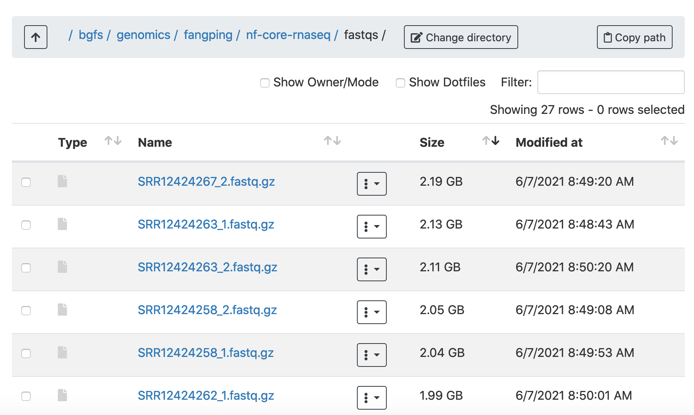

2. Samplesheet input

You will need to create a samplesheet file with information about the samples in your experiment before running the pipeline. Use this parameter to specify its location. It has to be a comma-separated file with 5 columns, and a header row specified in [this documentation](https://nf-co.re/rnaseq/2.0/usage).

You can use editor on Open Ondemand to edit this file.

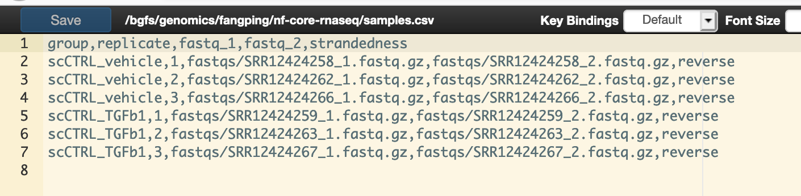

Keep a record of this samplesheet location. You can get its location from the header line of the above editor. For this example, this file is at ```/bgfs/genomics/fangping/nf-core-rnaseq/samples.csv```

3. Reference genome

Create a folder refs and download the reference genome for your samples. I have downloaded Ensembl homo sapiens GRCh38 primary assembly and Ensembl annotation version 103 to ```/bgfs/genomics/fangping/nf-core-rnaseq/refs```

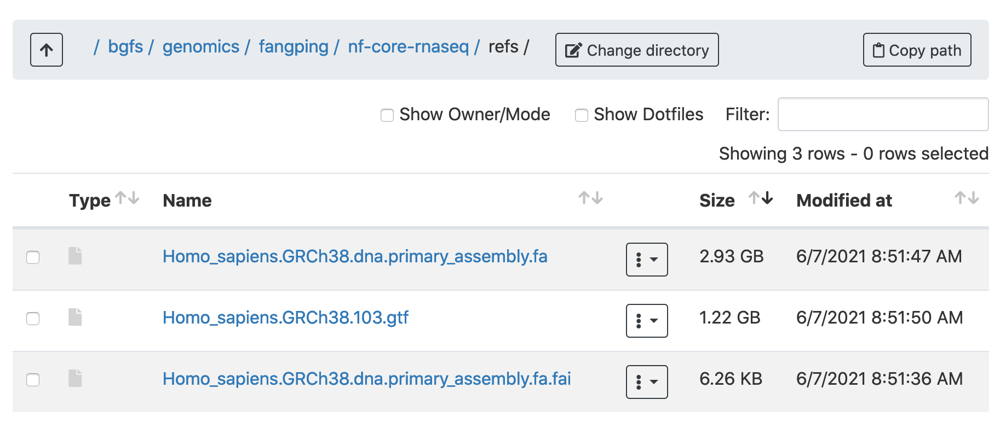

4. Fill the launch form

Click Genomics Apps -> nf-core pipelines, choose rnaseq 2.0, click Launch, then click Connect to Nextflow

The input field is the absolute path to your sample sheet.

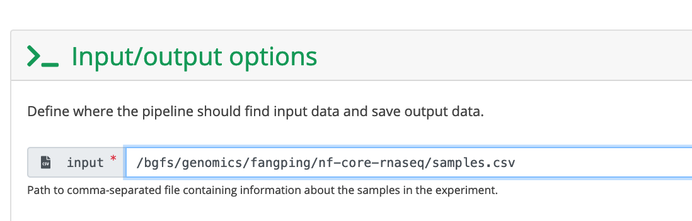

The minimum reference genome requirements are a FASTA and GTF file, all other files required to run the pipeline can be generated from these files. However, it is more storage and compute friendly if you are able to re-use reference genome files as efficiently as possible. It is recommended to change the save\_reference parameter to be true if you are using the pipeline to build new indices.

fasta and gtf fields are the the absolute path to your fasta and gtf file.

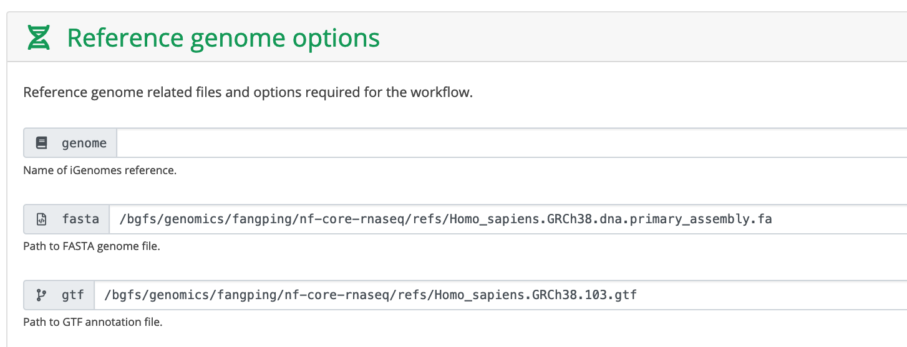

If you are using the pipeline to build new indices, change save_reference to be True. The star index is available at ```/bgfs/genomics/fangping/nf-core-rnaseq/results/genome/index/star```, and you can use this folder as input to star_index for future runs.

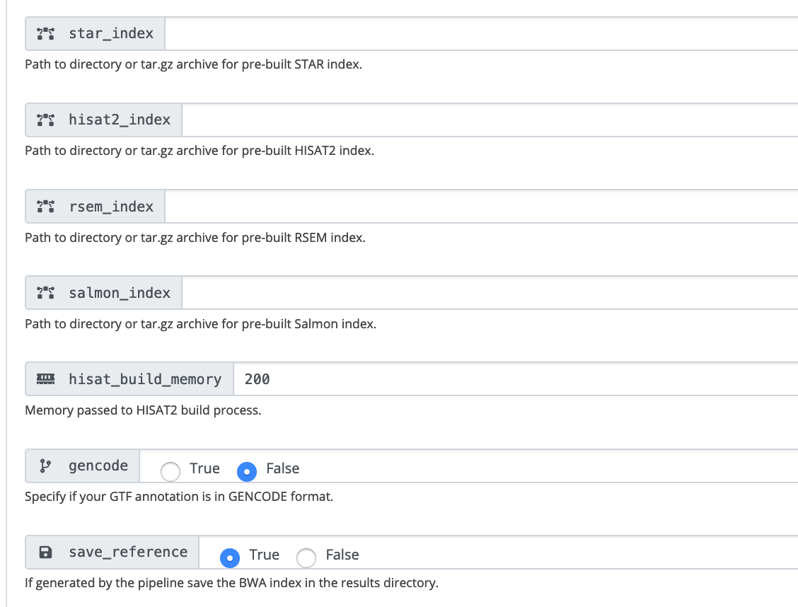

Choose the aligner and pseudo_aligner.

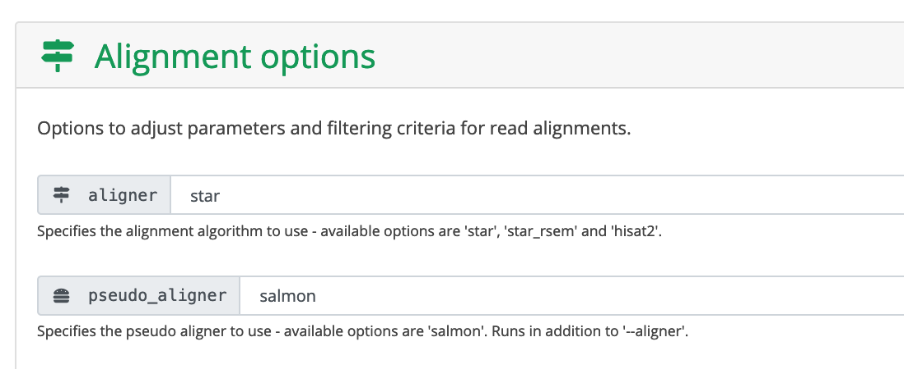

Adjust other parameters based on your data analysis goals. The meanings of these parameters are available [here](https://nf-co.re/rnaseq/2.0/parameters).

5. Lauch workflow

When you are ready, click Launch workflow.

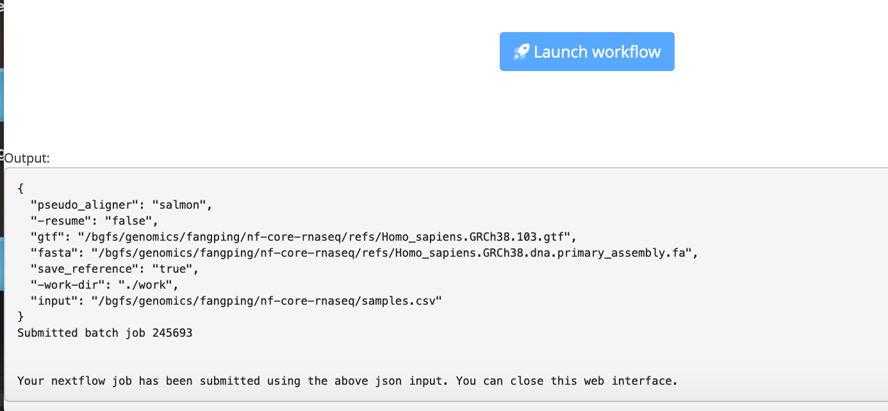

You can close this launch form. You will be notified by emails when your workflow begins and ends.

6. Outputs

[This document](https://nf-co.re/rnaseq/2.0/output) describes the output produced by the pipeline. For the above example, featurecounts.merged.counts.tsv is under /bgfs/genomics/fangping/nf-core-rnaseq/results/star/

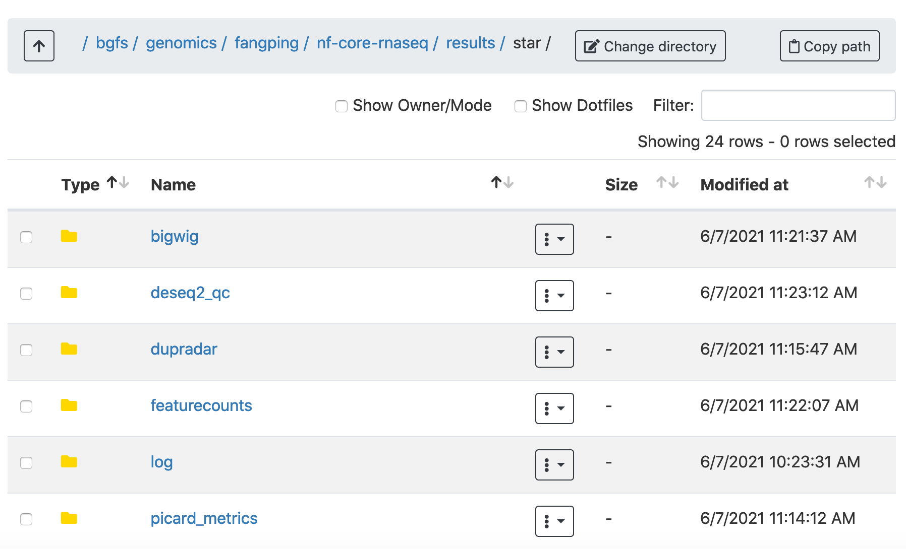


Navigate to ```/bgfs/genomics/fangping/nf-core-rnaseq/results/salmon```, you can find:

```salmon.merged.gene_counts.tsv```: Matrix of gene-level raw counts across all samples.

```salmon.merged.gene_tpm.tsv```: Matrix of gene-level TPM values across all samples.

```salmon.merged.transcript_counts.tsv```: Matrix of isoform-level raw counts across all samples.

```salmon.merged.transcript_tpm.tsv```: Matrix of isoform-level TPM values across all samples.

Navigate to ```/bgfs/genomics/fangping/nf-core-rnaseq/results/multiqc/star```, and click ```multiqc\_report.html``` to open the multiqc results.

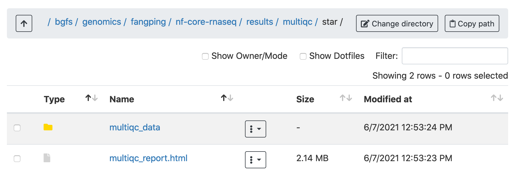

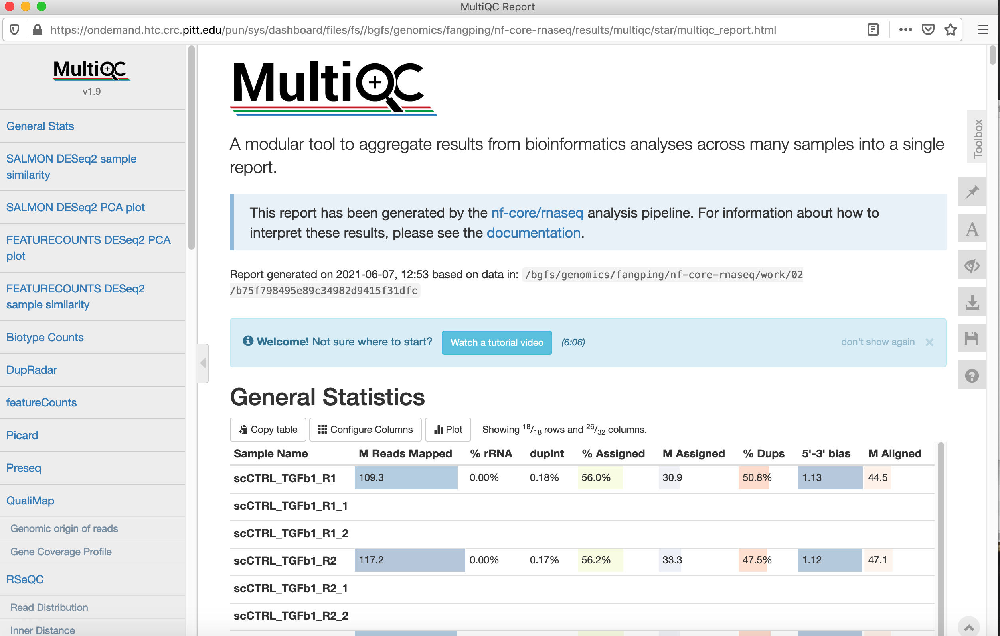

If you prefer to submit jobs through command line iapproach, use ```/bgfs/genomics/fangping/nf-core-rnaseq/job.sbatch```, input.json as reference. Both files are automatically generated through the above web application.

[nf-core/sarek](https://nf-co.re/sarek/2.7)
-------------------------------------------

Analysis pipeline to detect ```germline``` or somatic variants (pre-processing, variant calling and annotation) from WGS / targeted sequencing. Initially designed for Human, and Mouse, it can work on any species with a reference genome. Sarek can also handle tumour / normal pairs and could include additional relapses.

TODO

[nf-core/chipseq](https://nf-co.re/chipseq/1.2.2)
-------------------------------------------------

ChIP-seq peak-calling, QC and differential analysis pipeline. ```nfcore/chipseq``` is a bioinformatics analysis pipeline used for Chromatin ImmunopreciPitation sequencing (ChIP-seq) data.

1. Logon ondemand.htc.crc.pitt.edu, Click Files -> Home Directory, Click Change directory and go to your bgfs or zfs folder. Test data are in the folder /bgfs/genomics/fangping/nf-core-chipseq/tf and /bgfs/genomics/fangping/nf-core-chipseq/histone

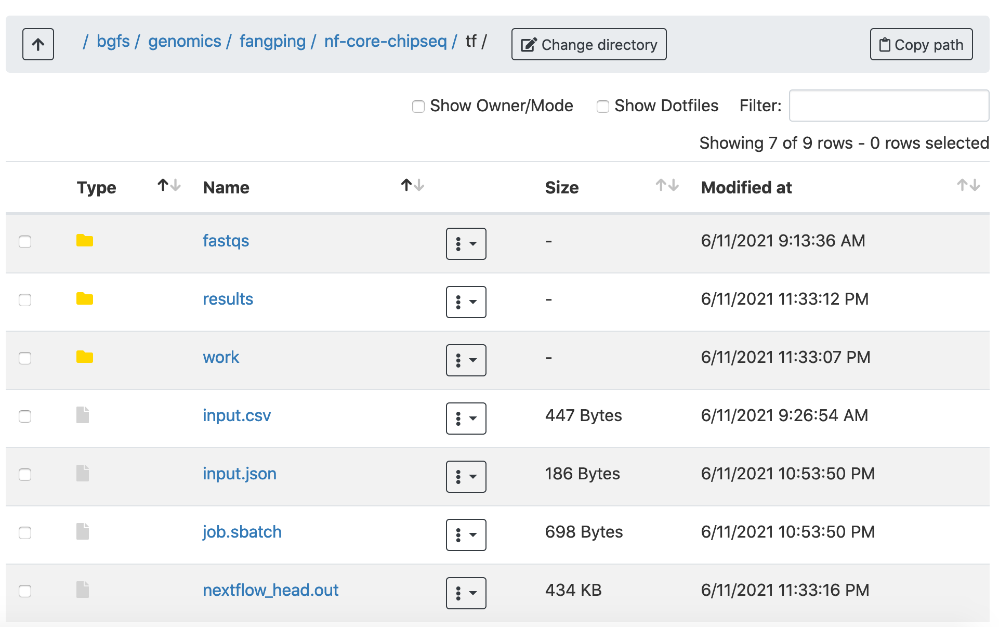

2. H. Sapiens single-end ChIP-seq dataset was obtained from 2 separate studies.

**Transcription factor data**

[Pubmed](https://pubmed.ncbi.nlm.nih.gov/25752574/), [GEO](https://www.ncbi.nlm.nih.gov/geo/query/acc.cgi?acc=GSE59530) (Input samples: SRR1635435 - SRR1635438, samples: SRR1635459 - SRR1635462)

I have downloaded these data to ```/bgfs/genomics/fangping/nf-core-chipseq/tf/fastqs```


**Broad histone data**

[Pubmed](https://pubmed.ncbi.nlm.nih.gov/25188243/), [GEO](https://www.ncbi.nlm.nih.gov/geo/query/acc.cgi?acc=GSE57632) (samples: SRR1285070 - SRR1285073, Input samples: SRR1285074 - SRR1285077)

I have downloaded these data to ```/bgfs/genomics/fangping/nf-core-chipseq/histone/fastqs```

3. Samplesheet input file

You will need to create a design file with information about the samples in your experiment before running the pipeline. Use this parameter to specify its location. It has to be a comma-separated file with 6 columns, and a header row contains the following columns.

group,replicate,fastq\_1,fastq\_2,antibody,control

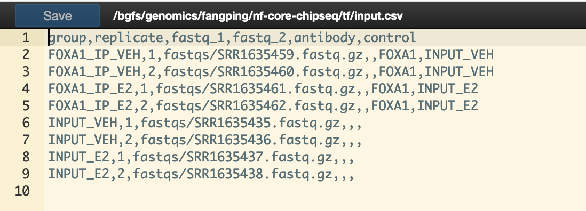

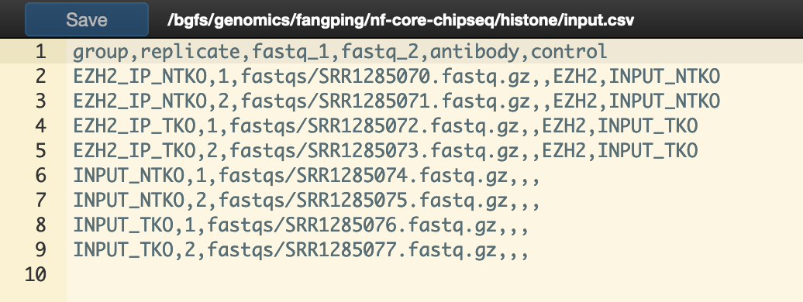

4. Fill the launch form

Click Genomics Apps -> nf-core pipelines, choose chipseq 1.2.1, click Launch, then click Connect to Nextflow

### Transcription factor data

The input field is the absolute path to your sample sheet. Choose single\_end to be True.


These are human data. We used hg38 as reference genome. You can also provide the absolute path to fasta and gtf files.

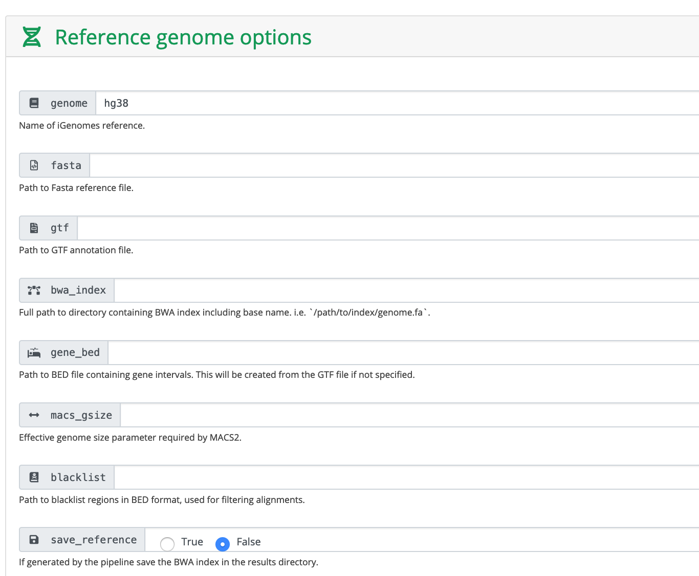

Run MACS2 in narrowPeak mode because these are transcription factor data.

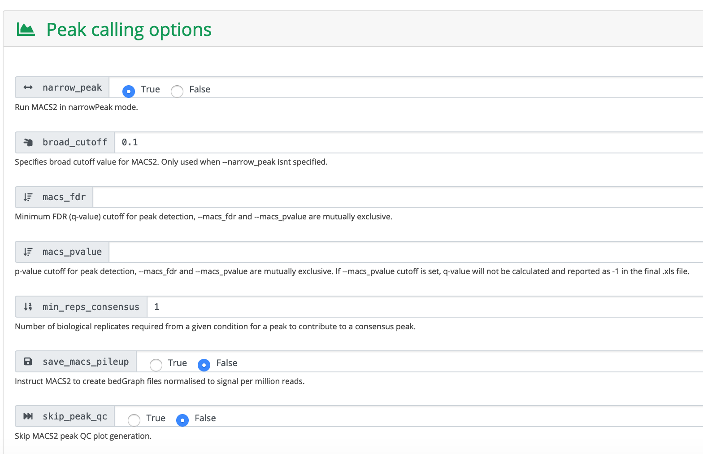

Click Launch workflow.

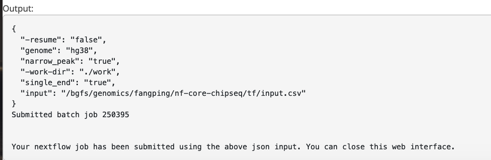

Histone Data

The input field is the absolute path to your sample sheet. Choose ```single_end``` to be True.

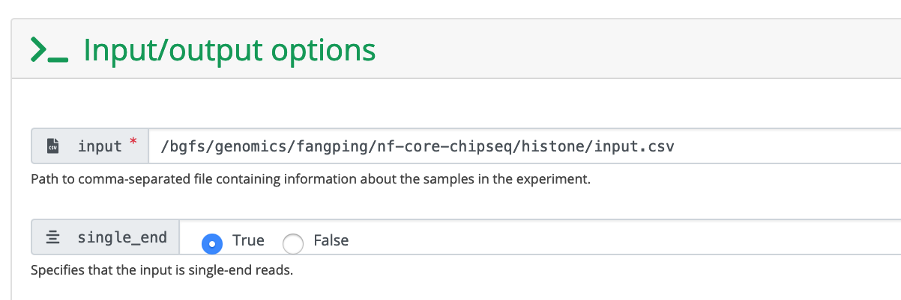

These are human data. We used hg38 as reference genome.

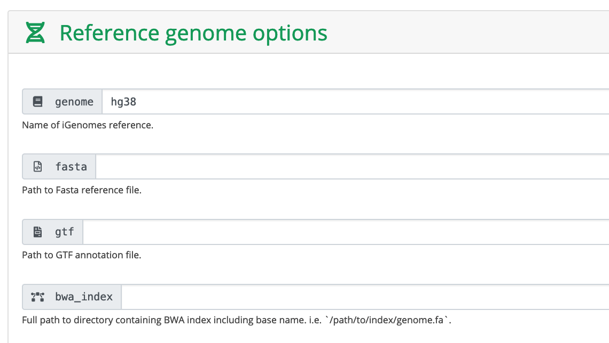

Run MACS2 in broadPeak mode because these are histone data.


Click Launch workflow.

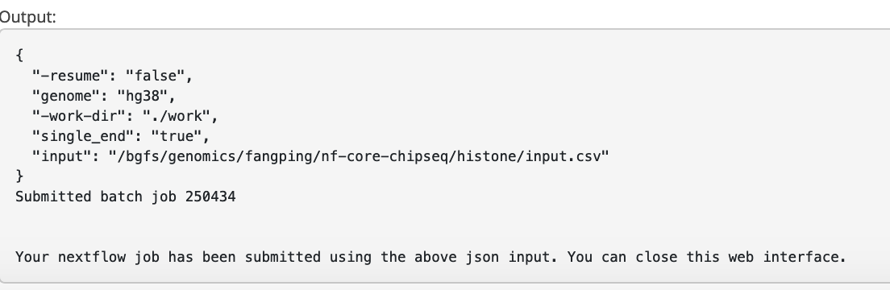

6. Outputs

[This document](https://nf-co.re/chipseq/1.2.1/output) [](https://nf-co.re/mag/2.0.0/output)describes the output produced by the pipeline. Navigate to ```/bgfs/genomics/fangping/nf-core-chipseq/tf/results and /bgfs/genomics/fangping/nf-core-chipseq/histone/results``` to read the results.

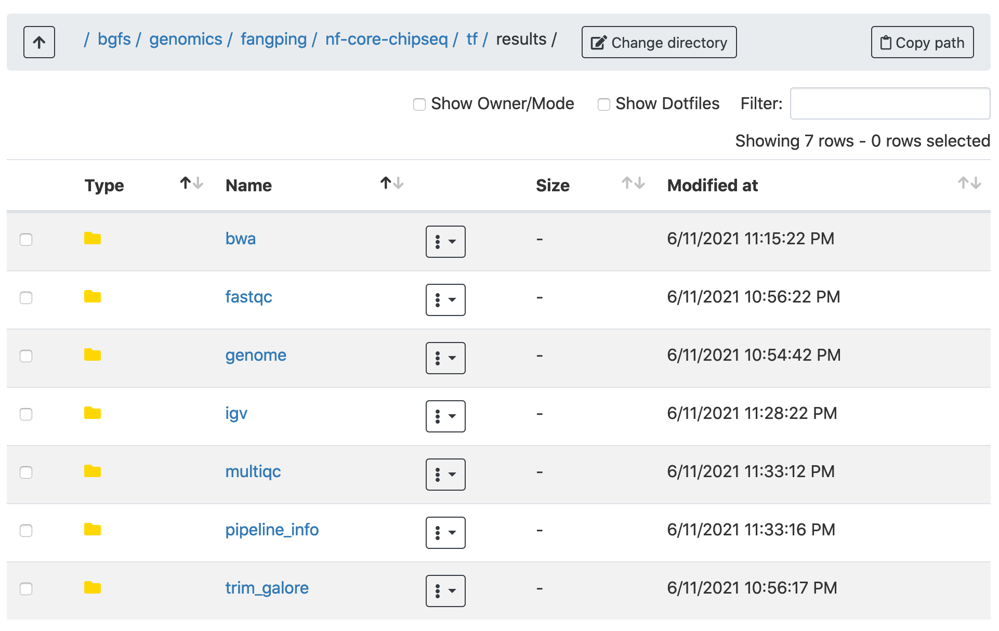

Navigate to ```/bgfs/genomics/fangping/nf-core-chipseq/tf/results/multiqc/narrowPeak``` and ```/bgfs/genomics/fangping/nf-core-chipseq/histone/results/multiqc/broadPeak``` to go through the multiqc report.

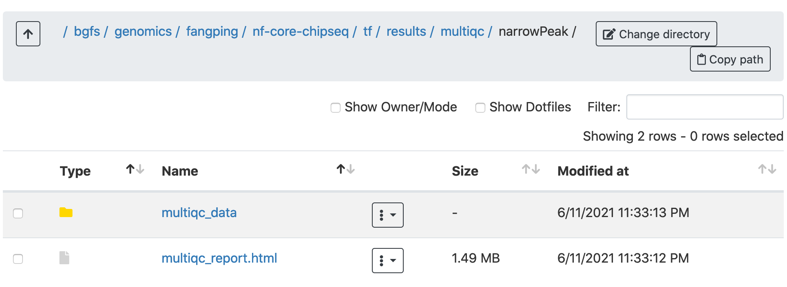

Click multiqc\_report.html to open the report.

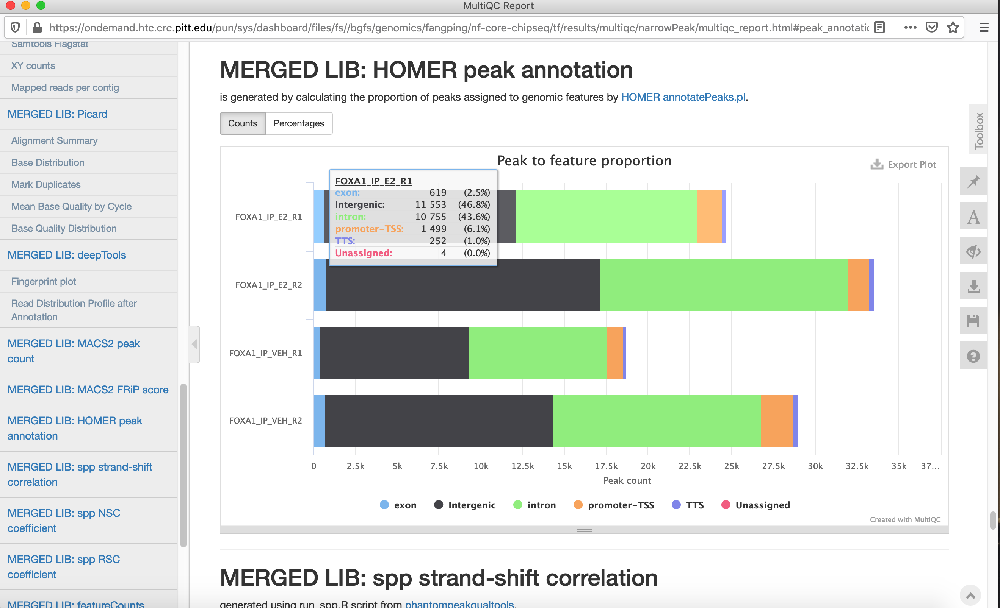

[nf-core/atacseq](https://nf-co.re/atacseq/1.2.1)
-------------------------------------------------

ATAC-seq peak-calling, QC and differential analysis pipeline. ```nfcore/atacseq``` is a bioinformatics analysis pipeline used for ATAC-seq data.

1. Logon ondemand.htc.crc.pitt.edu, Click Files -> Home Directory, Click Change directory and go to your bgfs or zfs folder. ATACseq test data are in the folder ```/bgfs/genomics/fangping/nf-core-atacseq```

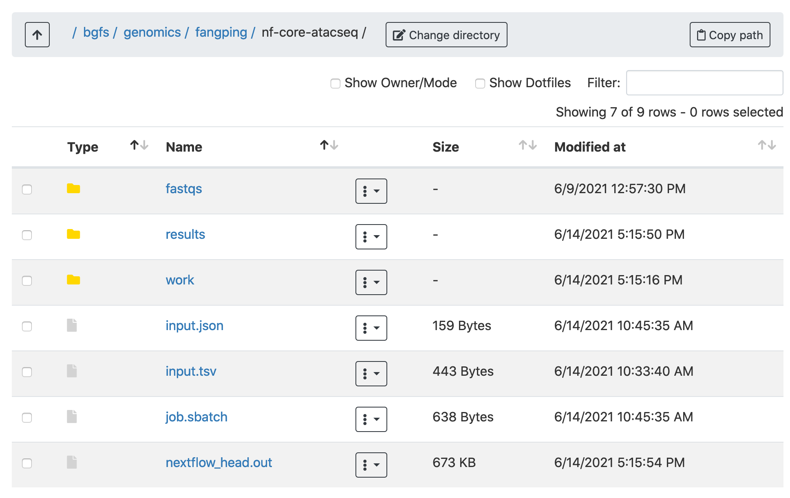

2. Within the fastqs folder, I have downloaded 6 samples from [this paper](https://pubmed.ncbi.nlm.nih.gov/29636475/).

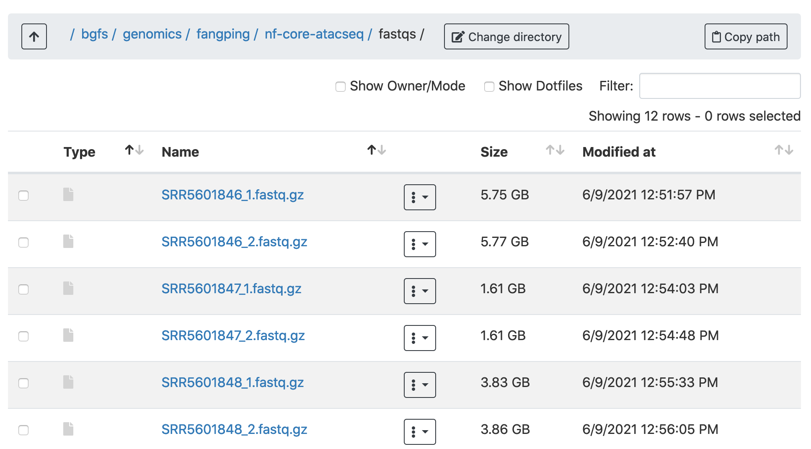

3. Samplesheet input file

You will need to create a design file with information about the samples in your experiment before running the pipeline. Use this parameter to specify its location. It has to be a comma-separated file with 4 columns.

  
group,replicate,fastq\_1,fastq\_2

Example ```samplesheet``` is at ```/bgfs/genomics/fangping/nf-core-atacseq/input.tsv```

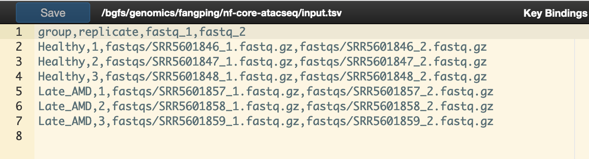

4. Fill the launch form

Click Genomics Apps -> nf-core pipelines, choose atacseq 1.2.1, click Launch, then click Connect to Nextflow

The input field is the absolute path to your sample sheet.

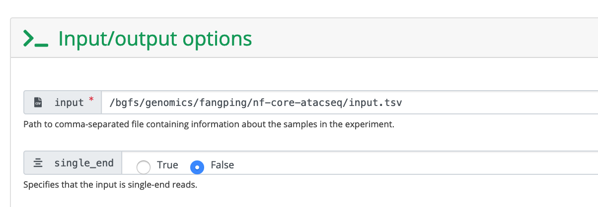

These are human data. We used hg38 as reference genome. You can also provide the absolute path to fasta and gtf files.

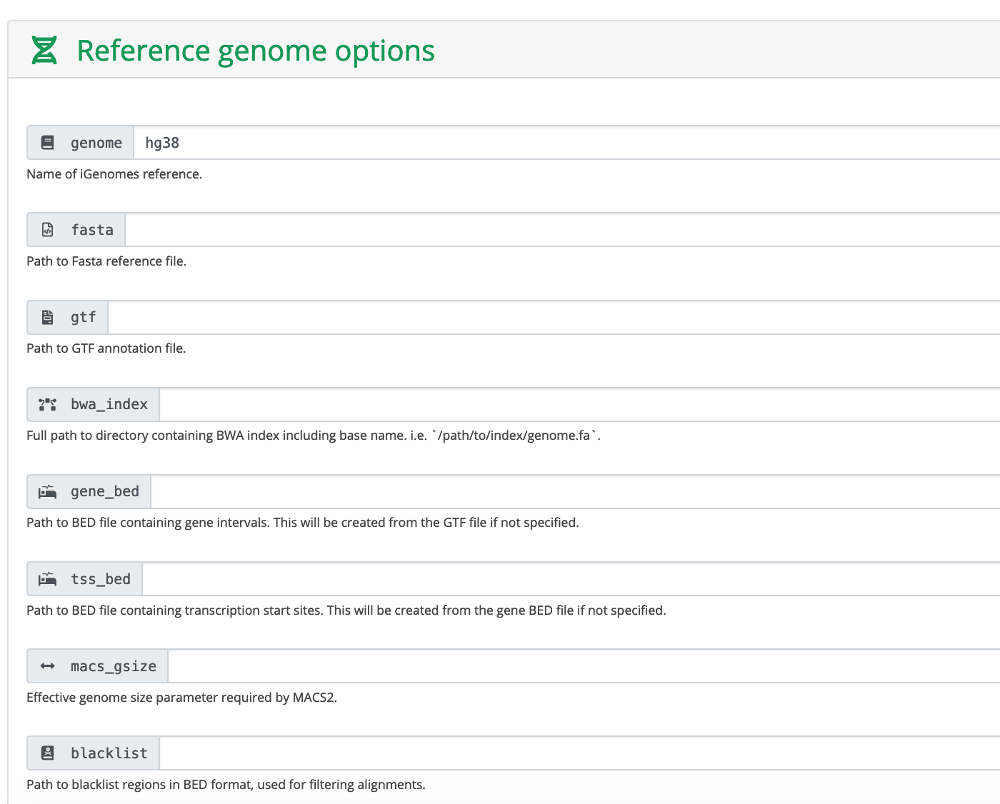

Run MACS2 in narrowPeak mode.

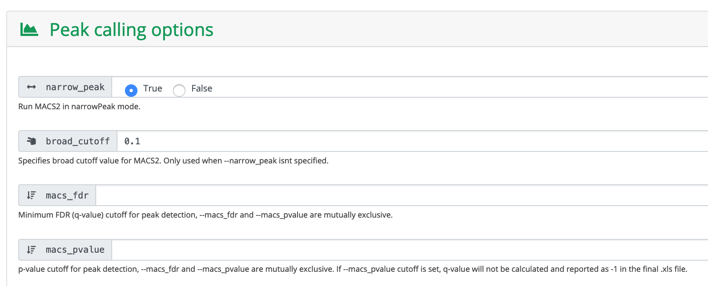

5. Click Launch workflow.

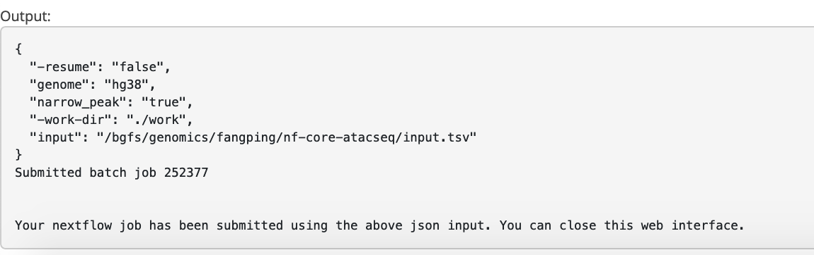

6. Outputs

[This document](https://nf-co.re/atacseq/1.2.1/output) describes the output produced by the pipeline. Navigate to ```/bgfs/genomics/fangping/nf-core-atacseq/results``` to read the results.

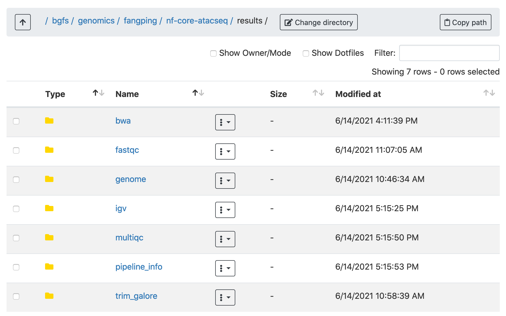

Navigate to ```/bgfs/genomics/fangping/nf-core-atacseq/results/multiqc/narrowPeak``` to go through the multiqc report.

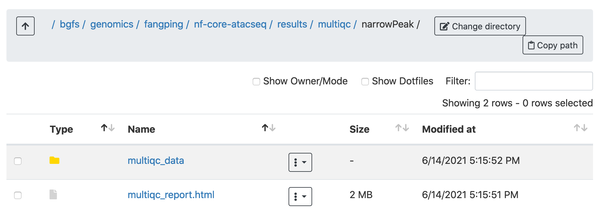

Click ```multiqc_report.html``` to open the report.

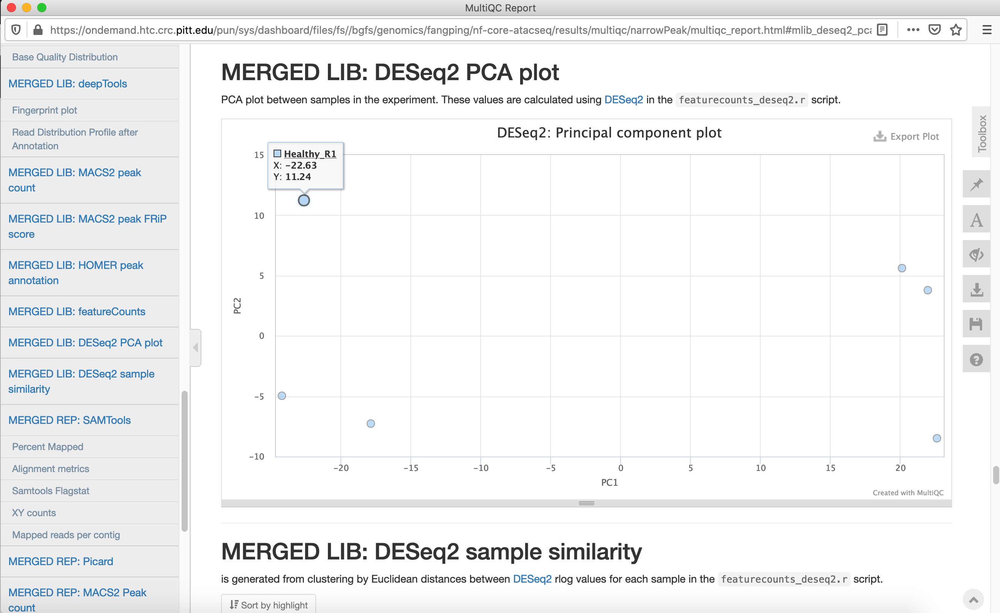

[nf-core/mag](https://nf-co.re/mag/2.0.0)
-----------------------------------------

Assembly and binning of metagenomes. nf-core/mag is a bioinformatics best-practise analysis pipeline for assembly, binning, and annotation of metagenomes.

By default, the pipeline currently performs the following: it supports both short and long reads, quality trims the reads and adapters with fastp and Porechop, and performs basic QC with FastQC. The pipeline then:

*   assigns taxonomy to reads using Centrifuge and/or Kraken2
*   performs assembly using MEGAHIT and SPAdes, and checks their quality using Quast
*   performs metagenome binning using MetaBAT2, and checks the quality of the genome bins using Busco
*   assigns taxonomy to bins using GTDB-Tk and/or CAT

Furthermore, the pipeline creates various reports in the results directory specified, including a MultiQC report summarizing some of the findings and software versions.

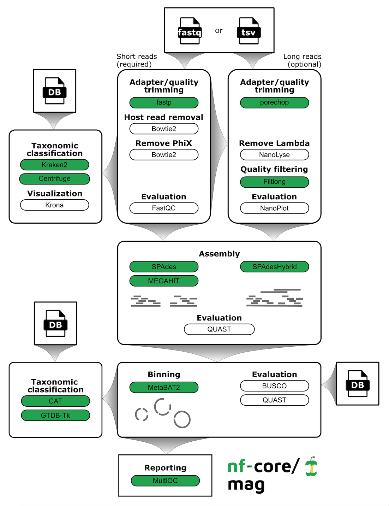

1. Logon ondemand.htc.crc.pitt.edu, Click Files -> Home Directory, Click Change directory and go to your bgfs or zfs folder. Test data for mag is in the folder /bgfs/genomics/fangping/nf-core-mag

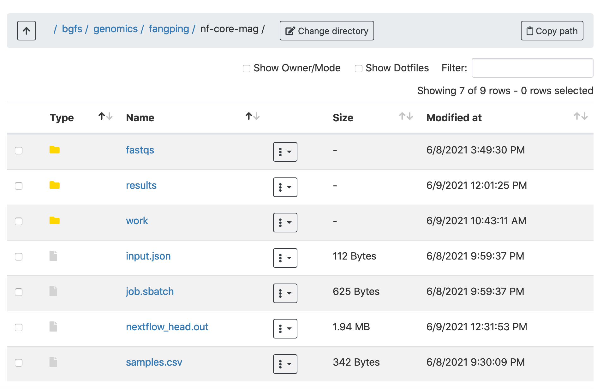

2. Within the fastqs folder, I have downloaded the gut metagenome data of antibiotic-treated patients originating from [Bertrand et al. Nature Biotechnology (2019)](https://www.nature.com/articles/s41587-019-0191-2). Three samples have been used. Note that sequencing data for the 3 samples have both Illumina and ONT reads.

SAMPLE

ILLUMINA READS: ENA ID

ONT READs: ENA ID

CAPES_S7

ERR3201914

ERR3201938

CAPES\_S11

ERR3201918

ERR3201942

CAPES_S21

ERR3201928

ERR3201952

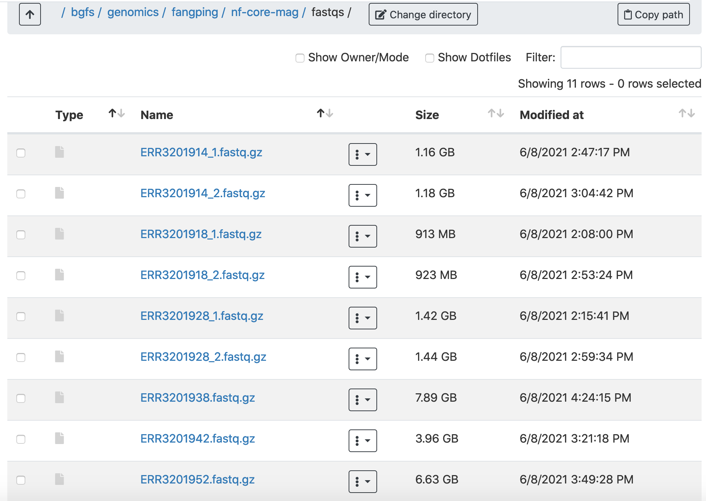

3. Samplesheet input file

To assign different groups or to include long reads for hybrid assembly with metaSPAdes, you can specify a CSV samplesheet input file that contains the paths to your FASTQ files and additional metadata.

This CSV file should contain the following columns:

sample,group,short\_reads\_1,short\_reads\_2,long\_reads

The path to long\_reads and short\_reads\_2 is optional. Example samplesheet is at /bgfs/genomics/fangping/nf-core-mag/samples.csv

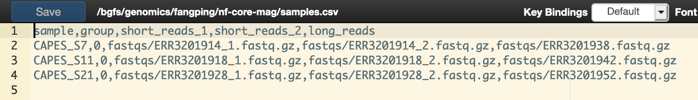

4. Fill the launch form

Click Genomics Apps -> nf-core pipelines, choose mag 2.0.0, click Launch, then click Connect to Nextflow

The input field is the absolute path to your sample sheet.

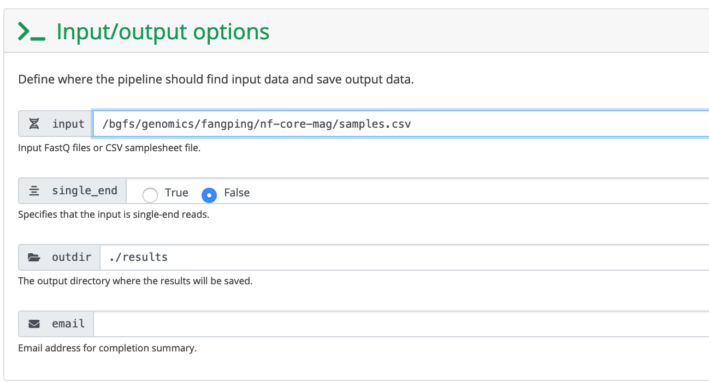

I have kept all other options as default values. Note that Taxonomic classification is disabled by default. cat\_db, centrifuge\_db and kraken2\_db are available under /bgfs/genomics/refs/metagenome\_refs

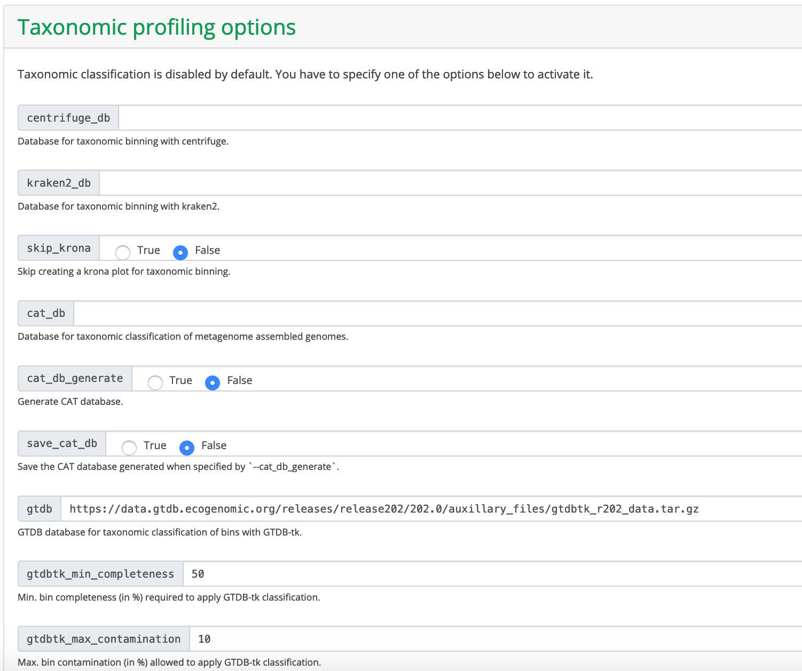

5. Lauch workflow

When you are ready, click Launch workflow.

6. Outputs

[This document](https://nf-co.re/rnaseq/2.0/output) [](https://nf-co.re/mag/2.0.0/output)describes the output produced by the pipeline. Navigate to /bgfs/genomics/fangping/nf-core-mag/results to read the results.

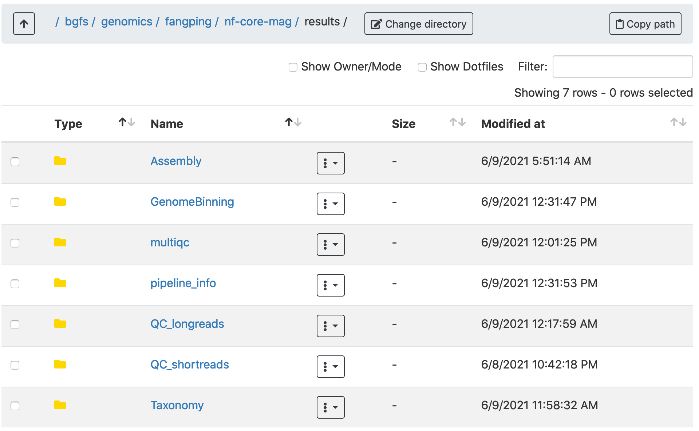

Navigate to /bgfs/genomics/fangping/nf-core-mag/results/multiqc to view the multiqc results.

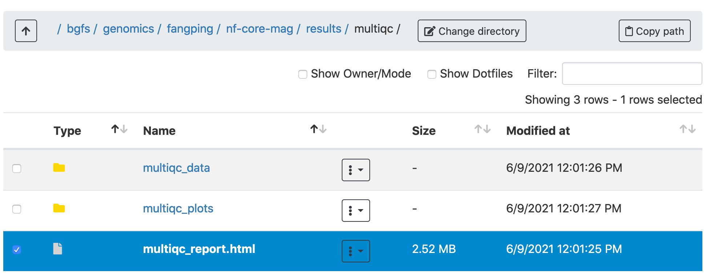

Click multiqc\_report.html to read the multiqc report.

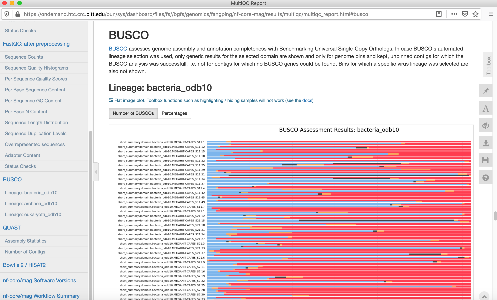
