# nf-core Pipelines

Nextflow is a reactive workflow framework and programming DSL designed to simplify the creation of data-intensive computational pipelines.

Key characteristics:

*  A workflow-oriented programming language built on Groovy/Java
*  Particularly well-suited for complex, highly parallel bioinformatics pipelines
*  Designed for ease of use
*  Manages interaction with compute infrastructure, enabling execution across nearly any environment

[nf-core](https://nf-co.re/) is a community-driven initiative that maintains a curated collection of analysis [pipelines](https://nf-co.re/pipelines) built with Nextflow.

I built a web application on Open OnDemand that lets you:

*  Select a pipeline
*  Complete the launch form for that pipeline
*  Submit the pipeline to the HTC cluster with your selected options

To get started:

Navigate to https://ondemand.htc.crc.pitt.edu

1. Click Genomics Apps → nf-core pipelines

2. Select a pipelne, for example, rnaseq 3.22.2, then click Launch

3. Click Connect to Nextflow

4. Complete the webform, then click "Launch Workflow".

## Guidelines

1. /vast/bioinformatics/tutorials/nf-core-rnaseq serves as an example setup for nf-core rnaseq 3.22.2.
2. Before running the pipeline, you'll need to create a samplesheet containing information about the samples you want to analyze. Provide the absolute path to this input file. As shown in the screenshot above, the samplesheet path used is /vast/bioinformatics/tutorials/nf-core-rnaseq/samples.csv.
3. The pipeline runs from the samplesheet's parent directory, and both -work-dir and outdir are relative to this path. In the example above, the parent path is /vast/bioinformatics/tutorials/nf-core-rnaseq, making the working directory /vast/bioinformatics/tutorials/nf-core-rnaseq/work and the output directory /vast/bioinformatics/tutorials/nf-core-rnaseq/results.
4. After clicking Launch, an nf-params.json file and a job.sbatch file will be generated in the parent directory. The job.sbatch file is then automatically submitted to run the nf-core pipeline.
5. The default config file is /software/rhel9/manual/install/nf-core/pipelines/config/htc.config. Leaving -profile empty will use this default. Alternatively, you can create a custom config file and specify its absolute path in -profile. /vast/bioinformatics/tutorials/nf-core-rnaseq/htc.config is another config file, where clusterOptions has been modified to specify a particular Slurm account.
6. All nf-core pipelines are located in /software/rhel9/manual/install/nf-core/pipelines.
7. Nextflow is built for running highly parallel bioinformatics pipelines, which means it relies on a fast file system to perform well. For this reason, we recommend running Nextflow pipelines on CRCD's /vast file system. If you're instead using CRCD's warm storage (/ix or /ix1), limit your pipeline runs to fewer than 10 samples.

## Installed pipelines

[sopa 1.0.0](https://nf-co.re/sopa/1.0.0)  
[spatialaxe 1.0.0](https://nf-co.re/spatialaxe/1.0.0)  
[airrflow 4.3.1](https://nf-co.re/airrflow/4.3.1)  
[ampliseq 2.15.0](https://nf-co.re/ampliseq/2.15.0)  
[atacseq 2.1.2](https://nf-co.re/atacseq/2.1.2)  
[bacass 2.5.0](https://nf-co.re/bacass/2.5.0)  
[bactmap 1.0.0](https://nf-co.re/bactmap/1.0.0)  
[bamtofastq 2.2.0](https://nf-co.re/bamtofastq/2.2.0)  
[chipseq 2.1.0](https://nf-co.re/chipseq/2.1.0)  
[circdna 1.1.0](https://nf-co.re/circdna/1.1.0)  
[cutandrun 3.2.2](https://nf-co.re/cutandrun/3.2.2)  
[demultiplex 1.7.0](https://nf-co.re/demultiplex/1.7.0)  
[denovotranscript 1.2.1](https://nf-co.re/denovotranscript/1.2.1)  
[differentialabundance 1.5.0](https://nf-co.re/differentialabundance/1.5.0)  
[drugresponseeval 1.1.0](https://nf-co.re/drugresponseeval/1.1.0)  
[fetchngs 1.12.0](https://nf-co.re/fetchngs/1.12.0)  
[funcscan 3.0.0](https://nf-co.re/funcscan/3.0.0)  
[genomeassembler 1.1.0](https://nf-co.re/genomeassembler/1.1.0)  
[hgtseq 1.1.0](https://nf-co.re/hgtseq/1.1.0)  
[hic 2.1.0](https://nf-co.re/hic/2.1.0)  
[hlatyping 2.1.0](https://nf-co.re/hlatyping/2.1.0)  
[isoseq 2.0.0](https://nf-co.re/isoseq/2.0.0)  
[mag 5.3.0](https://nf-co.re/mag/5.3.0)  
[metatdenovo 1.3.0](https://nf-co.re/metatdenovo/1.3.0)  
[methylseq 4.2.0](https://nf-co.re/methylseq/4.2.0)  
[mhcquant 3.0.0](https://nf-co.re/mhcquant/3.0.0)  
[nanoseq 3.1.0](https://nf-co.re/nanoseq/3.1.0)  
[oncoanalyser 2.3.0](https://nf-co.re/oncoanalyser/2.3.0)  
[pacvar 1.0.1](https://nf-co.re/pacvar/1.0.1)  
[pangenome 1.1.3](https://nf-co.re/pangenome/1.1.3)  
[pathogensurveillance 1.0.0](https://nf-co.re/pathogensurveillance/1.0.0)  
[raredisease 2.6.0](https://nf-co.re/raredisease/2.6.0)  
[rnafusion 4.0.0](https://nf-co.re/rnafusion/4.0.0)  
[rnaseq 3.22.2](https://nf-co.re/rnaseq/3.22.2)  
[rnasplice 1.0.4](https://nf-co.re/rnasplice/1.0.4)  
[rnavar 1.2.2](https://nf-co.re/rnavar/1.2.2)  
[sarek 3.7.1](https://nf-co.re/sarek/3.7.1)  
[scnanoseq 1.2.1](https://nf-co.re/scnanoseq/1.2.1)  
[scrnaseq 4.1.0](https://nf-co.re/scrnaseq/4.1.0)  
[taxprofiler 1.2.5](https://nf-co.re/taxprofiler/1.2.5)  
[viralmetagenome 1.0.1](https://nf-co.re/viralmetagenome/1.0.1)  
[viralrecon 3.0.0](https://nf-co.re/viralrecon/3.0.0)  

[mcmicro 2.0.0](https://nf-co.re/mcmicro/2.0.0)  

[proteinfamilies 2.4.0](https://nf-co.re/proteinfamilies/2.4.0)  
[proteinannotator 1.1.0](https://nf-co.re/proteinannotator/1.1.0)  
[proteinfold 2.0.0](https://nf-co.re/proteinfold/2.0.0)  

[quantms 1.8.0](https://github.com/bigbio/quantms)  

# nf-core rnaseq 3.22.2
---------------------------------------------

This walkthrough demonstrates how to run nf-core/rnaseq 3.22.2 on an actual RNA-seq dataset.

1. Go to https://ondemand.htc.crc.pitt.edu and log in with your Pitt credentials.
   
2. Click Files to confirm you have access to a /vast folder. Alternatively, click Home Directory, then use Change directory to navigate to your group's folder. In this example, we've moved to /vast/bioinformatics/tutorials.
   
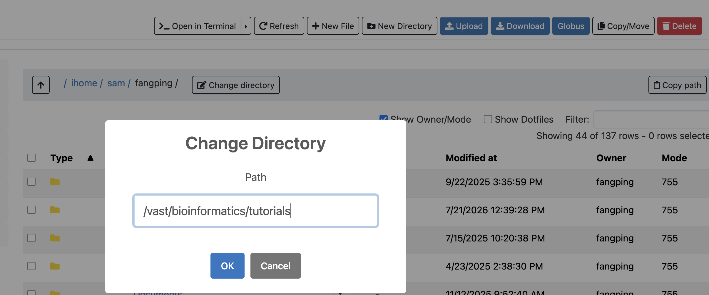

3. Use New Directory to create a new folder. Here, we've named it nf-core-rnaseq.

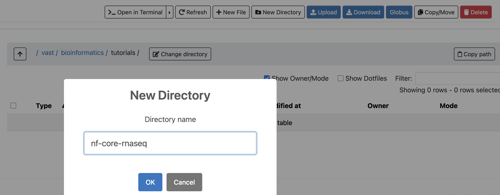

4. Inside nf-core-rnaseq, create a subfolder called fastqs and move your raw sequencing files there. This example uses 12 fastq.gz files uploaded to that folder. To upload your own raw data, follow one of the methods described in this manual: https://crc-pages.pitt.edu/user-manual/data-management/. Do not use OnDemand's built-in Upload feature for this, since it's meant for small files only, not large sequencing datasets.

5. Return to the nf-core-rnaseq folder, click New File, and name it samples.csv.

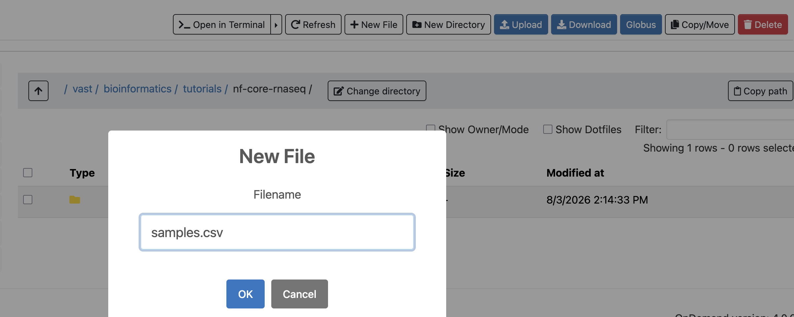

6. Click Edit to open samples.csv.

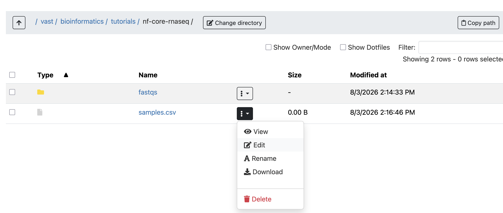

7. Paste in your nf-core samplesheet content and click Save.

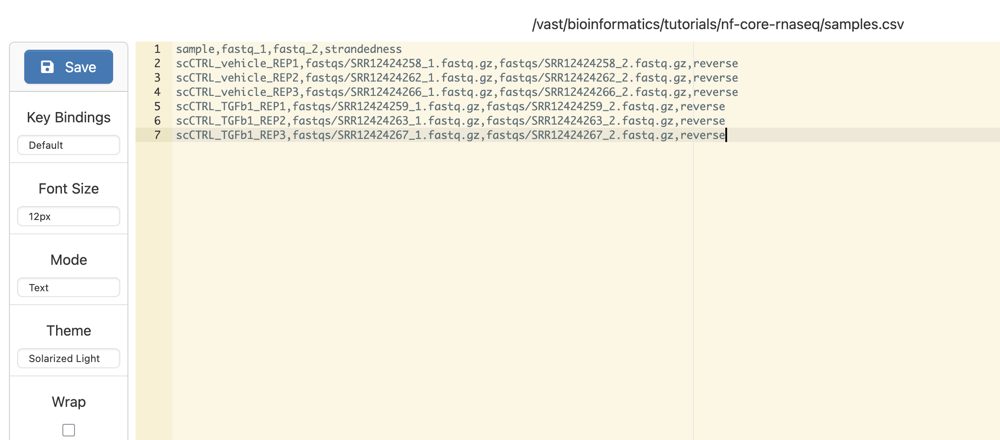

8. Get the absolute path to samples.csv. Clicking copy path gives you the parent directory path — in this case, /vast/bioinformatics/tutorials/nf-core-rnaseq — so the full path to the file is /vast/bioinformatics/tutorials/nf-core-rnaseq/samples.csv.

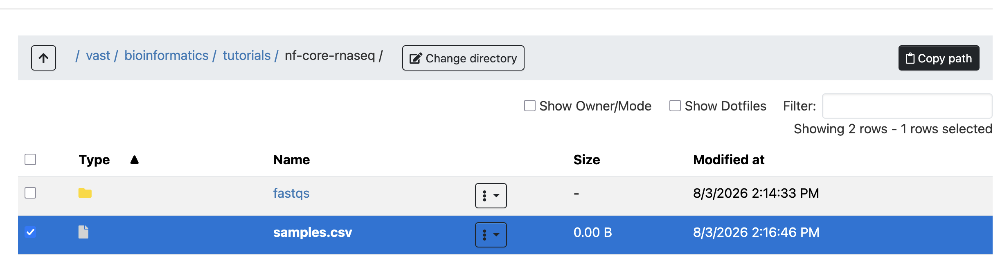

9. Click Genomics Apps → nf-core pipelines, choose rnaseq 3.22.2, and click Launch.

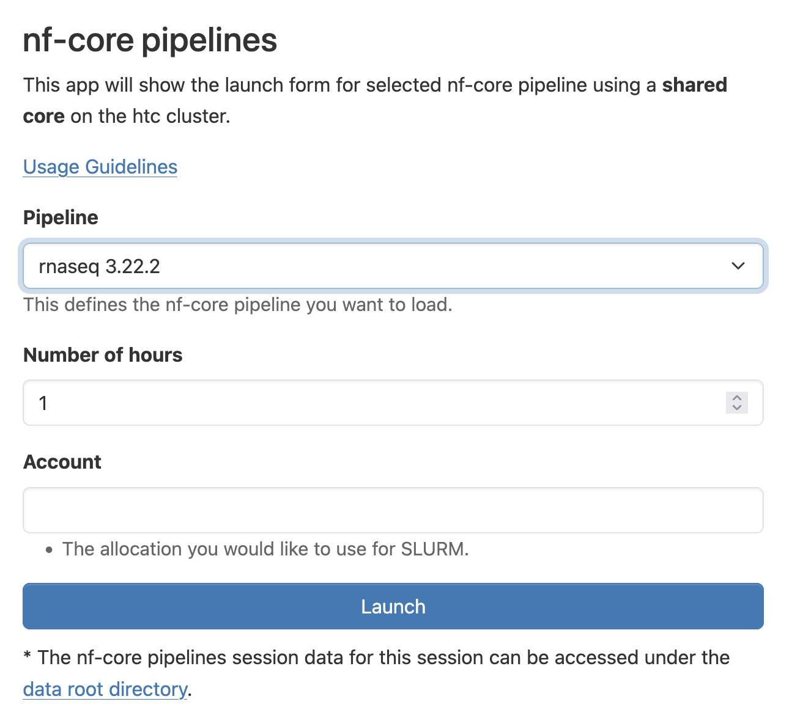

10. Click Connect to Nextflow.

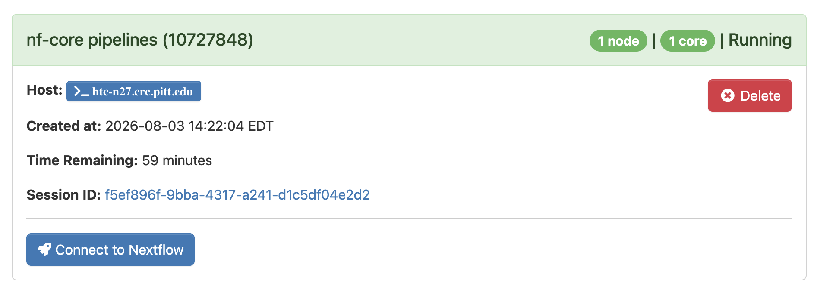

11. Enter the absolute path to samples.csv in the input field, and set the outdir field to results.

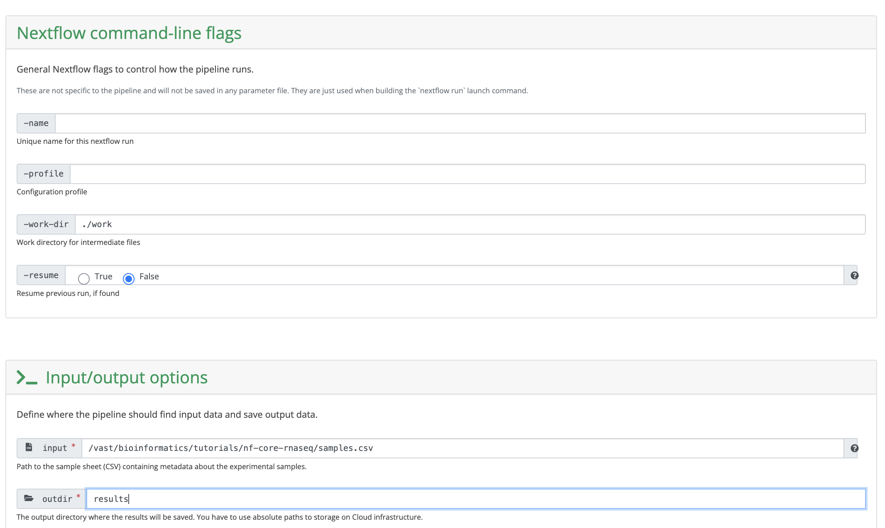

12. Under Reference genome options, select GRCh38 as the genome.
    
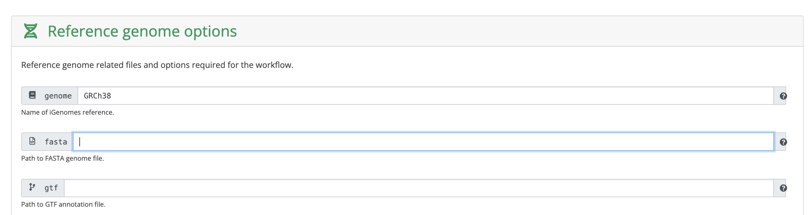

13. Under Alignment options, default settings were used for this example.

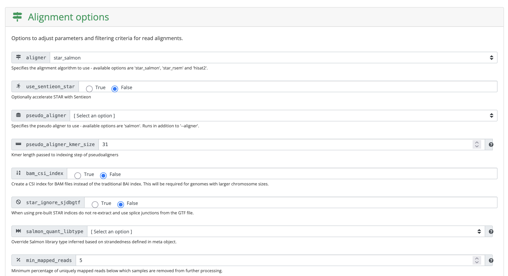

14. Under Optional outputs, the save_references box was checked, so the STAR index gets saved in the results directory for future reuse.

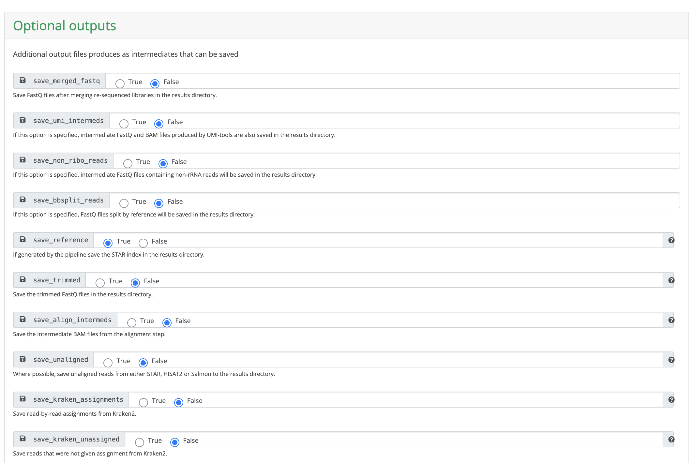

15. Scroll to the bottom and click Launch workflow.

16. Once submitted, you'll receive two emails: one when the pipeline starts and one when it finishes.

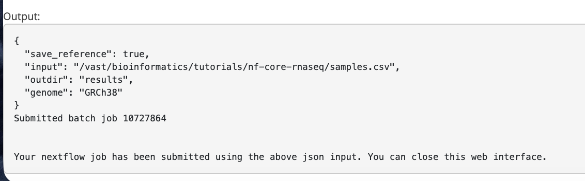

17. On successful completion, results will be in the results folder. If the run fails, enable Show Dotfiles and check .nextflow.log to troubleshoot.

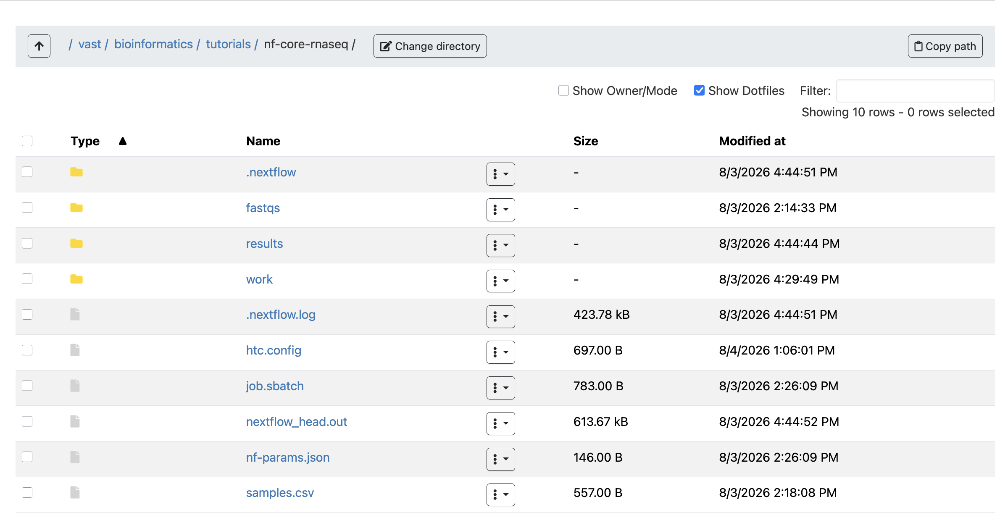

18. A good starting point for reviewing results is downloading multiqc_report.html and looking through it.

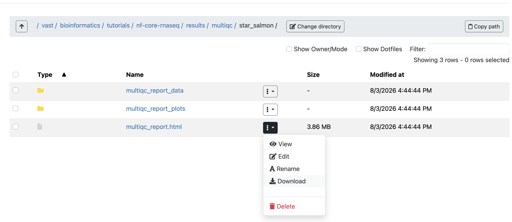

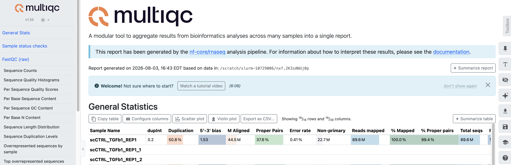

