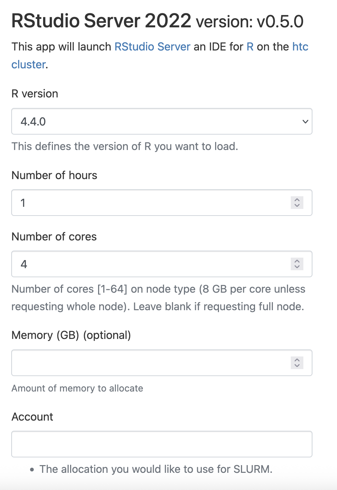
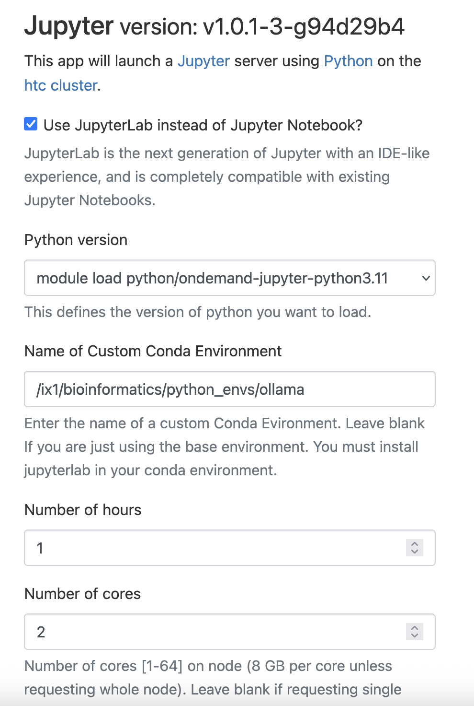
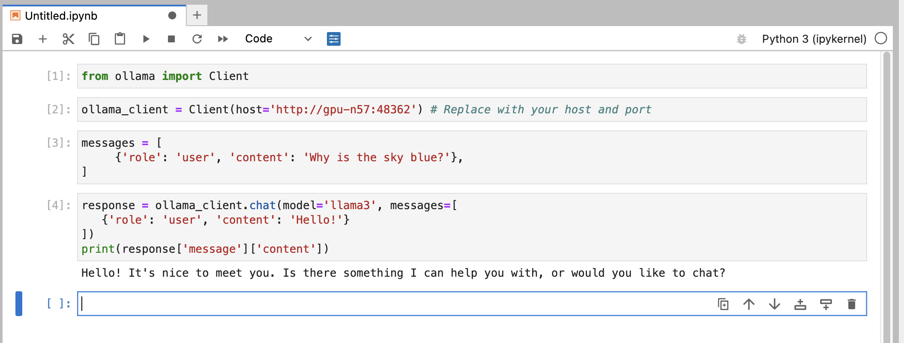

# Ollama

Ollama is a platform that enables users to interact with Large Language Models (LLMs) via an Application Programming Interface (API). It is a powerful tool for generating text, answering questions, and performing complex natural language processing tasks. 

## Running ollama server

Ollama version 0.11.10 has been installed as a singularity image /software/rhel9/manual/install/ollama/ollama-0.11.10.sif on our cluster.

We have provided two batch job templates to run Ollama server on CRCD's GPU cluster.
/software/rhel9/manual/install/ollama/ollama-0.11.10_a100_80gb.slurm will submit a job to the a100 partion, 80GB GPU memory node.
/software/rhel9/manual/install/ollama/ollama-0.11.10_l40s.slurm will submit a job to the l40s, 48GB GPU memory node.

Using sbatch to run the Ollama server :

```commandline
sbatch /software/rhel9/manual/install/ollama/ollama-0.11.10_a100_80gb.slurm
```

This will run the ollama service on a GPU node with 125GB of memory, 16 cores and an A100 80GB GPU memory which should be suitable for various models provided by Ollama.

```commandline
sbatch /software/rhel9/manual/install/ollama/ollama-0.11.10_l40s.slurm
```

This will run the ollama service on a GPU node with 125GB of memory, 16 cores and an L40S 48GB GPU memory.

After the job is submitted and running, you can inquire the host name and the port number it's listening on via the following command:

```commandline
[fangping@login3 ~]$ squeue -M gpu -u fangping
CLUSTER: gpu
             JOBID PARTITION     NAME     USER ST       TIME  NODES NODELIST(REASON)
           1230409      l40s ollama_0 fangping  R       0:03      1 gpu-n55
           
[fangping@login3 ~]$ squeue -M gpu --me --name=ollama_0.11.10_server_job --states=R -h -O NodeList,Comment
gpu-n55             45141
```
## Connecting to the ollama server from a client

You can connect to the ollama server running on a GPU node through R or Python client.

### Using RStudio server to connect to ollama server

logon ondemand.htc.crc.pitt.edu, click RStudio server 2022.



You can use rollama to connect to ollama server running on the gpu node.


Note that the ollama models will be downloaded to ~/.ollama. Your home directory has 75 GB quota.

```commandline
[fangping@login3 ~]$ cd ~/.ollama
[fangping@login3 .ollama]$ ls -l
total 53
-rw------- 1 fangping sam 387 Jun  9 10:15 id_ed25519
-rw-r--r-- 1 fangping sam  81 Jun  9 10:15 id_ed25519.pub
drwxr-xr-x 4 fangping sam  50 Jul  1 12:27 models
```
Delete the ollama server when you have finished testing.

```commandline
[fangping@login3 ~]$ scancel -M gpu 1230409
```

### Using Jupyter to connect to ollama server

I have installed ollama python package to a conda environment /ix1/bioinformatics/python_envs/ollama. In case that you are planning to install ollama into your own conda environment, these are the instructions. 

```commandline
[fangping@login3 ~]$ module load python/ondemand-jupyter-python3.11
[fangping@login3 ~]$ conda create --prefix=/ix1/bioinformatics/python_envs/ollama python=3.11
Retrieving notices: ...working... done
Collecting package metadata (current_repodata.json): done
Solving environment: done
...

[fangping@login3 ~]$ source activate /ix1/bioinformatics/python_envs/ollama
(/ix1/bioinformatics/python_envs/ollama) [fangping@login3 ~]$ pip install ollama
...
Successfully installed annotated-types-0.7.0 anyio-4.9.0 certifi-2025.6.15 h11-0.16.0 httpcore-1.0.9 httpx-0.28.1 idna-3.10 ollama-0.5.1 pydantic-2.11.7 pydantic-core-2.33.2 sniffio-1.3.1 typing-extensions-4.14.0 typing-inspection-0.4.1
(/ix1/bioinformatics/python_envs/ollama) [fangping@login3 ~]$ source deactivate
DeprecationWarning: 'source deactivate' is deprecated. Use 'conda deactivate'.
[fangping@login3 ~]$
```

Run ollama server and inquiry the hostname and port number.

```commandline
[fangping@login3 ~]$ sbatch /software/rhel9/manual/install/ollama/ollama-0.11.10_l40s.slurm
Submitted batch job 1230448 on cluster gpu
[fangping@login3 ~]$ squeue -M gpu -u fangping
CLUSTER: gpu
             JOBID PARTITION     NAME     USER ST       TIME  NODES NODELIST(REASON)
           1230448      l40s ollama_0 fangping  R       0:03      1 gpu-n57
[fangping@login3 ~]$ squeue -M gpu --me --name=ollama_0.11.10_server_job --states=R -h -O NodeList,Comment
gpu-n57             48362
```
logon ondemand.htc.crc.pitt.edu, click Jupyter.



You can use python ollama inside the conda environment to connect to ollama server running on the gpu node.




### Pulling new models

You have to to get an interactive session on SMP to run the image as follows:


```commandline
srun -M smp -p smp -n4 --mem=16G -t0-04:00:00 --pty bash
```

If you are already in an interactive session on SMP or HTC, then you can just run the following directly from the seesion but make sure you don't run this on the login node or it will be killed,
- when you get directed to the node:

```commandline
$ module load singularity/4.3.2
$ singularity shell /software/rhel9/manual/install/ollama/ollama-0.11.10.sif
singularity$ export OLLAMA_HOST=gpu-n58:44883
singularity$ ollama pull llama4:scout
```
Note to replace "gpu-n58:44883" to the gpu node name and port that your ollama server is running on.
