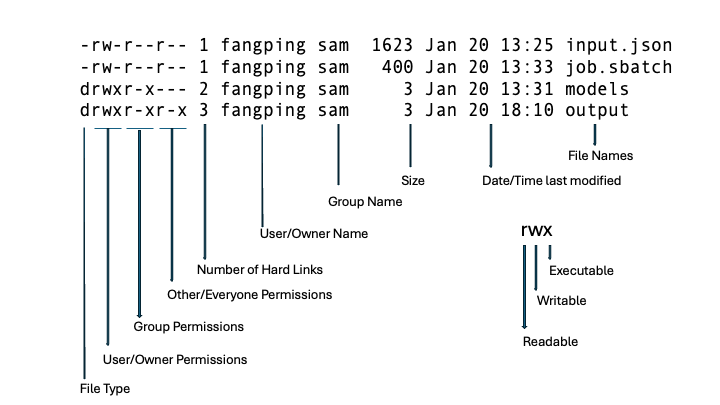

# File Permissions and Ownership

Linux uses POSIX-style permissions to control read, write, and execute access to files and directories.

## Viewing Permissions

Use `ls -l` to display file ownership and permissions:



- **Read (r)**: View file contents or list directory entries
- **Write (w)**: Modify a file or create/delete files in a directory
- **Execute (x)**: Run a file as a program, or access a directory (cd into it, list details with `ls -l`)

!!! note
    The execute permission on directories controls **access** - without it, users cannot `cd` into or traverse the directory, even if they have read permission.

## Changing Permissions

Use `chmod` to modify permissions. Only the file owner can change permissions.

```bash
# Give group read and execute access to a directory
chmod g+rx directory-name

# Give group read, write, and execute access to a file
chmod g+rwx filename
```

## Default Permissions: umask

The `umask` controls default permissions for newly created files and directories:

```bash
umask        # Display current setting (e.g., 0022)
umask 027    # Set new default (disallow world access)
```

Add `umask` to your `~/.bashrc` to make changes permanent.

### Common umask Values

| umask | Files | Directories | Use Case |
|-------|-------|-------------|----------|
| 002 | Owner+group: rw, others: r | Owner+group: rwx, others: rx | Open collaboration within group |
| 007 | Owner+group: rw | Owner+group: rwx | Group-private (no outside access) |
| 022 | Owner: rw, all others: r | Owner: rwx, all others: rx | **Default** |
| 027 | Owner: rw, group: r | Owner: rwx, group: rx | Restricted group read |
| 077 | Owner only: rw | Owner only: rwx | Fully private |

## Sharing Data with Group Members

Group project storage on `/ix1` uses 2770 permissions (sticky bit set, group rwx, others no access).

To share files within your group:

```bash
# Give group access to directories in the path
chmod g+rx /path/to/directory

# Give group access to specific files
chmod g+rx filename

# Give group write access
chmod g+rwx filename
```

## Sharing Data Across Groups

To share data with users outside your group, [submit a help ticket](https://services.pitt.edu/TDClient/33/Portal/Requests/TicketRequests/NewForm?ID=yXkHi62rHa8_&RequestorType=Service) requesting a shared folder. Provide:

- Pitt usernames of users who need access
- Required permissions (read, write, execute)

CRCD will create a shared folder under your `/ix` or `/ix1` location and configure Access Control Lists (ACLs) using `nfs4_setfacl` for fine-grained permission control.

!!! tip
    The `/ix` and `/ix1` storage locations are only accessible to allocation owners and their sponsored users by default. Shared folders must be explicitly requested.
