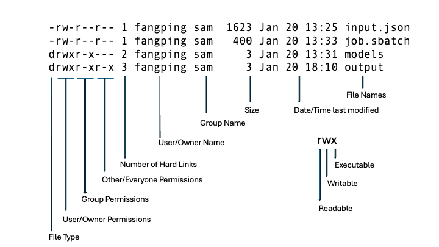

# File Permissions and Ownership

## Linux File Permissions and Ownership

Linux uses standard POSIX-style permissions to control who has the ability to read, write, or execute a file or a 
directory. The `ls -l` command will show the ownership and permissions of a file, a list of files, or all files in a 
directory.

The Execute (x) permission on directories is very different compared to files. Essentially, you can think of it as 
providing access to the directory. Having execute permission on a directory authorizes you to look at extended 
information on files in the directory (using `ls -l`, for instance) but also allows you to change your working 
directory (using cd) or pass through this directory on your way to a subdirectory underneath. If we change the above 
output folder permissions to 744 (drwxr--r--), then sam group members and others cannot cd to this folder.

The `chmod` command is used to change the permissions of a file or directory. Only the User that owns a file may change 
ownership or permissions.

## Default Permissions: umask

The default permissions set on a new file or directory is determined by the current setting of `umask`. This value is 
displayed with the umask command:

<code>
umask
0022
</code>

A value of 022 will allow group and others read access. The umask value is a mask that is applied to the permission mode 
of a file. That is, the numbers are subtracted to give the final permissions.

To change your default permissions, the umask command is also used: `umask 027` This value (027) of umask will cause a 
file to disallow world read access. This command can be added to your ~/.bashrc file to make the change permanent for 
all login and shell sessions.

Note that others can not access your group's `/ix/<primary group>` or `/ix1/<primary group>` folder. Others cannot 
access `/ihome/<primary group>`. You can use umask to share files with your group members.  
Here is a list of suggestions for umask values:

002 the owner and members of the group have read/write access for files and read/write/execute access for directories; 
everybody else has read-only access to files and read/execute access to directories.

007 the owner and members of the group have read/write access for files and read/write/execute access for directories.

022 everyone has read-only access to files; everyone has read/execute access to directories. This is the default.

027 files are created with read-only access for members of the group, but only the owner has write access; directories 
are created with read/execute for the owner and group.

077 files are created as read/write only for the owner; directories are created read/write/execute only for the owner

## Sharing data

To share files on the cluster with other users, we recommend using file access control lists (ACLs) to share access to 
their data with others. The Linux commands are `nfs4_getfacl` and `nfs4_setfacl`. We recommend that users submit a help 
ticket to request a shared folder in the group's ix or ix1 folder. We will create a shared folder 
`/ix or ix1/<group name>/shared/<group name>_<user name>`. Both the group members and the user `<user name>` from other 
group will be granted rwx permissions to this folder `/ix/<group name>/shared/<group name>_<user name>`. The group 
members can copy files to this folder to share with the other user `<user name>`. The other user can directly cd to the 
shared folder `/ix/<group name>/shared/<group name>_<user name>`. The other user can cd to `/ix/<group name>` or 
`/ix/<group name>/shared`. However, the user will receive "permission denied" error if the user runs ls or other 
directory or file handling operations.

## File permissions 

Group project storage locations on `/ix`, `/bgfs`, `/zfs1`, or `/zfs2` can be requested via ticket. The top level folder is 
owned by `root:groupname` with 2770 permission. The 2 sets the sticky bit, group members have read + write permission, 
and `other` users cannot access the folder.

Access to files by the group members is governed by Unix file permissions.
For detailed information on Unix file protections, see the `man` page for the `chmod` command.

To share files with your group, give the group **read and execute** access for each directory from your top-level 
directory down to the directory that contains the files you want to share.
`chmod g+rx {directory-name}`

Then give the group read and execute access to each file you want to share.
`chmod g+rx {filename}`

To give the group the ability to edit or change a file, add write access to the group:
`chmod g+rwx {filename}`

If you want to share file with other group members or users, submit a help ticket, and we can use 
Access Control Lists (ACLs) – a more fine-grained control than Unix file permissions allow. 
The command for bgfs is `setfacl`, and for ZFS is `nfs4_setfacl`, more detailed help text can be viewed in 
their man pages.

## Shared Folders

`/ix` storage locations are only accessible to allocation owners and the users they sponsor (their "user group").

If you are working with collaborators that also have CRC user accounts, but are not in your user group, a shared folder 
under your `/ix` location can be used to facilitate sharing data between your groups.

These should be requested by [submitting a ticket](https://services.pitt.edu/TDClient/33/Portal/Requests/TicketRequests/NewForm?ID=yXkHi62rHa8_&RequestorType=Service) 
and providing details about the users that need access.

This should include Pitt Usernames and specifics about the permissions they will require (read, write, execute, etc).
