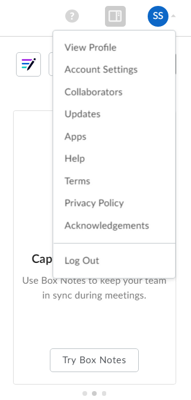
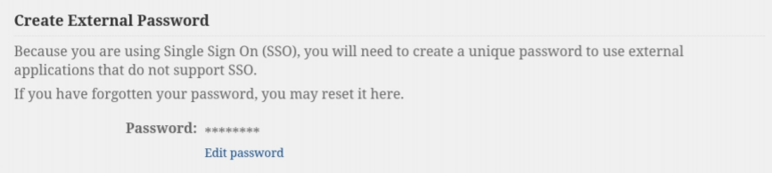

# Accessing Box from the Cluster
Users can transfer files to and from Box using lftp.

lftp can make both FTP and FTPS connections. Do not attempt to connect to 
FTP servers with lftp. If you get SSL/TLS errors from lftp this essentially
means "you cannot connect to that server or won't be allowed to connect
to the server from the cluster".

Please only use this tool when it is absolutely necessary. 
Two use cases are:
- Transferring files to share with people outside the University or vice versa
- Backing up old project data

## Getting Started
1. Navigate to [Pitt Box](https://pitt.app.box.com/) and log in.
2. Access Account Settings (top right corner)

3. Edit External Password using a strong password

4. Log into the cluster and use the following command:
```commandline
lftp -u $USER@pitt.edu ftps://ftp.box.com
```
5. Enter your password

## Using lftp
Some Notes:

* After you enter your password and type the first command it will take a second to make the connection
* Note $USER is your logon username. If you give the wrong username or password, no errors will be prompted. You will be logged on ftp.box.com as anonymous user.
* Access the help with help
* Supports standard unix commands for navigation (ls, cd) and modification (rm, mv)
* lcd is "local cd" to move around your directory tree instead of the remote one
* One can run any local command by prefixing with ! (!ls)
* To download or get files, just type get
* To upload or put files, just type put
* lftp doesn't support get *.txt, instead write glob get *.txt (get all files which end in ".txt")
* Exercise extreme caution when typing rm!
*mirror Mirror specified source directory to the target directory. By default the source is remote and the target is a local directory. When using  -R,  thesource directory is local and the target is remote.

## Known Limitations
* Individual file sizes can't be more than 15GB.