# Transferring Files with FileZilla

[FileZilla](https://filezilla-project.org/) is a free, cross-platform SFTP client with a
drag-and-drop interface for moving files between your computer and CRCD storage. It's a good
choice if you prefer a graphical tool over command-line `scp` or `rsync`. The screenshots below
are from macOS; the Windows and Linux clients work the same way.

!!! note "Connect to the VPN first"
    CRCD is reachable only from the University network. From off campus, connect to the
    [GlobalProtect VPN](../../getting-started/getting-started-step1-account.md) before connecting
    with FileZilla.

Download the **FileZilla Client** from the
[FileZilla download page](https://filezilla-project.org/download.php?show_all=1) and install it,
then work through the tabs below to connect and transfer files.

=== "1. Install & launch"

    The first time you open FileZilla on macOS, confirm that you want to open an app downloaded
    from the internet. macOS may also ask FileZilla for permission to read a local location —
    such as a network volume — so it can list files to transfer; click **Allow**.

    

    [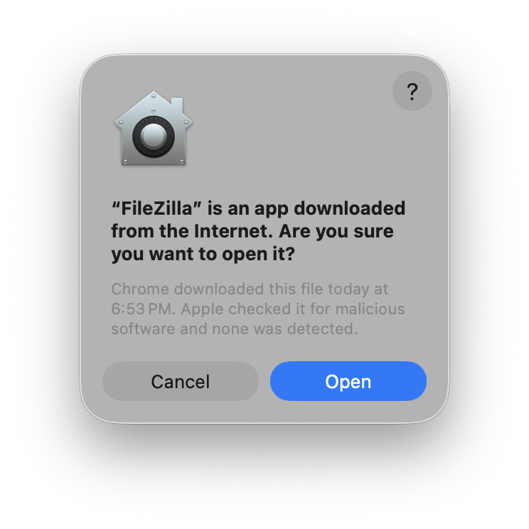](../../_assets/img/data-management/filezilla-1.png)

    [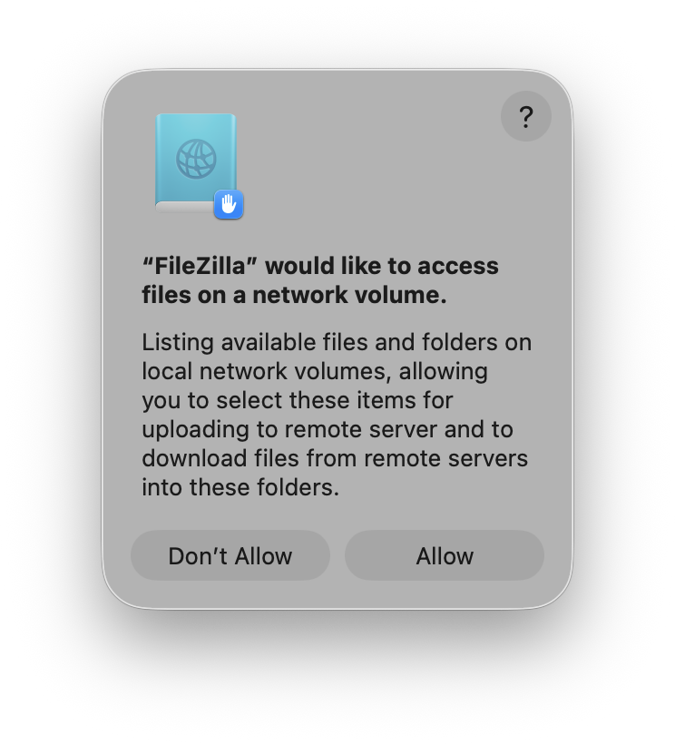](../../_assets/img/data-management/filezilla-2.png)

    

=== "2. Connect"

    Fill in the **Quickconnect** bar at the top of the window, then click **Quickconnect**:

    | Field    | Value |
    | -------- | ----- |
    | Host     | `sftp://h2p.crc.pitt.edu` for SMP, MPI, or GPU; `sftp://htc.crc.pitt.edu` for HTC. The `sftp://` prefix forces a secure connection. |
    | Username | Your Pitt username, all lowercase. |
    | Password | Your Pitt password. |
    | Port     | `22` |

    [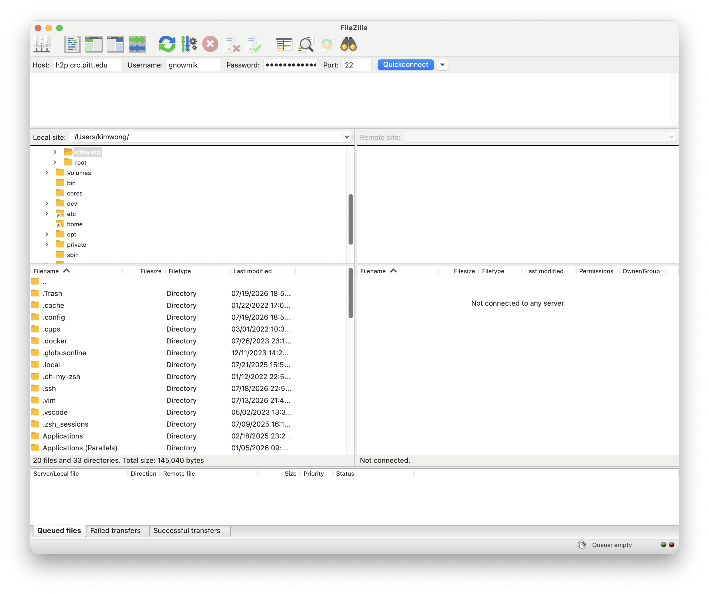](../../_assets/img/data-management/filezilla-3.png)

=== "3. Save password & trust host"

    FileZilla asks whether to remember passwords — on your own computer, **Save passwords** is
    convenient; on a shared machine, choose **Do not save passwords** or protect them with a
    master password. Then, on first connection, FileZilla shows the server's host key: check
    **Always trust this host, add this key to the cache** and click **OK**.

    

    [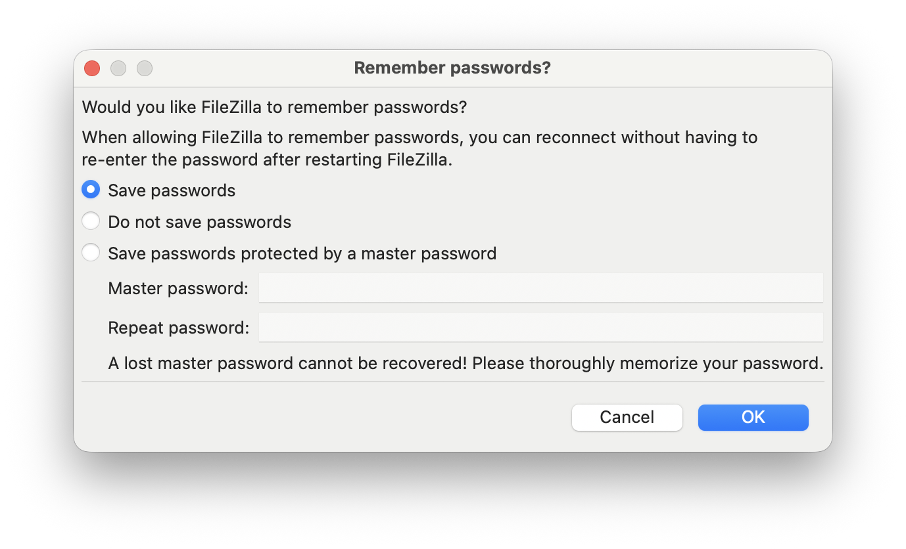](../../_assets/img/data-management/filezilla-4.png)

    [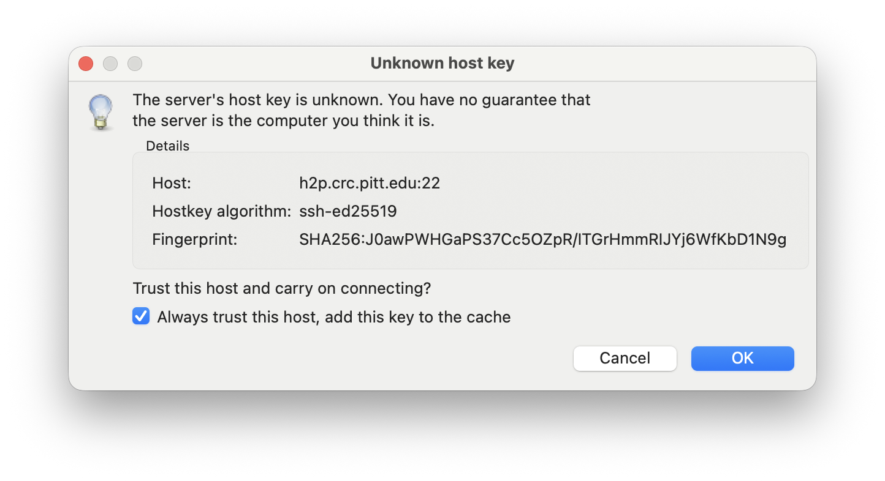](../../_assets/img/data-management/filezilla-5.png)

    

=== "4. Connected"

    Once connected, the **Remote site** panel on the right shows your CRCD home directory
    (`/ihome/<group>/<username>`); the **Local site** panel on the left is your own computer.

    [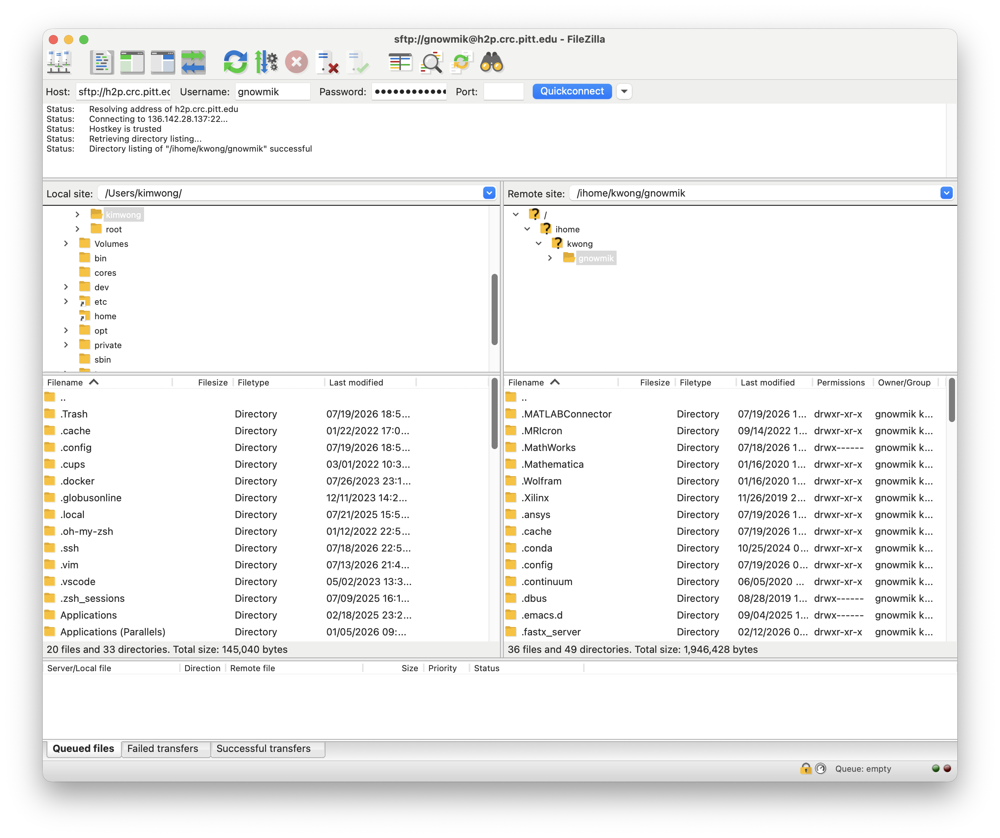](../../_assets/img/data-management/filezilla-6.png)

=== "5. Allow local folders"

    As you browse your computer to pick files, macOS asks FileZilla for permission to each
    personal folder (OneDrive, Desktop, Documents, Downloads). Click **Allow** on each so
    FileZilla can upload from and download to them.

    

    [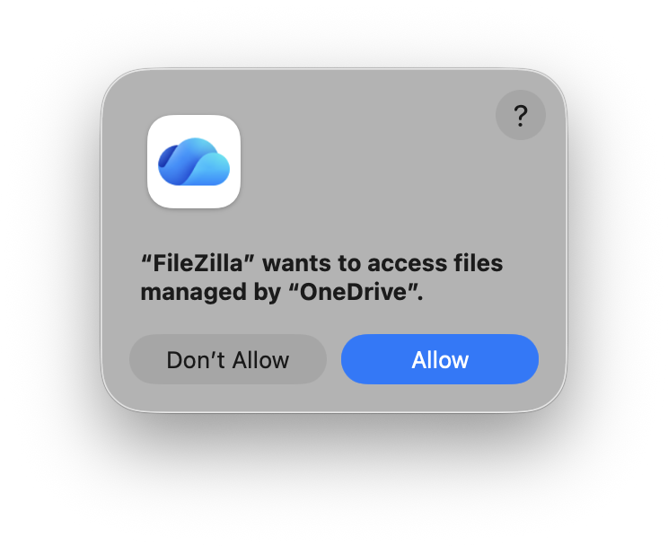](../../_assets/img/data-management/filezilla-7a.png)

    [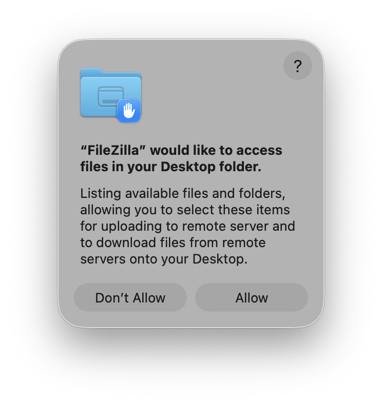](../../_assets/img/data-management/filezilla-7b.png)

    [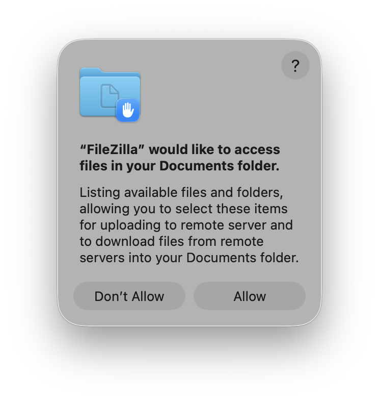](../../_assets/img/data-management/filezilla-7c.png)

    

    

=== "6. Transfer files"

    With both panels showing the folders you want, move files by dragging them between **Local
    site** and **Remote site**, or by double-clicking a file to send it to the other side.
    Progress appears in the transfer queue at the bottom, and finished transfers move to the
    **Successful transfers** tab.

    [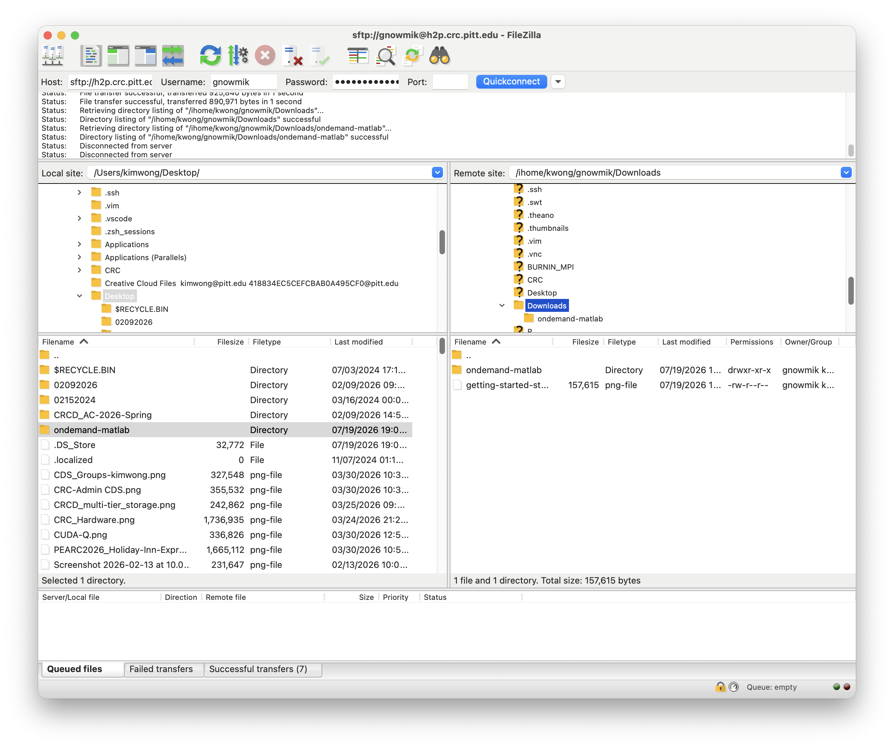](../../_assets/img/data-management/filezilla-8.png)

=== "7. Reconnect later"

    FileZilla remembers recent connections. Next time, click the arrow next to **Quickconnect**
    and pick your saved host from the history instead of retyping it.

    [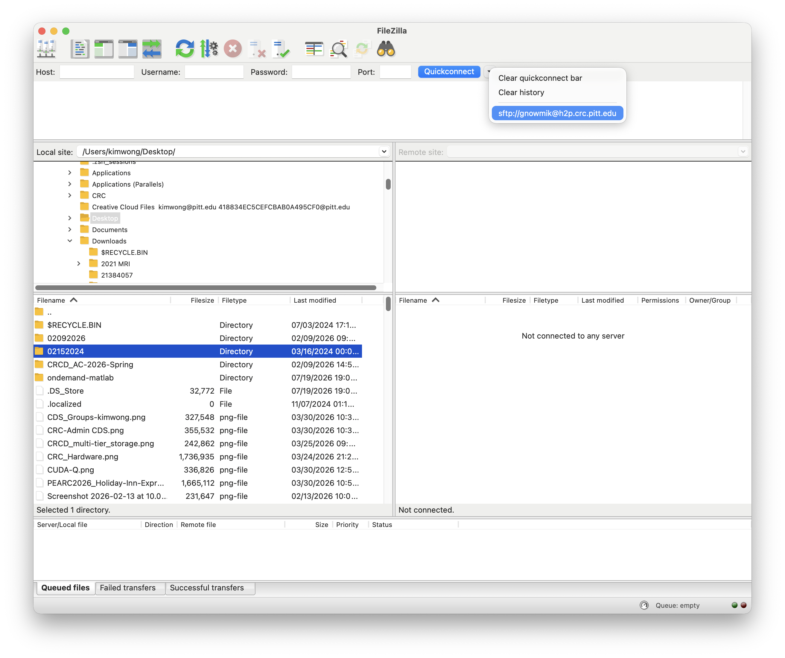](../../_assets/img/data-management/filezilla-9.png)

!!! tip "Where to put your data"
    Your home directory has a 75 GB quota. For large datasets, transfer into your group's project
    storage (`/ix`, `/ix1`, `/vast`) instead — see
    [Storage Tiers](../../hardware_profiles/storage.md) and [File Systems](../file-systems.md).
