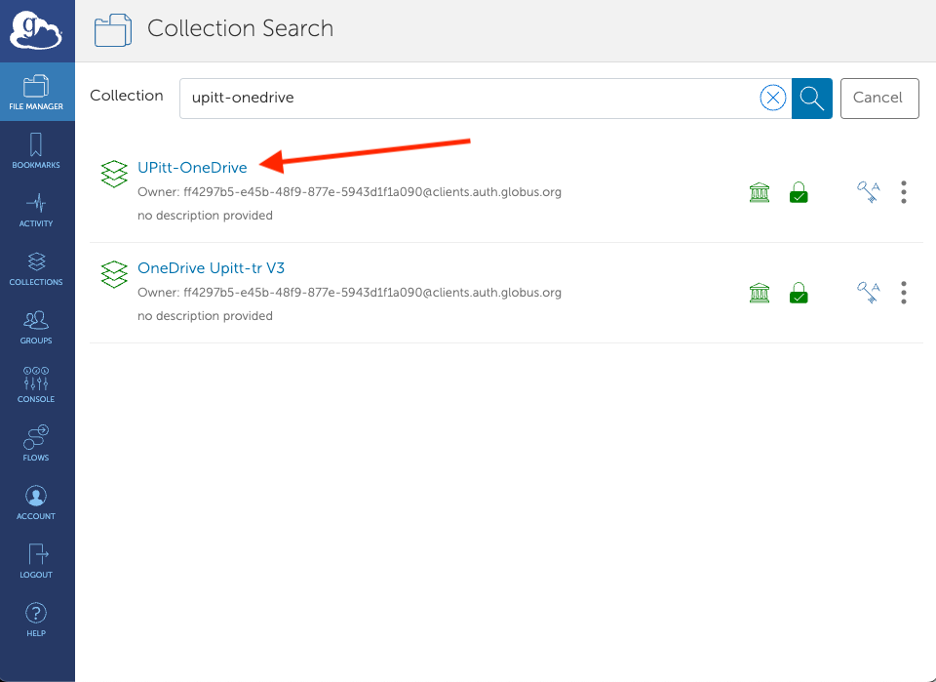
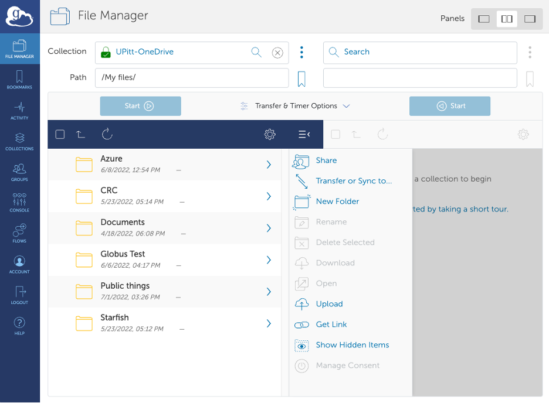
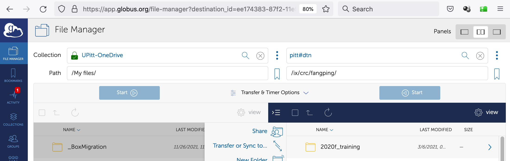
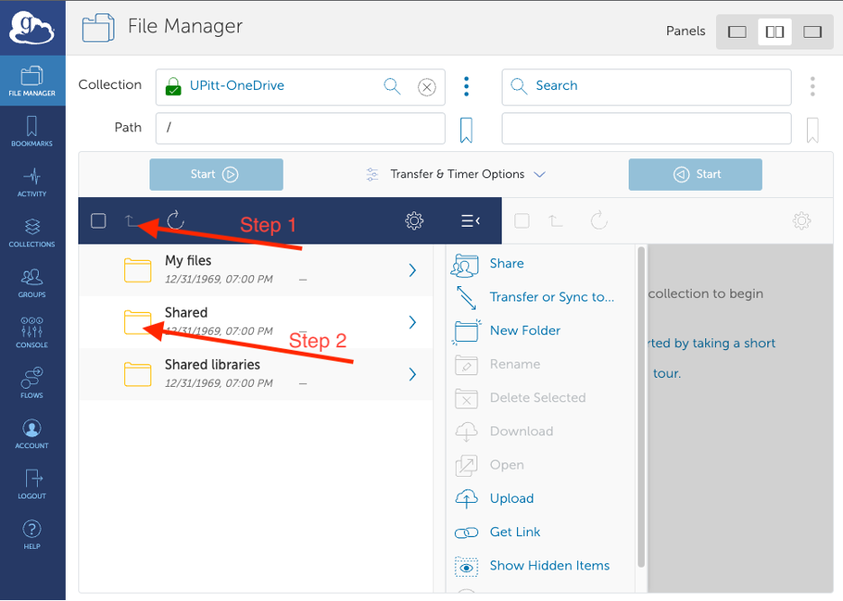
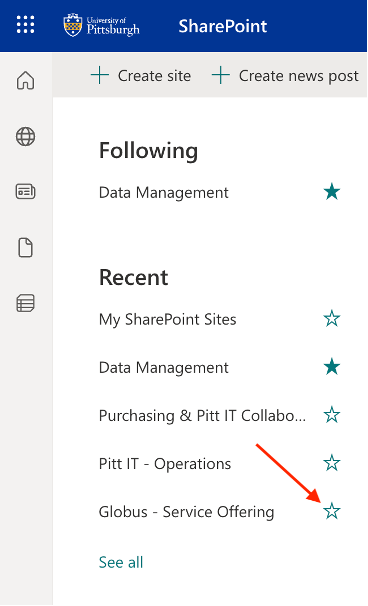
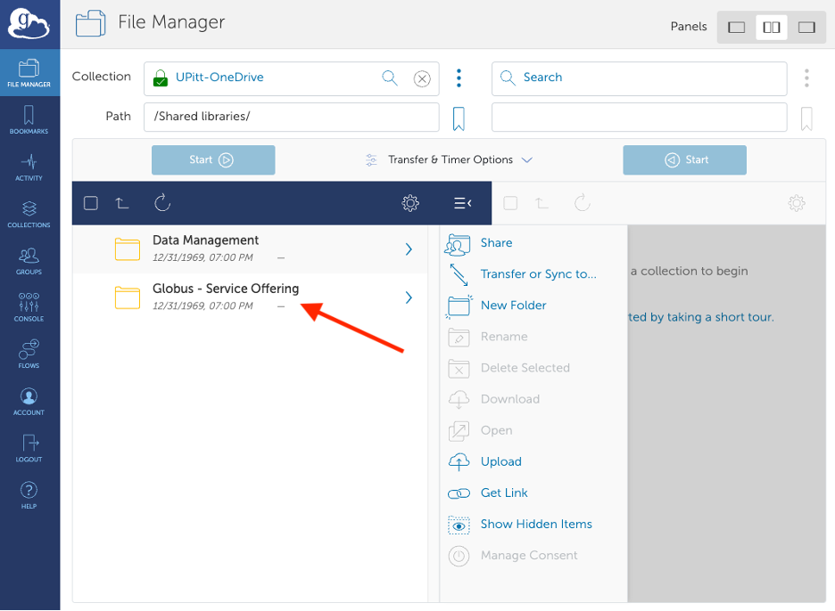

# Globus for Microsoft OneDrive

[Globus](globus.md) can access your files on Microsoft OneDrive and SharePoint,
which makes it a convenient way to move data between CRCD storage and OneDrive.

## Accessing OneDrive in Globus

Connect from your computer using
[Globus Connect Personal](https://www.globus.org/globus-connect-personal), or
sign in to the [Globus File Manager](https://app.globus.org/) with your Pitt
credentials. Search for the collection named **"UPitt-OneDrive"** and select it:

Complete any access-verification prompts, after which you'll see your OneDrive
files and be able to copy to or from them like any other Globus collection. Your
OneDrive space appears under the path **"My files"**:

To transfer between CRCD storage and OneDrive, search for the **`pitt#dtn`**
collection on the other side, sign in with your Pitt credentials, and navigate to
your `/ix`, `/ix1`, `/vast`, or `/ihome` folder.

## Accessing OneDrive shared folders

If someone has shared a OneDrive folder with you, find it by clicking **up one
folder** and looking in your **"Shared"** folder:

## Accessing SharePoint sites

SharePoint sites can be browsed in Globus, but you must **follow** a site first.
Log in to the [Pitt IT SharePoint service](https://pitt.sharepoint.com/_layouts/15/sharepoint.aspx)
with your Pitt credentials, navigate to the site, and click the **star** icon to
follow it:

Back in Globus, click **up one folder** until you reach **"Shared libraries"**;
the followed site now appears there:

## OneDrive and SharePoint limitations

OneDrive and SharePoint restrict what files can be stored, which matters when
uploading from Linux systems such as the CRCD `pitt#dtn` endpoint:

1. **No empty (zero-byte) files** — transferring one fails with a "storage quota
   exceeded / does not support creation of empty files" error.
2. **No symbolic links** — uploading a symlink instead uploads a copy of the file
   it points to, so the link becomes a regular duplicate file.
3. **No POSIX permissions or ACLs** — files downloaded back from OneDrive lose any
   custom permissions or ACLs, so you'll need to re-apply them (e.g. with `chmod`)
   afterward.

To preserve these, pack the files into a `tar` or `zip` archive before
transferring to OneDrive.

## Related

-   :material-transit-connection-variant:{ .lg .middle } __Globus basics__

    ---

    Endpoints, transfers, and sharing folders with collaborators.

    [:octicons-arrow-right-24: Globus](globus.md)

-   :material-microsoft-onedrive:{ .lg .middle } __OneDrive without Globus__

    ---

    Using rclone and the OneDrive client on the cluster.

    [:octicons-arrow-right-24: Microsoft OneDrive](microsoft-onedrive.md)

