# Transferring Files Between CRCD and OneDrive

[Globus](https://www.globus.org/) can access your files on Microsoft **OneDrive** and
**SharePoint**, which makes it a convenient way to move data between CRCD storage and OneDrive
without downloading it to your computer first. Pitt's OneDrive is available to Globus as the
**UPitt-OneDrive** collection (hosted on the CRCD Data Transfer Node, **DTN - CRC PITT**), so you
can transfer to and from `pitt#dtn` — your `/ihome`, `/ix`, `/ix1`, and `/vast` paths — using the
same File Manager you use for any other Globus transfer. You can also reach OneDrive from your
own computer with [Globus Connect Personal](https://www.globus.org/globus-connect-personal).

If you're new to Globus, read [Transferring Files with Globus](globus.md) first; this page
assumes you're comfortable logging in and using the two-pane File Manager, and focuses on the
parts that are specific to OneDrive.

!!! tip "No VPN required"
    Like other Globus transfers, OneDrive transfers run between managed Globus collections, so
    you do **not** need the PittNet VPN (GlobalProtect) to move data.

## Log in to Globus

Go to [globus.org](https://www.globus.org/), click **Log In**, choose **University of
Pittsburgh** under *Use your organizational login*, and click **Continue**.

[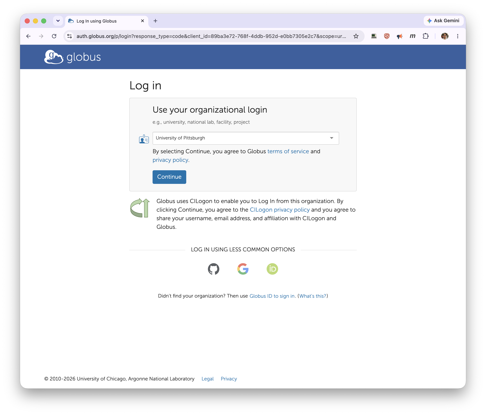](../../_assets/img/data-management/globus-onedrive-1.png)

You're redirected to **Pitt Passport**. Sign in with your Pitt username (all lowercase) and
password, then approve the **Duo** push.

[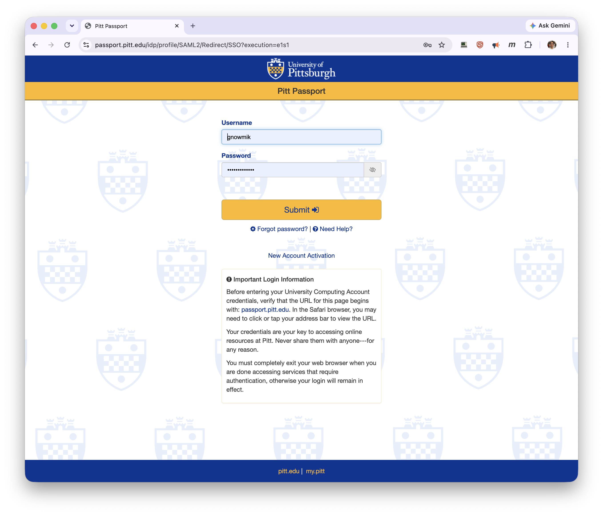](../../_assets/img/data-management/globus-onedrive-2.png)

## Find the UPitt-OneDrive collection

In the **File Manager**, click a **Collection** search box and type `UPitt-OneDrive`. Several
similarly named collections appear — choose **UPitt-OneDrive**, the *Subscribed Mapped
Collection (GCS)* on **DTN - CRC PITT**. Avoid `Test-UPitt-OneDrive` and the CompBio collection
on PittIT Globus unless you've been told otherwise.

[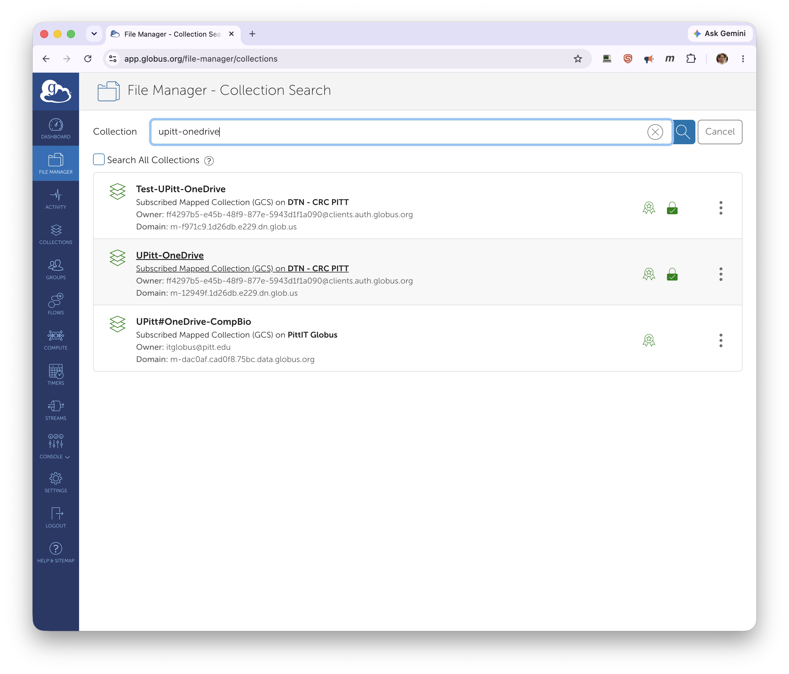](../../_assets/img/data-management/globus-onedrive-3.png)

## Set up your OneDrive credential

The **first time** you open the OneDrive collection, Globus needs a one-time credential setup so
it can act on your OneDrive on your behalf. You won't repeat these steps on later visits.

Globus tells you the credential requires initial setup and offers to send you to the credentials
page. Click **Continue**.

[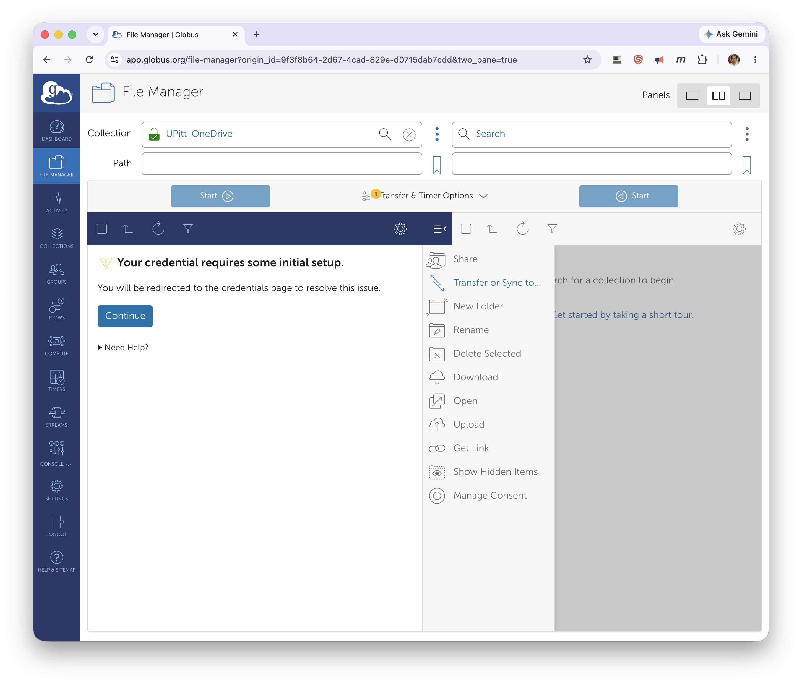](../../_assets/img/data-management/globus-onedrive-4.png)

Approve the consent that lets the Globus Web App **manage collections on DTN - CRC PITT** by
clicking **Allow**.

[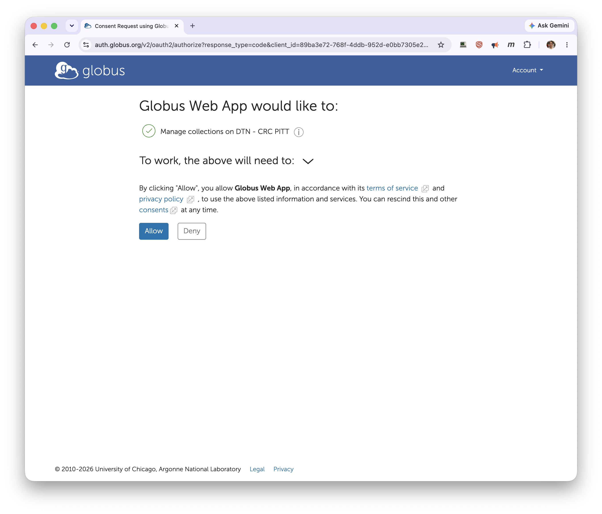](../../_assets/img/data-management/globus-onedrive-5.png)

On the **Provision Credential** dialog, confirm your **OneDrive Account** — usually your Pitt
address in the form `<your-pitt-username>@pitt.edu` — check that the **Globus Identity** shown is
your own Pitt identity, and click **Continue**.

[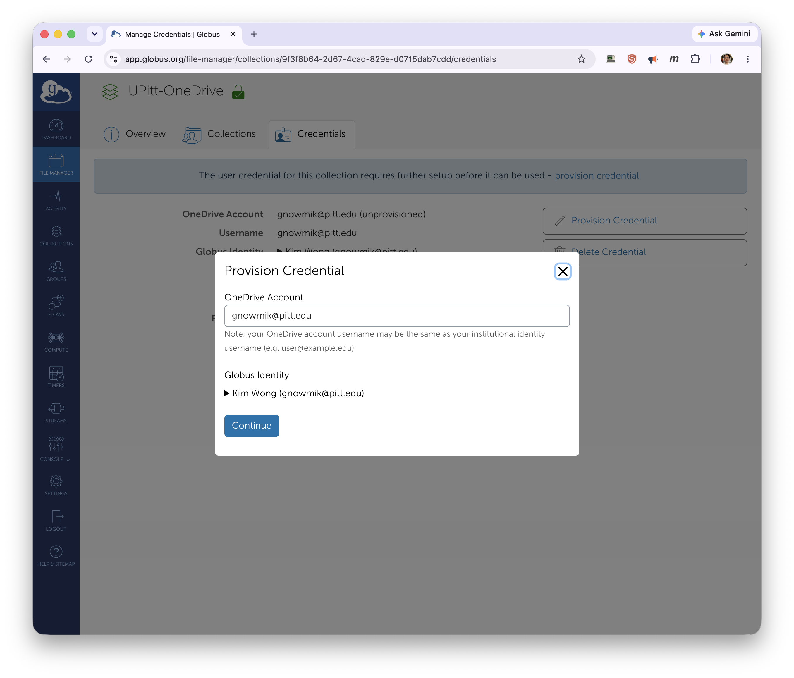](../../_assets/img/data-management/globus-onedrive-6.png)

!!! note "About the UPitt-OneDrive collection"
    The collection's **Overview** shows it's a mapped collection on **DTN - CRC PITT** with
    **Force Encryption** turned on and a **University of Pittsburgh (BAA)** subscription. You can
    reach this page from the collection's search result if you ever need to check its endpoint,
    domain, or settings.

[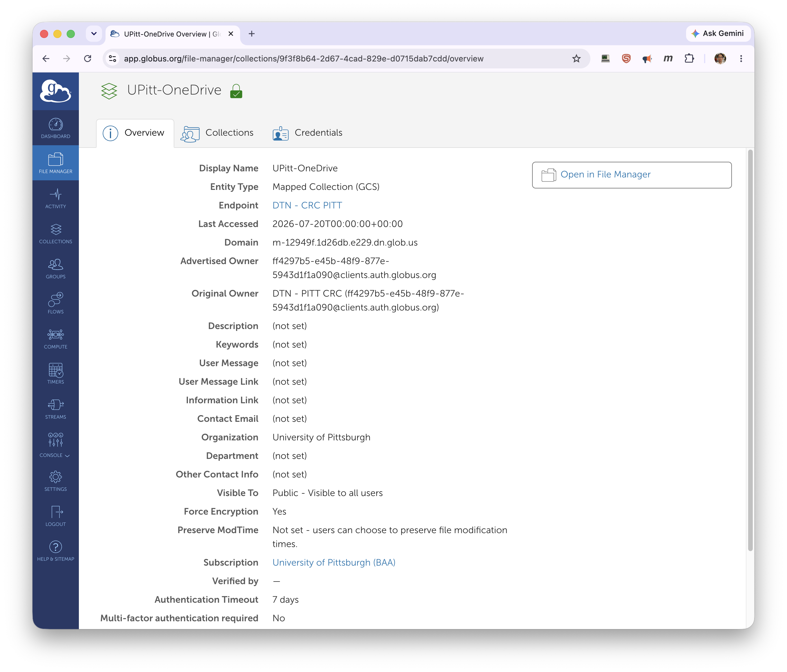](../../_assets/img/data-management/globus-onedrive-7.png)

## Browse your OneDrive files

Once the credential is provisioned, the panel lists your OneDrive contents. Your personal
OneDrive space is under the **My files** path — set the **Path** to `/My files/` to work there.

## Add the CRCD collection

In the other panel, open the **Collection** search and pick **pitt#dtn** from the **Recent** tab
(or type `pitt#dtn` to search for it). Set that panel's **Path** to your CRCD location, such as
`/ix/<group>/<username>` or a folder under `/ihome`, `/ix1`, or `/vast`.

[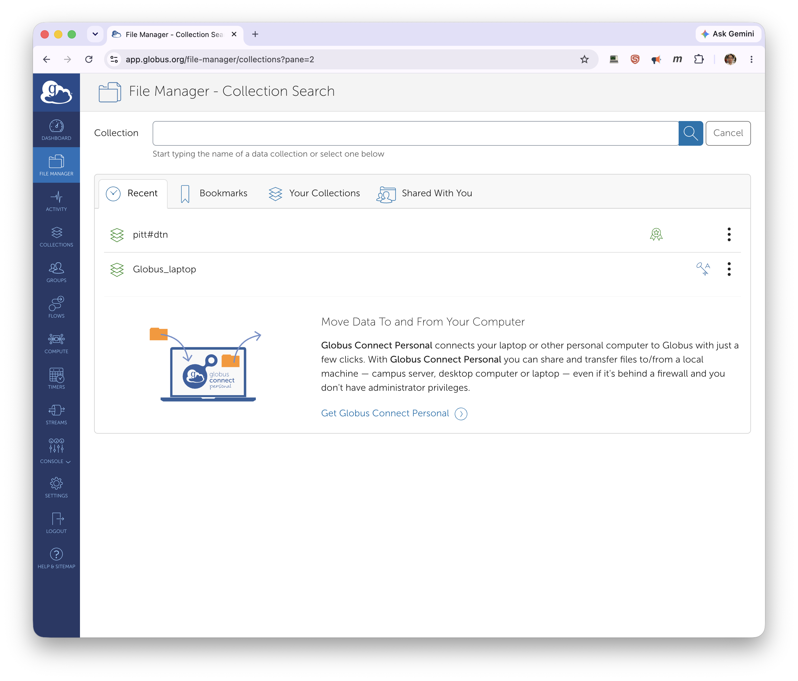](../../_assets/img/data-management/globus-onedrive-9.png)

## Transfer files

With OneDrive in one panel and `pitt#dtn` in the other, select the files or folders to move and
click **Start** on the side you're transferring *from* — the arrow on the **Start** button shows
the direction. Transfers work both ways: OneDrive → CRCD or CRCD → OneDrive.

[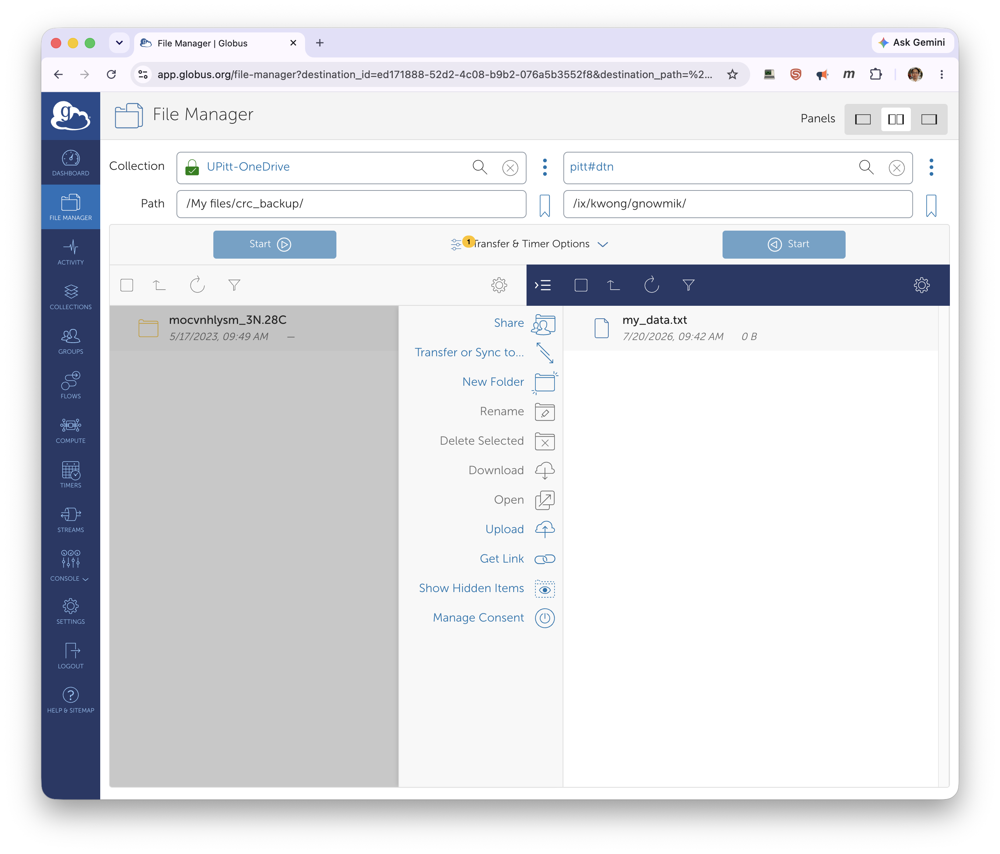](../../_assets/img/data-management/globus-onedrive-10.png)

Globus queues the transfer and shows **Transfer request submitted successfully**. Click **View
details** to watch progress under **Activity**; Globus also emails you when the transfer
finishes.

[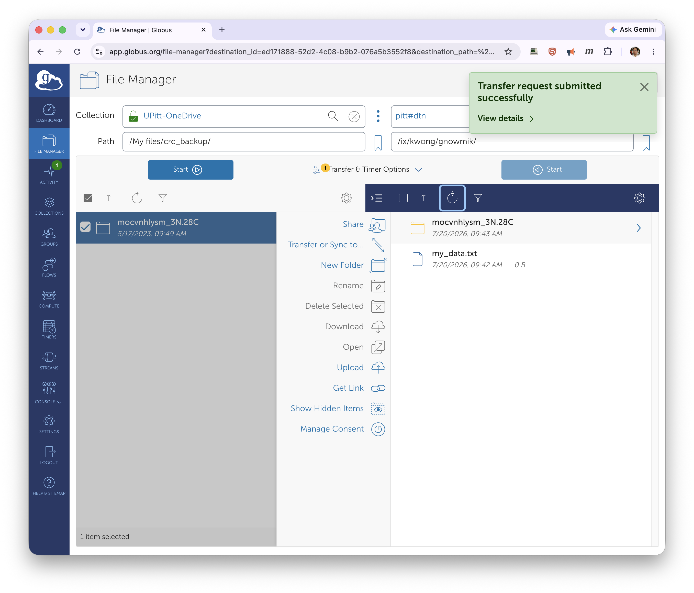](../../_assets/img/data-management/globus-onedrive-11.png)

## OneDrive folders: My files, Shared, and Shared libraries

At the top level of the OneDrive collection (go up from **My files** to the collection root)
you'll see three areas: **My files** (your personal OneDrive), **Shared** (items shared with
you), and **Shared libraries** (SharePoint and Teams document libraries you follow).

### Folders shared with you

If someone has shared a OneDrive folder with you, go up to the collection root and open the
**Shared** folder; the shared items appear inside, and you can transfer them like anything in
*My files*.

[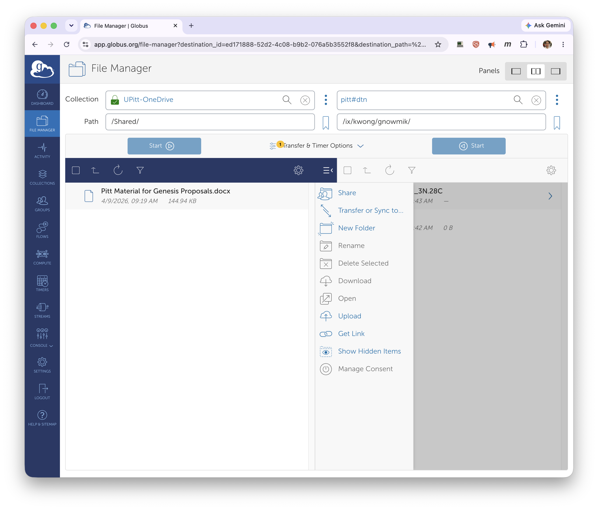](../../_assets/img/data-management/globus-onedrive-13.png)

!!! note "Link-shared items aren't visible"
    Items shared with you only through a OneDrive **link** (for example, a link you received by
    email) are not accessible through Globus. They must be shared to your account so they show up
    under **Shared**.

### SharePoint sites

SharePoint sites can be browsed in Globus, but a site only appears after you **follow** it. Log
in to the [Pitt IT SharePoint service](https://pitt.sharepoint.com/) with your Pitt credentials,
open the site, and click the **star** icon to follow it. Back in Globus, go up to the collection
root and open **Shared libraries** — the followed site now appears there.

## OneDrive and SharePoint limitations

OneDrive and SharePoint restrict what files can be stored, which matters when uploading from
Linux systems such as the CRCD `pitt#dtn` endpoint:

1. **No empty (zero-byte) files.** Transferring a zero-byte file fails with a *"storage quota
   exceeded"* error whose message is *"OneDrive does not support creation of empty files."*
2. **No symbolic links.** Uploading a symlink instead uploads a copy of the file it points to,
   so the link becomes a regular duplicate file rather than a link.
3. **No POSIX permissions or ACLs.** Files downloaded back from OneDrive lose any custom
   permissions or ACLs, so you'll need to re-apply them (e.g. with `chmod`) afterward.

To preserve empty files, links, and permissions, pack the files into a `tar` or `zip` archive
before transferring to OneDrive.

!!! tip "Where to put your data"
    For large datasets, transfer into your group's project storage (`/ix`, `/ix1`, `/vast`)
    rather than your 75 GB home directory — see [Storage Tiers](../../hardware_profiles/storage.md)
    and [File Systems](../file-systems.md).

## Related

- :material-transit-connection-variant:{ .lg .middle } **Globus basics**

    ---

    Endpoints, transfers, and sharing folders with collaborators.

    [:octicons-arrow-right-24: Globus](globus.md)

- :material-microsoft-onedrive:{ .lg .middle } **OneDrive without Globus**

    ---

    Using rclone and the OneDrive client on the cluster.

    [:octicons-arrow-right-24: Microsoft OneDrive](microsoft-onedrive.md)

