# Globus

## Transfer files using Globus

<ul>
	<li>Sign in using Pitt Credentials Globus <a href="https://app.globus.org">Sign In</a></li>
	<li>Connect from your computer: <a href="https://www.globus.org/globus-connect-personal">Globus Personal</a>
	<ul>
		<li>On Linux, you may need to make minor changes to the python scripts
		<ul>
			<li>Use python 2: #!/usr/bin/python → #!/usr/bin/python2</li>
		</ul>
		</li>
	</ul>
	</li>
</ul>

If you forget your endpoint name:

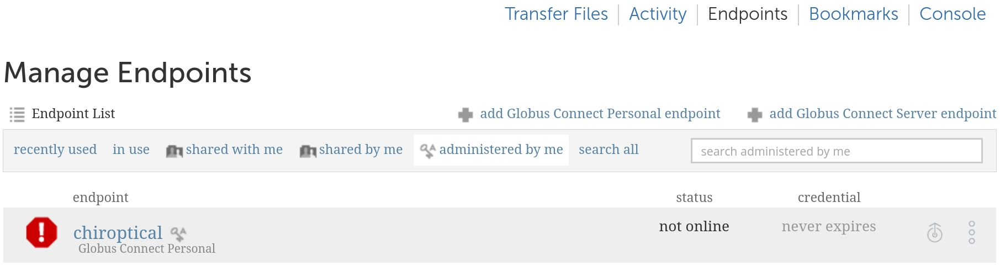

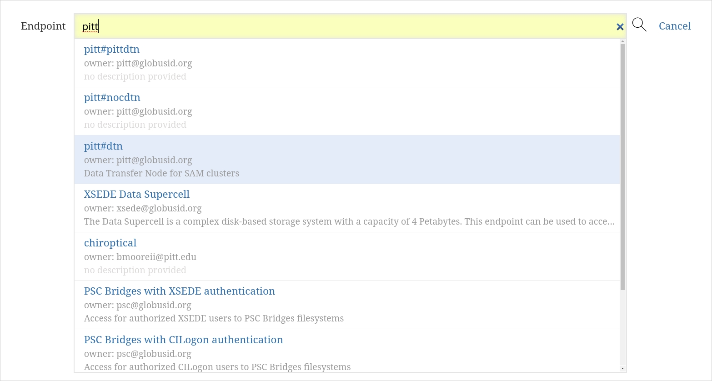

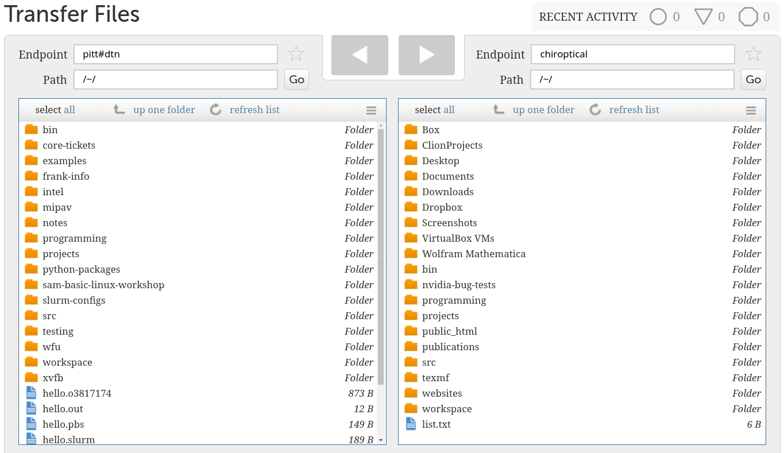

## Globus File Sharing

Globus sharing provides a mechanism for CRC PIs and users to store their data and easily share with collaborators, 
without the burden of local account management. CRC leverages our BeeGFS and ZFS storage infrastructure to make Globus 
Transfer and Sharing services available for researchers to store large amounts of research data, move data in and out 
of the system, and to make subsets of the data available to their collaborators.

CRC thanks Central IT for subscribing to Globus and paying the annual subscription fee.

**Please note: Sensitive material cannot be shared on Globus. To find out if material may be considered 
sensitive, contact your department or the Office of Trade Compliance.**

To use Globus sharing:

The PI must have an active allocation on CRC with data available on CRC’s BeeGFS or ZFS file system.

**PI must submit a help ticket to request Globus sharing and submit a help ticket 
to request access for users from her/his group**

PI is responsible for the integrity of their directories on the BeeGFS or ZFS file system, especially if the PI or 
other users share directories with write permission to offsite collaborators.

Once approved, the PI and other users can share their folders on BeeGFS or ZFS with their Pitt or outside collaborators.

### Sharing data with other users

Point your web browser to [https://www.globus.org/](https://www.globus.org/)
Click “Log In” at the top right corner
Choose “University of Pittsburgh”, click Continue. This should bring you to Pitt Passport: logon using your Pitt 
credentials.

You should see this screen:

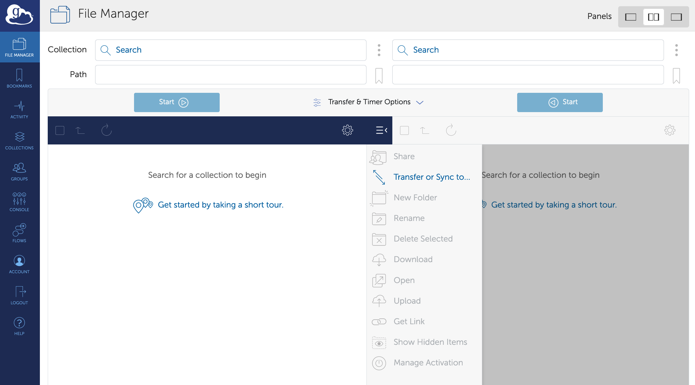

Click Collections, search "pitt#dtn”
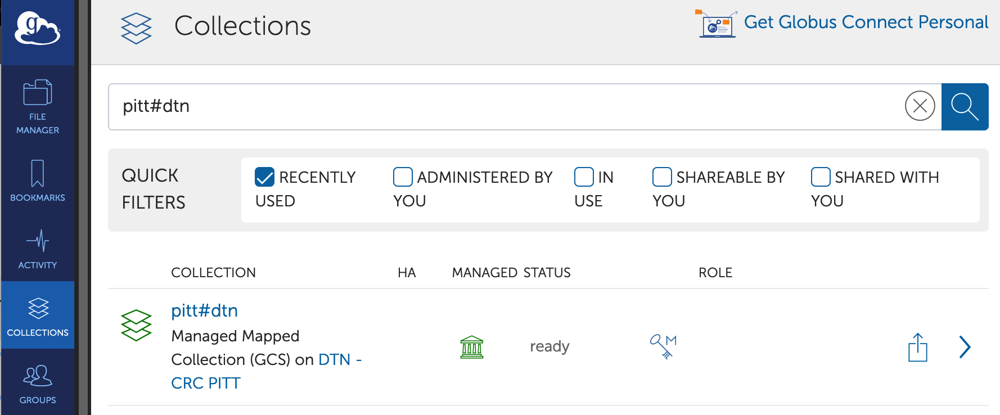
Select pitt#dtn, click Open in File Manager

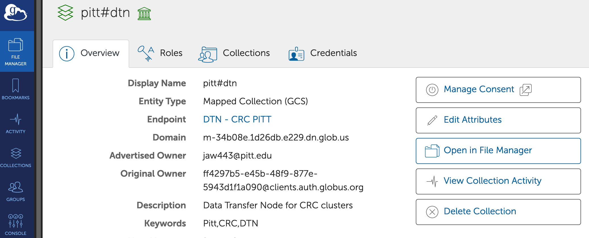
logon using your Pitt credentials. Go to the folder you wish to share.

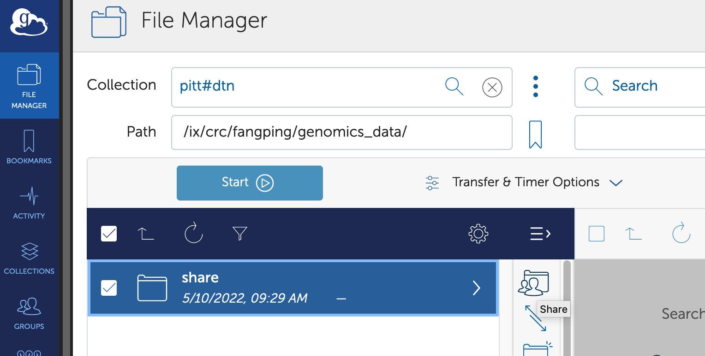

Highlight the folder that you would like to share and Click Share in the right command pane.

Note: Sharing is available for folders. Individual files can only be shared by sharing the folder that contains them.

Then click Add a Guest Collection.

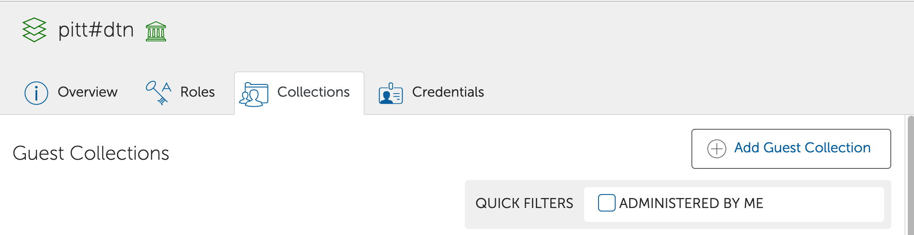
Provide a clear, meaningful Display Name for the guest collection, and click Create Collection.

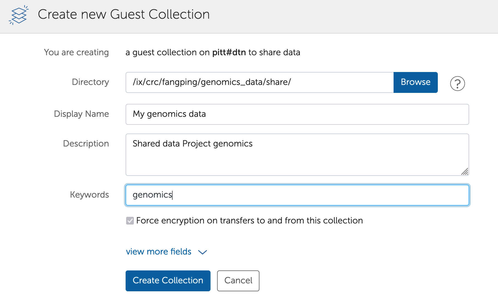
When your collection is created, you’ll be taken to the Permissions tab, where you can set permissions. Click Add 
Permissions - Share With

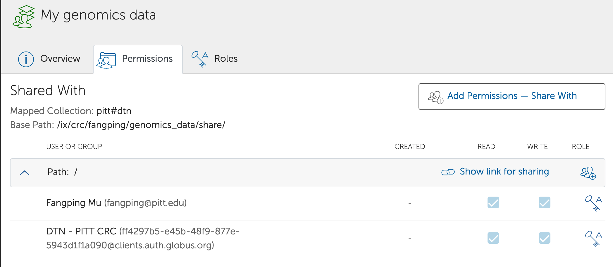
Add the Username or Email.

Note: You must be very careful if you choose write permission. This means that you are giving a user permission to 
delete existing files.

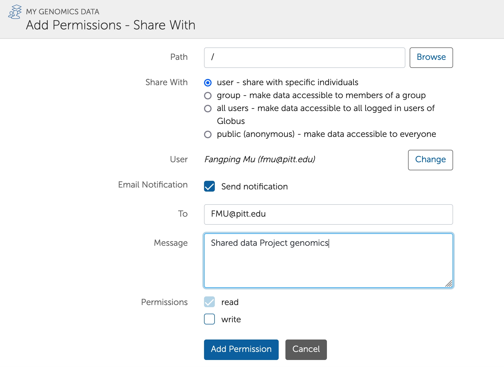
Click “Add Permission”.

Important Notes about Sharing:

You can only share directories, not individual files.

Globus allows directory trees to be shared as either read or read/write. This means that any subdirectories within that 
tree also have the same permissions.

When you create the shared endpoint and give access to one or more Globus users, you can select whether each person 
has read or read/write access. If they have write access, they are also able to delete files within that directory 
tree, so you should be careful about providing write access. We recommend that you only provide write access to an 
empty directory shared with your collaborators so that your collaborators can transfer files to the directory. We also 
recommend that you delete the endpoint share when your collaborator has completed transferring the data.

Collections management

To see all collections you have shared, click Collections | Administered by You. Choose the Collection, click Sharing: 
you should then see the shared endpoint and the people you have shared it with.

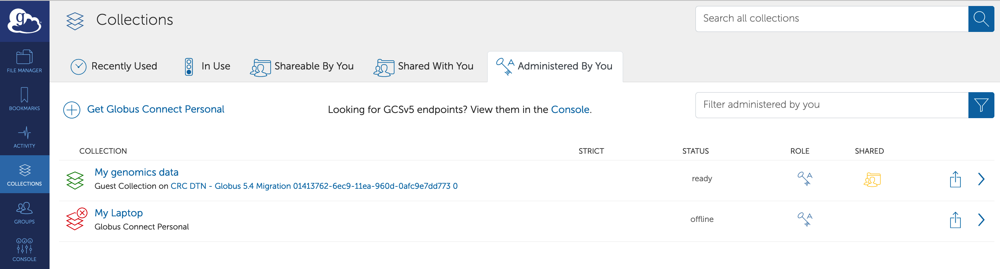

At any time, you can terminate access to the directory by clicking the 'X' next to the invitee in the screen above.

It is highly recommended that you delete the collection share when your collaborator has completed downloading the data. 
You can do so by going to 'Collections' in the left bar, then 'Administered by You': select the collection, and click 
on 'Delete endpoint'.

What to tell your collaborators<

If you set up a shared endpoint and want your collaborator to download the data, you need to tell them.

The collaborator needs to get a Globus account. This account is free. They may already have Globus access via their 
institution.

If the collaborator is downloading the data to his/her personal workstation, they need to install the Globus Connect
client. Globus connect clients are available for Mac, Windows or Linux systems and are free. If your collaborator has a 
CRC account and bgfs or zfs directory, they can use pitt#dtn endpoint to transfer data to their bgfs or zfs directory.

If you clicked on the 'notify users via email' button when you added access for this user, they should have received 
the following message:

    Globus user Fangping Mu (fangping@globusid.org) shared the folder "/" on the endpoint "My genomics data" 
    (endpoint id: 4b612536-d362-4151-b5e2-50e72a1af462) with Fangping Mu (fmu@pitt.edu).

    Additional Message:

    shared data genomics project

    Use this URL to access the share:

    https://app.globus.org/file-manager?&amp;origin_id=4b612536-d362-4151-b5e2-50e72a1af462&amp;origin_path=/&amp;add_identity=95f5a10d-82a4-4975-b326-537b1bd1e27d

    The Globus Team
    support@globus.org

You can, of course, also email your collaborators yourself that you've shared a folder with them. The collaborator 
should click on the link and log in with their institutional or Globus login username and password. They should then be 
able to see the files you shared with them.

When the user fmu@pitt.edu clicks this URL and logon globus, the contents of this folder is ready to be transferred.

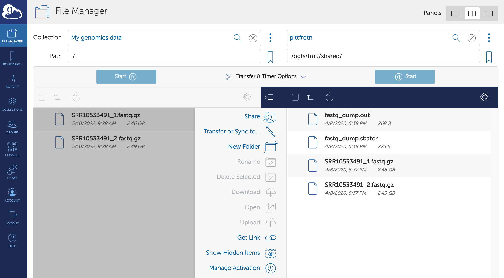

They should click on the files they want to transfer, then 'Transfer or Sync to', enter their own endpoint name and 
desired path, and click the 'Start' button near the bottom to start the transfer.

