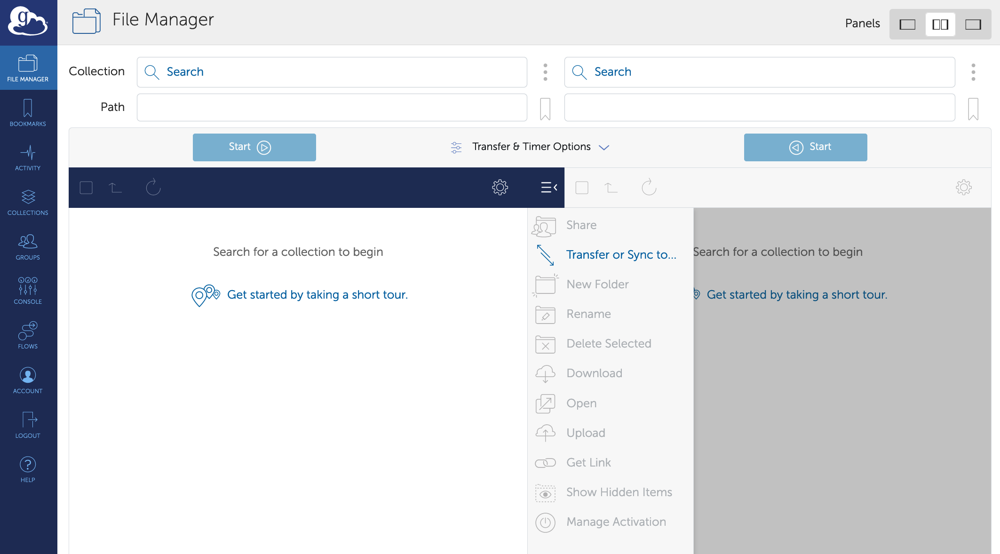
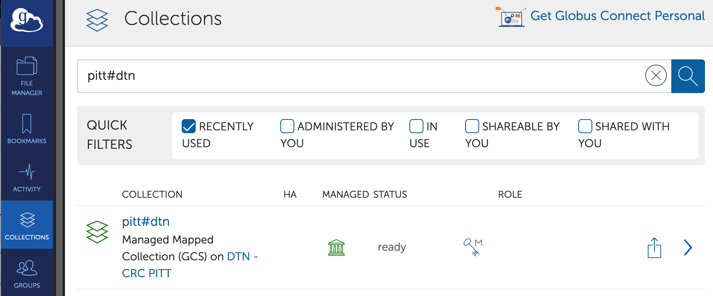
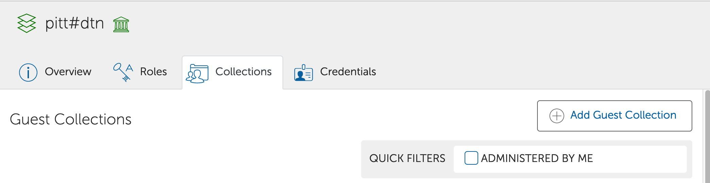
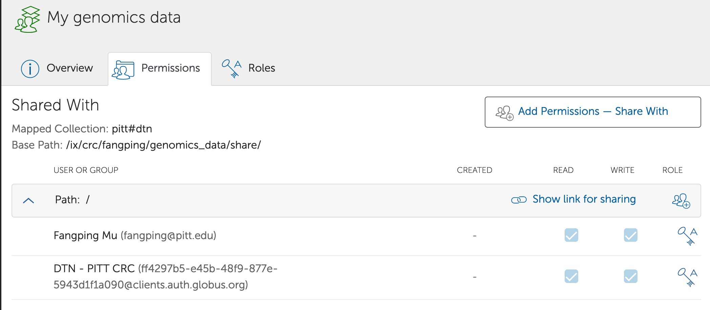
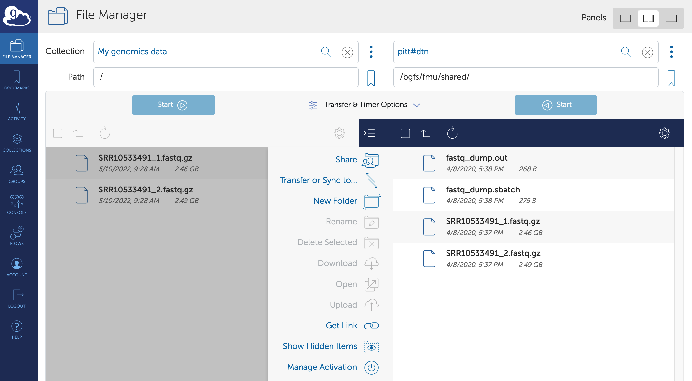

# Globus

[Globus](https://www.globus.org/) is the recommended way to move large datasets
to, from, and within CRCD, and to share data with collaborators. It handles
large transfers reliably — resuming automatically after interruptions — and
doesn't require your collaborators to have CRCD accounts.

!!! warning "Sensitive data"
    Sensitive material cannot be shared on Globus. To determine whether material
    is considered sensitive, contact your department or the Office of Trade
    Compliance.

## Getting started

- Sign in at [app.globus.org](https://app.globus.org) with your Pitt
  credentials (choose "University of Pittsburgh").
- To move data to or from your own computer, install
  [Globus Connect Personal](https://www.globus.org/globus-connect-personal) and
  set up a personal endpoint. An institutional endpoint is **not** required.
- CRCD's storage is reachable through the **`pitt#dtn`** collection. Search for it
  in **Collections**, open it in the File Manager, and navigate to your `/ix`,
  `/ix1`, `/vast`, or `/ihome` folder.

Central IT subscribes to Globus on behalf of the University — CRCD thanks them
for covering the annual subscription.

## Sharing data with collaborators

Globus lets you share a folder of CRCD data with Pitt or outside collaborators by
creating a **guest collection**, without any local account management on your end.
You need an active CRCD allocation with data on a CRCD filesystem, and you are
responsible for the integrity of any directories you share — especially those
shared with write access.

To share a folder:

1. Sign in to [Globus](https://app.globus.org) with your Pitt credentials.

    

2. In **Collections**, search `pitt#dtn`, select it, and **Open in File
   Manager**, authenticating with your Pitt credentials. Navigate to the folder
   you want to share.

    

3. Highlight the folder and click **Share** in the right-hand pane, then **Add a
   Guest Collection**. (Sharing works on folders, not individual files — share
   the containing folder.)

    

4. Give the guest collection a clear display name and click **Create
   Collection**. You'll land on the **Permissions** tab; click **Add Permissions
   – Share With** and add the collaborator's username or email, choosing read or
   read/write access.

    

!!! warning "Be careful with write access"
    Read/write access lets a collaborator **delete** files, and permissions apply
    to the whole directory tree. Best practice: grant write access only on an
    empty directory your collaborator will upload into, and delete the guest
    collection once the transfer is complete.

**Managing and ending a share.** Under **Collections → Administered by You**,
select the collection and click **Sharing** to see who has access; remove a
person with the **×** next to their name, or remove the whole share with **Delete
Collection**.

## What to tell your collaborators

Your collaborator needs a (free) Globus account — they may already have one
through their institution — and, if transferring to their own computer,
[Globus Connect Personal](https://www.globus.org/globus-connect-personal). If
they have a CRCD account, they can use `pitt#dtn` to move the data into their own
`/ix1` (or other) folder.

If you enabled email notification when adding their permission, Globus emails
them a link to the shared collection. They sign in, select the files, choose
**Transfer or Sync to**, enter their own endpoint and path, and click **Start**.

    

## Related

-   :material-microsoft:{ .lg .middle } __OneDrive via Globus__

    ---

    Move data between CRCD and Pitt OneDrive or SharePoint.

    [:octicons-arrow-right-24: Globus for OneDrive](globus-microsoft-onedrive.md)

-   :material-swap-horizontal:{ .lg .middle } __Other transfer methods__

    ---

    SFTP clients, rsync/scp, and cloud tools.

    [:octicons-arrow-right-24: File Transfer Methods](../index.md)

-   :material-harddisk:{ .lg .middle } __Where your data lives__

    ---

    Storage tiers and quotas on CRCD.

    [:octicons-arrow-right-24: File Systems](../file-systems.md)

