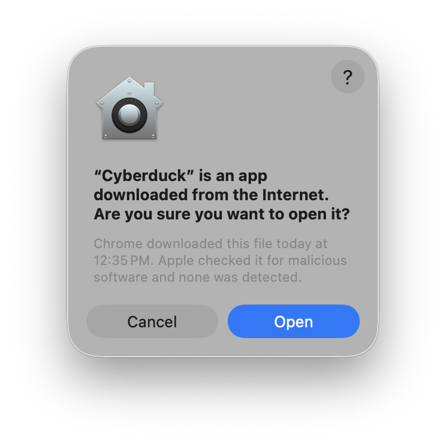
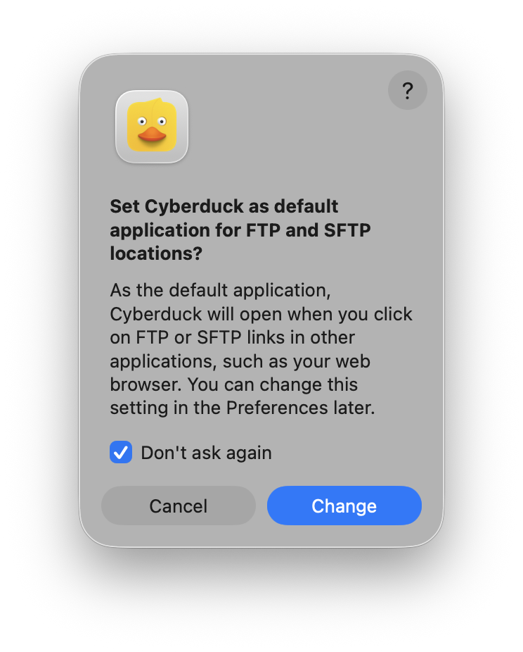
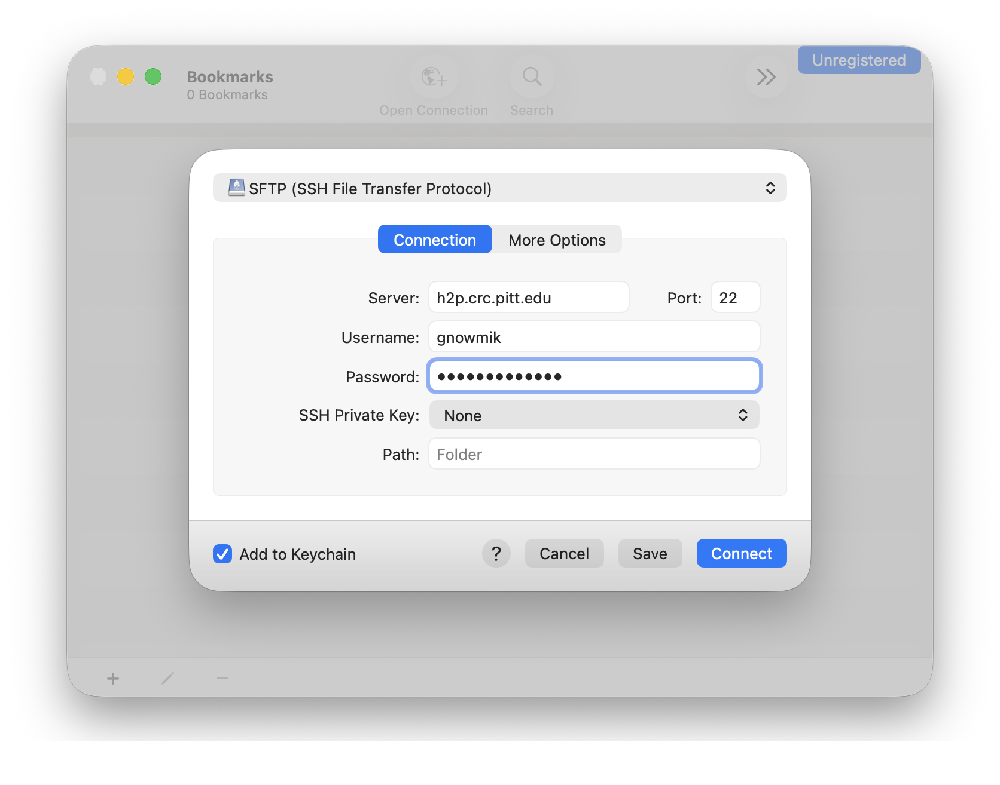
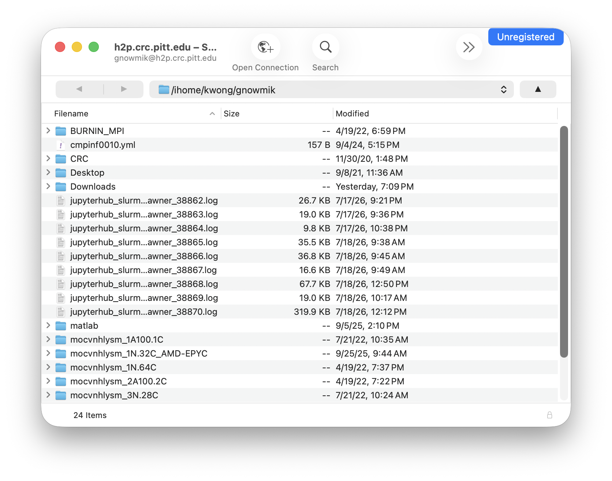
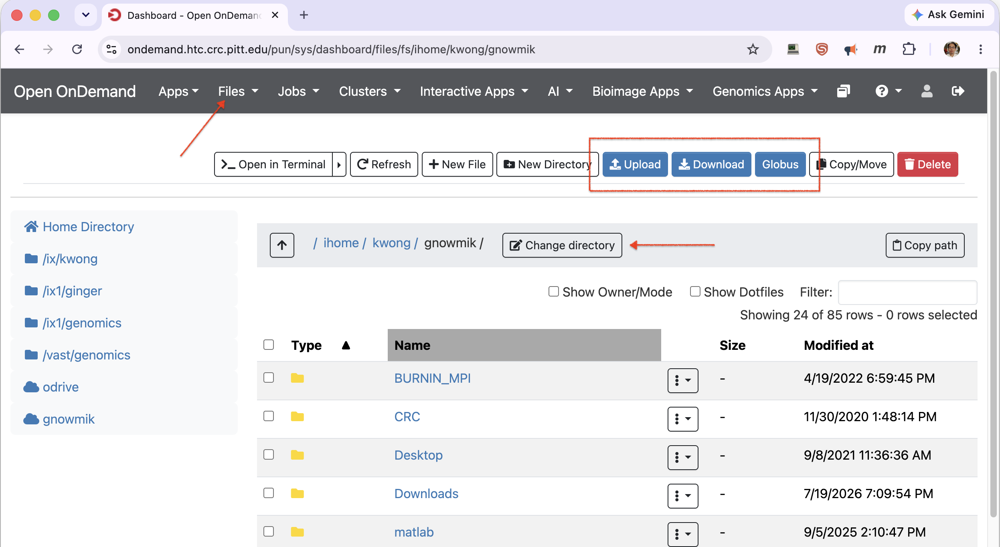

# File Transfer Methods

There are several ways to move data to and from the CRCD clusters. Pick based on
how much data you're moving and how you work:

| Situation                                                          | Use                                                             |
| ------------------------------------------------------------------ | --------------------------------------------------------------- |
| Small or occasional transfers, graphical                           | An [SFTP client](#sftp-clients) (Cyberduck, FileZilla) or the OnDemand file app |
| Scripted or command-line transfers                                 | [`rsync` or `scp`](#command-line-tools)                         |
| Large datasets, unreliable networks, or sharing with collaborators | [Globus](#globus)                                               |
| To or from cloud storage                                           | [Cloud tools](#cloud-tools) (OneDrive, S3, Google Cloud, Azure) |

Before transferring, decide *where* the data should land — see [File Systems](../file-systems.md)
for the storage tiers and quotas. In the examples below, replace paths like
`/ix1/<group>/<username>` with your own, and connect to your cluster's login node
(`htc.crc.pitt.edu` for HTC or `h2p.crc.pitt.edu` for SMP/GPU); both see the same storage.

!!! note "Sensitive or regulated data"
    Before moving sensitive or regulated data (for example, HIPAA or export-controlled
    material), confirm the method and destination are approved for that data class —
    check with CRCD or your department first.

## SFTP clients

Both clients below are free, open source, and run on Windows and macOS, so either works
whatever your operating system.

### Cyberduck

Cyberduck is a free, open-source SFTP client for Windows and macOS. Work through the tabs
below to open the app, connect, and transfer files.

=== "1. Open Cyberduck"

    The first time you open Cyberduck on macOS, confirm two prompts: click **Open** when
    macOS warns the app was downloaded from the internet, then **Change** (or **Cancel**)
    if it offers to become the default handler for FTP and SFTP links.

    <div class="grid" markdown>

    [](../../_assets/img/data-management/cyberduck-1.png)

    [](../../_assets/img/data-management/cyberduck-2.png)

    </div>

=== "2. Connect"

    Click **Open Connection**, then in the dialog select **SFTP (SSH File Transfer
    Protocol)**, and enter:

    - **Server:** your cluster's login node — `h2p.crc.pitt.edu` (SMP/GPU) or
      `htc.crc.pitt.edu` (HTC); leave **Port** at `22`.
    - Your Pitt **username** and **password**, then click **Connect**.

    [{ width="480" }](../../_assets/img/data-management/cyberduck-3.png)

=== "3. Transfer files"

    Your files appear in the window; drag and drop to upload and download.

    [](../../_assets/img/data-management/cyberduck-4.png)

### FileZilla

FileZilla is a free, open-source FTP/SFTP client for Windows, macOS, and Linux. To
connect, enter `sftp://htc.crc.pitt.edu` in the **Host** box with your Pitt username and
password, and click **QuickConnect**. See [FileZilla](filezilla.md) for a full
walkthrough with screenshots.

!!! warning "Download FileZilla only from the official site"
    Get FileZilla from [filezilla-project.org](https://filezilla-project.org/download.php?show_all=1),
    and decline any bundled extras during install — third-party download sites have
    historically packaged it with unwanted software.

### The Open OnDemand file app

!!! warning
    The OnDemand file app isn't suitable for large files (> 1 GB) due to a limited
    cache size — use `rsync`, `scp`, or Globus for those.

After [logging in to Open OnDemand](../../web-portals/open-ondemand.md), open **Files → Home
Directory**. From the toolbar you can **Upload** files from your computer, **Download** files to
it, launch a **Globus** transfer, or switch folders with **Change directory**.

[](../../_assets/img/data-management/ondemand-filetransfer.png)

## Globus

For large datasets, unreliable networks, or sharing with collaborators, use
[**Globus**](globus.md). An institutional endpoint isn't required — you can set up a
personal endpoint on your own computer to move large amounts of data reliably. Globus can
also move data to and from [Pitt OneDrive and SharePoint](globus-onedrive.md).

## Command-line tools

### rsync

Run `rsync` from a terminal on your local computer.

Copy **to** the cluster:

```
rsync -aP <files> <username>@htc.crc.pitt.edu:/ix1/<group>/<username>/
```

Copy **from** the cluster:

```
rsync -aP <username>@htc.crc.pitt.edu:/ix1/<group>/<username>/files/ .
```

`-a` preserves attributes recursively and `-P` shows progress and resumes partial
transfers — handy for large or interrupted copies.

### scp

`scp` also runs from your local terminal and is fine for simple one-off copies (for large
or interruptible transfers, prefer `rsync`):

```
scp -r <files> <username>@htc.crc.pitt.edu:/ix1/<group>/<username>/
scp -r <username>@htc.crc.pitt.edu:/ix1/<group>/<username>/files/ .
```

### Aspera

IBM Aspera enables high-performance downloads from data providers that run an Aspera
server — for example, EBI/ENA offers Aspera endpoints for large sequence datasets.
Download the **current** IBM Aspera Connect client into your home directory and run its
installer; the client installs to `~/.aspera`, with `ascp` at
`~/.aspera/connect/bin/ascp`. A typical download from EBI's ENA:

```
~/.aspera/connect/bin/ascp -QT -l 300m -P33001 \
  -i ~/.aspera/connect/etc/asperaweb_id_dsa.openssh \
  era-fasp@fasp.sra.ebi.ac.uk:/vol1/fastq/SRR949/SRR949627/SRR949627_1.fastq.gz .
```

### Downloading with wget or curl

To fetch a file from a URL:

```
wget https://domain.com/file
curl -O https://domain.com/file
```

Save under a different name with `wget -O newname <url>` or `curl -o newname <url>`.
If the URL contains special characters like `?`, wrap it in single quotes so the
shell doesn't mangle it.

## Cloud tools

The cloud CLIs are provided as modules. Load the current version — run
`module spider <tool>` to see what's available — rather than pinning an old one.

### Pitt OneDrive

You can transfer data between Pitt OneDrive and the cluster. See
[Microsoft OneDrive](microsoft-onedrive.md) to use `rclone`, or
[OneDrive via Globus](globus-onedrive.md) to move data through Globus.

### AWS S3

```
module load awscli
aws s3 sync /ix1/<group>/<username>/DataUpload s3://my-s3-bucket/data_from_cluster
```

### Google Cloud Storage

```
module load gsutil
gsutil config
gsutil cp -r gs://gs-bucket-name/ .
```

### Azure Storage

[AzCopy](https://learn.microsoft.com/azure/storage/common/storage-use-azcopy-v10) moves
data into and out of Azure Storage:

```
module load azcopy
azcopy copy "/ix1/<group>/<username>/folder/" "https://account.blob.core.windows.net/container/<SAS-token>" --recursive=true
```

For any of these, you can run the transfer as a batch job on a compute node rather than
tying up a login session.
