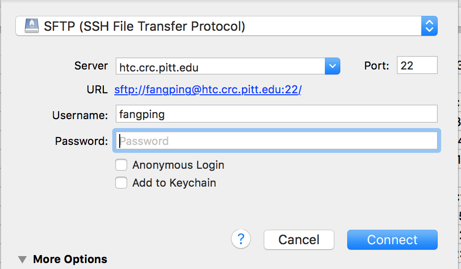
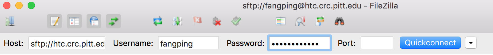

# File Transfer Methods

There are several ways to move data to and from the CRCD clusters. Pick based on
how much data you're moving and how you work:

| Situation | Use |
| --------- | --- |
| Small or occasional transfers, graphical | An [SFTP client](#sftp-clients) (Cyberduck, FileZilla) or the OnDemand file app |
| Scripted or command-line transfers | [`rsync` or `scp`](#command-line-tools) |
| Large datasets, unreliable networks, or sharing with collaborators | [Globus](globus.md) |
| To or from cloud storage | [Cloud tools](#cloud-tools) (OneDrive, S3, Google Cloud, Azure) |

Before transferring, decide *where* the data should land — see
[File Systems](../file-systems.md) for the storage tiers and quotas. In the
examples below, replace paths like `/ix1/<group>/<username>` with your own.

## SFTP clients

### Cyberduck

Cyberduck is a popular open-source SFTP client for Windows and macOS. Install it,
click **Open Connection**, then:



- Select **SFTP (SSH File Transfer Protocol)**.
- Server: `htc.crc.pitt.edu`
- Enter your Pitt username and password, and click **Connect**.

Your files appear in the window; drag and drop to upload and download.

### FileZilla

FileZilla is a cross-platform FTP/SFTP client for Windows, Linux, and macOS.



- Host: `sftp://htc.crc.pitt.edu`
- Enter your Pitt username and password, and click **QuickConnect**.

### The Open OnDemand file app

!!! warning
    The OnDemand file app isn't suitable for large files (> 1 GB) due to a
    limited cache size — use `rsync`, `scp`, or Globus for those.

Log on to `ondemand.htc.crc.pitt.edu`, click **Files → Home Directory**, then
**Upload** to choose files from your computer.


### Globus

For large datasets, use [**Globus**](globus.md). An institutional endpoint isn't
required — you can set up a personal endpoint on your own computer to move large
amounts of data reliably.

## Command-line tools

### rsync

Run `rsync` from a terminal on your local computer.

Copy **to** the cluster:

```bash
rsync -aP <files> <username>@htc.crc.pitt.edu:/ix1/<group>/<username>/
```

Copy **from** the cluster:

```bash
rsync -aP <username>@htc.crc.pitt.edu:/ix1/<group>/<username>/files/ .
```

`-a` preserves attributes recursively and `-P` shows progress and resumes
partial transfers — handy for large or interrupted copies.

### scp

`scp` also runs from your local terminal:

```bash
scp -r <files> <username>@htc.crc.pitt.edu:/ix1/<group>/<username>/
scp -r <username>@htc.crc.pitt.edu:/ix1/<group>/<username>/files/ .
```

### Aspera

IBM Aspera enables high-performance downloads from providers that run an Aspera
server — for example, NCBI and EBI recommend it for large sequence datasets.
Download the **current** IBM Aspera Connect client into your home directory and
run its installer; the client installs to `~/.aspera`, with `ascp` at
`~/.aspera/connect/bin/ascp`. A typical download from EBI's SRA:

```bash
~/.aspera/connect/bin/ascp -QT -l 300m -P33001 \
  -i ~/.aspera/connect/etc/asperaweb_id_dsa.openssh \
  era-fasp@fasp.sra.ebi.ac.uk:/vol1/fastq/SRR949/SRR949627/SRR949627_1.fastq.gz .
```

### Downloading with wget or curl

To fetch a file from a URL:

```bash
wget https://domain.com/file
curl -O https://domain.com/file
```

Save under a different name with `wget -O newname <url>` or `curl -o newname <url>`.
If the URL contains special characters like `?`, wrap it in single quotes so the
shell doesn't mangle it.

## Cloud tools

The cloud CLIs are provided as modules. Load the current version — run
`module spider <tool>` to see what's available — rather than pinning an old one.

### Pitt OneDrive

You can transfer data between Pitt OneDrive and the cluster. See
[Microsoft OneDrive](microsoft-onedrive.md), or
[Globus for OneDrive](globus-microsoft-onedrive.md) to move data via Globus.

### AWS S3

```bash
module load awscli
aws s3 sync /ix1/<group>/<username>/DataUpload s3://my-s3-bucket/data_from_cluster
```

### Google Cloud Storage

```bash
module load gsutil
gsutil config
gsutil cp -r gs://gs-bucket-name/ .
```

### Azure Storage

[AzCopy](https://learn.microsoft.com/azure/storage/common/storage-use-azcopy-v10)
moves data into and out of Azure Storage:

```bash
module load azcopy
azcopy copy "/ix1/<group>/<username>/folder/" "https://account.blob.core.windows.net/container/<SAS-token>" --recursive=true
```

For any of these, you can run the transfer as a batch job on a compute node
rather than tying up a login session.
