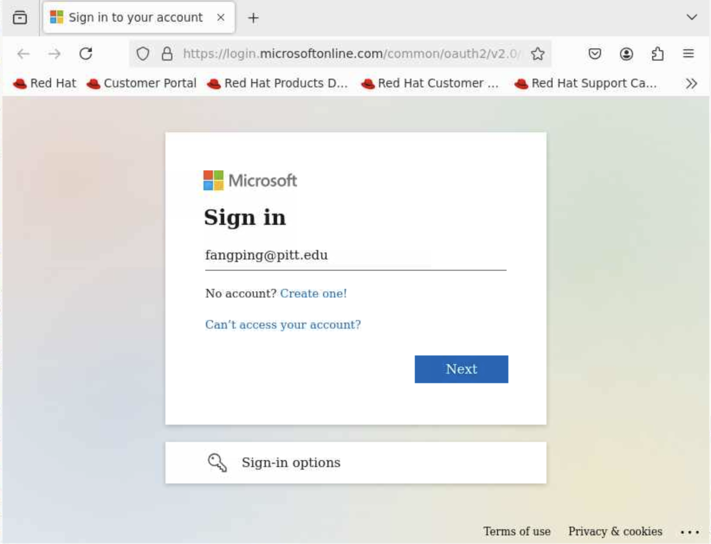

# Microsoft OneDrive
## Accessing Microsoft OneDrive
The Microsoft Office portal has a link from portal.office.com, or you can go 
directly to pitt.onedrive.com and login there with Pitt credentials. You can 
also access from my.pitt.edu shortcuts.

A few notes about this storage:

- Any University faculty, student or staff can activate and access their official 
University of Pittsburgh Microsoft OneDrive by visiting the above link and 
logging in.
- Under the university agreement, University of Pittsburgh faculty, staff 
and students have access to 5TB in Microsoft OneDrive; the maximum file size 
is 100GB. Storage limits can be increased up to a max of 25TB. This requires 
a ticket to Pitt IT technology help desk to process. After 25TB, additional 
accounts/sites can be created with another 25TB cap. 
- Microsoft OneDrive is **not** suitable for storing sensitive data, including 
personal information.

## Rclone

[Rclone](https://rclone.org) is a command-line program that supports file transfers and syncing of 
files between local storage and Microsoft OneDrive as well as a number of other 
storage services. Rclone offers options to optimize a transfer and reach higher 
transfer speeds than other common transfer tools such as scp and rsync.

If you wish to use rclone to transfer files to or from CRC file systems, you 
can use the CRC installation of rclone. There is a module to set the proper 
environment to use the tool. 

### Loading and Configuring of Rclone

To use Rclone, you first need to load it via LMOD:
```commandline
module load rclone/1.59.2
```
The next step is to configure rclone for the transfer partner.

Configuration for transferring files to/from the University of Pittsburgh’s 
Microsoft OneDrive storage.

It is difficult to use a remote or headless machine to configure Rclone for 
Microsoft OneDrive.

You can use HTC Desktop on Open Ondemand to configure Rclone for Microsoft 
OneDrive.

Logon ondemand.htc.crc.pitt.edu, click Interactive Apps -> HTC Desktop, Choose 
1 hour and 1 core, Click Launch.


Click Launch HTC Desktop, Click Terminal Emulator.


```commandline
[fangping@htc-n1 ~]$ module load rclone/1.59.2
[fangping@htc-n1 ~]$ rclone config
```

This command will create a ~/.config/rclone/rclone.conf file in your home 
directory which contains the setup information. You will be asked a few questions:

1. Choose ‘New remote’
```commandline
[fangping@htc-n1 ~]$ rclone config
Current remotes:

Name                 Type
====                 ====
gdrive               drive

e) Edit existing remote
n) New remote
d) Delete remote
r) Rename remote
c) Copy remote
s) Set configuration password
q) Quit config
e/n/d/r/c/s/q> n
```

2. Enter a name for the Microsoft OneDrive. This will be typed out whenever
you want to access the Microsoft OneDrive, so make it short.

```commandline
name> odrive
```
3. Select Microsoft OneDrive ("onedrive")
```commandline
Type of storage to configure.
Enter a string value. Press Enter for the default ("").
Choose a number from below, or type in your own value
 <long list of types>
22 / Microsoft Azure Blob Storage
   \ "azureblob"
23 / Microsoft OneDrive
   \ "onedrive"
<several more types>
Storage> 32
```

4. Leave the Client ID and Client Secret fields blank -- press enter
```commandline
<information>
Enter a string value. Press Enter for the default ("").
client_id>
<information>
client_secret>
<more information>
```
5. Advanced configuration - choose no
```commandline
Edit advanced config? (y/n)
y) Yes
n) No
y/n> n
```
6. Choose 'Y' for auto-config
```commandline
Remote config
Use auto config?
 * Say Y if not sure
 * Say N if you are working on a remote or headless machine
y) Yes (default)
n) No
y/n> y
If your browser doesn't open automatically go to the following link: http://127.0.0.1:*****
Log in and authorize rclone for access
Waiting for code...
```



7. Log in Pitt passport and authorize rclone for access
8. Choose Onedrive Personal or Business "onedrive"
```commandline
Choose a number from below, or type in an existing value
 1 / OneDrive Personal or Business
   \ "onedrive"
 2 / Root Sharepoint site
   \ "sharepoint"
 3 / Type in driveID
   \ "driveid"
 4 / Type in SiteID
   \ "siteid"
 5 / Search a Sharepoint site
   \ "search"
Your choice> 1
```
9. Choose Onedrive(business) to confirm the configuration and then quit the config
```commandline
Found 1 drives, please select the one you want to use:
0: OneDrive (business) id=****
Chose drive to use:> 0
Found drive 'root' of type 'business', URL: https://pitt-my.sharepoint.com/******
Is that okay?
y) Yes (default)
n) No
y/n> y
--------------------
[odrive]
type = onedrive
token = {<long list of token information>
drive_type = business
--------------------
y) Yes this is OK (default)
e) Edit this remote
d) Delete this remote
y/e/d> y
Current remotes:

Name                 Type
====                 ====
gdrive               drive
odrive               onedrive

e) Edit existing remote
n) New remote
d) Delete remote
r) Rename remote
c) Copy remote
s) Set configuration password
q) Quit config
e/n/d/r/c/s/q> q
[fangping@htc-n1 ~]$
```
You are now enabled to access your Microsoft OneDrive via rclone.

### Rclone usage

In this section some common rclone usage cases are presented. In the following the 
name odrive is being used. You would need to use the name you choose when doing your 
configuration. Note the trailing colon. This indicates to rclone that “odrive” is a 
remote storage system, rather than a file or directory in your current working 
directory. At any point, you may verify that these changes were successful by 
viewing your Drive from within a web browser.

- List top-level buckets in your Drive: 
```commandline
rclone lsd odrive:
```
- List all files in your Drive: 
```commandline
rclone ls odrive:
```
- Create backup bucket on OneDrive: 
```commandline
rclone mkdir odrive:backup
```
- Copy a file from CRC to odrive:backup bucket: 
```commandline 
copy <local file> odrive:backup
```
- Copy contents of a folder to odrive:backup bucket: 
```commandline 
copy <local folder> odrive:backup/newfolder
```
Synchronizing directories is done with the sync option: 
```commandline
rclone sync <local folder> odrive:backup
```
This is a full synchronization, so files at the destination (odrive:backup) prior to 
the sync will be overwritten or deleted. 
Double check the destination and it's contents.

### Rclone Options
While the full list of options can be found in the official MANUAL file in the [Rclone github repo](https://github.com/ncw/rclone) (or ‘man rclone’ if rclone is installed), some options are:

- --transfers=N (default N=4)
Number of file transfers to be run in parallel. Increasing this may increase the overall speed of a large transfer, as long as the network and remote storage system can handle it (bandwidth and memory).

- --drive-chunk-size=SIZE (default SIZE=8192)
The chunk size for a transfer in kilobytes; must be a power of 2 and at least 256. Each chunk is buffered in memory prior to the transfer, so increasing this increases how much memory is used.

- --drive-use-trash
Sends files to Microsoft OneDrive’s trash instead of deleting (prior to a directory sync for instance). Note that this is not a default option, because the Trash is not accessible through Rclone and must be managed through a web browser.

- --skip-links
Ignore symlinks.

### Automating Transfers Using Rclone
The file transfer process can be scripted, and you can submit the script as a batch 
job. With these scripts a user can set up a periodic backup of their data.

Submit the following job to transfer a folder to Microsoft OneDrive:
```shell
#!/bin/bash
#
#SBATCH --job-name=rclone_to_odrive
#SBATCH -c 1
#SBATCH -t 1-00:00 # Runtime in D-HH:MM
#SBATCH --output=rclone_to_odrive.out

module purge
module load rclone/1.53.2

rclone copy --skip-links <local folder> odrive:<remote folder>
```

## Share files from Microsoft OneDrive
You can share the files and folders that you store in Microsoft OneDrive with anyone.

https://support.microsoft.com/en-us/office/share-onedrive-files-and-folders-9fcc2f7d-de0c-4cec-93b0-a82024800c07

When you share from Microsoft OneDrive, you can control whether people can edit, 
comment on, or only view the file. When you share content from Microsoft OneDrive, 
the Microsoft OneDrive program policies apply.

## How to access a OneDrive shared folder
You cannot directly download onedrive shared files using rclone. See this GitHub 
issue https://github.com/rclone/rclone/issues/4062

"OneDrive Client for Linux" can be used to download onedrive shared files.

https://github.com/abraunegg/onedrive

This tool has been installed as a module.

```commandline
module load onedrive/2.4.15
```

To view your shared folder:
```commandline
onedrive --list-shared-folders
```

To download shared folders:
1. Create a new file called 'business_shared_folders' in your config directory
2. On each new line, list the OneDrive Business Shared Folder you wish to sync
```commandline
cat ~/.config/onedrive/business_shared_folders
# comment
release86
# Another comment
# Top Level to Share
```
3. Use onedrive to sync the specific folder.
```commandline
onedrive --synchronize --sync-shared-folders --download-only --single-directory 'release86' --verbose
```
