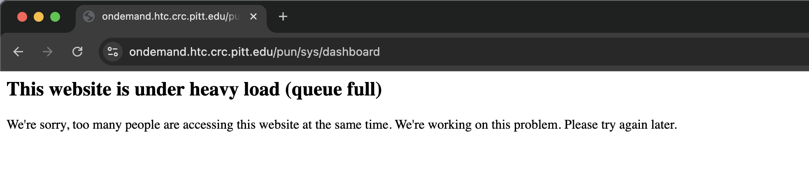

# Frequently asked questions (FAQ)

In this section we list a series of common problems that CRCD users may encounter, with possible solutions.

^^**1. Encountering an Ominous Warning Message**^^

!!! example "WARNING: REMOTE HOST IDENTIFICATION HAS CHANGED!"
    === "The Symptom"
        After a scheduled quarterly maintenance, `ssh` attempts from your laptop to h2p.crc.pitt.edu, htc.crc.pitt.edu, 
        or another CRCD remote server can fail with the following warning message below.

        ```commandline
        Last login: Fri Aug 22 08:48:12 on ttys009
        kimwong@M1-Max ~ % ssh login3.crc.pitt.edu
        @@@@@@@@@@@@@@@@@@@@@@@@@@@@@@@@@@@@@@@@@@@@@@@@@@@@@@@@@@@
        @    WARNING: REMOTE HOST IDENTIFICATION HAS CHANGED!     @
        @@@@@@@@@@@@@@@@@@@@@@@@@@@@@@@@@@@@@@@@@@@@@@@@@@@@@@@@@@@
        IT IS POSSIBLE THAT SOMEONE IS DOING SOMETHING NASTY!
        Someone could be eavesdropping on you right now (man-in-the-middle attack)!
        It is also possible that a host key has just been changed.
        The fingerprint for the ED25519 key sent by the remote host is
        SHA256:J0awPWHGaPS37Cc5OZpR/ITGrHmmRIJYj6WfKbD1N9g.
        Please contact your system administrator.
        Add correct host key in /Users/kimwong/.ssh/known_hosts to get rid of this message.
        Offending ED25519 key in /Users/kimwong/.ssh/known_hosts:30
        Host key for login3.crc.pitt.edu has changed and you have requested strict checking.
        Host key verification failed.
        kimwong@M1-Max ~ %
        ```

    === "The Fix"
        This warning message indicates that changes to the remote server (e.g., an IP address change) have invalidated the
        remote server host key, which is stored in a file called `.ssh/known_hosts`. The message also suggests a possible fix
        (highlighted in yellow).

        ```commandline
        Last login: Fri Aug 22 08:48:12 on ttys009
        kimwong@M1-Max ~ % ssh login3.crc.pitt.edu
        @@@@@@@@@@@@@@@@@@@@@@@@@@@@@@@@@@@@@@@@@@@@@@@@@@@@@@@@@@@
        @    WARNING: REMOTE HOST IDENTIFICATION HAS CHANGED!     @
        @@@@@@@@@@@@@@@@@@@@@@@@@@@@@@@@@@@@@@@@@@@@@@@@@@@@@@@@@@@
        IT IS POSSIBLE THAT SOMEONE IS DOING SOMETHING NASTY!
        Someone could be eavesdropping on you right now (man-in-the-middle attack)!
        It is also possible that a host key has just been changed.
        The fingerprint for the ED25519 key sent by the remote host is
        SHA256:J0awPWHGaPS37Cc5OZpR/ITGrHmmRIJYj6WfKbD1N9g.
        Please contact your system administrator.
        {==Add correct host key in /Users/kimwong/.ssh/known_hosts to get rid of this message.
        Offending ED25519 key in /Users/kimwong/.ssh/known_hosts:30==}
        Host key for {++login3.crc.pitt.edu++} has changed and you have requested strict checking.
        Host key verification failed.
        kimwong@M1-Max ~ %
        ```

        One fix is to edit the file `/Users/kimwong/.ssh/known_hosts` and delete line 30 which has the offending "ED25519 key".
        The `:30` syntax in the second highlighted sentence above indicates line 30 of the file `known_hosts`.

        An alternative fix is to issue the command

        ```commandline
        ssh-keygen -R <hostname>
        ```
        where `<hostname>` is the hostname of the computer you are trying to connect to. This will remove all keys belonging 
        to the specified `<hostname>` and update the `known_hosts` file automatically. The above warning message also shows
        the `<hostname>` (highlighted in green and underlined) that failed the host key verification.

    === "What's Going On?"
        When you first log into a remote server, you are warned that the authenticity of a host cannot be verified and 
        if you wish to continue connecting.

        ```commandine
        kimwong@M1-Max ~ % ssh login3.crc.pitt.edu
        The authenticity of host 'login3.crc.pitt.edu (136.142.28.148)' can't be established.
        ED25519 key fingerprint is SHA256:J0awPWHGaPS37Cc5OZpR/ITGrHmmRIJYj6WfKbD1N9g.
        This host key is known by the following other names/addresses:
            ~/.ssh/known_hosts:27: login2.crc.pitt.edu
            ~/.ssh/known_hosts:31: h2p.crc.pitt.edu
            ~/.ssh/known_hosts:32: login1.crc.pitt.edu
        Are you sure you want to continue connecting (yes/no/[fingerprint])?
        ```

        If you answer `yes`, you will see the following message:

        ```commandline
        Are you sure you want to continue connecting (yes/no/[fingerprint])? yes
        {==Warning: Permanently added 'login3.crc.pitt.edu' (ED25519) to the list of known hosts.==}
        Connection closed by 136.142.28.148 port 22
        ```
        which means the new host key was added to the `.ssh/known_hosts` file. Now the next time you `ssh` to the
        remote server, the key on the remote server is compared against the one stored in `.ssh/known_hosts`. If the 
        keys match, you continue connecting to the server. If the keys don't match, you see the ominous warning message.

        This situation happens, for example, when we need to replace an old server with a new more performant one and we 
        keep the same hostname. The new host key will not match with the one stored in your `.ssh/known_hosts` file.

^^**2. I'm graduating soon. Can I continue to use CRCD to complete my papers?**^^

Yes. Please see the section on [Sponsored Accounts](getting-started/sponsored_account.md).

^^**3. Can I provide my collaborators, who are outside of Pitt, access to my CRCD allocation?**^^

Yes. Please see the section on [Sponsored Accounts](getting-started/sponsored_account.md).

^^**4. I'm an Emeritus Faculty, can I still use CRCD?**^^

Yes. In the eyes of CRCD, a Pitt Emeritus Faculty gets the same benefits as an active faculty.

^^**5. Open OnDemand: Website under heavy load error**^^

!!! example "The website is under heavy load (queue full)"
    === "The Symptom"
        

    === "The Fix"
        From a Chrome browser, start a New Incognito Window and paste the following URL and authenticate.

        ```commandline
        https://ondemand.htc.crc.pitt.edu/nginx/stop?redir=/pun/sys/dashboard/
        ```

    === "What's Going On?"
        You can read about it from the Open OnDemand [Discourse forum](https://discourse.openondemand.org/t/website-is-under-heavy-load-queue-full/4109).
