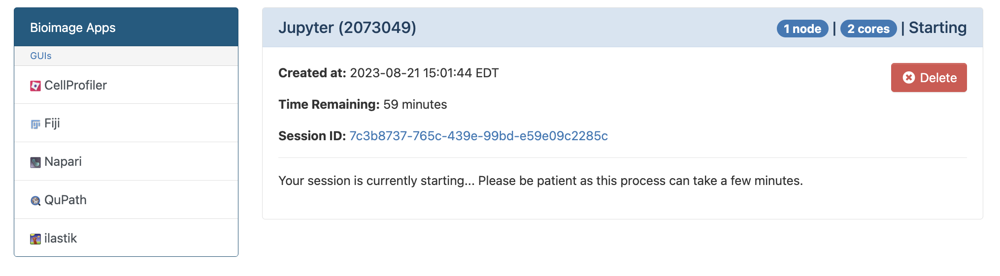
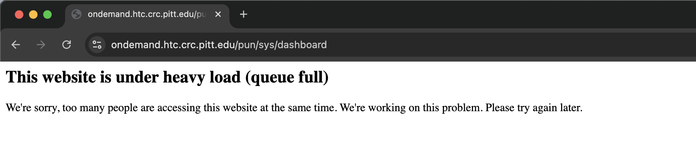

# Common Problems

In this section we list a series of common problems that CRCD users may encounter, with possible solutions. They are grouped by theme below; use the table of contents on the right to jump to a topic.

## Logging in and connecting

### I can't log in — my session hangs or is terminated { data-toc-label="Can't log in" }

!!! example ""
    === "The Symptom"
        Logging in to a login node is very slow, hangs without ever giving me a prompt, or
        disconnects before the login completes. It can look like any of these.

        The connection is dropped right after the login banner:

        ```bash
        abc123@htc.crc.pitt.edu's password:
        ###############################################################
                        Welcome to htc.crc.pitt.edu!
            Documentation can be found at https://crc-pages.pitt.edu/user-manual/
        ---------------------------------------------------------------
                             IMPORTANT REMINDERS
         Don't run jobs on login nodes! Use interactive jobs: `crc-interactive --help`
        ---------------------------------------------------------------
        ###############################################################
        Last login: Thu Sep 10 13:17:42 2026 from 136.142.28.142
        {==Your connection to the remote server has been terminated.==}
        ```

        Or the session hangs after the banner with no prompt at all, and pressing ++ctrl+c++
        eventually drops you to a prompt. Remote editors are affected too — VS Code Remote-SSH may
        fail to connect or hang while "Setting up SSH host".

        This is **not** a VPN or host-key problem. If you can reach the node but can't get a usable
        shell, read on.

    === "The Fix"
        You are almost certainly over your own per-user limit on that login node, because of
        processes *you* left running there. The fix is to get those processes killed.

        **1. Try another login node or cluster.** The limits are enforced per node, so a different
        one may still let you in:

        ```bash
        ssh <pittID>@h2p.crc.pitt.edu    # SMP, MPI, GPU clusters
        ssh <pittID>@htc.crc.pitt.edu    # HTC cluster
        ```

        You can also try a shell through the web portal — in
        [Open OnDemand](web-portals/open-ondemand.md), use **Clusters** → **HTC / gpu / smp Shell
        Access**.

        **2. Find your processes.** Once you have any prompt, list what you are running on that node:

        ```bash
        [abc123@login3 ~]$ top -u $USER
        ```

        ```bash
        PID     USER    PR  NI    VIRT    RES    SHR S  %CPU  %MEM     TIME+ COMMAND
        1388307 abc123  20   0 6083400   {==5.6g==}  15616 D   0.0   2.2   5:57.53 {==R==}
        1387616 abc123  20   0   27744  15220  10752 S   0.0   0.0   1:02.81 systemd
        ```

        A single R, Python, or MATLAB process holding several GB is enough to lock you out. Also
        look for stray `conda` processes and leftover VS Code server processes (`code-*`).

        **3. Kill them.** Use the PID from `top`, or kill by name:

        ```bash
        kill <PID>
        pkill -u $USER -f R          # replace R with the offending command
        ```

        Be deliberate — `pkill` matching too broadly can kill your own shell.

        **4. If you cannot get in at all,** [open a help ticket](https://crc.pitt.edu/tickets) and ask
        us to kill your processes on the login node. Say which cluster and login node you were using
        (for example "login3 on HTC"). This is a routine request and quick to action.

        !!! tip "Prevention"
            Do the work where it belongs. Start an
            [interactive session](slurm/interactive-jobs.md) with `crc-interactive` for hands-on
            work, or submit a [batch job](slurm/batch-jobs.md). If you use VS Code against the
            clusters, follow [VS Code](applications/coding/vscode.md) — by default its server and language
            extensions run on the **login** node, which is a common way to hit the limit without
            realizing it.

    === "What's Going On?"
        Login nodes are a shared entry point, not a place to compute. To keep them responsive,
        per-user limits are enforced with cgroups: currently **1 core and 8 GB of memory per user**,
        applied across *all* of your processes on that login node. When the node's resources are
        exhausted, you may be unable to log in until usage drops.

        That last part is the whole explanation. Logging in is itself work: SSH has to start a shell
        and several small processes for you. If your existing processes on that node have already
        consumed your 1 core and 8 GB, there is nothing left to start a new session with — so the
        login hangs waiting, or is terminated outright. You are not locked out by other users or by
        us; you are locked out by your own earlier processes.

        Three things make this easy to hit by accident:

        - **The limit is collective.** It is not 8 GB per process but 8 GB for everything you are
          running on that node at once. One R or Python session loading a large dataset can consume
          it alone.
        - **Processes outlive your session.** A dropped connection, a `tmux` session, a `nohup`
          command, or a remote-editor server can keep running for days. You can be locked out by
          something you started last week.
        - **Remote editors are silent offenders.** VS Code Remote-SSH starts a server plus language
          and extension processes on the login node, and those can spawn further `conda` or
          interpreter processes without any obvious sign in the editor.

        Note also that resource-intensive processes on the login nodes may be killed at any
        time — so a long computation started on a login node is likely to die
        partway through even if it does not lock you out first.

        For what login nodes are and are not for, see
        [Login Nodes](hardware_profiles/login.md); for the limits themselves, see the
        [Job Scheduling Policy](policies/job-scheduling-policy.md).

### SSH warning: remote host identification has changed { data-toc-label="Host key changed" }

!!! example ""
    === "The Symptom"
        After a scheduled quarterly maintenance, `ssh` attempts from your laptop to h2p.crc.pitt.edu, htc.crc.pitt.edu, 
        or another CRCD remote server can fail with the following warning message below.

        ```bash
        Last login: Fri Aug 22 08:48:12 on ttys009
        kimwong@M1-Max ~ % ssh login3.crc.pitt.edu
        @@@@@@@@@@@@@@@@@@@@@@@@@@@@@@@@@@@@@@@@@@@@@@@@@@@@@@@@@@@
        @    WARNING: REMOTE HOST IDENTIFICATION HAS CHANGED!     @
        @@@@@@@@@@@@@@@@@@@@@@@@@@@@@@@@@@@@@@@@@@@@@@@@@@@@@@@@@@@
        IT IS POSSIBLE THAT SOMEONE IS DOING SOMETHING NASTY!
        Someone could be eavesdropping on you right now (man-in-the-middle attack)!
        It is also possible that a host key has just been changed.
        The fingerprint for the ED25519 key sent by the remote host is
        SHA256:J0awPWHGaPS37Cc5OZpR/ITGrHmmRIJYj6WfKbD1N9g.
        Please contact your system administrator.
        Add correct host key in /Users/kimwong/.ssh/known_hosts to get rid of this message.
        Offending ED25519 key in /Users/kimwong/.ssh/known_hosts:30
        Host key for login3.crc.pitt.edu has changed and you have requested strict checking.
        Host key verification failed.
        kimwong@M1-Max ~ %
        ```

    === "The Fix"
        This warning message indicates that changes to the remote server (e.g., an IP address change) have invalidated the
        remote server host key, which is stored in a file called `.ssh/known_hosts`. The message also suggests a possible fix
        (highlighted in yellow).

        ```bash
        Last login: Fri Aug 22 08:48:12 on ttys009
        kimwong@M1-Max ~ % ssh login3.crc.pitt.edu
        @@@@@@@@@@@@@@@@@@@@@@@@@@@@@@@@@@@@@@@@@@@@@@@@@@@@@@@@@@@
        @    WARNING: REMOTE HOST IDENTIFICATION HAS CHANGED!     @
        @@@@@@@@@@@@@@@@@@@@@@@@@@@@@@@@@@@@@@@@@@@@@@@@@@@@@@@@@@@
        IT IS POSSIBLE THAT SOMEONE IS DOING SOMETHING NASTY!
        Someone could be eavesdropping on you right now (man-in-the-middle attack)!
        It is also possible that a host key has just been changed.
        The fingerprint for the ED25519 key sent by the remote host is
        SHA256:J0awPWHGaPS37Cc5OZpR/ITGrHmmRIJYj6WfKbD1N9g.
        Please contact your system administrator.
        {==Add correct host key in /Users/kimwong/.ssh/known_hosts to get rid of this message.
        Offending ED25519 key in /Users/kimwong/.ssh/known_hosts:30==}
        Host key for {++login3.crc.pitt.edu++} has changed and you have requested strict checking.
        Host key verification failed.
        kimwong@M1-Max ~ %
        ```

        One fix is to edit the file `/Users/kimwong/.ssh/known_hosts` and delete line 30 which has the offending "ED25519 key".
        The `:30` syntax in the second highlighted sentence above indicates line 30 of the file `known_hosts`.

        An alternative fix is to issue the command

        ```bash
        ssh-keygen -R <hostname>
        ```
        where `<hostname>` is the hostname of the computer you are trying to connect to. This will remove all keys belonging 
        to the specified `<hostname>` and update the `known_hosts` file automatically. The above warning message also shows
        the `<hostname>` (highlighted in green and underlined) that failed the host key verification.

    === "What's Going On?"
        When you first log into a remote server, you are warned that the authenticity of a host cannot be verified and 
        if you wish to continue connecting.

        ```bash
        kimwong@M1-Max ~ % ssh login3.crc.pitt.edu
        The authenticity of host 'login3.crc.pitt.edu (136.142.28.148)' can't be established.
        ED25519 key fingerprint is SHA256:J0awPWHGaPS37Cc5OZpR/ITGrHmmRIJYj6WfKbD1N9g.
        This host key is known by the following other names/addresses:
            ~/.ssh/known_hosts:27: login2.crc.pitt.edu
            ~/.ssh/known_hosts:31: h2p.crc.pitt.edu
            ~/.ssh/known_hosts:32: login1.crc.pitt.edu
        Are you sure you want to continue connecting (yes/no/[fingerprint])?
        ```

        If you answer `yes`, you will see the following message:

        ```bash
        Are you sure you want to continue connecting (yes/no/[fingerprint])? yes
        {==Warning: Permanently added 'login3.crc.pitt.edu' (ED25519) to the list of known hosts.==}
        Connection closed by 136.142.28.148 port 22
        ```
        which means the new host key was added to the `.ssh/known_hosts` file. Now the next time you `ssh` to the
        remote server, the key on the remote server is compared against the one stored in `.ssh/known_hosts`. If the 
        keys match, you continue connecting to the server. If the keys don't match, you see the ominous warning message.

        This situation happens, for example, when we need to replace an old server with a new more performant one and we 
        keep the same hostname. The new host key will not match with the one stored in your `.ssh/known_hosts` file.

### I can't ssh into an allocated compute node { data-toc-label="SSH to compute node" }

!!! example ""
    === "The Symptom"
        I have a node allocated to me, but hopping to it from the login node asks for a password
        I can't get past, or refuses the connection outright.

        ```bash
        [abc123@login1 ~]$ salloc -M htc --nodes=1 --time=02:00:00
        salloc: Granted job allocation 10721347
        salloc: Nodes htc-n72 are ready for job
        [abc123@login1 ~]$ ssh htc-n72
        {==abc123@htc-n72's password:==}
        ```

        Or:

        ```bash
        [abc123@login1 ~]$ ssh htc-n72
        {==Permission denied (publickey,gssapi-keyex,gssapi-with-mic,password).==}
        ```

        The same failure shows up indirectly: `ssh -X` to run a GUI application on your compute
        node fails, or an MPI job dies early with connection errors, hangs, or timeouts while
        starting processes on the other nodes.

    === "The Fix"
        Hops between cluster nodes need **passwordless SSH within the cluster** — a key pair that
        lives in your CRCD home directory. This is separate from any key you set up on your laptop
        for logging in.

        **1. Confirm the node is actually yours.** You can only reach a compute node while you have
        a job allocated on it:

        ```bash
        squeue -M all -u $USER
        ```

        The `NODELIST` column must show the node you are trying to reach. If it does not, no key
        will help — request an allocation first.

        **2. Create an in-cluster key pair.** On a login node, accept the default path and leave the
        passphrase **empty** (an automated `mpirun` or `ssh -X` hop has nobody to type one):

        ```bash
        ssh-keygen -t ed25519
        ```

        **3. Authorize it for yourself:**

        ```bash
        cat ~/.ssh/id_ed25519.pub >> ~/.ssh/authorized_keys
        chmod 700 ~/.ssh
        chmod 600 ~/.ssh/authorized_keys
        ```

        The permissions matter — SSH silently refuses keys in world- or group-writable files, which
        is a common reason this appears not to work.

        **4. Try the hop again.** The first connection asks you to confirm the node's authenticity;
        answer `yes`:

        ```bash
        [abc123@login1 ~]$ ssh htc-n72
        The authenticity of host 'htc-n72 (10.201.8.72)' can't be established.
        Are you sure you want to continue connecting (yes/no/[fingerprint])? yes
        [abc123@htc-n72 ~]$
        ```

        !!! tip "You may not need the hop at all"
            For an interactive shell on a compute node, `crc-interactive` puts you there directly —
            no `ssh` needed. The hop matters when you already hold an allocation (via `salloc`),
            want `ssh -X` for a GUI application, or run software that launches its own processes
            across nodes. See [Interactive Jobs](slurm/interactive-jobs.md).

        For the complete walkthrough, including laptop-to-login-node keys, SSH agents, and config
        shortcuts, see [Passwordless SSH](getting-started/passwordless-ssh.md).

    === "What's Going On?"
        Slurm decides *which* nodes you may reach — a node is open to you while you hold an
        allocation on it — but the hop itself is still an ordinary SSH connection between two
        machines, and it has to authenticate. With no key in place, `sshd` falls back to asking for
        a password. That is merely annoying when you are typing it yourself; it is fatal when an MPI
        launcher is trying to start processes on twelve nodes at once, because there is no prompt for
        it to answer. Hence the hang or timeout early in a parallel run.

        The convenient part is that your home directory is shared across the login and compute
        nodes. One key pair in `~/.ssh` is therefore visible everywhere, so authorizing your own
        public key once makes every in-cluster hop work — you never repeat this per node.

        Two clarifications worth keeping straight:

        - **Two different keys, two different jobs.** A key on your *laptop* saves you typing your
          Pitt password when logging in to `h2p` or `htc`. A key in your *CRCD home directory*
          enables node-to-node hops inside the cluster. Setting up the first does nothing for the
          second.
        - **An empty passphrase is deliberate here.** It is the only way unattended launchers can
          use the key. The key never leaves the cluster and only grants access to your own account,
          so its scope is limited — but treat your `~/.ssh` directory accordingly.

### Red Hat Insights prompt upon login { data-toc-label="Red Hat Insights prompt" }

!!! example ""
    === "The Symptom"
        Upon successful login, I see the following prompt. Do I need to do anything?

        ```bash
        kimwong@M1-Max ~ % ssh h2p.crc.pitt.edu
        Register this system with Red Hat Insights: rhc connect
        
        Example:
        # rhc connect --activation-key <key> --organization <org>
        
        The rhc client and Red Hat Insights will enable analytics and additional
        management capabilities on your system.
        View your connected systems at https://console.redhat.com/insights
        
        You can learn more about how to register your system
        using rhc at https://red.ht/registration
        Last login: Mon Aug 25 15:58:56 2025 from 10.25.193.128
        [kimwong@login1.crc.pitt.edu ~]$
        ```

    === "The Fix"
        Ignore. This message is intended for Systems Administrators. We will leave this FAQ up until we find time to disable the message.

    === "What's Going On?"
        It's advertisement for AI. You can read the [promo](https://www.redhat.com/en/technologies/management/insights) if you are interested.

## My jobs are not running

### My job is stuck in the PD (pending) state { data-toc-label="Job stuck pending" }

!!! example ""
    === "The Symptom"
        I submitted my job, but `squeue` shows it as `PD` instead of running. Why hasn't it started?

        List your jobs across all clusters and look at the `NODELIST(REASON)` column:

        ```bash
        [kimwong@login1.crc.pitt.edu ~]$ squeue -M all -u $USER
        CLUSTER: htc
                     JOBID PARTITION     NAME     USER ST       TIME  NODES NODELIST{==(REASON)==}
                  10845112       htc   my-job  kimwong PD       0:00      1 {==(Priority)==}
                  10845113       htc   my-job  kimwong PD       0:00      1 {==(Resources)==}
                  10845114       htc    align  kimwong PD       0:00      1 {==(AssocGrpBillingMinutes)==}
                  10845115       htc    step2  kimwong PD       0:00      1 {==(Dependency)==}
                  10845116       htc    step3  kimwong PD       0:00      1 {==(DependencyNeverSatisfied)==}
        ```

        The reason in parentheses tells you what the job is waiting for. The five below account for
        most pending jobs.

    === "The Fix"
        Match the reason from the `NODELIST(REASON)` column to the row below.

        **1. `AssocGrpBillingMinutes` — your group's allocation is used up or expired.**
        This one will not resolve on its own. Check your group's usage, then request more:

        ```bash
        crc-usage
        ```

        Submit a new [Resource Allocation Request](https://crc.pitt.edu/service-request-forms/compute-allocation-guidelines).
        See [Service Units](slurm/service-units.md) for how usage is charged.

        **2. `Priority` — higher-priority jobs are ahead of yours.**
        Nothing is wrong; wait. Choosing the shortest QoS that fits your job helps it start sooner,
        since shorter tiers carry higher priority. See the
        [Job Scheduling Policy](policies/job-scheduling-policy.md) for how priority is computed.

        **3. `Resources` — the cluster is busy and nothing is free yet.**
        Wait; it starts when resources free up. If you wait often, check whether your jobs actually
        use what they request:

        ```bash
        crc-seff <jobid>
        ```

        Right-sizing future requests (fewer cores, less memory, or a shorter walltime) gets jobs
        scheduled sooner.

        **4. `Dependency` — waiting on another job you marked with `--dependency`.**
        Expected behavior. Wait for the upstream job to finish.

        **5. `DependencyNeverSatisfied` — a job it depends on failed.**
        This job will *never* run and will sit in the queue indefinitely.
        [Cancel it](getting-started/step3/getting-started-step3-manage-jobs.md), fix the upstream
        job, and resubmit.

        !!! tip "Other reasons"
            Reasons such as `QOSMaxJobsPerUserLimit`, `MaxCpuPerAccount`, `MaxMemoryPerAccount`,
            and `JobArrayTaskLimit` mean you have hit a concurrent-job or per-group resource cap.
            The full table is on [Job Limits & QoS](slurm/job-limits.md).

    === "What's Going On?"
        A pending job is not a broken job. When the cluster is busy, jobs wait in the queue and
        start in order of a computed priority, so `Priority` and `Resources` simply mean your job
        is in line. Limits are enforced **per group (account)**, not per user — everyone in your
        group draws from the same pool, so a colleague's running jobs can hold the cap that keeps
        yours waiting.

        The five reasons fall into three different situations:

        - **Waiting its turn** (`Priority`, `Resources`) — resolves by itself.
        - **Waiting on you** (`Dependency`) — resolves when the upstream job finishes.
        - **Stuck** (`AssocGrpBillingMinutes`, `DependencyNeverSatisfied`) — requires action.
          Neither will ever clear on its own: the first needs a new allocation, the second needs
          the job cancelled.

        That last group is the important distinction. A job pending on
        `AssocGrpBillingMinutes` or `DependencyNeverSatisfied` can sit in `PD` forever while you
        assume it is merely queued, so it is worth checking the reason rather than waiting.

        For the complete list of pending reasons, the QoS walltime tiers, and the per-group
        resource caps, see [Job Limits & QoS](slurm/job-limits.md).

### My interactive session never gets a compute node { data-toc-label="Interactive session waiting" }

!!! example ""
    === "The Symptom"
        I asked for an interactive session from the terminal, but it just sits there. I never get a
        shell prompt on a compute node.

        ```bash
        [kimwong@login1.crc.pitt.edu ~]$ crc-interactive -s
        srun: job 10845120 queued and waiting for resources
        ```

        The command hangs at that message. Nothing else happens, and pressing ++ctrl+c++ gets me
        back to the login node with no session.

    === "The Fix"
        Your request is a normal Slurm job sitting in the queue, so start by finding out what it is
        waiting for. Leave the `crc-interactive` command running and open a **second terminal**:

        ```bash
        [kimwong@login1.crc.pitt.edu ~]$ squeue -M all -u $USER
        ```

        Read the `NODELIST(REASON)` column and use the
        [pending-reason guide above](#my-job-is-stuck-in-the-pd-pending-state). In particular, if
        the reason is `AssocGrpBillingMinutes`, your group's allocation is exhausted and the session
        will *never* start — no amount of waiting will help.

        If the reason is `Priority` or `Resources`, the cluster is busy and the practical fix is to
        **ask for less**. An interactive request has to be satisfied right now, so a smaller, shorter
        request is far easier for the scheduler to place:

        - **Shorten the walltime.** An hour beats a day; short jobs carry higher priority and
          backfill into gaps.
        - **Request fewer cores** and less memory.
        - **Drop specialized hardware if you can.** A GPU, high-memory, or specific-model request
          narrows the pool of nodes that can run you.

        Check what you are actually asking for before you queue again — `-z` prints the equivalent
        `srun` command without running it, and `--help` lists every flag:

        ```bash
        crc-interactive -s -z
        crc-interactive --help
        ```

        !!! tip "Don't keep cancelling and resubmitting"
            Each ++ctrl+c++ and resubmit throws away the priority your request had accrued and puts
            you at the back of the line. If the reason is `Priority` or `Resources`, waiting is
            faster than retrying.

        Two alternatives if you need to get working now:

        - **Use a web portal instead.** [Open OnDemand](web-portals/open-ondemand.md) and the
          [Viz portal](web-portals/viz.md) launch interactive sessions from the browser, and are the
          easiest route if you are not attached to the terminal.
        - **Submit a batch job.** If the work does not truly need your input, a
          [batch job](slurm/batch-jobs.md) queues and runs without you sitting at the terminal.

    === "What's Going On?"
        `crc-interactive` builds a Slurm request and hands it to `srun`, which then **blocks** —
        it holds your terminal until the scheduler can place the job. A batch job submitted with
        `sbatch` returns immediately and waits in the queue out of sight; an interactive request
        waits in the same queue, under the same priority and the same per-group caps, but you are
        watching it happen. The `queued and waiting for resources` message is Slurm telling you it
        has accepted the job and is looking for somewhere to run it.

        This is why interactive sessions can feel slower to start than batch jobs even though
        nothing is wrong. It is also why the size of the request matters so much: the scheduler
        backfills small, short jobs into gaps between larger reservations, so a one-core, one-hour
        request often starts in seconds while a 16-core, one-day request on a busy cluster can
        wait a long time.

        Two consequences worth knowing:

        - **The session is tied to your terminal.** Because `srun` holds the connection, closing the
          terminal or dropping your SSH connection cancels the request. For long waits or long
          sessions, run it inside `tmux` so it survives a disconnect — see
          [Persisting Sessions](tips/persist-sessions.md).
        - **Interrupting costs you your place.** ++ctrl+c++ cancels the job outright rather than
          backgrounding it, so the accrued Age priority is lost.

        For the full picture on interactive sessions, including `salloc`, `srun`, and X11
        forwarding for GUI applications, see [Interactive Jobs](slurm/interactive-jobs.md).

### My OnDemand session stays queued and shows no Connect button { data-toc-label="OnDemand stays queued" }

!!! example ""
    === "The Symptom"
        I launched Jupyter (or RStudio) from Open OnDemand, but the session card in
        **My Interactive Sessions** sits at **Queued** and never gives me a
        **Connect to Jupyter** or **Connect to RStudio Server** button.

        

        The button only appears once the card turns to **Running**.

    === "The Fix"
        An OnDemand session is a Slurm job, so this is the same queue wait as a terminal request —
        the web interface just hides the queue from you. To see *why* it is waiting, open a shell
        from the OnDemand menu bar: **Clusters** → **HTC Shell Access** (or **gpu** / **smp**,
        matching the cluster you submitted to). Then check the reason:

        ```bash
        squeue -M all -u $USER
        ```

        Then use the [pending-reason guide above](#my-job-is-stuck-in-the-pd-pending-state). The
        common outcomes:

        - **`Priority` or `Resources`** — the cluster is busy. Leave the page open; the card flips
          to **Running** on its own and the Connect button appears. You can safely close the browser
          tab and come back to **My Interactive Sessions** later.
        - **`AssocGrpBillingMinutes`** — your group's allocation is exhausted or expired. The
          session will *never* start. Check `crc-usage`. If you belong to more than one group, relaunch
          and pick a different **Account** on the submission form.

        If the wait is due to a busy cluster, **delete the session and relaunch with a smaller
        request**. On the submission form:

        - **Lower the number of hours.** The Jupyter form defaults to 1 hour for a reason — shorter
          requests backfill into gaps and start sooner.
        - **Lower the number of cores.**
        - **Reconsider the GPU type.** Scarce cards have much smaller per-group caps than the common
          ones, so an in-demand type can queue far longer. See
          [Job Limits & QoS](slurm/job-limits.md) for the per-partition GPU caps and the
          [GPU cluster](hardware_profiles/gpu.md) page for what is currently available.

        !!! tip "Check the session logs"
            Click **My Interactive Sessions** to open a file explorer with your session's logs and
            scripts. If a session goes to **Running** but still never connects, the logs usually say
            why — and they are what we will ask for if you open a support ticket.

        Still stuck? A session that never leaves **Queued** with no limit-related reason is worth
        reporting — include the job ID and the session logs.

    === "What's Going On?"
        Launching an OnDemand app submits a Slurm job on your behalf. The form fields you filled in
        (hours, cores, GPU type, account) become the resource request, and the job then waits in the
        same queue, under the same priority and per-group caps, as anything submitted with `sbatch`
        or `srun`.

        The session card's state mirrors the Slurm job state: **Queued** is Slurm's `PD` (pending),
        and **Running** means the job has been allocated a compute node. OnDemand only renders the
        Connect button once the app is actually up on that node — which is why a missing button is
        almost never a portal problem. It means the job has not started yet.

        This is the important thing to understand about the web portals: they make Slurm easier to
        *use*, not faster to *schedule*. Switching from the terminal to OnDemand does not move you
        up the queue.

        Two behaviors specific to OnDemand:

        - **Closing the tab does not cancel the job.** Unlike a terminal `srun`, the request
          survives losing your browser or your connection. Return to **My Interactive Sessions** to
          reconnect. The job runs until its walltime expires or you click the red **Delete** button.
        - **A running session costs Service Units for its whole walltime**, used or not. Asking for
          8 hours "just in case" both lengthens your queue wait and charges your group for 8 hours.
          See [Service Units](slurm/service-units.md).

## I cannot access data

### Permission denied when I try to read or write my data { data-toc-label="Permission denied" }

!!! example ""
    === "The Symptom"
        I know the path is right, but I can't get at the file or directory.

        ```bash
        [abc123@login1 ~]$ cat /ix1/sam/kimwong/results/run3.csv
        {==cat: /ix1/sam/kimwong/results/run3.csv: Permission denied==}
        ```

        Or the path appears not to exist at all, even though a colleague can see it:

        ```bash
        [abc123@login1 ~]$ ls /ix1/sam/kimwong/results/
        {==ls: cannot open directory '/ix1/sam/kimwong/results/': Permission denied==}
        ```

        Writing can fail the same way — a job dies with a "cannot create file" or
        "read-only file system" style error partway through.

    === "The Fix"
        Work through these four checks in order. Each one rules out a common cause, and together
        they are exactly what we need if you end up opening a ticket.

        **1. Find which directory is blocking you.** `namei -l` walks every component of the path
        and shows the mode, owner, and group at each level:

        ```bash
        [abc123@login1 ~]$ namei -l /ix1/sam/kimwong/results/run3.csv
        f: /ix1/sam/kimwong/results/run3.csv
         dr-xr-xr-x root    root  /
         drwxr-xr-x root    root  ix1
         drwxr-x--- kimwong sam   sam
         {==drwx------ kimwong sam   kimwong==}
         drwxr-x--- kimwong sam   results
         -rw-r----- kimwong sam   run3.csv
        ```

        Read down the list and stop at the first line where you lack access. Above, the
        highlighted directory is `drwx------` — the group has no `x`, so nobody but the owner can
        pass *through* it, no matter how open the file at the end is. You need `x` on **every**
        directory in the chain. See
        [File Permissions](data-management/file-permissions.md).

        **2. Check your group membership.** Confirm you are actually in the group that owns the data:

        ```bash
        [abc123@login1 ~]$ id
        ```

        If you were recently added to a group but it is missing here, **log out and log back in** —
        group changes do not apply to a session that is already open.

        **3. Check the quota.** A full filesystem produces write failures that look like
        permission errors:

        ```bash
        [abc123@login1 ~]$ crc-quota
        ```

        See [File Systems](data-management/file-systems.md) for the quota on each tier.

        **4. Check ACLs, if your filesystem supports them.** Shared folders use Access Control
        Lists, which `ls -l` does not fully show — a trailing `+` on the mode (`drwxr-x---+`) means
        an ACL is present. The tool depends on the filesystem backend (`getfacl` or
        `nfs4_getfacl`); if you are unsure which applies to `/ix`, `/ix1`, or `/vast`, include the
        path in your ticket and we will check.

        !!! warning "Two things not to do"
            Don't reach for `chmod 777` — it makes your data writable by every user on the cluster.
            And don't use `chmod -R` to fix a path problem: it rewrites permissions on everything
            beneath, which is hard to undo and can stop applications from running. Grant the
            narrowest access that works — usually `g+rx` on the directories in the path.

        **Still stuck? Open a ticket.** [Submit a help
        request](https://services.pitt.edu/TDClient/33/Portal/Requests/TicketRequests/NewForm?ID=yXkHi62rHa8_&RequestorType=Service)
        and include:

        - The **absolute path** you cannot reach (not "my project folder").
        - The **exact command and the verbatim error**, copied and pasted.
        - The output of **`namei -l <path>`**, **`id`**, and **`crc-quota`**.
        - **How you are connecting**: terminal, Open OnDemand, Globus, or FileZilla.
        - **Whether it worked before**, and roughly when it stopped.
        - **Who owns the data**, if it is not yours.

    === "What's Going On?"
        Almost every "permission denied" on a shared filesystem comes down to one of four things,
        and they are worth telling apart because only the last needs us.

        **A missing traverse bit.** This is the most common and least intuitive. On a directory,
        `x` does not mean "execute" — it means "pass through". If any directory between the
        filesystem root and your file denies you `x`, you are blocked, even if the file itself is
        world-readable. This is why `namei -l` is the right first command: it shows you the exact
        link in the chain that fails, rather than leaving you guessing.

        It also explains the confusing `No such file or directory` variant. Without `x` on a parent
        directory you cannot even *look up* names inside it, so the system genuinely cannot tell you
        whether the thing exists. The error is about the path, not the file.

        **Stale group membership.** Your groups are attached to your session when you log in. Being
        added to a group today does nothing for a terminal you opened yesterday, or for a
        long-running OnDemand session. Logging out and back in is the whole fix.

        **A full quota masquerading as a permission problem.** When a filesystem or your home
        directory is full, writes fail — and the error text often reads like an access problem.
        Checking `crc-quota` before editing any permissions saves a lot of wasted effort.

        **Cross-group access, which genuinely requires CRCD.** `/ix` and `/ix1` locations are open
        only to the allocation owner and the users they sponsor. Plain Unix permissions cannot
        express "this one person from another group may read this folder", so those arrangements are
        implemented with ACLs that only we can set — see the entry below.

        One quirk worth knowing about `/ihome`: `/ihome/<group>` is restricted to the group, but each
        user's directory inside it is readable by group members by default. So colleagues in your
        group can usually already read your home directory, while nobody outside the group can reach
        it at all.

### I need access to data owned by another group { data-toc-label="Cross-group access" }

`/ix` and `/ix1` locations are accessible only to the allocation owner and the users they sponsor,
so you cannot grant a collaborator outside your group access yourself — plain Unix permissions
cannot express it, and the ACLs that can are set by CRCD.

[Submit a help request](https://services.pitt.edu/TDClient/33/Portal/Requests/TicketRequests/NewForm?ID=yXkHi62rHa8_&RequestorType=Service)
for a **shared folder** and include:

- The **absolute path** of the data to be shared, and **which group owns it**.
- The **Pitt usernames** of everyone who needs access.
- The **access level** each person needs — read-only, or read and write.
- **Confirmation from the data owner or PI** that they agree to the sharing. We will not open up a
  group's data without it, so saying so up front saves a round trip.

We create a folder such as `/ix1/<group>/shared/<group>_<user>` where both parties have the
appropriate access, implemented with ACLs for finer-grained control than Unix permissions allow.
Move or copy the data you want to share into that folder — it does not change permissions on the
rest of your group's space.

If instead you only need to share with people **inside** your own group, you can do that yourself
with `chmod`; see [File Permissions](data-management/file-permissions.md).

## Accessing web portals

### Open OnDemand: website under heavy load error { data-toc-label="Website under heavy load" }

!!! example ""
    === "The Symptom"
        

    === "The Fix"
        From a Chrome browser, start a New Incognito Window and paste the following URL and authenticate.

        ```bash
        https://ondemand.htc.crc.pitt.edu/nginx/stop?redir=/pun/sys/dashboard/
        ```

    === "What's Going On?"
        You can read about it from the Open OnDemand [Discourse forum](https://discourse.openondemand.org/t/website-is-under-heavy-load-queue-full/4109).

## Accounts and eligibility

### I'm graduating soon. Can I continue to use CRCD to complete my papers? { data-toc-label="Graduating soon" }

Yes. Please see the section on [Sponsored Accounts](getting-started/sponsored_account.md).

### Can I provide my collaborators, who are outside of Pitt, access to my CRCD allocation? { data-toc-label="External collaborators" }

Yes. Please see the section on [Sponsored Accounts](getting-started/sponsored_account.md).

### I'm an Emeritus Faculty, can I still use CRCD? { data-toc-label="Emeritus faculty" }

Yes. In the eyes of CRCD, a Pitt Emeritus Faculty gets the same benefits as an active faculty.

## Software and environments

### I loaded python but where's conda? { data-toc-label="Where's conda?" }

!!! example ""
    === "The Symptom"

        ```bash
        [kimwong@login1.crc.pitt.edu ~]$module spider python
        
        ------------------------------------------------------
          python:
        ------------------------------------------------------
             Versions:
                python/ondemand-jupyter-python3.9
                python/ondemand-jupyter-python3.11
                ...
                python/3.12.0-ig3l6e
                python/3.12.8-ydargp
             Other possible modules matches:
                openslide-python  py-biopython
        
        ------------------------------------------------------
          To find other possible module matches execute:
        
              $ module -r spider '.*python.*'
        ------------------------------------------------------
          For detailed information about a specific "python" package (including how to load the modules) use the module's full name.
          Note that names that have a trailing (E) are extensions provided by other modules.
          For example:
        
             $ module spider python/3.12.8-ydargp
        ------------------------------------------------------
        
        [kimwong@login1.crc.pitt.edu ~]$module load python/3.12.8-ydargp
        {==[kimwong@login1.crc.pitt.edu ~]$which python
        /software/rhel9/spack/install/linux-rhel9-x86_64/gcc-11.4.1/python-3.12.8-ydargpm3mtvvle4gg4stjl66phnu3nth/bin/python
        [kimwong@login1.crc.pitt.edu ~]$which conda
        /usr/bin/which: no conda in (/software/rhel9/spack/install/linux-rhel9-x86_64/gcc-11.4.1/python-3.12.8-ydargpm3mtvvle4gg4stjl66phnu3nth/bin:.:
        /xhome/crc/kimwong/bin:/usr/local/bin:/usr/bin:/usr/local/sbin:/usr/sbin:/ihome/crc/pipx/bin)==}
        [kimwong@login1.crc.pitt.edu ~]$
        ```

    === "The Fix"
        In the new rhel9 [Spack](https://spack.io/) environment, the Anaconda distribution of Python is a separate module. You can 
        load it as follows, which will also provide you `conda`:

        ```bash
        [kimwong@login1.crc.pitt.edu ~]$module spider anaconda
        
        --------------------------------------------------------
          anaconda3:
        --------------------------------------------------------
             Versions:
                anaconda3/2021.11-python_3.9.7-fqibig
                anaconda3/2022.10-python_3.9.13-x3avg2
                anaconda3/2023.09-0-python_3.11.5-amgrwv
        
        --------------------------------------------------------
          For detailed information about a specific "anaconda3" package (including how to load the modules) use the module's full name.
          Note that names that have a trailing (E) are extensions provided by other modules.
          For example:
        
             $ module spider anaconda3/2023.09-0-python_3.11.5-amgrwv
        --------------------------------------------------------
        
        {==[kimwong@login1.crc.pitt.edu ~]$module load anaconda3/2022.10-python_3.9.13-x3avg2
        [kimwong@login1.crc.pitt.edu ~]$which python
        /software/rhel9/spack/install/linux-rhel9-x86_64/gcc-11.4.1/anaconda3-2022.10-x3avg2z6spaqdupsmq3cdzsfjzzzdimp/bin/python
        [kimwong@login1.crc.pitt.edu ~]$which conda
        /software/rhel9/spack/install/linux-rhel9-x86_64/gcc-11.4.1/anaconda3-2022.10-x3avg2z6spaqdupsmq3cdzsfjzzzdimp/condabin/conda
        [kimwong@login1.crc.pitt.edu ~]$which pip3
        /software/rhel9/spack/install/linux-rhel9-x86_64/gcc-11.4.1/anaconda3-2022.10-x3avg2z6spaqdupsmq3cdzsfjzzzdimp/bin/pip3
        [kimwong@login1.crc.pitt.edu ~]$which pip
        /software/rhel9/spack/install/linux-rhel9-x86_64/gcc-11.4.1/anaconda3-2022.10-x3avg2z6spaqdupsmq3cdzsfjzzzdimp/bin/pip==}
        [kimwong@login1.crc.pitt.edu ~]$
        ```

    === "What's Going On?"
        In the old rhel7 environment, the environment modules were created by hand. We decided at the time to organized the Anaconda distribution under the 
        python category.

        ```bash
        [kimwong@viz-n0.crc.pitt.edu ~]$module spider python
        
        ------------------------------------------------
          python:
        ------------------------------------------------
            Description:
              Anaconda is the leading open data science platform powered by Python.
        
             Versions:
                python/anaconda2.7-5.2.0
                python/anaconda3.5-4.2.0
                ... 
                python/anaconda3.9-2021.11
                python/bioconda-2.7-5.2.0
                ...
                python/bioconda-3.7-2019.03
                python/intel-3.5
                python/intel-3.6
                python/ondemand-jupyter-python3.8
                python/ondemand-jupyter-python3.10
                python/ondemand-jupyter-python3.11
                python/3.7.0-fastx
                python/3.7.0
        
             Other possible modules matches:
                biopython  openslide-python
        
        ------------------------------------------------
          To find other possible module matches do:
              module -r spider '.*python.*'
        
        ------------------------------------------------
          For detailed information about a specific "python" module (including how to load the modules) use the module's full name.
          For example:
        
             $ module spider python/ondemand-jupyter-python3.9
        ------------------------------------------------
        
        [kimwong@viz-n0.crc.pitt.edu ~]$module spider anaconda
        Lmod has detected the following error:  Unable to find: "anaconda"
        
        [kimwong@viz-n0.crc.pitt.edu ~]$
        ```

        In the new rhel9 environment, the modules are generated automatically in [Spack](https://spack.io/). Within the Spack recipe, Anaconda is
        a separate module.
