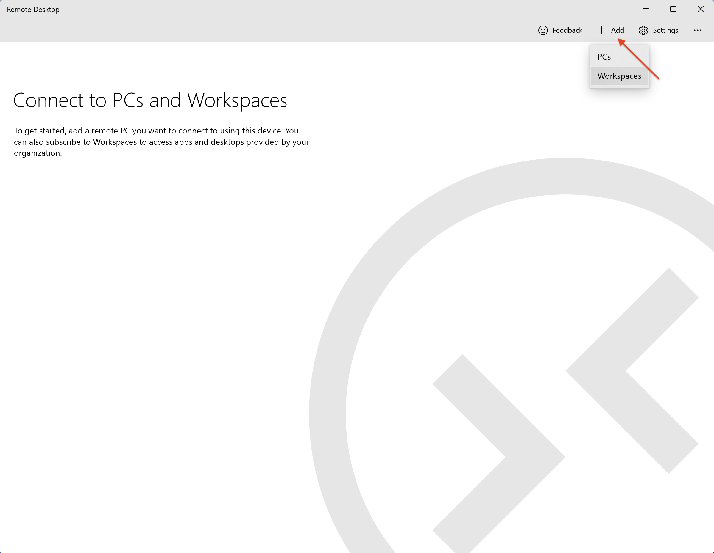
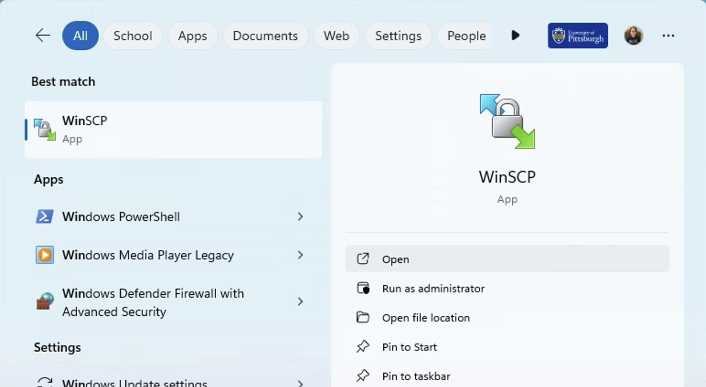

---
hide:
  - toc
---

# Access CRC Using Azure Virtual Desktop (AVD)

If for whatever reason you are unable to get VPN to work, you can try accessng CRC through AVD. The AVD is a 
cloud-based Windows instance with direct access to PittNet.

A schematic of the process is depicted below.

^^**Definitions**^^

*   **Client** -- this is your computer or internet-connected device
*   **Access Portal** -- one of several remote servers used to submit jobs to the high performance computing clusters or to perform
data management operations
*   **CRC Ecosystem** -- the total footprint of the CRC infrastructure, including high performance computing 
clusters, data storage systems, networking equipment, and software 
*   **Azure Virtual Desktop** -- A cloud-based Windows Remote Desktop that has a direct connection to PittNet

^^**1. Install and Configure Remote Desktop client**^^

You will need to install the [Remote Desktop client](https://learn.microsoft.com/en-us/windows-server/remote/remote-desktop-services/clients/remote-desktop-clients) 
for your OS. The previous link provides instructions for various types of devices. Below, we will only highlight MacOS and Windows. 

!!! example "Installing and Configuring the Remote Desktop client"
    === "MacOS"
        In MacOS, the Windows App client software is distributed through the Mac App Store. Open the the Windows App after download.

        

        Next, add Pitt's Remote Desktop Device by selecting *Add Work or School Account* from the + widget, located towards the upper right-hand 
        corner of the window.

        

        This will take you to the *Microsoft Sign in* panel for authenticating using Pitt Single Sign-On.

        | Authenticate via Pitt Passport| |
        | ----------- | ------------------------------------ |
        | **1** | **2** |
        | **3** | **4** |

    === "Windows"

        In Windows, the Microsoft Remote Desktop software is distributed through the Microsoft App Store. Open Remote Desktop installer after download.
        

        Next, add Pitt's Workspaces by selecting *Workspaces* from the **+ Add** widget, located towards the upper right-hand
        corner of the window.

        

        This will take you to the *Subscribe to a Workspace* window where you will be asked to sign in using your Pitt credentials..

        

        | Authenticate via Pitt Passport| |
        | ----------- | ------------------------------------ |
        | **1** | **2** |
        | **3** | **4** |

^^**2. Connecting to an AVD Device**^^

!!! example "Connecting to a Remote Device"
    === "MacOS"

        After successful authentication, you will be presented with list of authorized remote Devices that you can connect to. Your
        device list may be different from what is shown below. The *Device* we wish to log in to is **Pitt IT - Virtual Student Computing Lab**.

        

        Double clicking on that selection will prompt for your Pitt credentials.

        

        You will see the Remote Windows Desktop after successful login. From this remote portal, you can access CRC.

        

    === "Windows"

        After successful authentication, you will be presented with list of authorized Workspaces that you can connect to. Your
        Workspaces may be different from what is shown below. The *Workspace* we wish to log in to is **Pitt IT - Virtual Student Computing Lab**.

        

        Double clicking on that selection will prompt for your Pitt credentials.

        | Authenticate via Pitt Passport| |
        | ----------- | ------------------------------------ |
        | **1** | **2** |

        You will see the Remote Windows Desktop after successful login. From this remote portal, you can access CRC.

        

^^**3. Various Methods Connecting to CRC**^^

!!! example "Options for Connecting to CRC"

    === "Full Desktop Overview of all Tools"

        Shown below is the Desktop of the Virtual Computing Lab, where there are active connections
        to CRC using

        * **PuTTY**
        * **WinSCP**
        * **MobaXterm**
        * **Viz, Open OnDemand portals via a web browser**

        

         
         
         
         
         
         
         

    === "PuTTY"
        Search for and launch the PuTTY app from the Windows Start Menu.

        

        Fill in the PuTTY Configuration using the following values:

        * **Host Name (or IP address):** h2p.crc.pitt.edu or htc.crc.pitt.edu
        * **Port:** 22
        * **Connection type:** SSH

        You might also want to Save the profile under a name for quick loading in the future.

        

        When you first connect, you may see the following PuTTY Security Alert message below. Select Accept.

        

        The login credentials are your  Pitt username (all lowercase) and password.

        

        A successful authentication will present you with a terminal to one of the CRC login nodes.

        

    === "WinSCP"
        Transfer of files from the AVD to CRC can be done using WinSCP. Go to the Windows Start Menu
        and search for the WinSCP app.

        

        Fill in the Login Session panel using the following values:

        * **File protocol:** SFTP
        * **Host name:** h2p.crc.pitt.edu or htc.crc.pitt.edu
        * **Port number:** 22
        * **User name:** your Pitt username all in lowercase
        * **Password:** your Pitt password

        

        You might want to Save the session under a Site name for quick loading in the future.
        Press Login to initiate the connection.

        

        When you first connect, you may see the following Warning message below. Select Accept.

        

        Enter the password again if prompted.

        

        A successful connection will present a window with two panes. The left side shows 
        the filesystem on the AVD device, while the right side shows your $HOME folder 
        on CRC.

        

        You can transfer files between the two filesystems by dragging and dropping between the
        two panes.

        

        When terminating a session, you may be prompted with the option to save the workspace.

        

    === "MobaXterm"
        Within the AVD, point your browser to the [Download page](https://mobaxterm.mobatek.net/download-home-edition.html) 
        to get the Portable edition of the software.

        

        Navigate to the directory where the MobaXterm zip file was saved and double click on it to extract. Go into the 
        resulting software directory and run the MobaXterm program.

        

        Click on the Session widget to open the settings panel. Select the SSH option and fill in the Basic SSH setting 
        with the following values:

        * **Remote host:** h2p.crc.pitt.edu or htc.crc.pitt.edu
        * **Specify username:** your Pitt username in all lowercase
        * **Port:** 22

        followed by clicking on OK.

        

        Input your Pitt password. If the authentication becomes successful, you may be prompted to
        save your password. Make sure your Master Password is super strong if you decide to 
        save your Pitt password locally on the AVD device. Selecting No will result in MobaXterm
        prompting for your password when you login again. 

        

        A successful authentication will drop you onto the commandline on one of the CRC login nodes.
 
        

        By default, X-forwarding is enable on MobaXterm, giving you the capability to
        to display GUI applications through the included X server.

        

    === "CRC Webportals"

        From within the AVD, all CRC webportals are accessible, including

        * **Open OnDemand:** [https://ondemand.htc.crc.pitt.edu](https://ondemand.htc.crc.pitt.edu)
  
        

        

        * **Viz Linux Desktop:** [https://viz.crc.pitt.edu](https://viz.crc.pitt.edu)

        

        

        
