---
hide:
  - toc
---

# Access CRC HIPAA Environment via Azure Virtual Desktop (AVD)

The CRC HIPAA Environment is where you can do computation on [**regulated data**](https://www.technology.pitt.edu/security/data-risk-classification-and-compliance-operating-standard)
containing Protected Health Information (PHI),
particularly data containing any of the 18 [**HIPAA identifiers**](https://www.hrpo.pitt.edu/hipaa-safe-harbor-vs-limited-data-set). This environment is restricted
to authorized users on projects that are covered under an approved IRB application. Pitt managed devices that meet the restricted HIP (Host Information Profile) check
can directly access the portals. For most users, the method of access will be through the AVD. The documentation below describes how to set up AVD for accessing the 
HIPAA environment.

A schematic of the process is depicted below.

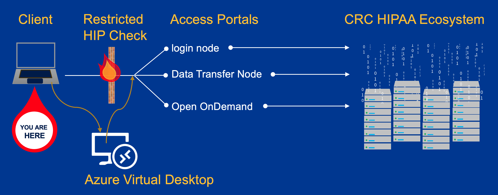

^^**Definitions**^^

*   **Client** -- this is your computer or internet-connected device
*   **HIP Check** -- The Host Information Profile ([**HIP**](https://live.paloaltonetworks.com/t5/community-blogs/leveraging-host-information-profile-hip/ba-p/291126)) 
feature within GlobalProtect permits the system to collect information about the security status of 
the endpoint to determine whether to allow or deny access based on defined policies.
*   **Access Portal** -- one of several remote servers used to submit jobs to the high performance computing clusters or to perform
data management operations
*   **CRC HIPAA Ecosystem** -- the total footprint of the CRC HIPAA infrastructure, including a high performance computing 
cluster, a data storage system, access portals, networking equipment, and software 
*   **Azure Virtual Desktop** -- A cloud-based Windows Remote Desktop that has a direct connection to PittNet

##**1. ^^Install and Configure Remote Desktop client^^**

You will need to install the [Remote Desktop client](https://learn.microsoft.com/en-us/windows-server/remote/remote-desktop-services/clients/remote-desktop-clients) 
for your OS. The previous link provides instructions for various types of devices. Below, we will only highlight MacOS and Windows. 

!!! example "Installing and Configuring the Remote Desktop client"
    === "MacOS"
        In MacOS, the Windows App client software is distributed through the Mac App Store. Open the the Windows App after download.

        

        Next, add Pitt's Remote Desktop Device by selecting *Add Work or School Account* from the + widget, located towards the upper right-hand 
        corner of the window.

        

        This will take you to the *Microsoft Sign in* panel for authenticating using Pitt Single Sign-On.

        | Authenticate via Pitt Passport| |
        | ----------- | ------------------------------------ |
        | **1** | **2** |
        | **3** | **4** |

    === "Windows"

        In Windows, the Microsoft Remote Desktop software is distributed through the Microsoft App Store. Open Remote Desktop installer after download.
        

        Next, add Pitt's Workspaces by selecting *Workspaces* from the **+ Add** widget, located towards the upper right-hand
        corner of the window.

        

        This will take you to the *Subscribe to a Workspace* window where you will be asked to sign in using your Pitt credentials..

        

        | Authenticate via Pitt Passport| |
        | ----------- | ------------------------------------ |
        | **1** | **2** |
        | **3**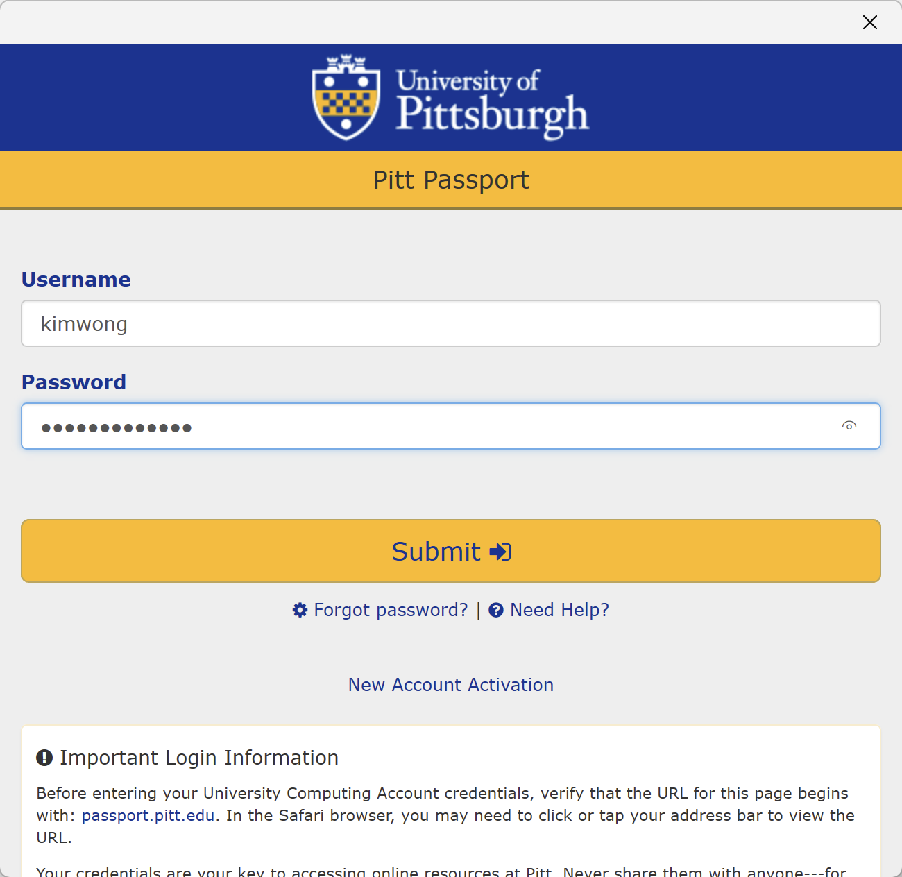 | **4** |

##**2. ^^Connecting to an AVD Device^^**

!!! example "Connecting to a Remote Device"
    === "MacOS"

        After successful authentication, you will be presented with list of authorized remote Devices that you can connect to. Your
        device list may be different from what is shown below, depending on your role. Authorized users of the HIPAA environment will
        see a *Device* called **Center for Research Computing Restricted**. 
        If you do not see this *Device* but should have access, please submit a
        [**help ticket**](https://services.pitt.edu/TDClient/33/Portal/Requests/TicketRequests/NewForm?ID=yXkHi62rHa8_&RequestorType=Service),
        stating that you need authorization to use AVD to access the CRC HIPAA environment.

        

        Double clicking on that selection will prompt for your Pitt credentials.

        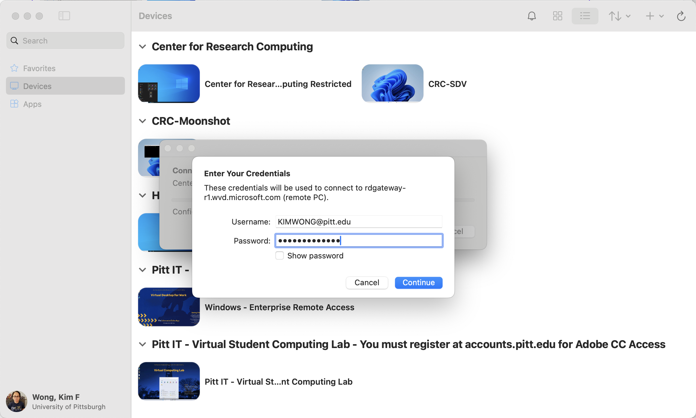

        You will see the Remote Windows Desktop after successful login. From this remote portal, you can access the HIPAA environment.

        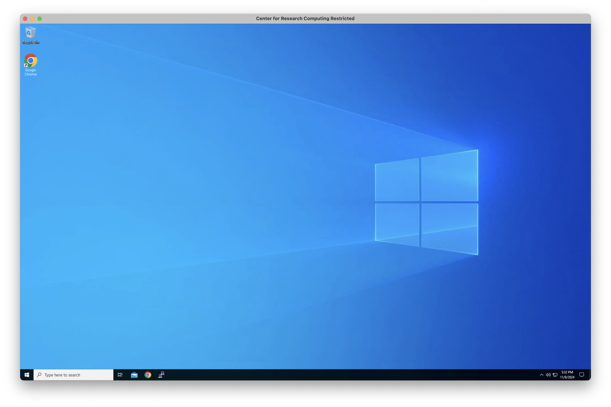

    === "Windows"

        After successful authentication, you will be presented with list of authorized Workspaces that you can connect to. Your
        Workspaces may be different from what is shown below, depending on your role. Authorized users of the HIPAA environment will
        see a *Workspace* called **Center for Research Computing Restricted**.
        If you do not see this *Workspace* but should have access, please submit a
        [**help ticket**](https://services.pitt.edu/TDClient/33/Portal/Requests/TicketRequests/NewForm?ID=yXkHi62rHa8_&RequestorType=Service),
        stating that you need authorization to use AVD to access the CRC HIPAA environment.

        

        Double clicking on that selection will prompt for your Pitt credentials.

        | Authenticate via Pitt Passport| |
        | ----------- | ------------------------------------ |
        | **1** | **2** |

        You will see the Remote Windows Desktop after successful login. From this remote portal, you can access the HIPAA environment.

        

##**3. ^^Various Methods Connecting to CRC^^**

!!! example "Options for Connecting to CRC"

    === "Full Desktop Overview of all Tools"

        Shown below is the Desktop of the Virtual Computing Lab, where there are active connections
        to CRC using

        * **PuTTY**
        * **MobaXterm**
        * **Open OnDemand portal via a web browser**

        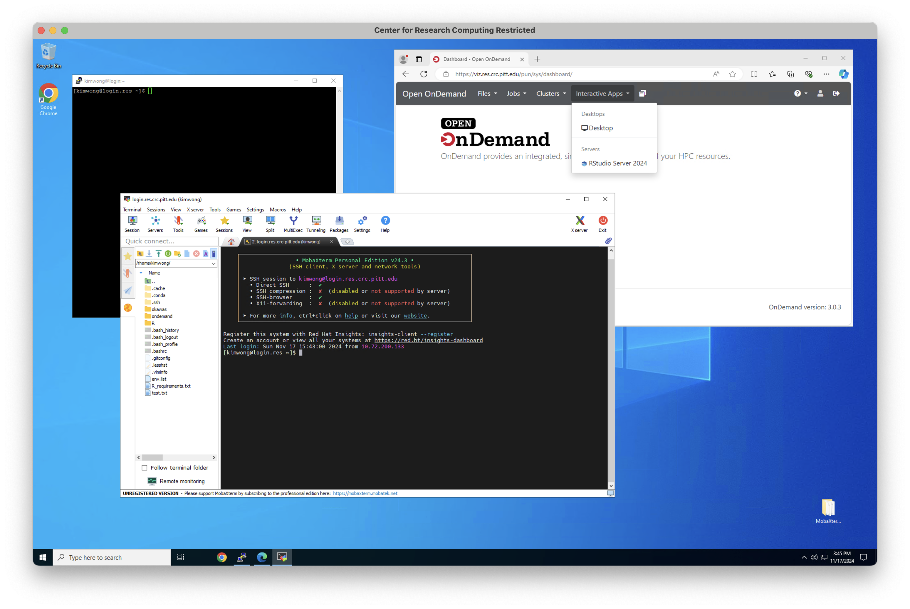

         
         
         
         
         
         
         

    === "PuTTY"
        Search for and launch the PuTTY app from the Windows Start Menu.

        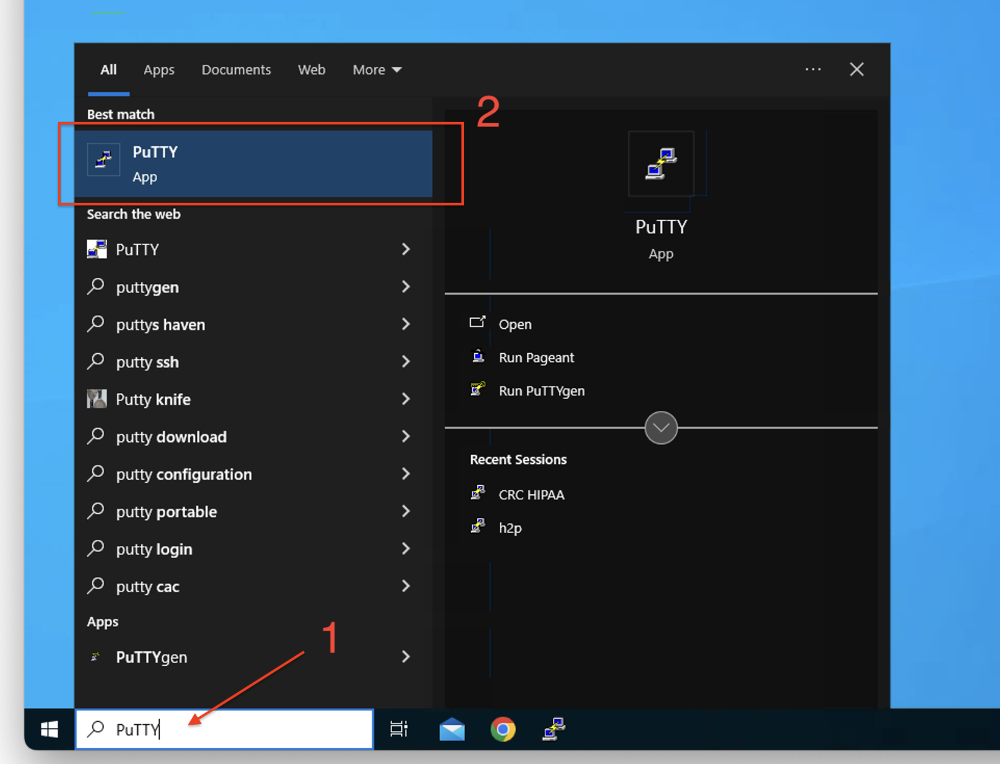

        Fill in the PuTTY Configuration using the following values:

        * **Host Name (or IP address):** login.res.crc.pitt.edu
        * **Port:** 22
        * **Connection type:** SSH

        You might also want to Save the profile under a name for quick loading in the future.

        

        When you first connect, you may see the following PuTTY Security Alert message below. Select Accept.

        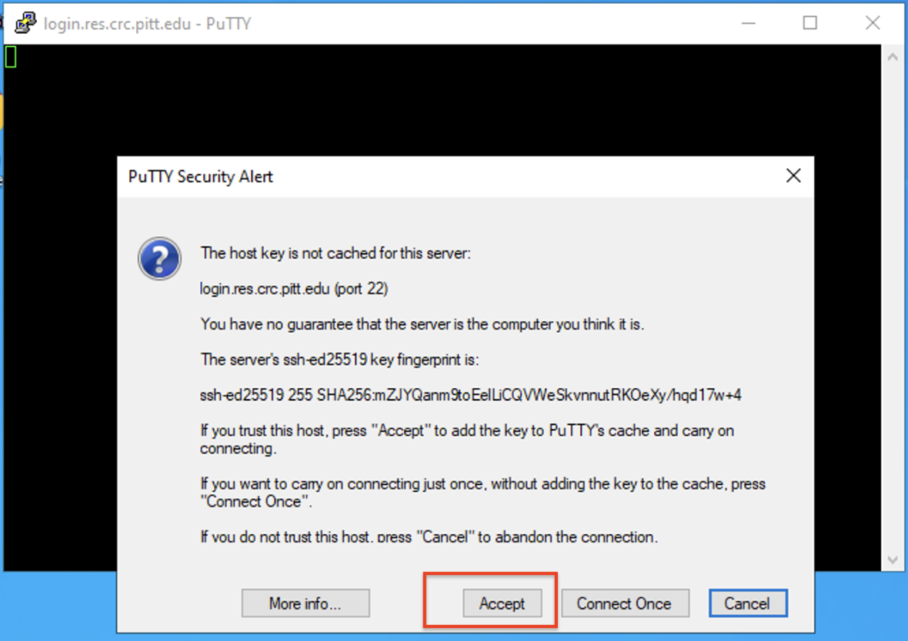

        The login credentials are your  Pitt username (all lowercase) and password.

        

        A successful authentication will present you with a terminal to the CRC HIPAA login node.

        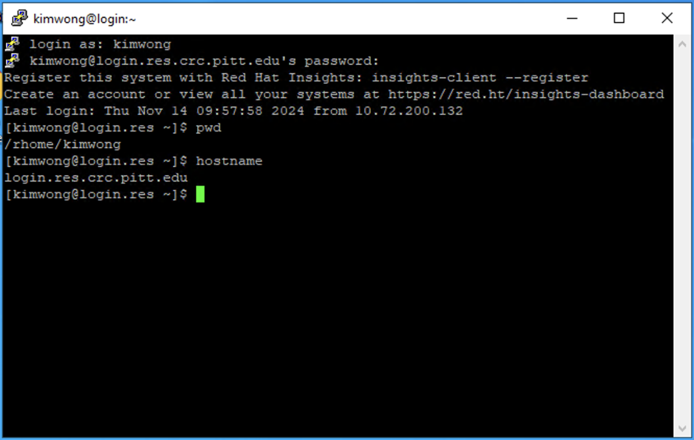

    === "MobaXterm"
        Within the AVD, point your browser to the [**Download page**](https://mobaxterm.mobatek.net/download-home-edition.html) 
        to get the Portable edition of the software.

        !!! warning "End User License Agreement (EULA)"
            Please read the full [**MoabXterm terms and conditions**](https://mobaxterm.mobatek.net/license.html). According to
            the EULA, section **5.1 Right of use**:

            *...*
             
            *Individual end-user is allowed to download (only from MobaXterm website: https://mobaxterm.mobatek.net) and to use 
            MobaXterm Home Edition in a commercial or company environment. However, software installation must be performed by 
            the end-user himself: the user who uses MobaXterm Home Edition inside a company must be the same person who 
            downloaded the software and installed it. It is therefore not allowed to redistribute or deploy MobaXterm Home 
            Edition inside a company. It is also not allowed for multiple users to use a single shared installation of MobaXterm 
            Home Edition in a company, whether at the same time or not. These usages are covered by MobaXterm Professional Edition.*

        

        Navigate to the directory where the MobaXterm zip file was saved and double click on it to extract. Go into the 
        resulting software directory and run the MobaXterm program. 

        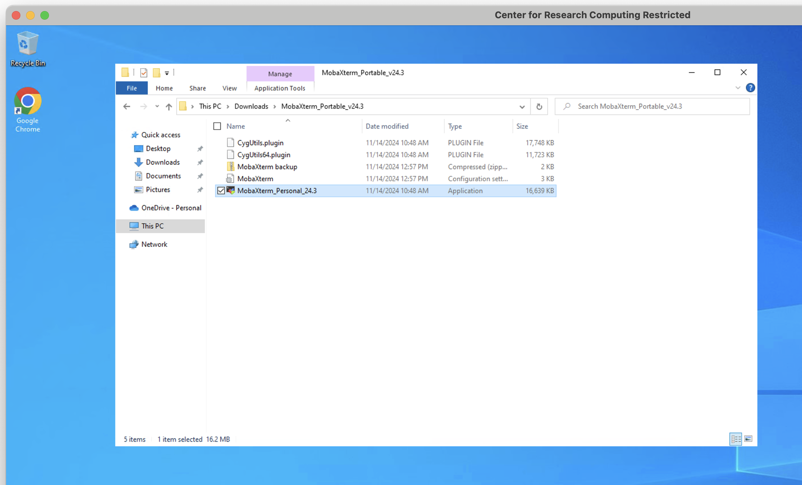

        Click on the Session widget to open the settings panel. Select the SSH option and fill in the Basic SSH setting 
        with the following values:

        * **Remote host:** login.res.crc.pitt.edu
        * **Specify username:** your Pitt username in all lowercase
        * **Port:** 22

        followed by clicking on OK.

        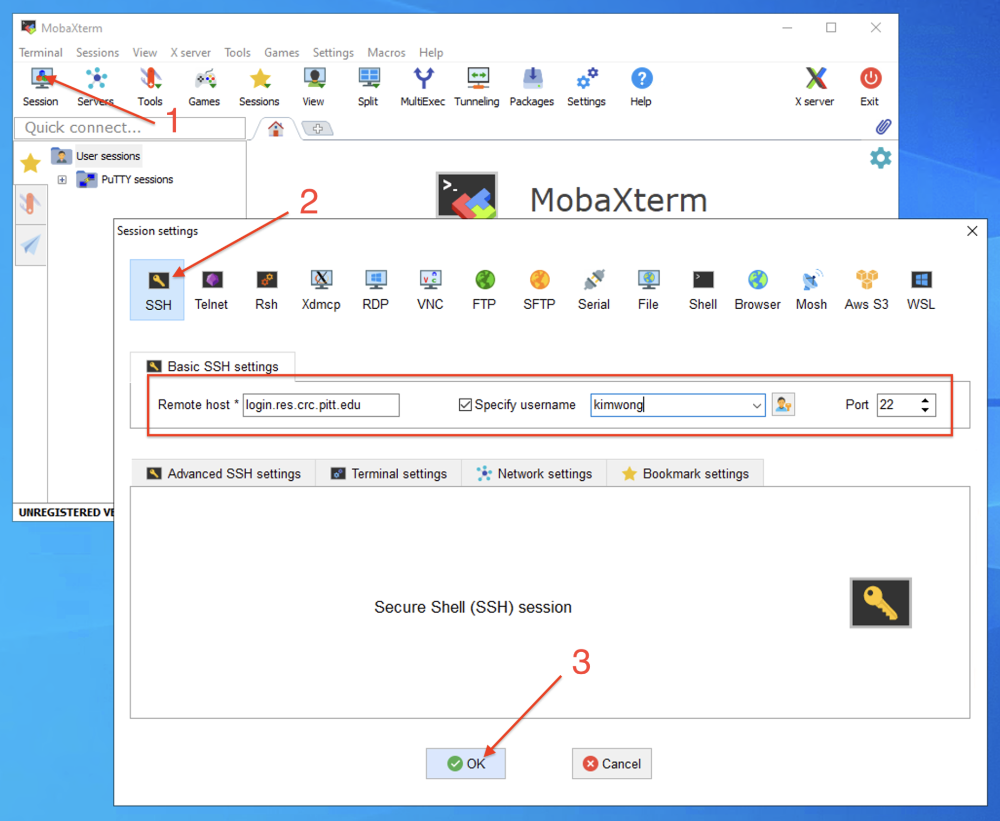

        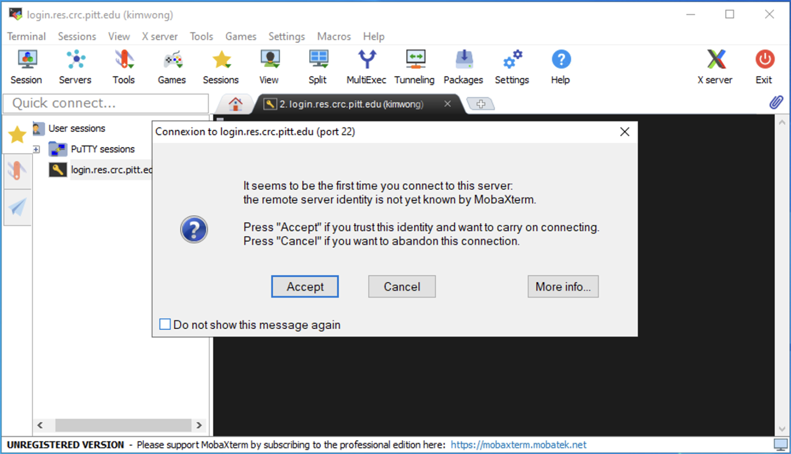

        Input your Pitt password. If the authentication becomes successful, you may be prompted to
        save your password. Make sure your Master Password is super strong if you decide to 
        save your Pitt password locally on the AVD device. Selecting No will result in MobaXterm
        prompting for your password when you login again. 

        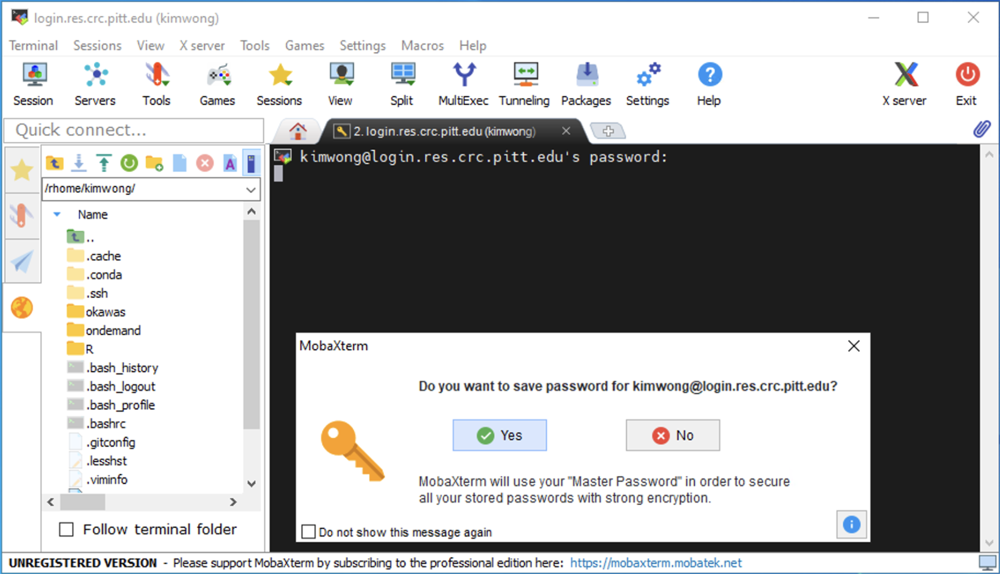

        A successful authentication will drop you onto the commandline on one of the CRC login nodes.
 
        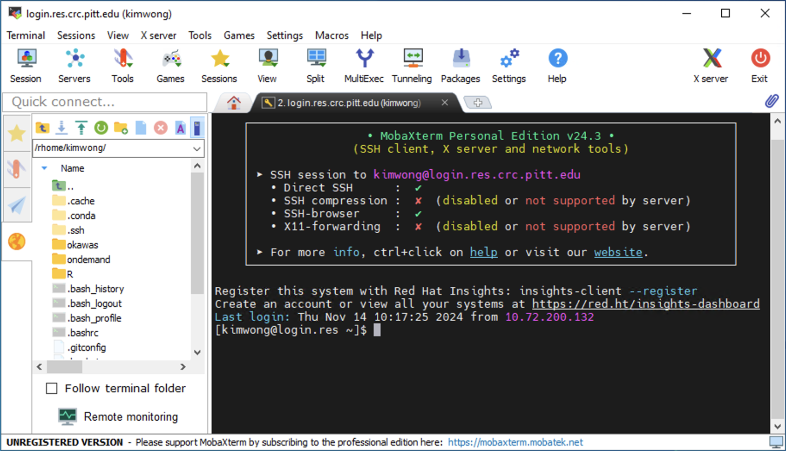

        By default, X-forwarding is enable on MobaXterm, giving you the capability to
        to display GUI applications through the included X server.

        

    === "CRC Webportals"

        From within the AVD, all CRC webportals are accessible, including

        * **Open OnDemand:** [https://ondemand.res.crc.pitt.edu](https://ondemand.res.crc.pitt.edu)
  
        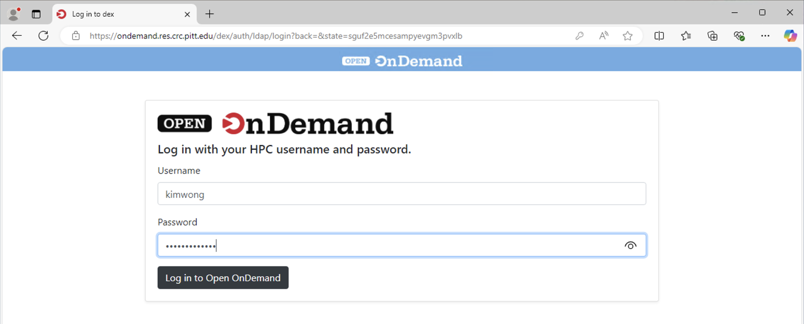

        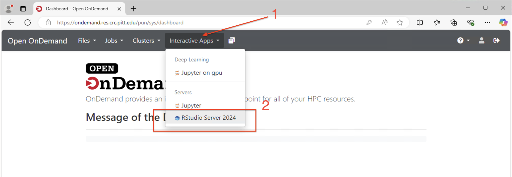

        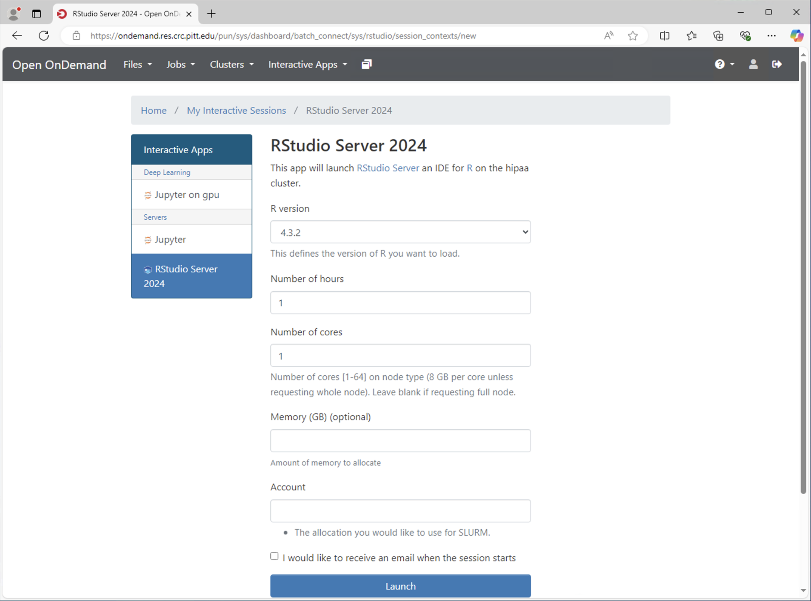

##**4. ^^Recommendations on setting up your software environment^^**

The CRC team will work with you to set up the software environment. Where self service is possible, we will point
you to the appropriate documentation that shows you how to do this yourself. If you run into problems, please 
submit a [**help ticket**](https://services.pitt.edu/TDClient/33/Portal/Requests/TicketRequests/NewForm?ID=yXkHi62rHa8_&RequestorType=Service)
and we will engage in finding the solution. We summarize below, the best practices for various software.

*   **R and RStudio** -- Most users will already have a working environment and will want to transfer 
packages from there to the CRC HIPAA environment. Here is a 
[**blog post**](https://www.r-bloggers.com/2017/07/quick-way-of-installing-all-your-old-r-libraries-on-a-new-device/) that
shows how to automate the package installation process in three steps.

*   **Python** -- The CRC provides [**guidance on setting up a Python environment**](../applications/python.md). One
way clone an environment from one system to another is to create a requirements file and then to use that for the 
package installation in the other system. This is described in 
the [**pip documentation**](https://pip.pypa.io/en/latest/user_guide/#requirements-files).

##**5. ^^Ending your AVD session^^**

Once you are done with your work session, be sure to Sign out.

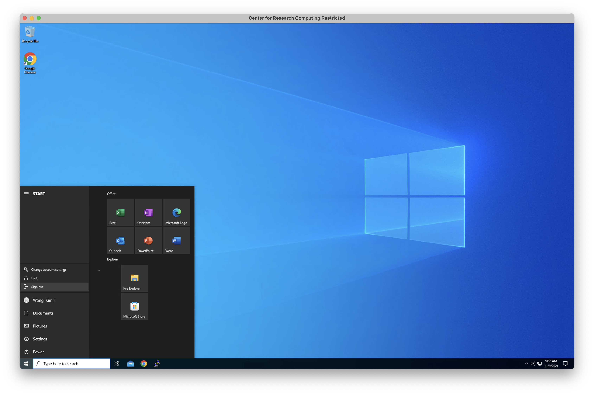
