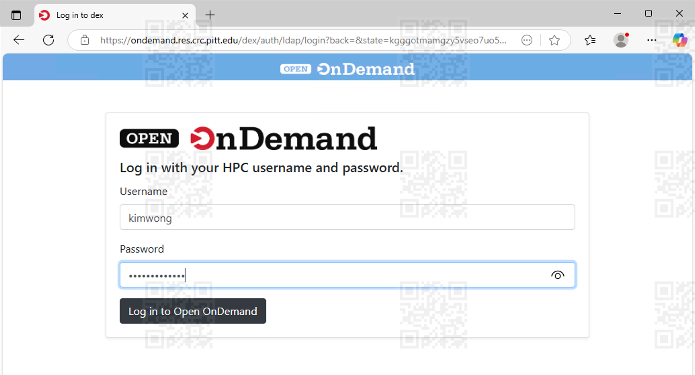

---
hide:
  - toc
---

# Access CRCD SRE via Azure Virtual Desktop (AVD)

The CRCD Secure Research Environment (SRE) is where you can do computation on [**regulated data**](https://www.technology.pitt.edu/security/data-risk-classification-and-compliance-operating-standard)
requiring NIST SP 800-171 compliance (self-attested) and is suitable for satisfying controlled-access data requirements from NSF and NIH. It is suitable for 
storing data containing Protected Health Information (PHI),
particularly data containing any of the 18 [**HIPAA identifiers**](https://www.hrpo.pitt.edu/hipaa-safe-harbor-vs-limited-data-set). This environment is restricted
to authorized users on projects that are covered under an approved IRB application or data use agreement (DUA). The documentation below describes how to set up AVD for accessing the 
CRCD SRE.

A schematic of the process is depicted below.

^^**Definitions**^^

*   **Client** -- this is your computer or internet-connected device
*   **Access Portal** -- one of several remote servers used to submit jobs to the high performance computing clusters or to perform
data management operations
*   **CRCD SRE** -- the total footprint of the CRCD Secure Research Environment, including a high performance computing 
cluster, a data storage system, access portals, networking equipment, and software 
*   **Azure Virtual Desktop** -- A cloud-based Windows Remote Desktop that has a direct connection to the CRCD SRE 

##**1. ^^Install and Configure Remote Desktop client^^**

You will need to install the [Remote Desktop client](https://learn.microsoft.com/en-us/windows-server/remote/remote-desktop-services/clients/remote-desktop-clients) 
for your OS. The previous link provides instructions for various types of devices. Below, we will only highlight MacOS and Windows. 

!!! example "Installing and Configuring the Remote Desktop client"
    === "MacOS"
        In MacOS, the Windows App client software is distributed through the Mac App Store. Open the the Windows App after download.

        

        Next, add Pitt's Remote Desktop Device by selecting *Add Work or School Account* from the + widget, located towards the upper right-hand 
        corner of the window.

        

        This will take you to the *Microsoft Sign in* panel for authenticating using Pitt Single Sign-On.

        | Authenticate via Pitt Passport| |
        | ----------- | ------------------------------------ |
        | **1** | **2** |
        | **3** | **4** |

    === "Windows"

        In Windows, the Microsoft Remote Desktop software is distributed through the Microsoft App Store. Open Remote Desktop installer after download.
        

        Next, add Pitt's Workspaces by selecting *Workspaces* from the **+ Add** widget, located towards the upper right-hand
        corner of the window.

        

        This will take you to the *Subscribe to a Workspace* window where you will be asked to sign in using your Pitt credentials..

        

        | Authenticate via Pitt Passport| |
        | ----------- | ------------------------------------ |
        | **1** | **2** |
        | **3** | **4** |

##**2. ^^Connecting to an AVD Device^^**

!!! example "Connecting to a Remote Device"
    === "MacOS"

        After successful authentication, you will be presented with list of authorized remote Devices that you can connect to. Your
        device list may be different from what is shown below, depending on your role. Authorized users of the Secure Research Environment will
        see a *Device* called **CRCD-SRE**. 
        If you do not see this *Device* but should have access, please submit a
        [**help ticket**](https://services.pitt.edu/TDClient/33/Portal/Requests/TicketRequests/NewForm?ID=yXkHi62rHa8_&RequestorType=Service),
        stating that you need authorization to use AVD to access the CRCD Secure Research Environment.

        

        Double clicking on that selection will prompt for your Pitt credentials.

        

        You will see the Remote Windows Desktop after successful login. From this remote portal, you can access the Secure Research Environment.

        

    === "Windows"

        After successful authentication, you will be presented with list of authorized Workspaces that you can connect to. Your
        Workspaces may be different from what is shown below, depending on your role. Authorized users of the HIPAA environment will
        see a *Workspace* called **CRCD-SRE**.
        If you do not see this *Workspace* but should have access, please submit a
        [**help ticket**](https://services.pitt.edu/TDClient/33/Portal/Requests/TicketRequests/NewForm?ID=yXkHi62rHa8_&RequestorType=Service),
        stating that you need authorization to use AVD to access the CRCD Secure Research Environment.

        

        Double clicking on that selection will prompt for your Pitt credentials.

        | Authenticate via Pitt Passport| |
        | ----------- | ------------------------------------ |
        | **1** | **2** |

        You will see the Remote Windows Desktop after successful login. From this remote portal, you can access the HIPAA environment.

        

##**3. ^^Various Methods Connecting to CRCD SRE^^**

!!! example "Options for Connecting to CRCD SRE"

    === "Full Desktop Overview of all Tools"

        Shown below is the Desktop of the CRCD-SRE AVD, where there are active connections
        to CRCD using

        * **PuTTY**
        * **Open OnDemand portal via a web browser**

        

         
         
         
         
         
         
         

    === "PuTTY"
        Search for and launch the PuTTY app from the Windows Start Menu.

        

        Fill in the PuTTY Configuration using the following values:

        * **Host Name (or IP address):** login.res.crc.pitt.edu
        * **Port:** 22
        * **Connection type:** SSH

        You might also want to Save the profile under a name for quick loading in the future.

        

        When you first connect, you may see the following PuTTY Security Alert message below. Select Accept.

        

        The login credentials are your  Pitt username (all lowercase) and password.

        

        A successful authentication will present you with a terminal to the CRCD SRE login node.

        

    === "CRCD Webportals"

        From within the AVD, all CRCD webportals are accessible, including

        * **Open OnDemand:** [https://ondemand.res.crc.pitt.edu](https://ondemand.res.crc.pitt.edu)
  
        

        

        

##**4. ^^Recommendations on setting up your software environment^^**

The CRCD team will work with you to set up the software environment. Where self service is possible, we will point
you to the appropriate documentation that shows you how to do this yourself. If you run into problems, please 
submit a [**help ticket**](https://services.pitt.edu/TDClient/33/Portal/Requests/TicketRequests/NewForm?ID=yXkHi62rHa8_&RequestorType=Service)
and we will engage in finding the solution. We summarize below, the best practices for various software.

*   **R and RStudio** -- Most users will already have a working environment and will want to transfer 
packages from there to the CRCD SRE. Here is a 
[**blog post**](https://www.r-bloggers.com/2017/07/quick-way-of-installing-all-your-old-r-libraries-on-a-new-device/) that
shows how to automate the package installation process in three steps.

*   **Python** -- The CRCD provides [**guidance on setting up a Python environment**](../applications/python.md). One
way clone an environment from one system to another is to create a requirements file and then to use that for the 
package installation in the other system. This is described in 
the [**pip documentation**](https://pip.pypa.io/en/latest/user_guide/#requirements-files).

##**5. ^^Ending your AVD session^^**

Once you are done with your work session, be sure to Sign out.

