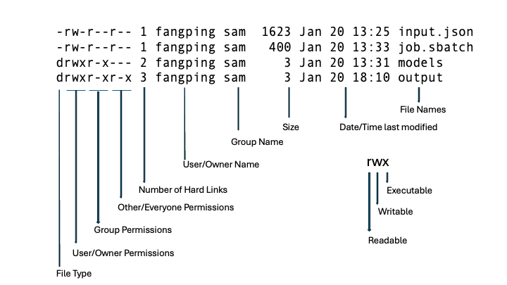

# File Systems and Data Management

## Data Storage options in the CRCD Environment

### User Home Directories
Every individual user has a home directory (under /ihome/<primary group>/$USER, environment variable $HOME) for permanently storing code and important configuration files. Home Directories provide limited storage space (75 GB). Users can check their quota utilization using the crc-quota command. User home directories are backed up daily. Users can use command id to display user and group names along with their numeric IDs.
