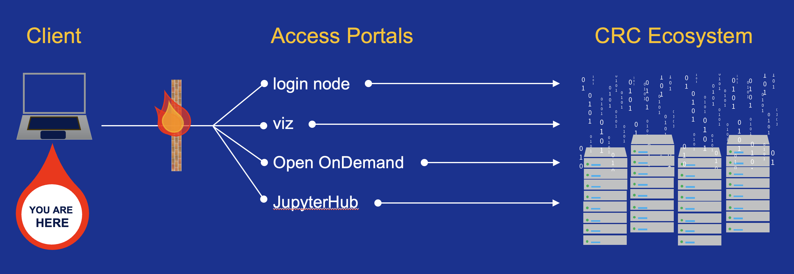

# Big Picture Overview

The University of Pittsburgh provides its research community access to high performance computing and data storage
resources. These systems are maintained and supported through the Center for Research Computing (CRC) and Pitt IT.
To get started, you will need a CRC account, with which you will use to login to Access Portals to interact with
the CRC Ecosystem.

A schematic of the process is depicted below.

<ins>**Definitions**</ins>

* **Client** -- this is your computer or internet-connected device
* **Access Portal** -- one of several remote servers used to submit jobs to the high performance computing clusters or
  to perform
  data management operations
* **CRC Ecosystem** -- the total footprint of the CRC infrastructure, including high performance computing
  clusters, data storage systems, networking equipment, and software

<ins>**Available Resources**</ins>

<link rel="stylesheet" href="https://cdn.datatables.net/1.13.4/css/jquery.dataTables.min.css">
<table class="display cell-border" id="aTable">
    <thead>
        <tr>
            <td>Cluster Acronym</td>
            <td>Full Form of Acronym</td>
            <td>Description of Use Cases</td>
        </tr>
    </thead>
    <tbody>
        <tr>
            <td>mpi</td>
            <td>Message Passing Interface
            <td>For tightly coupled parallel codes that use the Message Passing Interface APIs for distributing computation 
                across multiple nodes, each with its own memory space
        </tr>
        <tr>
            <td>htc</td>
            <td>High Throughput Computing</td>
            <td>For genomics and other health sciences-related workflows that can run on a single node
        </tr>
        <tr>
            <td>smp</td>
            <td>Shared Memory Processing</td>
            <td>For jobs that can run on a single node where the CPU cores share a common memory space</td>
        </tr>
        <tr>
            <td>gpu</td>
            <td>Graphics Processing Unit</td>
            <td>For AI/ML applications and physics-based simulation codes that had been written to take advantage of accelerated
                computing on GPU cores</td>
        </tr>
    </tbody>
</table>

