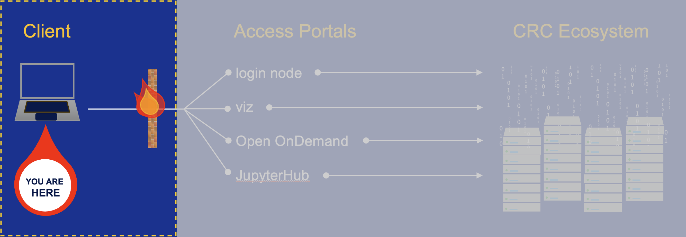

---
hide:
  - toc
---

# Step 1- Getting an Account

Access to the CRC Ecosystem requires a CRC account and an accompanying resource allocation. 
All active Pitt faculty, instructors, or center directors can request a resource allocation using the webform from
our [**service catalog**](https://crc.pitt.edu/service-request-forms). 

The CRC Ecosystem is hosted at the Pitt data center and is firewalled within PittNet. You will first need to establish 
a [**VPN**](https://services.pitt.edu/TDClient/33/Portal/KB/ArticleDet?ID=293) in order to gain access.

!!! tip "Alternative Access Point: AVD"
    If after exhausting all troubleshooting avenues and the VPN remains non-functional, an alternative approach is to use an
    [**Azure Virtual Desktop**](access_avd.md) as a so-called *jump box* to CRC.

    ==**CRCD users on UPMC devices**==, please follow these [**instructions**](upmc_avd.md) for connecting to the HSIT-AVD instance.

!!! warning "Deprecation Notice"
    The HIPAA environment has been upgraded to the NIST SP 800-171 standard (self-attested). Please see the instructions below under
    **Accessing the CRCD Secure Research Environment (SRE)**.
    !!! tip "~~Accessing the HIPAA environment~~"
        ~~The CRC HIPAA environment can be accessed using a secured [**Azure Virtual Desktop**](access_hipaa.md). Only projects with an 
        IRB approval can reside within this restricted environment.~~

!!! tip "Accessing the CRCD Secure Research Environment (SRE)"
    The CRCD SRE can be accessed using a secured [**Azure Virtual Desktop**](access_sre.md). Only projects with an
    IRB approval or a data user agreement (DUA) requiring NIST SP 800-171 compliance can reside within this restricted environment.

A schematic of this part of the process is highlighted below.

<ins>**Definitions**</ins>

*   **Resource allocation** -- an allotment of computing time and/or data storage quota
*   **Client** -- this is your computer or internet-connected device
*   **PittNet** -- the internal University network
*   **Firewall** -- a network security device that monitors and filters incoming and outgoing network traffic based on an organization's previously established security policies
