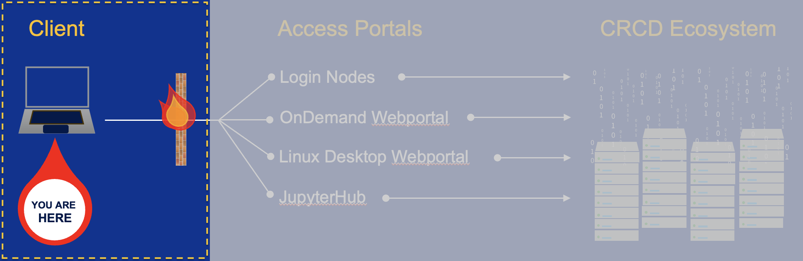

---
hide:
  - toc
---

# Step 1- Getting an Account

!!! abstract "In this step"
    Request your CRCD account and allocation, and set up the PittNet VPN so you
    can reach the clusters. Next: [Step 2 — logging in](step2/index.md).

Access to the CRCD Ecosystem requires a CRCD account and an accompanying Resource Allocation. All active Pitt faculty, 
instructors, or center directors can request a resource allocation using the *One-time Startup Allocation*
webform from our [**service catalog**](https://crc.pitt.edu/service-request-forms). 

The CRCD Ecosystem is hosted at the Pitt data center and is firewalled within PittNet. You will first need to establish 
a [**VPN**](https://services.pitt.edu/TDClient/33/Portal/KB/ArticleDet?ID=3426) in order to gain access.

!!! tip "Alternative Access Point: AVD"
    If after exhausting all troubleshooting avenues and the VPN remains non-functional, an alternative approach is to use an
    [**Azure Virtual Desktop**](access_avd.md) as a so-called *jump box* to CRCD.

    ==**CRCD users on UPMC devices**==, please follow these [**instructions**](upmc_avd.md) for connecting to the HSIT-AVD instance.

!!! tip "Accessing the CRCD Secure Research Environment (SRE)"
    The CRCD SRE can be accessed using a secured [**Azure Virtual Desktop**](access_sre.md). Only projects with an
    IRB approval or a data user agreement (DUA) requiring NIST SP 800-171 compliance can reside within this restricted environment.

A schematic of this part of the process is highlighted below.

