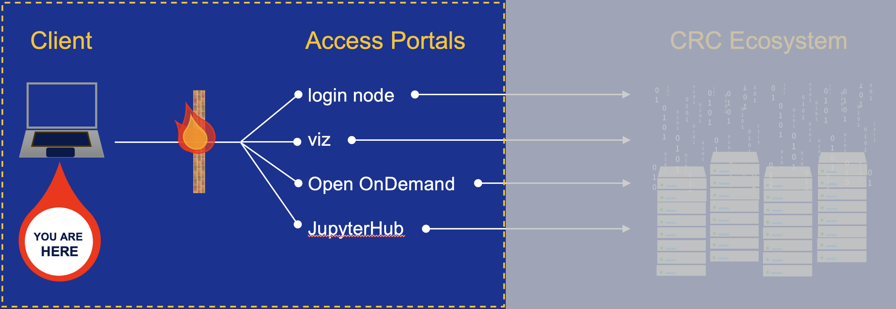

# Step 2: Login to Access Portals

Once you have established a VPN to PittNet, you can access the CRC advanced computing and storage resources via
several portals, including

* [**SSH connection using a terminal**](../web-portals/terminal.md)
* [**Linux Desktop webportal**](../web-portals/viz.md)
* [**Open OnDemand webportal**](../web-portals/open-ondemand.md)
* [**JupyterHub webportal**](../web-portals/jupyter-hub.md)

A schematic of this part of the process is highlighted below.

## Guidance on appropriate usage of access portals

Many users are logged into the CRC login nodes. These are the gateways everyone uses to perform interactive
work like editing code, submitting and checking the status of jobs, etc.

Executing processing scripts or commands on these nodes can cause substantial slowdowns for the rest of the users.
For this reason, it is important to make sure that this kind of work is done in either an interactive session on a node
from one of the clusters, or as a batch job submission.

Resource-intensive processes found to be running on the login nodes may be killed at anytime.

<ins>**The CRC team reserves the right to revoke cluster access of any user who repeatedly causes slowdowns on the login
nodes with processes that can otherwise be run on the compute nodes.**</ins>
