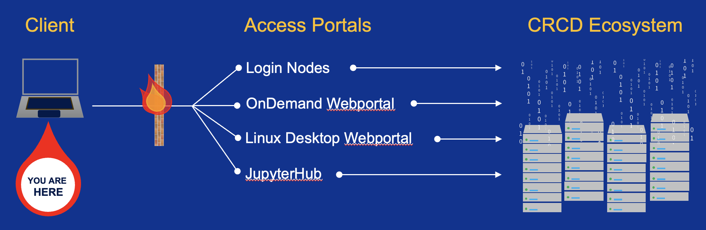

---
hide:
  - toc
---

# Big Picture Overview

!!! tip "New to HPC?"
    Unfamiliar with a term? The [Glossary](../glossary.md) explains the words and
    acronyms used throughout this manual. You'll also see some acronyms — like SU
    or MPI — with a dotted underline: hover over one (or tap on a touch screen)
    to read its definition without leaving the page.

The University of Pittsburgh provides its research community access to high performance computing, data storage, software, and
domain expertise. These systems/services are maintained and supported through the Center for Research Computing and Data (CRCD)
and Pitt Digital. To get started, you will need a CRCD account, with which you will use to login to Access Portals to interact with
the CRCD Ecosystem.

A schematic of the process is depicted below.

##Definitions##

- **Client** -- your computer or internet-connected device.
- **Access Portal** -- one of several remote servers used to submit jobs to the high performance computing clusters or to perform data-management operations.
- **CRCD Ecosystem** -- the total footprint of the CRCD infrastructure: high performance computing clusters, data-storage systems, networking equipment, and software.

##Who has Access?##

The [**CRCD-P3: Open Science Research Computing and Data Environment Usage Policy**](https://crc.pitt.edu/sites/default/files/assets/CRC%20P3%20Open%20Science%20Research%20Computing%20and%20Data%20Environment%20Usage%20Policy.pdf) defines
the scope of access. Briefly, these computing and data resources are available to all Pitt faculty, instructors, Emeritus faculty or center
directors. These PIs, in turn, can request access for their students, post doctoral fellows, and staff. Access for Pitt alumni and external
collaborators are possible through the [**Sponsored Account**](sponsored_account.md) mechanism.

##Available Resources##

CRCD's hardware is profiled in detail under [**Hardware Profiles**](../hardware_profiles/index.md).
The resources available to you span compute clusters, the nodes you connect through,
and tiered storage for your data:

| Type               | Resource                                    | Best for                                                                                     |
| ------------------ | ------------------------------------------- | -------------------------------------------------------------------------------------------- |
| Compute cluster    | [SMP](../hardware_profiles/smp.md)          | Single-node jobs whose cores share one memory space (symmetric multiprocessing)              |
| Compute cluster    | [HTC](../hardware_profiles/htc.md)          | Many independent single-node jobs (high-throughput computing); genomics and health sciences  |
| Compute cluster    | [MPI](../hardware_profiles/mpi.md)          | Tightly coupled codes spanning multiple nodes via the Message Passing Interface              |
| Compute cluster    | [GPU](../hardware_profiles/gpu.md)          | AI/ML and physics-based simulations that use GPU acceleration                                |
| Compute cluster    | [Teach](../hardware_profiles/teach.md)      | Classroom instruction and coursework                                                         |
| Access & auxiliary | [Login nodes](../hardware_profiles/login.md) | The shared entry point for submitting jobs and managing files — not for heavy computation    |
| Access & auxiliary | [Viz](../hardware_profiles/viz.md)          | Interactive visualization and GUI applications on a Linux desktop                            |
| Storage            | [Storage tiers](../hardware_profiles/storage.md) | Performance (flash), Standard (disk), and archive storage, allocated per research group  |

Beyond hardware, CRCD also provides [**software**](../applications/software-list.md) through the
module system and [**consulting and domain expertise**](https://crc.pitt.edu/consulting-services).
