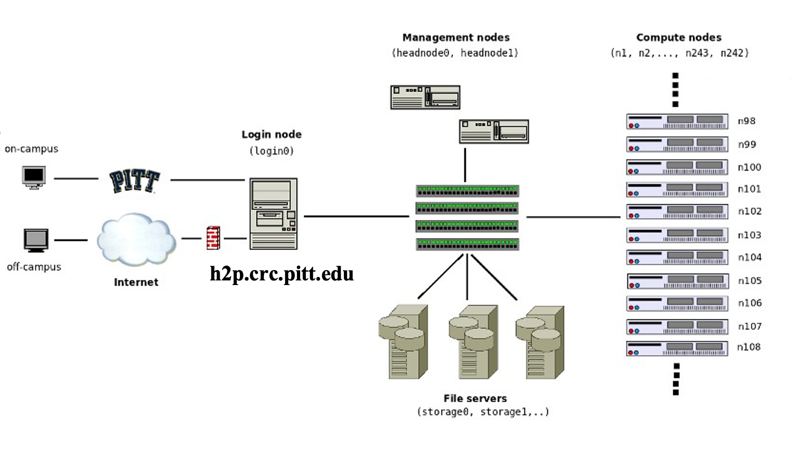
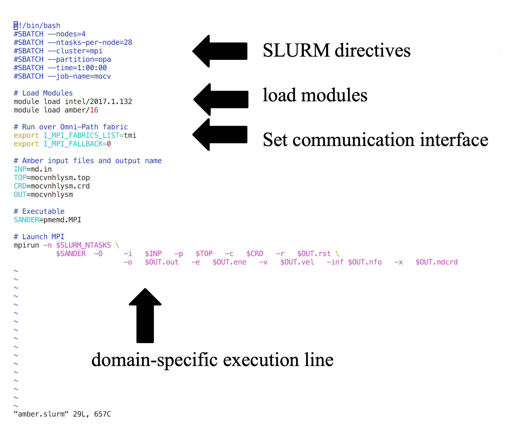

# CRCD Overview
## Mission

The Center for Research Computing and Data (CRCD) supports leading-edge research with free access to advanced computing 
hardware and software for fields across the entire research community, along with training and consultation by CRCD 
research faculty. We primarily offer the following services:

- Access to cutting-edge computer hardware and software for enabling transformative research
- Workshops teaching the most effective ways to use the CRCD's High Performance Computing (HPC) resources
- Personalized consultation on refining projects at the computational code or workflow level

## Compute Resources Overview

For the most up-to-date overview of the available compute hardware, see the 
[Computing Hardware page](https://www.crcd.pitt.edu/overview-crc-services/computing-hardware) under the Resources 
section of our website.

Our compute resources can be categorized by several specializations, each of which having their own "cluster" defined
in the job scheduler:

- MPI: Message Passing Interface for highly parallel computing across many compute nodes.
- HTC: High Throughput Computing for processing data in large quantities or for long periods of time. 
  - Commonly used by life sciences and next generation sequencing workflows.
- SMP: Shared Memory Processing for efficient exchange and access to data with a common memory space.
- GPU: Graphics Processing Units for accelerated computing with GPU applications.
- TEACH: Hardware for courses with compute-intensive curriculum.

## The Ecosystem

Below is a schematic of all the key parts of the advanced computing infrastructure.



These systems are typically composed of one or more communal "log-in" servers that enable access to large 
clusters of computers with specialized hardware equipped for throughput/compute intensive data processing tasks.

### User Clients

Starting on the left, a connection starts with the users' computer. This is the "local" client/machine. You start here, 
but the processing you want to run would quickly exhaust your individual systems resources, even if you've equipped it 
with high-end components. To deal with this, you'll connect to the CRCD's clusters.

### Firewalled Connection

Regardless of whether you're on campus, the next step is establishing a secure connection is required. If you're on a 
university administered workstation, this may be covered by your log-in and a physical connection to PittNet via an 
ethernet cable. If not, you will need to connect via Pitt's VPN.

### Login Nodes

The next step is a remote login server. The CRCD's main login servers are

    "Hail to Pitt" (H2P), with the hostname address "h2p.crc.pitt.edu"
    "High Throughput Computing" (HTC), with the hostname address "htc.crc.pitt.edu"

### Management Nodes

Once on the login node, the only thing between you and access to a compute-node is the job management system. 
This system attempts to queue jobs submitted by the many users sharing the login nodes in a fashion that is efficient 
and also fair.

### Compute Nodes

These machines are where your job actually runs

---

# Establishing a VPN Connection to PittNet

The CRCD computing and storage resources reside at the Pitt data center and are firewalled within PittNet. What this 
means is that you will need to establish a VPN in order to gain access.

Pitt offers two VPN tools:

    Global Protect VPN Client
    Ubuntu GUI: Global Protect VPN Client

Both software can be downloaded from software.pitt.edu.

The steps for setting up the VPN client are outlined below.

TODO GLOBALPROTECT INSTALL MAC
TODO UBUNTU GUI INSTALL

---


# Access Modalities

We provide several modes for accessing the advanced computing and storage resources, including:

- SSH Connection via Terminal
- VIZ Web Portal
- Open OnDemand Web Portal
- JupyterHub Web Portal

Each interface is briefly described below.

## SSH Connection via Terminal

If your local computer uses the Windows operating system, you can use a Secure SHell (SSH) client to connect to the 
cluster. For example, the portable edition of MobaXterm is freely available and a good tool to start with.

Execute MobaXterm and click on the + Start local terminal button to open a terminal. Recall that in The Ecosystem 
schematic, the remote login node H2P's address is h2p.crc.pitt.edu

Here are the connection details:

    connection protocol: ssh
    remote hostname: h2p.crc.pitt.edu
    authentication credentials: Pitt username and password

The syntax to connect to the H2P login node is

`ssh -X username@h2p.crc.pitt.edu`

where username is your Pitt username in lowercase and the answer to the prompt is the corresponding password. The -X 
option enables X forwarding for applications that generate a GUI such as xclock. If you type xclock on the commandline, 
you should get a clock app showing in Windows.

Below is a login session from MobaXterm.

TODO

If your client computer is macOS, a recommended tool is iTerm2. While macOS already has a built-in Terminal in the 
Utilities folder, iTerm2 is more feature-rich. To render graphics, a tool like XQuartz is needed to provide the X 
Server component.

Below is a login session using iTerm2 and XQuartz, following the same syntax as shown earlier. 


## VIZ Web Portal

CRCD provides access to a Linux Desktop GUI using a web browser.

Navigate in your web browser to viz.crc.pitt.edu and authenticate using your Pitt credentials.

viz-01 TODO

Click Launch Session, click on MATE, and click Launch viz-02

What is presented to you will be a Linux Desktop, with graphical capabilities, where you can interact with the rest of 
the CRCD compute and storage resources

viz-03 TODO


Open On Demand Web Portal

Similar to VIZ, the Open OnDemand web portal provides our users access to interactive compute resources. The full 
documentation for CRCD's implementation features are described here.

To get started, point your browser to OnDemand and authenticate using your Pitt credentials

ondemand-01 TODO

Once you log in, you will be presented with a menu of options. For example, click on the Interactive Apps dropdown menu

ondemand-02 TODO

If you select the R Studio Server option, you will be presented with a panel where you can configure the resources to 
suit your needs

ondemand-03 TODO

Clicking Launch will submit the resource request to the queue and will present a button to Connect to RStudio Server 
when the resources have been allocated.

ondemand-04 TODO

In this instance, the compute-node allocated to host the RStudio Server is htc-n24 with 48 cores for a period of 24 
hours.

ondemand-05 TODO


## JupyterHub Web Portal

We also provides a JupyterHub instance in support of teaching. Point your browser to hub.crc.pitt.edu and authenticate 
using your Pitt credentials when presented with the Pitt Passport page. Clicking on Start My Server provides a panel 
for requesting access to CPUs and GPUs

hub-01 TODO

followed by the familiar Python environment

hub-02 TODO

---

# Software Environment and the LMOD Module System

If you are familiar with the Linux command line, the traditional terminal interface is the most efficient method for 
accessing the CRCD compute and storage resources. username should be your Pitt ID.

```commandline
YOUR-PC:~ YOUR-LOCAL-USERNAME$ ssh -X username@h2p.crc.pitt.edu
username@h2p.crc.pitt.edu's password:
###############################################################################

                         Welcome to h2p.crc.pitt.edu!

      Documentation can be found at https://crc-pages.pitt.edu/user-manual/

-------------------------------------------------------------------------------

                             IMPORTANT REMINDERS

 Don't run jobs on login nodes! Use interactive jobs: `crc-interactive --help`

 Slurm is separated into 'clusters', e.g. if `scancel <jobnum>` doesn't work 
      try `crc-scancel <jobnum>`. Try `crc-sinfo` to see all clusters.

-------------------------------------------------------------------------------

###############################################################################
[username@login1 ~]$ pwd
/ihome/groupname/username

[username@login1 ~]$ ls
CRCD  Desktop  zzz_cleanmeup
```

## The LMOD Module System

The CRCD uses the LMOD Environment Modules tool to manage and provision software applications. 
The reason why it is necessary to employ LMOD is that many users on one system brings a broad range of software 
application demands, and many of them are not compatible with eachother or have depdendencies that conflict.


The command for searching for specific software by keyword is `module spider'. Let's try searching for software 
containing the keyword "python":
```commandline
[username@login1 ~] : module spider python

---------------------------------------------------------------------------
  python:
---------------------------------------------------------------------------
     Versions:
        python/ondemand-jupyter-python3.8
        python/ondemand-jupyter-python3.9
        python/ondemand-jupyter-python3.11
        python/pytorch_251_311_cu124
        python/tensorflow_218_311
        python/3.7.0
        python/3.7.17
        python/3.8.18
        python/3.9.18
        python/3.10.13
        python/3.11.6
        python/3.11.9
        python/3.12.0
        python/3.12.8
     Other possible modules matches:
        openslide-python  py-biopython  py-bx-python  py-gitpython  ...

---------------------------------------------------------------------------
  To find other possible module matches execute:

      $ module -r spider '.*python.*'

---------------------------------------------------------------------------
  For detailed information about a specific "python" package (including how to load the modules) use the module's full 
  name. Note that names that have a trailing (E) are extensions provided by other modules.
  For example:

     $ module spider python/3.12.8
---------------------------------------------------------------------------

```
This shows that we have several versions of Python available.

## Software Loading Example: Python

To load software, use the command `module load PACKAGE_NAME`. You may also specify a version from the module spider 
output, but each package will have a default module that loads if you do not specify a version.
Any dependency modules should also be loaded automatically.

```commandline
[username@login1 ~] : module load python
```

After loading some modules, you can check which modules you have loaded with `module list`:
```commandline
[username@login1 ~] : module list

Currently Loaded Modules:
  1) glibc/2.34-pdpia3h          12) zlib-ng/2.2.3-sp4tqsg
  2) gcc-runtime/11.4.1-35mycmu  13) libxml2/2.13.5-ftxdjfd
  3) bzip2/1.0.8-fmepb3v         14) tar/1.34-x7cmoa7
  4) libmd/1.0.4-6r67pli         15) gettext/0.23.1-mn2kp6h
  5) libbsd/0.12.2-qfsjhws       16) libffi/3.4.6-wsudgk7
  6) expat/2.6.4-ia66qf2         17) libxcrypt/4.4.35-adfotdo
  7) ncurses/6.5-ywu2pv4         18) openssl/3.0.7-rfrhxyq
  8) readline/8.2-jpmleyb        19) sqlite/3.46.0-bxwcjm4
  9) gdbm/1.23-rvnehuy           20) util-linux-uuid/2.40.2-druic7y
 10) libiconv/1.17-oygrtg5       21) python/3.12.8
 11) xz/5.4.6-anmq7m4

```

??? Question "What is that string of characters at the end of the loaded modules?"
    On our system, many dependency packages will not appear in `module spider` or `module avail` output. These are
    packages with a hash string suffix.

Usually, two versions of the same module will conflict and not be able to be loaded together. In the case of python, 
the versions will be swapped:
```commandline
[username@login1 ~] : module load python/3.12.0

The following have been reloaded with a version change:
  1) bzip2/1.0.8-fmepb3v => bzip2/1.0.8
  2) expat/2.6.4-ia66qf2 => expat/2.5.0-civmiu6
  3) gdbm/1.23-rvnehuy => gdbm/1.23-i7j3ckd
  4) gettext/0.23.1-mn2kp6h => gettext/0.22.4-oschqsp
  5) libbsd/0.12.2-qfsjhws => libbsd/0.11.7-tjvomkh
  6) libffi/3.4.6-wsudgk7 => libffi/3.4.4-o6i2vfh
  7) libiconv/1.17-oygrtg5 => libiconv/1.17-b47av4d
  8) libmd/1.0.4-6r67pli => libmd/1.0.4-pr3r6b6
  9) libxcrypt/4.4.35-adfotdo => libxcrypt/4.4.35-vxku33b
 10) libxml2/2.13.5-ftxdjfd => libxml2/2.10.3
 11) ncurses/6.5-ywu2pv4 => ncurses/6.4
 12) openssl/3.0.7-rfrhxyq => openssl/3.1.3-527o4u3
 13) python/3.12.8 => python/3.12.0
 14) readline/8.2-jpmleyb => readline/8.2-hdjus6f
 15) sqlite/3.46.0-bxwcjm4 => sqlite/3.43.2-usqgkvi
 16) util-linux-uuid/2.40.2-druic7y => util-linux-uuid/2.38.1-jgrgx4c
 17) xz/5.4.6-anmq7m4 => xz/5.4.1
 18) zlib-ng/2.2.3-sp4tqsg => zlib-ng/2.1.5-g64y7ia

```

??? Warning "Some packages require you manually load one or more dependencies first!"
    Some software will have dependencies that you need to manually load. This is usually the case for packages that 
    depend on a specific version of a specific compiler or MPI library.

    ```commandline
    [username@login1 ~] : module load hdf5/1.14.6
    Lmod has detected the following error:  These module(s) or
    extension(s) exist but cannot be loaded as requested: "hdf5/1.14.6"
    Try: "module spider hdf5/1.14.6" to see how to load the module(s).
    
    
    
    [username@login1 ~] : module spider hdf5/1.14.6

    ---------------------------------------------------------------------------
      hdf5: hdf5/1.14.6
    ---------------------------------------------------------------------------

    You will need to load all module(s) on any one of the lines below before the "hdf5/1.14.6" module is available to 
    load.

      openmpi/4.1.7
 
    Help:
      HDF5 is a data model, library, and file format for storing and managing
      data. It supports an unlimited variety of datatypes, and is designed for
      flexible and efficient I/O and for high volume and complex data.

    ```

    The module will become loadable when you explicitly load the dependency **first**.

    ```commandline
    [username@login1 ~] : module load openmpi/4.1.7 hdf5/1.14.6
    [username@login1 ~] : module list

    Currently Loaded Modules:
      1) glibc/2.34-pdpia3h          11) openssl/3.0.7-rfrhxyq
      2) gcc-runtime/11.4.1-35mycmu  12) libevent/2.1.12-tpkhym3
      3) libiconv/1.17-oygrtg5       13) numactl/2.0.18-73x3q67
      4) xz/5.4.6-anmq7m4            14) openssh/8.7p1-fxu75mo
      5) zlib/1.3.1-hyu2l33          15) pmix/5.0.5-fdtsecx
      6) libxml2/2.13.5-wfubyta      16) slurm/23.11.10-ikt2uzm
      7) cuda/12.8.0-jlgo77i         17) openmpi/4.1.7
      8) libpciaccess/0.17-o53lwnr   18) pkgconf/1.7.3-ydzqjwx
      9) ncurses/6.5-ywu2pv4         19) hdf5/1.14.6
     10) hwloc/2.11.1-tana35e
    ```

The command to remove an individual module and it's dependencies from your environment is `module remove`.

```commandline
[username@login1 ~] : module remove python
[username@login1 ~] : module list
No modules loaded
```

If you wish to clear all loaded modules from your environment and start fresh, the command is `module purge`.

```commandline
[username@login1 ~] : module load python apptainer
[username@login1 ~] : module list

Currently Loaded Modules:
  1) bzip2/1.0.8                  20) expat/2.5.0-civmiu6
  2) libiconv/1.17-b47av4d        21) libxcrypt/4.4.35-vxku33b
  3) xz/5.4.1                     22) openssl/3.1.3-527o4u3
  4) zlib-ng/2.1.5-g64y7ia        23) sqlite/3.43.2-usqgkvi
  5) libxml2/2.10.3               24) util-linux-uuid/2.38.1-jgrgx4c
  6) ncurses/6.4                  25) python/3.11.6
  7) tar/1.34-x7cmoa7             26) glib/2.78.0-ba6elef
  8) gettext/0.22.4-oschqsp       27) libseccomp/2.5.4-tot6t3t
  9) pkgconf/1.7.3-ydzqjwx        28) conmon/2.1.7-ysrmyqx
 10) zstd/1.5.5-p3ezlwy           29) git/2.39.3
 11) elfutils/0.190-t44l4oz       30) go/1.21.3-ii4fypb
 12) libffi/3.4.4-o6i2vfh         31) libgpg-error/1.47-s3rxpz2
 13) pcre2/10.42-m2savla          32) squashfs/4.6.1-qvfurlh
 14) berkeley-db/18.1.40-yawkwrd  33) libfuse/3.16.2-ow27vmq
 15) readline/8.2-hdjus6f         34) lz4/1.9.4-36utyjs
 16) gdbm/1.23-i7j3ckd            35) lzo/2.10-3knt437
 17) perl/5.38.0                  36) squashfuse/0.5.0-dvxfijq
 18) libmd/1.0.4-pr3r6b6          37) apptainer/1.1.9
 19) libbsd/0.11.7-tjvomkh


 

[username@login1 ~] : module purge 
[username@login1 ~] : module list
No modules loaded
```
These few commands are useful to memorize to efficiently manipulate the software package environment.

--- 

# Batch Job Submission Scripts

Users submit "jobs" to SLURM via scripts that outline the resources to be requested.

Upon submission to SLURM, the jobs are queued within a scheduling system. They run when the requested resources become 
available, so long as the request is in accordance with scheduling policies.

Shown below is the architecture of a SLURM job submission script:



The SLURM job submission script is essentially a text file that contains 
- directives required by SLURM
- commands to set up your software environment 
- any environment settings for communication or software
- the application-specific execution command 

The commands execute sequentially line-by-line from top to bottom (unless you background the command with an & at 
the end). We provide a growing number of example job submission scripts for specific software applications

```commandline
[username@login1 ~] : ls /ihome/crc/how_to_run/
abaqus            febio         lumerical        pbdr
abm               fluent        lumerical.test   psi4
amber             gamess        lumerical.test2  python_3.6.8_pip-list.txt
ansys             gaussian      matlab           qchem
bioeng2370_2021f  gpaw          molecularGSM     quantumespresso
blender           gromacs       molpro           r
comsol            h2p_examples  mopac            sas
cp2k              hello-world   mosek            stata
dalton            hfss          namd             tinker
damask            ipc           nektar++         turbomole
DeepLabCut-1.02   julia         nsight-systems   vasp
deformetrica      lammps        openfoam         westpa
fdtd              lightgbm      orca             xilinx
```

## Example Submission Script
```commandline
[username@login1 ~]$ pwd
/ihome/groupname/username

[username@login1 ~]$ cp -rp /ihome/crc/how_to_run/amber/mocvnhlysm_1N.24C_OMPI_SMP .

[username@login1 ~]$ cp -rp /ihome/crc/how_to_run/amber/mocvnhlysm_1titanX.1C .

[username@login1 ~]$ cp -rp /ihome/crc/how_to_run/amber/mocvnhlysm_2GTX1080.2C .

[username@login1 ~]$ ls
CRCD  Desktop  mocvnhlysm_1N.24C_OMPI_SMP  mocvnhlysm_1titanX.1C  mocvnhlysm_2GTX1080.2C  zzz_cleanmeup
```

First let's go into the mocvnhlysm_1N.24C_OMPI_SMP directory and show the contents of the SLURM submission script
```commandline
[username@login1 ~]$ cd mocvnhlysm_1N.24C_OMPI_SMP

[username@login1 mocvnhlysm_1N.24C_OMPI_SMP]$ ls
amber.slurm  logfile  md.in  mocvnhlysm.crd  mocvnhlysm.nfo  mocvnhlysm.rst  mocvnhlysm.top

[username@login1 mocvnhlysm_1N.24C_OMPI_SMP]$ cat amber.slurm

#!/bin/bash
#SBATCH --nodes=1
#SBATCH --ntasks-per-node=12
#SBATCH --cluster=smp
#SBATCH --partition=high-mem
#SBATCH --time=1:00:00
#SBATCH --job-name=mocv

# Load Modules
module purge
module load amber/24

# Run over Omni-Path fabric
#export I_MPI_FABRICS_LIST=tmi
#export I_MPI_FALLBACK=0

# Amber input files and output name
INP=md.in
TOP=mocvnhlysm.top
CRD=mocvnhlysm.crd
OUT=mocvnhlysm

# Executable
SANDER=pmemd.MPI

# Launch MPI
mpirun -n $SLURM_NTASKS \
          $SANDER  -O     -i   $INP   -p   $TOP   -c   $CRD   -r   $OUT.rst \
                          -o   $OUT.out   -e   $OUT.ene   -v   $OUT.vel   -inf $OUT.nfo   -x   $OUT.mdcrd
```

The SLURM directives begin with the #SBATCH prefix and instructs the scheduler to allocate 1 node with 12 cores within 
the high-mem partition on the smp cluster for 1 hour. Then the submission script loads the Amber molecular dynamics 
package and dependencies, followed by application-specific execution syntax.

??? Question What if I am a member of multiple SLURM accounts?

    If your CRCD user is associated with multiple SLURM accounts, you can specify which account to debit the SUs from by 
    adding the `--account` option to the SLURM directives in your job submission script.
    
    For example, to use the SUs from the workshop account, use
    
    `#SBATCH --account=workshops`
    
    You can use the following command to see which SLURM allocations your user account is associated with:
    
    ```commandline
    [username@login1 ~] : sacctmgr show assoc where user=username format=cluster,account,user
       Cluster    Account       User 
    ---------- ---------- ----------
           gpu  groupname   username 
           gpu  workshops   username 
           htc  groupname   username  
           htc  workshops   username  
           mpi  groupname   username 
           mpi  workshops   username  
           smp  groupname   username 
           smp  workshops   username  
         teach  groupname   username  
         teach  workshops   username
    ```

## Submitting a Job

Use `sbatch` to submit the job:

```commandline
[username@login1 mocvnhlysm_1N.24C_OMPI_SMP]$ sbatch amber.slurm
Submitted batch job 20802819 on cluster smp


[username@login1 mocvnhlysm_1N.24C_OMPI_SMP] : squeue -M smp -u $USER
CLUSTER: smp
             JOBID PARTITION     NAME        USER ST       TIME  NODES NODELIST(REASON)
          20802819  high-mem     mocv    username  R       0:08      1 smp-2048-n0


[username@login1 mocvnhlysm_1N.24C_OMPI_SMP] : tail mocvnhlysm.out
|---------------------------------------------------

 NSTEP =      500   TIME(PS) =    2021.000  TEMP(K) =   300.79  PRESS =     0.0
 Etot   =   -292505.1896  EKtot   =     68260.7485  EPtot      =   -360765.9380
 BOND   =       505.5351  ANGLE   =      1282.1948  DIHED      =      1665.2778
 1-4 NB =       554.2510  1-4 EEL =      4547.0025  VDWAALS    =     51205.2089
 EELEC  =   -420525.4082  EHBOND  =         0.0000  RESTRAINT  =         0.0000
 Ewald error estimate:   0.2093E-03
 ------------------------------------------------------------------------------
```

Every job submission is assigned a "Job ID". In this case it is 20802819.

Use the squeue command to check on the status of submitted jobs. The -M option is to specify the cluster and the -u 
flag is used to only output information for a particular username.

```commandline
[username@login1 mocvnhlysm_1N.24C_OMPI_SMP]$ echo $USER
username

[username@login1 mocvnhlysm_1N.24C_OMPI_SMP]$ squeue -M smp -u $USER
CLUSTER: smp
             JOBID PARTITION     NAME     USER ST       TIME  NODES NODELIST(REASON)
             
[username@login1 mocvnhlysm_1N.24C_OMPI_SMP] : tail -30 mocvnhlysm.out
|     Total               13.38    5.03

|  PME Load Balancing CPU Time, Average for All Tasks:
|
|     Routine                 Sec        %
|     ------------------------------------
|     Atom Reassign           0.01    0.00
|     Image Reassign          0.00    0.00
|     FFT Reassign            0.01    0.00
|     ------------------------------------
|     Total                   0.02    0.01

|  Final Performance Info:
|     -----------------------------------------------------
|     Average timings for last       1 steps:
|     Elapsed(s) =       0.00 Per Step(ms) =       4.89
|         ns/day =      35.34   seconds/ns =    2444.95
|
|     Average timings for all steps:
|     Elapsed(s) =     269.50 Per Step(ms) =      53.90
|         ns/day =       3.21   seconds/ns =   26949.99
|     -----------------------------------------------------

|  Master Setup CPU time:            0.53 seconds
|  Master NonSetup CPU time:       264.30 seconds
|  Master Total CPU time:          264.83 seconds     0.07 hours

|  Master Setup wall time:           2    seconds
|  Master NonSetup wall time:      270    seconds
|  Master Total wall time:         272    seconds     0.08 hours
```

In the time needed to write the descriptions, the job had completed.

If you leave out the -u option to squeue, you get reporting of everyone's jobs on the specified cluster:
```commandline
[username@login1 mocvnhlysm_1N.24C_OMPI_SMP] : squeue -M smp
CLUSTER: smp
             JOBID PARTITION     NAME     USER ST       TIME  NODES NODELIST(REASON)
          20140070  high-mem     mocv   mts178 PD       0:00      1 (AssocGrpBillingMinutes)
          17788936  high-mem scenic_c   amz138 PD       0:00      1 (AssocGrpBillingMinutes)
          17788920  high-mem scenic_c   amz138 PD       0:00      1 (AssocGrpBillingMinutes)
          17716353  high-mem scenic_c   amz138 PD       0:00      1 (AssocGrpBillingMinutes)
          17715494  high-mem scenic_c   amz138 PD       0:00      1 (AssocGrpBillingMinutes)
          20303173  high-mem my_freef   aad100 PD       0:00      1 (MaxMemoryPerAccount)
          20303184  high-mem my_freef   aad100 PD       0:00      1 (MaxMemoryPerAccount)
          20304554  high-mem my_freef   aad100 PD       0:00      1 (MaxMemoryPerAccount)
    20801826_[0-1]  high-mem postproc knoneman PD       0:00      1 (MaxCpuPerAccount)
    20801825_[0-1]  high-mem postproc knoneman PD       0:00      1 (MaxCpuPerAccount)
    20801824_[0-1]  high-mem postproc knoneman PD       0:00      1 (MaxCpuPerAccount)
    20801823_[0-1]  high-mem postproc knoneman PD       0:00      1 (MaxCpuPerAccount)
    20801822_[0-1]  high-mem postproc knoneman PD       0:00      1 (MaxCpuPerAccount)
    20801821_[0-1]  high-mem postproc knoneman PD       0:00      1 (MaxCpuPerAccount)
    20801820_[0-1]  high-mem postproc knoneman PD       0:00      1 (MaxCpuPerAccount)
    20801819_[0-1]  high-mem postproc knoneman PD       0:00      1 (MaxCpuPerAccount)
          20802337  high-mem 1-3_cati   nam340 PD       0:00      1 (Resources)
          20802065  high-mem baybe_se    kwl20 PD       0:00      1 (Priority)
          20802849  high-mem 1-3_cati   nam340 PD       0:00      1 (Priority)
        20801808_0  high-mem postproc knoneman  R      41:56      1 smp-1024-n8
        20801807_0  high-mem postproc knoneman  R      46:53      1 smp-1024-n2
        20801806_0  high-mem postproc knoneman  R      49:14      1 smp-1024-n1
        20801804_0  high-mem postproc knoneman  R      57:39      1 smp-1024-n3
        20801802_0  high-mem postproc knoneman  R    1:01:04      1 smp-1024-n1
        20801805_0  high-mem postproc knoneman  R      56:49      1 smp-1024-n7
        20801803_0  high-mem postproc knoneman  R      59:12      1 smp-1024-n8
        20801801_0  high-mem postproc knoneman  R    1:10:57      1 smp-1024-n7
        20801800_0  high-mem postproc knoneman  R    1:13:51      1 smp-1024-n2
        20801773_0  high-mem postproc knoneman  R    2:29:18      1 smp-1024-n6
          20802776  high-mem workload    ziq15  R      14:51      1 smp-1024-n5
          20782726  high-mem   Job523    moe13  R 3-09:05:20      1 smp-1024-n3
          20802442  high-mem Glyoxal_    bea60  R      26:22      1 smp-1024-n3
          20802443  high-mem Glyoxal_    bea60  R      26:22      1 smp-1024-n5
          20802447  high-mem Glyoxal_    bea60  R      26:22      1 smp-1024-n5
          20774674  high-mem PT-orca-   jml230  R 4-22:39:36      1 smp-2048-n1
          20800966  high-mem benzene_   nam340  R    9:21:39      1 smp-2048-n0
          20800875  high-mem  cc-pvqz   nam340  R    9:42:57      1 smp-1024-n5
          20779618  high-mem xene-neu   nam340  R 4-03:02:23      1 smp-1024-n4
          20801648  high-mem 1-4_cati   nam340  R      45:10      1 smp-1024-n6
          20801406    osiris full_mod    lom31  R    6:57:23      1 smp-n265
          20800897      pliu    TS-06   yuz171  R    9:20:17      1 smp-n261
          20802915      pliu cpptraj_    bim12  R       4:22      1 smp-n256
          20802920      pliu cpptraj_    bim12  R       4:22      1 smp-n257
          20802921      pliu cpptraj_    bim12  R       4:22      1 smp-n258
          20802908      pliu cpptraj_    bim12  R       5:22      1 smp-n252
          20802909      pliu cpptraj_    bim12  R       5:22      1 smp-n255
          ...
```

## Adjusting Job Parameters and Checking their Status

### GPU Cluster Example 1 TODO

Now let's take a look at a job submission script to the gpu cluster

```commandline
[username@login1 ~]$ cd ..

[username@login1 ~]$ cd mocvnhlysm_1titanX.1C

[username@login1 mocvnhlysm_1titanX.1C]$ pwd
/ihome/groupname/username/mocvnhlysm_1titanX.1C

[username@login1 mocvnhlysm_1titanX.1C]$ ls
amber.slurm  md.in  mocvnhlysm.crd  mocvnhlysm.nfo  mocvnhlysm.rst  mocvnhlysm.top

[username@login1 mocvnhlysm_1titanX.1C]$ cat amber.slurm

#!/bin/bash
#SBATCH --job-name=gpus-1
#SBATCH --output=gpus-1.out
#SBATCH --nodes=1
#SBATCH --ntasks-per-node=1
#SBATCH --cluster=gpu
#SBATCH --partition=titanx
#SBATCH --gres=gpu:1
#SBATCH --time=24:00:00

# Load Modules
module purge
module load cuda/7.5.18
module load amber/16-titanx

# Amber input files and output name
INP=md.in
TOP=mocvnhlysm.top
CRD=mocvnhlysm.crd
OUT=mocvnhlysm

# Executable
SANDER=pmemd.cuda

# Launch PMEMD.CUDA
echo AMBERHOME    $AMBERHOME
echo SLURM_NTASKS $SLURM_NTASKS
nvidia-smi

          $SANDER  -O     -i   $INP   -p   $TOP   -c   $CRD   -r   $OUT.rst \
                          -o   $OUT.out   -e   $OUT.ene   -v   $OUT.vel   -inf $OUT.nfo   -x   $OUT.mdcrd
```

The content of this job submission script is similar to the one for the smp cluster, with key differences in the SLURM 
directives and the specification of the GPU-accelerated Amber package and executable.

Here, we are requesting

    1 node
    1 Core
    1 GPU
        on the titanx partition
        in the gpu cluster
    24 hours wall-time

We submit the job using the sbatch command.

```commandline
[username@login1 mocvnhlysm_1titanX.1C]$ sbatch amber.slurm
Submitted batch job 260052 on cluster gpu

[username@login1 mocvnhlysm_1titanX.1C]$ squeue -M gpu -u $USER
CLUSTER: gpu
             JOBID PARTITION     NAME     USER ST       TIME  NODES NODELIST(REASON)
            260052    titanx   gpus-1  username  R       0:06      1 gpu-stage06

[username@login1 mocvnhlysm_1titanX.1C]$ tail mocvnhlysm.out
 ------------------------------------------------------------------------------


 NSTEP =     1000   TIME(PS) =    2022.000  TEMP(K) =   301.12  PRESS =     0.0
 Etot   =   -292271.3092  EKtot   =     68336.6875  EPtot      =   -360607.9967
 BOND   =       490.8433  ANGLE   =      1305.8711  DIHED      =      1690.9079
 1-4 NB =       555.5940  1-4 EEL =      4530.8677  VDWAALS    =     51423.4399
 EELEC  =   -420605.5206  EHBOND  =         0.0000  RESTRAINT  =         0.0000
 ------------------------------------------------------------------------------
```

While this job is running, let's run the other GPU-accelerated example:

```commandline
[username@login1 mocvnhlysm_1titanX.1C]$ cd ../mocvnhlysm_2GTX1080.2C/

[username@login1 mocvnhlysm_2GTX1080.2C]$ cat amber.slurm

#!/bin/bash
#SBATCH --job-name=gpus-2
#SBATCH --output=gpus-2.out
#SBATCH --nodes=1
#SBATCH --ntasks-per-node=2
#SBATCH --cluster=gpu
#SBATCH --partition=gtx1080
#SBATCH --gres=gpu:2
#SBATCH --time=24:00:00


# Load Modules
module purge
module load cuda/8.0.44
module load amber/16-gtx1080

# Amber input files and output name
INP=md.in
TOP=mocvnhlysm.top
CRD=mocvnhlysm.crd
OUT=mocvnhlysm

# Executable
SANDER=pmemd.cuda.MPI

# Launch PMEMD.CUDA
echo AMBERHOME    $AMBERHOME
echo SLURM_NTASKS $SLURM_NTASKS
nvidia-smi

mpirun -n $SLURM_NTASKS \
          $SANDER  -O     -i   $INP   -p   $TOP   -c   $CRD   -r   $OUT.rst \
                          -o   $OUT.out   -e   $OUT.ene   -v   $OUT.vel   -inf $OUT.nfo   -x   $OUT.mdcrd
```

In this example, we are requesting:

    1 Node
    2 Cores
    2 GPUs
        on the gtx1080 partition
        of the gpu cluster

Submit the job using sbatch and check on the queue

```commandline
[username@login1 mocvnhlysm_2GTX1080.2C]$ squeue -M gpu -u $USER
CLUSTER: gpu
             JOBID PARTITION     NAME     USER ST       TIME  NODES NODELIST(REASON)
            260052    titanx   gpus-1  username  R       6:15      1 gpu-stage06

[username@login1 mocvnhlysm_2GTX1080.2C]$ sbatch amber.slurm
Submitted batch job 260053 on cluster gpu

[username@login1 mocvnhlysm_2GTX1080.2C]$ squeue -M gpu -u $USER
CLUSTER: gpu
             JOBID PARTITION     NAME     USER ST       TIME  NODES NODELIST(REASON)
            260053   gtx1080   gpus-2  username  R       0:04      1 gpu-n25
            260052    titanx   gpus-1  username  R       6:23      1 gpu-stage06
```

You see that we now have two jobs running on the GPU cluster, one on the titanx partition and the other on the gtx1080 
partition.

You might wonder,

is there any way I can see the state of the cluster and the partitions?

You can use the sinfo command to list the current state.

```commandline
[username@login1 ~] : sinfo -M gpu
CLUSTER: gpu
PARTITION         AVAIL  TIMELIMIT  NODES  STATE NODELIST
a100*                up   infinite     12    mix gpu-n[33-44]
a100_multi           up   infinite      8    mix gpu-n[46-50,52-54]
a100_multi           up   infinite      2   idle gpu-n[45,51]
preempt              up   infinite     15    mix gpu-n[46-50,52-54,58-59,61-62,69-70],mems-n0
preempt              up   infinite     13  alloc gpu-n[55-57,60,63-68,71-73]
preempt              up   infinite      2   idle gpu-n[45,51]
a100_nvlink          up   infinite      4    mix gpu-n[28,30-32]
a100_nvlink          up   infinite      1  alloc gpu-n29
a100_nvlink_multi    up   infinite      4    mix gpu-n[28,30-32]
a100_nvlink_multi    up   infinite      1  alloc gpu-n29
l40s                 up   infinite      6    mix gpu-n[58-59,61-62,69-70]
l40s                 up   infinite     13  alloc gpu-n[55-57,60,63-68,71-73]
isenocak             up   infinite      2    mix gpu-n[26-27]
eschneider           up   infinite      4   idle ppc-n[1-4]
eschneider           up   infinite      1   down ppc-n0
jmendoza-arenas      up   infinite      1    mix mems-n0

```

To see all the cluster info, pass a comma separate list of cluster names to the -M flag

```commandline
[username@login1 ~] : sinfo -M smp,gpu,mpi,htc
CLUSTER: gpu
PARTITION         AVAIL  TIMELIMIT  NODES  STATE NODELIST
a100*                up   infinite     12    mix gpu-n[33-44]
a100_multi           up   infinite      8    mix gpu-n[46-50,52-54]
a100_multi           up   infinite      2   idle gpu-n[45,51]
preempt              up   infinite     15    mix gpu-n[46-50,52-54,58-59,61-62,69-70],mems-n0
preempt              up   infinite     13  alloc gpu-n[55-57,60,63-68,71-73]
preempt              up   infinite      2   idle gpu-n[45,51]
a100_nvlink          up   infinite      4    mix gpu-n[28,30-32]
a100_nvlink          up   infinite      1  alloc gpu-n29
a100_nvlink_multi    up   infinite      4    mix gpu-n[28,30-32]
a100_nvlink_multi    up   infinite      1  alloc gpu-n29
l40s                 up   infinite      6    mix gpu-n[58-59,61-62,69-70]
l40s                 up   infinite     13  alloc gpu-n[55-57,60,63-68,71-73]
isenocak             up   infinite      2    mix gpu-n[26-27]
eschneider           up   infinite      4   idle ppc-n[1-4]
eschneider           up   infinite      1   down ppc-n0
jmendoza-arenas      up   infinite      1    mix mems-n0

CLUSTER: htc
PARTITION  AVAIL  TIMELIMIT  NODES  STATE NODELIST
htc*          up   infinite      1  inval htc-n26
htc*          up   infinite      2  down* htc-n[76-77]
htc*          up   infinite      2   drng htc-1024-n3,htc-n72
htc*          up   infinite     30    mix htc-1024-n[0,2],htc-n[24-25,27,29-35,39,59-63,68,70-71,73-75,83-85,89-91]
htc*          up   infinite      1  alloc htc-n86
htc*          up   infinite     36   idle htc-1024-n1,htc-n[28,36-38,40-58,64-67,69,78-82,87-88]
preempt       up   infinite      1  inval htc-n26
preempt       up   infinite      2  down* htc-n[76-77]
preempt       up   infinite      2   drng htc-1024-n3,htc-n72
preempt       up   infinite     30    mix htc-1024-n[0,2],htc-n[24-25,27,29-35,39,59-63,68,70-71,73-75,83-85,89-91]
preempt       up   infinite      1  alloc htc-n86
preempt       up   infinite     38   idle htc-1024-n1,htc-n[28,36-38,40-58,64-67,69,78-82,87-88,92-93]
vcooper       up   infinite      1   idle htc-n92
seyoungkim    up   infinite      1   idle htc-n93

CLUSTER: mpi
PARTITION   AVAIL  TIMELIMIT  NODES  STATE NODELIST
mpi*           up   infinite      1 drain* mpi-n121
mpi*           up   infinite      5  down* mpi-n[104-105,119,132-133]
mpi*           up   infinite      1  drain mpi-n61
mpi*           up   infinite    118  alloc mpi-n[0-19,26-60,62-69,72-94,96-103,106-117,122-131,134-135]
mpi*           up   infinite     11   idle mpi-n[20-25,70-71,95,118,120]
ndr            up   infinite      3  down* mpi-n[137-138,144]
ndr            up   infinite      2  alloc mpi-n[141-142]
ndr            up   infinite     13   idle mpi-n[136,139-140,143,145-153]
preempt        up   infinite      1 drain* mpi-n121
preempt        up   infinite      5  down* mpi-n[104-105,119,132-133]
preempt        up   infinite      1  drain mpi-n61
preempt        up   infinite    118  alloc mpi-n[0-19,26-60,62-69,72-94,96-103,106-117,122-131,134-135]
preempt        up   infinite     11   idle mpi-n[20-25,70-71,95,118,120]
preempt_ndr    up   infinite      3  down* mpi-n[137-138,144]
preempt_ndr    up   infinite      2  alloc mpi-n[141-142]
preempt_ndr    up   infinite     13   idle mpi-n[136,139-140,143,145-153]

CLUSTER: smp
PARTITION AVAIL  TIMELIMIT  NODES  STATE NODELIST
smp*         up   infinite     13    mix smp-n[156,158,201,214,217,228-229,233,240,246,249,251,266]
smp*         up   infinite     81  alloc smp-n[157,159-200,202-210,215-216,218-227,230-232,234-239,241-245,247-248,250]
high-mem     up   infinite      1  down$ smp-1024-n0
high-mem     up   infinite      4    mix smp-1024-n[3-5],smp-2048-n0
high-mem     up   infinite      6  alloc smp-1024-n[1-2,6-8],smp-2048-n1
preempt      up   infinite      1  inval osiris-n1
preempt      up   infinite      1  down$ smp-1024-n0
preempt      up   infinite     30    mix osiris-n0,smp-1024-n[3-5],smp-2048-n0,smp-n[156,158,201,214,217,228-229,233,240,246,249,251-252,255-266]
preempt      up   infinite     90  alloc smp-1024-n[1-2,6-8],smp-2048-n1,smp-n[157,159-200,202-211,215-216,218-227,230-232,234-239,241-245,247-248,250,253-254]
preempt      up   infinite      1   idle smp-n212
pliu         up   infinite     11    mix smp-n[252,255-264]
pliu         up   infinite      3  alloc smp-n[211,253-254]
pliu         up   infinite      1   idle smp-n212
osiris       up   infinite      1  inval osiris-n1
osiris       up   infinite      2    mix osiris-n0,smp-n265
```

You can use a similar syntax for the squeue command to see all the jobs you have submitted.

```commandline
[username@login1 mocvnhlysm_2GTX1080.2C]$ squeue -M smp,gpu,mpi,htc -u $USER
CLUSTER: gpu
             JOBID PARTITION     NAME     USER ST       TIME  NODES NODELIST(REASON)
            260052    titanx   gpus-1  username  R      14:46      1 gpu-stage06

CLUSTER: htc
             JOBID PARTITION     NAME     USER ST       TIME  NODES NODELIST(REASON)

CLUSTER: mpi
             JOBID PARTITION     NAME     USER ST       TIME  NODES NODELIST(REASON)

CLUSTER: smp
             JOBID PARTITION     NAME     USER ST       TIME  NODES NODELIST(REASON)

[username@login1 mocvnhlysm_2GTX1080.2C]$ sbatch amber.slurm
Submitted batch job 260055 on cluster gpu

[username@login1 mocvnhlysm_2GTX1080.2C]$ cd ../mocvnhlysm_1N.24C_OMPI_SMP/

[username@login1 mocvnhlysm_1N.24C_OMPI_SMP]$ sbatch amber.slurm

[username@login1 mocvnhlysm_2GTX1080.2C]$ squeue -M smp,gpu,mpi,htc -u $USER
CLUSTER: gpu
             JOBID PARTITION     NAME     USER ST       TIME  NODES NODELIST(REASON)
            260055   gtx1080   gpus-2  username  R       0:03      1 gpu-n25
            260052    titanx   gpus-1  username  R      15:46      1 gpu-stage06

CLUSTER: htc
             JOBID PARTITION     NAME     USER ST       TIME  NODES NODELIST(REASON)

CLUSTER: mpi
             JOBID PARTITION     NAME     USER ST       TIME  NODES NODELIST(REASON)

CLUSTER: smp
             JOBID PARTITION     NAME     USER ST       TIME  NODES NODELIST(REASON)
           5105649  high-mem     mocv  username  R       0:28      1 smp-512-n1
```

### Example 3: Changing the partition

Next, we will change the job submission script to submit to the v100 partition on the gpu cluster

```commandline
[username@login1 ~]$ cp -rp mocvnhlysm_1titanX.1C mocvnhlysm_1v100.1C

[username@login1 ~]$ cd mocvnhlysm_1v100.1C

[username@login1 mocvnhlysm_1v100.1C]$ vi amber.slurm

[username@login1 mocvnhlysm_1v100.1C]$ head amber.slurm

#!/bin/bash
#SBATCH --job-name=gpus-1
#SBATCH --output=gpus-1.out
#SBATCH --nodes=1
#SBATCH --ntasks-per-node=1
#SBATCH --cluster=gpu
#SBATCH --partition=v100
#SBATCH --gres=gpu:1
#SBATCH --time=24:00:00

[username@login1 mocvnhlysm_1v100.1C]$ sbatch amber.slurm
Submitted batch job 260056 on cluster gpu

[username@login1 mocvnhlysm_1v100.1C]$ squeue -M smp,gpu,mpi,htc -u $USER
CLUSTER: gpu
             JOBID PARTITION     NAME     USER ST       TIME  NODES NODELIST(REASON)
            260056      v100   gpus-1  username PD       0:00      1 (Priority)
            260052    titanx   gpus-1  username  R      20:44      1 gpu-stage06

CLUSTER: htc
             JOBID PARTITION     NAME     USER ST       TIME  NODES NODELIST(REASON)

CLUSTER: mpi
             JOBID PARTITION     NAME     USER ST       TIME  NODES NODELIST(REASON)

CLUSTER: smp
             JOBID PARTITION     NAME     USER ST       TIME  NODES NODELIST(REASON)

To obtain more information about why the job is in the Pending (PD) state, use the scontrol command:

[username@login1 mocvnhlysm_1v100.1C]$ scontrol -M gpu show job 260056
JobId=260056 JobName=gpus-1
   UserId=username(152289) GroupId=groupname(16260) MCS_label=N/A
   Priority=2367 Nice=0 Account=sam QOS=gpu-v100-s
   JobState=PENDING Reason=Priority Dependency=(null)
   Requeue=1 Restarts=0 BatchFlag=1 Reboot=0 ExitCode=0:0
   RunTime=00:00:00 TimeLimit=1-00:00:00 TimeMin=N/A
   SubmitTime=2022-01-26T08:20:43 EligibleTime=2022-01-26T08:20:43
   AccrueTime=2022-01-26T08:20:43
   StartTime=Unknown EndTime=Unknown Deadline=N/A
   SuspendTime=None SecsPreSuspend=0 LastSchedEval=2022-01-26T08:24:34
   Partition=v100 AllocNode:Sid=login1:25474
   ReqNodeList=(null) ExcNodeList=(null)
   NodeList=(null)
   NumNodes=1-1 NumCPUs=1 NumTasks=1 CPUs/Task=1 ReqB:S:C:T=0:0:*:*
   TRES=cpu=1,mem=5364M,node=1,billing=5,gres/gpu=1
   Socks/Node=* NtasksPerN:B:S:C=1:0:*:* CoreSpec=*
   MinCPUsNode=1 MinMemoryCPU=5364M MinTmpDiskNode=0
   Features=(null) DelayBoot=00:00:00
   OverSubscribe=OK Contiguous=0 Licenses=(null) Network=(null)
   Command=/ihome/groupname/username/mocvnhlysm_1v100.1C/amber.slurm
   WorkDir=/ihome/groupname/username/mocvnhlysm_1v100.1C
   StdErr=/ihome/groupname/username/mocvnhlysm_1v100.1C/gpus-1.out
   StdIn=/dev/null
   StdOut=/ihome/groupname/username/mocvnhlysm_1v100.1C/gpus-1.out
   Power=
   TresPerNode=gpu:1
   MailUser=(null) MailType=NONE
```

If you realize that you made a mistake in the inputs for your job submission script, you can cancel the job with the 
`scancel` command:

```commandline
[username@login1 mocvnhlysm_1v100.1C]$ squeue -M smp,gpu,mpi,htc -u $USER
CLUSTER: gpu
             JOBID PARTITION     NAME     USER ST       TIME  NODES NODELIST(REASON)
            260056      v100   gpus-1  username PD       0:00      1 (Priority)
            260052    titanx   gpus-1  username  R      26:07      1 gpu-stage06

CLUSTER: htc
             JOBID PARTITION     NAME     USER ST       TIME  NODES NODELIST(REASON)

CLUSTER: mpi
             JOBID PARTITION     NAME     USER ST       TIME  NODES NODELIST(REASON)

CLUSTER: smp
             JOBID PARTITION     NAME     USER ST       TIME  NODES NODELIST(REASON)

[username@login1 mocvnhlysm_1v100.1C]$ scancel -M gpu 260056

[username@login1 mocvnhlysm_1v100.1C]$ squeue -M smp,gpu,mpi,htc -u $USER
CLUSTER: gpu
             JOBID PARTITION     NAME     USER ST       TIME  NODES NODELIST(REASON)
            260052    titanx   gpus-1  username  R      26:24      1 gpu-stage06

CLUSTER: htc
             JOBID PARTITION     NAME     USER ST       TIME  NODES NODELIST(REASON)

CLUSTER: mpi
             JOBID PARTITION     NAME     USER ST       TIME  NODES NODELIST(REASON)

CLUSTER: smp
             JOBID PARTITION     NAME     USER ST       TIME  NODES NODELIST(REASON)
```

That's it! Once you become familiar with these handful of commands, you should become proficient in leveraging all 
the compute-resources for your research. The hardest part is crafting the job submission script.

---

# CRCD Helper Scripts

For your convenience, the CRCD maintains some wrappers for gathering info from they system

## Checking Storage Quotas

Checking disk quota with crc-quota

```commandline
[username@login1 ~]$ crc-quota
User: 'username'
-> ihome: 70.11 GB / 75.0 GB

Group: 'groupname'
-> bgfs: 35.91 GB / 5.0 TB
```

## SLURM Allocation Details

View your group's SLURM allocation details with crc-usage. Using this command alone will show the details for your user
account's default allocation.

```commandline
[username@login1 ~] : crc-usage 
Please enter your CRCD login password:

+-----------------------------------------------------------------------------+
|        Resource Allocation Request Information for 'groupname'              |
+---------+--------------------------------------------+----------------------+
|    ID   |                   TITLE                    |   EXPIRATION DATE    |
+---------+--------------------------------------------+----------------------+
|  35737  |       groupname allocation on teach        |      2025-09-19      |
+---------+--------------------------------------------+----------------------+
|         |                  CLUSTER                   |    SERVICE UNITS     |
|         |                    ----                    |         ----         |
|         |                   teach                    |        50000         |
|         |                                            |                      |
+---------+--------------------------------------------+----------------------+
|  35744  |            Strategic Investment            |      2025-09-20      |
+---------+--------------------------------------------+----------------------+
|         |                  CLUSTER                   |    SERVICE UNITS     |
|         |                    ----                    |         ----         |
|         |                    gpu                     |        250000        |
|         |                    htc                     |        250000        |
|         |                    mpi                     |        250000        |
|         |                    smp                     |        250000        |
|         |                   teach                    |        250000        |
|         |                                            |                      |
+---------+--------------------------------------------+----------------------+
|  36085  | Resource Allocation Request for groupname  |      2026-05-01      |
+---------+--------------------------------------------+----------------------+
|         |                  CLUSTER                   |    SERVICE UNITS     |
|         |                    ----                    |         ----         |
|         |                    gpu                     |       1000000        |
|         |                    htc                     |       1000000        |
|         |                    smp                     |       1000000        |
|         |                    mpi                     |       1000000        |
|         |                   teach                    |       1000000        |
|         |                                            |                      |
+---------+--------------------------------------------+----------------------+
+-----------------------------------------------------------------------------+
|                     Summary of Usage Across All Clusters                    |
+----------+-------------------------+-----------------------+----------------+
|  teach   |     TOTAL USED: 541     |    AWARDED: 1300000   |   % USED: 0    |
+----------+-------------------------+-----------------------+----------------+
|          |           USER          |          USED         |     % USED     |
|          |           ----          |          ----         |      ----      |
|          |          user1          |          213          |       <1       |
|          |          user2          |          168          |       <1       |
|          |          user3          |           88          |       <1       |
|          |          user4          |           35          |       <1       |
|          |          user5          |           22          |       <1       |
|          |          user6          |           11          |       <1       |
|          |          user7          |           3           |       <1       |
|          |       username          |           2           |       <1       |
|          |                         |                       |                |
+----------+-------------------------+-----------------------+----------------+
|   gpu    |    TOTAL USED: 36461    |    AWARDED: 1250000   |   % USED: 2    |
+----------+-------------------------+-----------------------+----------------+
|          |           USER          |          USED         |     % USED     |
|          |           ----          |          ----         |      ----      |
|          |          user1          |         21776         |       1        |
|          |          user2          |         10278         |       <1       |
|          |          user3          |          3698         |       <1       |
|          |          user4          |          425          |       <1       |
|          |          user5          |          196          |       <1       |
|          |          user6          |           88          |       <1       |
|          |       username          |           0           |       <1       |
|          |          user7          |           0           |       <1       |
|          |                         |                       |                |
+----------+-------------------------+-----------------------+----------------+
|   htc    |     TOTAL USED: 2371    |    AWARDED: 1250000   |   % USED: 0    |
+----------+-------------------------+-----------------------+----------------+
|          |           USER          |          USED         |     % USED     |
|          |           ----          |          ----         |      ----      |
|          |          user1          |          1212         |       <1       |
|          |          user2          |          649          |       <1       |
|          |          user3          |          352          |       <1       |
|          |          user4          |          149          |       <1       |
|          |       username          |           6           |       <1       |
|          |          user5          |           1           |       <1       |
|          |          user6          |           1           |       <1       |
|          |          user7          |           1           |       <1       |
|          |          user8          |           0           |       <1       |
|          |          user9          |           0           |       <1       |
|          |                         |                       |                |
+----------+-------------------------+-----------------------+----------------+
|   mpi    |    TOTAL USED: 122418   |    AWARDED: 1250000   |   % USED: 9    |
+----------+-------------------------+-----------------------+----------------+
|          |           USER          |          USED         |     % USED     |
|          |           ----          |          ----         |      ----      |
|          |          user1          |         84399         |       6        |
|          |          user2          |         36459         |       2        |
|          |          user3          |          1423         |       <1       |
|          |          user4          |          137          |       <1       |
|          |                         |                       |                |
+----------+-------------------------+-----------------------+----------------+
|   smp    |    TOTAL USED: 58433    |    AWARDED: 1250000   |   % USED: 4    |
+----------+-------------------------+-----------------------+----------------+
|          |           USER          |          USED         |     % USED     |
|          |           ----          |          ----         |      ----      |
|          |          user1          |         39580         |       3        |
|          |          user2          |         10215         |       <1       |
|          |          user3          |          8057         |       <1       |
|          |          user4          |          562          |       <1       |
|          |       username          |           13          |       <1       |
|          |          user5          |           6           |       <1       |
|          |          user6          |           1           |       <1       |
|          |          user7          |           0           |       <1       |
|          |                         |                       |                |
+----------+-------------------------+-----------------------+----------------+
```

If your user account is associated with multiple SLURM allocations, you can use `crc-usage GROUPNAME` where `GROUPNAME` 
is the name of an alternate allocation your user belongs to. 

## Scanning for Idle Resources

Look for available resources across the clusters with crc-idle.

```commandline
[username@login1 ~] : crc-idle --help
usage: crc-idle [-h] [-v] [-s] [-g] [-m] [-d] [-t] [-p PARTITION [PARTITION ...]]

Display idle Slurm resources.

optional arguments:
  -h, --help                                      show this help message and exit
  -v, --version                                   show program's version number and exit
  -s, --smp                                       list idle resources on the smp cluster
  -g, --gpu                                       list idle resources on the gpu cluster
  -m, --mpi                                       list idle resources on the mpi cluster
  -d, --htc                                       list idle resources on the htc cluster
  -t, --teach                                     list idle resources on the teach cluster
  -p PARTITION [PARTITION ...], --partition PARTITION [PARTITION ...]
                                                  only include information for specific partitions
[username@login1 ~] : crc-idle -s
Cluster: smp, Partition: osiris
======================================================================
   1 nodes w/   0 idle cores 744.82G - 744.82G min-max free memory
   1 nodes w/   4 idle cores 1,451.52G - 1,451.52G min-max free memory
   1 nodes w/  16 idle cores 361.89G - 361.89G min-max free memory

Cluster: smp, Partition: smp
======================================================================
  73 nodes w/   0 idle cores 3.41G - 747.68G min-max free memory
   1 nodes w/   3 idle cores 390.08G - 390.08G min-max free memory
   7 nodes w/   4 idle cores 426.35G - 704.15G min-max free memory
   2 nodes w/   6 idle cores 163.77G - 197.95G min-max free memory
   6 nodes w/   8 idle cores 157.56G - 684.24G min-max free memory
   1 nodes w/  10 idle cores 712.87G - 712.87G min-max free memory
   1 nodes w/  11 idle cores 640.69G - 640.69G min-max free memory
   1 nodes w/  16 idle cores 227.38G - 227.38G min-max free memory
   1 nodes w/  32 idle cores 402.70G - 402.70G min-max free memory
   1 nodes w/  40 idle cores 742.75G - 742.75G min-max free memory

Cluster: smp, Partition: preempt
======================================================================
  84 nodes w/   0 idle cores 0.00G - 1,780.40G min-max free memory
   1 nodes w/   3 idle cores 390.08G - 390.08G min-max free memory
   8 nodes w/   4 idle cores 426.35G - 1,451.52G min-max free memory
   2 nodes w/   6 idle cores 163.77G - 197.95G min-max free memory
   1 nodes w/   7 idle cores 393.01G - 393.01G min-max free memory
   6 nodes w/   8 idle cores 157.56G - 684.24G min-max free memory
   1 nodes w/  10 idle cores 712.87G - 712.87G min-max free memory
   1 nodes w/  11 idle cores 640.69G - 640.69G min-max free memory
   1 nodes w/  12 idle cores 836.24G - 836.24G min-max free memory
   1 nodes w/  14 idle cores 712.15G - 712.15G min-max free memory
   2 nodes w/  15 idle cores 374.82G - 993.46G min-max free memory
   2 nodes w/  16 idle cores 227.38G - 361.89G min-max free memory
   1 nodes w/  23 idle cores 1,034.66G - 1,034.66G min-max free memory
   4 nodes w/  32 idle cores 4.35G - 1,208.29G min-max free memory
   1 nodes w/  35 idle cores 439.60G - 439.60G min-max free memory
   1 nodes w/  40 idle cores 742.75G - 742.75G min-max free memory
   1 nodes w/  44 idle cores 1,442.72G - 1,442.72G min-max free memory
   2 nodes w/  80 idle cores 1,278.01G - 1,311.72G min-max free memory
   1 nodes w/  88 idle cores 1,461.82G - 1,461.82G min-max free memory
   1 nodes w/  96 idle cores 1,364.35G - 1,364.35G min-max free memory
   1 nodes w/ 136 idle cores 1,461.70G - 1,461.70G min-max free memory

Cluster: smp, Partition: high-mem
======================================================================
   7 nodes w/   0 idle cores 0.00G - 1,780.40G min-max free memory
   1 nodes w/  12 idle cores 836.24G - 836.24G min-max free memory
   1 nodes w/  14 idle cores 712.15G - 712.15G min-max free memory
   2 nodes w/  32 idle cores 4.35G - 1,208.29G min-max free memory

```

## Requesting an Interactive Session

You can request an interactive session on a compute-node with `crc-interactive`:

TODO
```commandline
[username@login1 ~]$ crc-interactive --help
 crc-interactive -- An interactive Slurm helper
Usage:
    crc-interactive (-s | -g | -m | -i | -d) [-hvzo] [-t <time>] [-n <num-nodes>]
        [-p <partition>] [-c <num-cores>] [-u <num-gpus>] [-r <res-name>]
        [-b <memory>] [-a <account>] [-l <license>] [-f <feature>]

Positional Arguments:
    -s --smp                        Interactive job on smp cluster
    -g --gpu                        Interactive job on gpu cluster
    -m --mpi                        Interactive job on mpi cluster
    -i --invest                     Interactive job on invest cluster
    -d --htc                        Interactive job on htc cluster
Options:
    -h --help                       Print this screen and exit
    -v --version                    Print the version of crc-interactive
    -t --time <time>                Run time in hours, 1 <= time <= 12 [default: 1]
    -n --num-nodes <num-nodes>      Number of nodes [default: 1]
    -p --partition <partition>      Specify non-default partition
    -c --num-cores <num-cores>      Number of cores per node [default: 1]
    -u --num-gpus <num-gpus>        Used with -g only, number of GPUs [default: 0]
    -r --reservation <res-name>     Specify a reservation name
    -b --mem <memory>               Memory in GB
    -a --account <account>          Specify a non-default account
    -l --license <license>          Specify a license
    -f --feature <feature>          Specify a feature, e.g. `ti` for GPUs
    -z --print-command              Simply print the command to be run
    -o --openmp                     Run using OpenMP style submission

[username@login1 ~]$ crc-interactive -g -p titanx -n 1 -c 1 -u 1 -t 12
srun: job 260065 queued and waiting for resources
srun: job 260065 has been allocated resources

[username@gpu-stage06 ~]$ nvidia-smi
Wed Jan 26 08:42:04 2022
+-----------------------------------------------------------------------------+
| NVIDIA-SMI 460.32.03    Driver Version: 460.32.03    CUDA Version: 11.2     |
|-------------------------------+----------------------+----------------------+
| GPU  Name        Persistence-M| Bus-Id        Disp.A | Volatile Uncorr. ECC |
| Fan  Temp  Perf  Pwr:Usage/Cap|         Memory-Usage | GPU-Util  Compute M. |
|                               |                      |               MIG M. |
|===============================+======================+======================|
|   0  GeForce GTX TIT...  On   | 00000000:02:00.0 Off |                  N/A |
| 48%   82C    P2   236W / 250W |    794MiB / 12212MiB |     99%      Default |
|                               |                      |                  N/A |
+-------------------------------+----------------------+----------------------+
|   1  GeForce GTX TIT...  On   | 00000000:03:00.0 Off |                  N/A |
| 22%   28C    P8    16W / 250W |      1MiB / 12212MiB |      0%      Default |
|                               |                      |                  N/A |
+-------------------------------+----------------------+----------------------+
|   2  GeForce GTX TIT...  On   | 00000000:81:00.0 Off |                  N/A |
| 22%   28C    P8    15W / 250W |      1MiB / 12212MiB |      0%      Default |
|                               |                      |                  N/A |
+-------------------------------+----------------------+----------------------+
|   3  GeForce GTX TIT...  On   | 00000000:82:00.0 Off |                  N/A |
| 22%   27C    P8    14W / 250W |      1MiB / 12212MiB |      0%      Default |
|                               |                      |                  N/A |
+-------------------------------+----------------------+----------------------+

+-----------------------------------------------------------------------------+
| Processes:                                                                  |
|  GPU   GI   CI        PID   Type   Process name                  GPU Memory |
|        ID   ID                                                   Usage      |
|=============================================================================|
|    0   N/A  N/A     23796      C   pmemd.cuda                        790MiB |
+-----------------------------------------------------------------------------+

[username@gpu-stage06 ~]$ exit
exit

[username@login1 ~]$ hostname
login1.crc.pitt.edu
```

??? Note "Use the `-a` option to specify an account besides your default Slurm account"

    ```commandline
    [username@login1 ~]$ crc-interactive -g -p titanx -n 1 -c 1 -u 1 -t 12 -a workshops
    srun: job 260079 queued and waiting for resources
    srun: job 260079 has been allocated resources
    
    [username@gpu-stage06 ~]$ scontrol show job 260079
    JobId=260079 JobName=bash
       UserId=username(152289) GroupId=groupname(16260) MCS_label=N/A
       Priority=2797 Nice=0 Account=workshops QOS=gpu-titanx-s
       JobState=RUNNING Reason=None Dependency=(null)
       Requeue=1 Restarts=0 BatchFlag=0 Reboot=0 ExitCode=0:0
       RunTime=00:00:10 TimeLimit=12:00:00 TimeMin=N/A
       SubmitTime=2022-01-26T10:45:13 EligibleTime=2022-01-26T10:45:13
       AccrueTime=2022-01-26T10:45:13
       StartTime=2022-01-26T10:45:13 EndTime=2022-01-26T22:45:13 Deadline=N/A
       PreemptEligibleTime=2022-01-26T10:45:13 PreemptTime=None
       SuspendTime=None SecsPreSuspend=0 LastSchedEval=2022-01-26T10:45:13
       Partition=titanx AllocNode:Sid=login1:25474
       ReqNodeList=(null) ExcNodeList=(null)
       NodeList=gpu-stage06
       BatchHost=gpu-stage06
       NumNodes=1 NumCPUs=1 NumTasks=1 CPUs/Task=1 ReqB:S:C:T=0:0:*:*
       TRES=cpu=1,mem=1G,node=1,billing=1,gres/gpu=1
       Socks/Node=* NtasksPerN:B:S:C=1:0:*:* CoreSpec=*
       MinCPUsNode=1 MinMemoryNode=1G MinTmpDiskNode=0
       Features=(null) DelayBoot=00:00:00
       OverSubscribe=OK Contiguous=0 Licenses=(null) Network=(null)
       Command=bash
       WorkDir=/ihome/groupname/username
       Power=
       TresPerNode=gpu:1
       MailUser=(null) MailType=NONE
    
    [username@gpu-stage06 ~]$ exit
    exit
    
    [username@login1 ~]$
    ```

# Other Useful Wrapper Scripts

There are a few other helper scripts that you can see by typing crc- followed two strokes of the tab key

```commandline
[username@login1 ~]$ crc-
crc-idle          crc-job-stats     crc-quota         crc-squeue        crc-usage
crc-interactive   crc-proposal-end  crc-scancel       crc-sinfo         crc-sus
[username@login1 ~]$ crc-
```

## Job Details / Management

crc-job-stats - Include at the bottom of a job script, outputs the details of the job after completion

crc-squeue - Show details for active jobs submitted by your user

crc-scancel - Cancel a job by job ID from crc-squeue

## Allocation Details

crc-proposal-end - Outputs the end date of your user's default allocation

crc-sus - Show a concise view of the service units awarded on each cluster

## Cluster / Partition Details

crc-show-config - Show configuration information about the partitions for each cluster

crc-sinfo - Show the status of the partitions of each cluster and their nodes

--- 

# Resources and Asking for Help

- Website Home: https://crc.pitt.edu
- Getting Started: https://crc.pitt.edu/getting-started/requesting-new-account
- User Manual: https://crc-pages.pitt.edu/user-manual/

The best way to get help on a specific issue is to submit a help ticket!