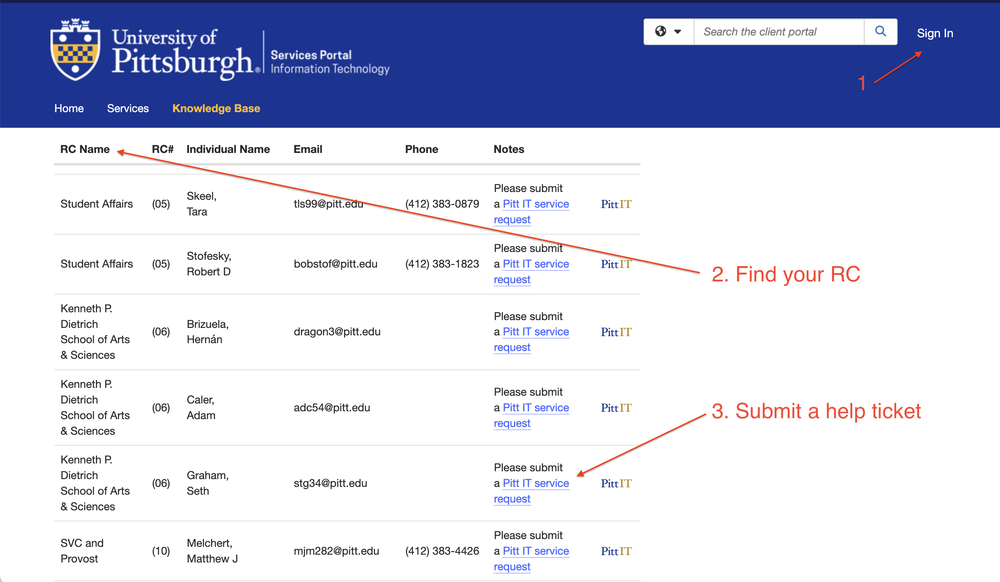
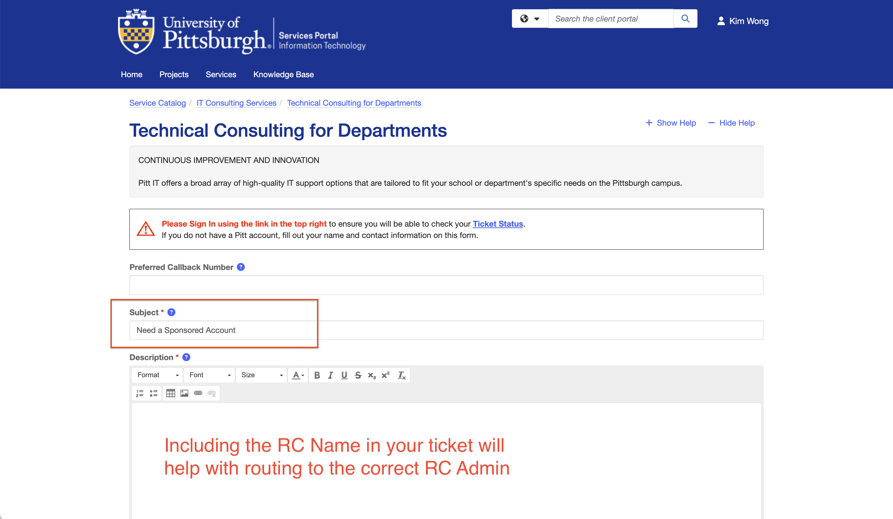

---
hide:
  - toc
---

# Providing access to Alumni and external collaborators via Sponsored Accounts

The CRCD uses the Pitt identity system for authentication. As such, all users will need an active Pitt account (username). When a
student graduates, their student account transitions to an Alumni account, and they lose access to CRCD resources. To maintain
access, a faculty can request changing the Alumni account to a Sponsored Account. Faculty can also request Sponsored Accounts 
for external collaborators to provide them with access to their CRCD resource allocation.

An overview about Sponsored Accounts are provided in a [**knowledge base article**](https://services.pitt.edu/TDClient/33/Portal/KB/ArticleDet?ID=801).
Briefly, the steps involve: 

1. Navigating to the [**RC Admins page**](https://services.pitt.edu/TDClient/33/Portal/KB/ArticleDet?ID=218). You should sign-in
on the page using your Pitt credentials.
2. Locating your RC Name. The name is typically associated with your school.
3. Submitting a help ticket requesting the sponsored account.

!!! tip "For the Pediatrics Department" 
    Please use the [**Pediatrics Sponsored Accounts form**](https://services.pitt.edu/TDClient/33/Portal/Requests/TicketRequests/NewForm?ID=Vk2EErK0OTw_&RequestorType=Service)

The help ticket form should include "Sponsored Account" in the Subject line and relevent contact information about the Sponsored 
Account Holder. Including the RC Name may help with routing the ticket to the appropriate RC Admin.

<ins>**Definitions**</ins>

* **Sponsored Account** -- A Pitt account that is requested by a faculty or an administrator on behalf of an external collaborator.
* **Sponsored Account Holder** -- The individual for whom the Sponsored Account was created for.
* **Sponsored Account Owner** -- The sponsor of the Sponsored Account.
* **Alumni Account** -- The account of a Pitt graduate. This account type has limitations that prevents the user from accessing the CRCD resources.
