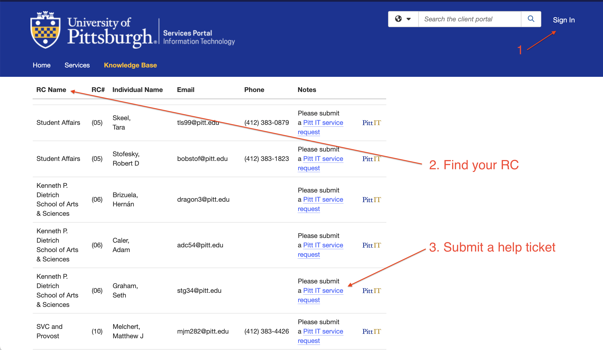
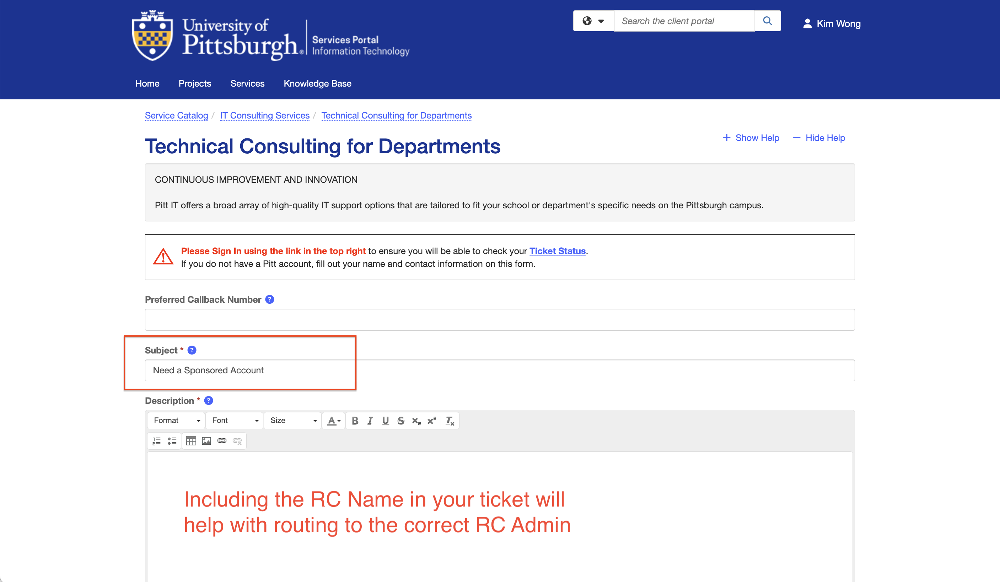

# Sponsored Accounts

The CRCD uses the Pitt identity system for authentication. All users need an active Pitt account (username). When a student graduates, their account transitions to an Alumni account and they lose access to CRCD resources.

## Use Cases

- **Graduating students**: Faculty can request converting an Alumni account to a Sponsored Account to maintain CRCD access
- **External collaborators**: Faculty can request Sponsored Accounts for collaborators outside of Pitt

## How to Request a Sponsored Account

1. Navigate to the [RC Admins page](https://services.pitt.edu/TDClient/33/Portal/KB/ArticleDet?ID=218) and sign in with your Pitt credentials
2. Locate your RC Name (typically associated with your school)
3. Submit a help ticket requesting the sponsored account

!!! tip "Pediatrics Department"
    Use the dedicated [Pediatrics Sponsored Accounts form](https://services.pitt.edu/TDClient/33/Portal/Requests/TicketRequests/NewForm?ID=Vk2EErK0OTw_&RequestorType=Service).

Include "Sponsored Account" in the Subject line and relevant contact information about the Sponsored Account Holder in the Description. Including the RC Name helps route the ticket to the appropriate RC Admin.

## Definitions

| Term | Description |
|------|-------------|
| Sponsored Account | A Pitt account requested by faculty on behalf of an external collaborator |
| Sponsored Account Holder | The individual for whom the account was created |
| Sponsored Account Owner | The faculty sponsor |
| Alumni Account | A graduate's account with limitations that prevent CRCD access |
