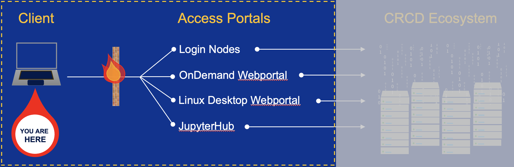

---
hide:
  - toc
---

# Step 2- Login to Access Portals

!!! abstract "In this step"
    Choose an access portal and log in. Next: [Step 3 — run jobs](../step3/index.md).

Once you've connected to the PittNet VPN (see [Step 1](../getting-started-step1-account.md)),
you can reach the CRCD computing and storage resources through several portals. The
most common entry points are below; if you're unsure, start with Terminal SSH — it's
the most flexible and supports every workflow.

-   :material-console:{ .lg .middle } __Terminal SSH to Login Node__

    ---

    Command-line access for scripting and for submitting and monitoring jobs —
    the most flexible option.

    [:octicons-arrow-right-24: Connect via SSH](../terminal.md)

-   :material-web:{ .lg .middle } __Open OnDemand Web Portal__

    ---

    Browser-based access to files, interactive apps, and notebooks — the simplest
    on-ramp.

    [:octicons-arrow-right-24: Open OnDemand](../open-ondemand.md)

-   :material-monitor:{ .lg .middle } __Linux Desktop Visualization Node__

    ---

    A full graphical Linux desktop for GUI applications and visualization.

    [:octicons-arrow-right-24: Launch a desktop](../viz.md)

-   :material-school:{ .lg .middle } __JupyterHub Web Portal on Teach Cluster__

    ---

    Notebooks on the Teach cluster, for courses and teaching.

    [:octicons-arrow-right-24: Teach cluster](../jupyter-teach.md)

!!! warning "Login nodes are for light work only"
    Whichever portal you use, the login nodes are a shared gateway for editing
    files, managing data, and submitting jobs — **not** for running analyses.
    Heavy processes there slow the system for everyone and may be terminated. Run
    real work in an [interactive session](../../slurm/interactive-jobs.md) or a
    [batch job](../../slurm/batch-jobs.md); see
    [Login Nodes](../../hardware_profiles/login.md) for the per-user limits.

A schematic of this part of the process is highlighted below.

