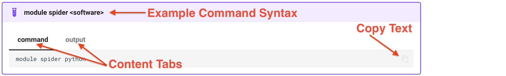

---
hide:
  - toc
---

# How to Request Computing Resources

Because CRC operates a shared resource for the Pitt research community, there needs to be a tool that ensures fair and equitable access. CRC 
uses the [**Slurm workload manager**](https://slurm.schedmd.com/quickstart.html) to accomplish this. Slurm is a batch queueing system that will 
allocate resources based on defined policies. CRC supports both interactive work and batch processing.

## Requesting Computing Resources for Interactive Work

Dedicated resources for interactive work can be requested using the [**Open OnDemand webportal**](../../web-portals/open-ondemand.md) or through
the Linux terminal using the helper tool, `crc-interactive`:

```bash
kimwong@login1.crc.pitt.edu ~]$crc-interactive -h
usage: crc-interactive [-h] [-v] [-z] [-s] [-g] [-m] [-i] [-d] [-e] [-p PARTITION] [-b MEM] [-t TIME] [-n NUM_NODES] [-c NUM_CORES] [-u NUM_GPUS] [-a ACCOUNT] [-r RESERVATION] [-l LICENSE]
                       [-f FEATURE] [-o]

Launch an interactive Slurm session.

optional arguments:
  -h, --help                                 show this help message and exit
  -v, --version                              show program's version number and exit
  -z, --print-command                        print the equivalent slurm command and exit

Cluster Arguments:
  -s, --smp                                  launch a session on the smp cluster
  -g, --gpu                                  launch a session on the gpu cluster
  -m, --mpi                                  launch a session on the mpi cluster
  -i, --invest                               launch a session on the invest cluster
  -d, --htc                                  launch a session on the htc cluster
  -e, --teach                                launch a session on the teach cluster
  -p PARTITION, --partition PARTITION        run the session on a specific partition

Arguments for Increased Resources:
  -b MEM, --mem MEM                          memory in GB
  -t TIME, --time TIME                       run time in hours or hours:minutes [default: 01:00:00]
  -n NUM_NODES, --num-nodes NUM_NODES        number of nodes [default: 1]
  -c NUM_CORES, --num-cores NUM_CORES        number of cores per node [default: 1]
  -u NUM_GPUS, --num-gpus NUM_GPUS           if using -g, the number of GPUs [default: 0]

Additional Job Settings:
  -a ACCOUNT, --account ACCOUNT              specify a non-default account
  -r RESERVATION, --reservation RESERVATION  specify a reservation name
  -l LICENSE, --license LICENSE              specify a license
  -f FEATURE, --feature FEATURE              specify a feature, e.g. `ti` for GPUs
  -o, --openmp                               run using OpenMP style submission
```

For example, to request 8 cores and 256GB of RAM on the high-mem partition of the SMP cluster for 12 hours, you would 
type the following on the commandline (1)
{ .annotate }

1. 

 
!!! example "crc-interactive &lt;options list>"

    === "command"
        ```commandline
        crc-interactive -s -p high-mem -c 8 -b 256 -t 12:00:00
        ```

    === "output"
        ```bash
        [kimwong@login1.crc.pitt.edu ~]$crc-interactive -s -p high-mem -c 8 -b 256 -t 12:00:00
        srun: job 16615902 queued and waiting for resources
        srun: job 16615902 has been allocated resources
        [kimwong@smp-1024-n8.crc.pitt.edu ~]$
        ```  
        !!! note
        
            See how the hostname changes from `login1.crc.pitt.edu` to `smp-1024-n8.crc.pitt.edu` once Slurm allocates
            the requested resources for my job.

## Requesting Computing Resources for Batch Processing

Batch processing requires a script. This script is submitted to the Slurm workload manager using the command
`sbatch <job_submission_script>`. (1) The Slurm job submission script follows a particular syntax that can be broken 
down into three parts, including a section with Slurm directives, a section on loading the software environment, 
and a section for executing the software. In the example script below for running 
[**Amber molecular dynamics**](https://ambermd.org/), we will break down each of these three components. Interacting
with Slurm will be covered in the [**next section**](getting-started-step3-manage-jobs.md).
{ .annotate }

1.  Throughout the examples, we use the conventional syntax `<variable>` to represent a placeholder for an expected value that the user
    will provide.

!!! example "Architecture of a Slurm job submission script"
    === "Whole Script"
        ```bash
        #!/usr/bin/env bash

        ## ------------------------------------------------------------------
        ## Slurm directives defining the resource request 
        ## ------------------------------------------------------------------
        #SBATCH --job-name=gpus-1
        #SBATCH --output=gpus-1.out
        #SBATCH --nodes=1
        #SBATCH --ntasks-per-node=1
        #SBATCH --cluster=gpu
        #SBATCH --partition=l40s
        #SBATCH --gres=gpu:1
        #SBATCH --time=24:00:00

        ## ---------------------------------------------------------------------
        ## Load software into environment 
        ## ---------------------------------------------------------------------
        module purge
        module load gcc/10.2.0  openmpi/4.1.1
        module load amber/24

        ## ---------------------------------------------------------------------
        ## Setup software execution environment
        ## ---------------------------------------------------------------------
        # Define environmental variables for Amber input/output files
        INP=md.in
        TOP=mocvnhlysm.top
        CRD=mocvnhlysm.crd
        OUT=mocvnhlysm
        
        # Define software executable
        SANDER=pmemd.cuda
        
        # Display environmental variables to Slurm output file for diagnostics
        echo AMBERHOME    $AMBERHOME
        echo SLURM_NTASKS $SLURM_NTASKS
        echo which SANDER `which $SANDER`
        echo "Running on node:" `hostname`

        # Display NVIDIA GPU information to Slurm output file
        nvidia-smi

        # Software execution line
        $SANDER  -O     -i   $INP   -p   $TOP   -c   $CRD   -r   $OUT.rst \
                        -o   $OUT.out   -e   $OUT.ene   -v   $OUT.vel   -inf $OUT.nfo   -x   $OUT.mdcrd
        ```
        !!! info
            The job script should start the first line with the standard [**shebang**](https://en.wikipedia.org/wiki/Shebang_(Unix)) 
            line, specifying the [**Linux shell**](https://en.wikipedia.org/wiki/Unix_shell).
    === "Part1: Slurm Directives"
        ```bash
        ## ------------------------------------------------------------------
        ## Slurm directives defining the resource request
        ## ------------------------------------------------------------------
        #SBATCH --job-name=gpus-1
        #SBATCH --output=gpus-1.out
        #SBATCH --nodes=1
        #SBATCH --ntasks-per-node=1
        #SBATCH --cluster=gpu
        #SBATCH --partition=l40s
        #SBATCH --gres=gpu:1
        #SBATCH --time=24:00:00
        ```
        The syntax for a Slurm directive begins with `#SBATCH` followed by ` --<variable>=<value>`, where `<variable>`  
        is one of the OPTIONS defined for the [**sbatch**](https://slurm.schedmd.com/sbatch.html) command. The specific
        `<value>` is unique to how CRC configures our implementation of the Slurm Workload Manager and is provided in
        <insert link to table>.

        !!! info
            Most if not all [**Linux shells**](https://en.wikipedia.org/wiki/Unix_shell) interpret a line starting with 
            the `#` sign as a comment, meaning that the line is
            not executed as a command. If you were to execute the above section of text as a `bash` script, the text is 
            treated as comments only. However, if you were to run the above section of text as input to the Slurm `sbatch` command, 
            `sbatch` will treat every instance of `#SBATCH` as a command to it (hence, the term *directive*) and will interpret
            the ` --<variable>=<value>` parameters accordingly. Any other combination of text starting with a `#` sign will 
            be treated as a comment, such as the `## ` syntax in the example above. 

        <br>
        <br>
        <br>
        <br>
        <br>
        <br>
        <br>
        <br>
        <br>
        <br>
        <br>
        <br>
        <br>

    === "Part2: Load Software"
        ```bash
        ## ---------------------------------------------------------------------
        ## Load software into environment
        ## ---------------------------------------------------------------------
        module purge
        module load gcc/10.2.0  openmpi/4.1.1
        module load amber/24
        ```

        !!! info
            We first purge all previously loaded software and only load the packages that are needed.  These commands will 
            expose the installed software to the user environment by updating the `$PATH`, `$LD_LIBRARY_PATH`, and other required
            environmental variables as specified in the package installation instructions.

        <br>
        <br>
        <br>
        <br>
        <br>
        <br>
        <br>
        <br>
        <br>
        <br>
        <br>
        <br>
        <br>
        <br>
        <br>
        <br>
        <br>
        <br>
        <br>
        <br>
        <br>
        <br>
        <br>
        <br>
        <br>
        <br>
        <br>

    === "Part3: Run Software"
        ```bash
        ## ---------------------------------------------------------------------
        ## Setup software execution environment
        ## ---------------------------------------------------------------------
        # Define environmental variables for Amber input/output files
        INP=md.in
        TOP=mocvnhlysm.top
        CRD=mocvnhlysm.crd
        OUT=mocvnhlysm

        # Define software executable
        SANDER=pmemd.cuda

        # Display environmental variables to Slurm output file for diagnostics
        echo AMBERHOME    $AMBERHOME
        echo SLURM_NTASKS $SLURM_NTASKS
        echo which SANDER `which $SANDER`
        echo "Running on node:" `hostname`

        # Display NVIDIA GPU information to Slurm output file
        nvidia-smi

        # Software execution line
        $SANDER  -O     -i   $INP   -p   $TOP   -c   $CRD   -r   $OUT.rst \
                        -o   $OUT.out   -e   $OUT.ene   -v   $OUT.vel   -inf $OUT.nfo   -x   $OUT.mdcrd
        ```

        !!! info
            This section contains the software specific setup and execution line(s). Typically, you should be able to copy
            over the commands that you use when running on your local laptop or desktop, with some modifications. At the most 
            straightforward level, you should be able to translate the setup/commands described in the software user manual to
            work within the CRC Ecosystem.

        <br>
        <br>
        <br>
        <br>
        <br>
        <br>
        <br>
        <br>
        <br>
        <br>
        <br>
        <br>
