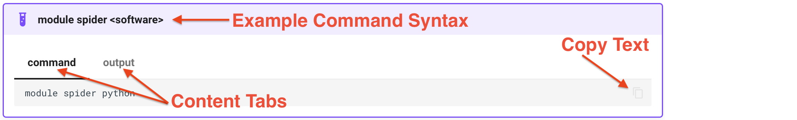

---
hide:
  - toc
---

# Discovering and Loading Software 

??? abstract "Show Table of Commands"
    | Command                          | Description                                                |
    | :------------------------------- | :--------------------------------------------------------- |
    | `module spider <software>`       | Query if `<software>` is available                         |
    | `module load <software>`         | Load `<software>` into environment                          |
    | `module list`                    | List loaded software packages                              |
    | `module rm <software>`           | Remove previously loaded `<software>` from environment     |
    | `module unload <software>`       | Same as `module rm <software>`                             |
    | `module purge`                   | Remove all previously loaded `<software>` from environment |

CRCD uses the [**Lmod**](https://github.com/TACC/Lmod) Environment Modules tool to manage and provision software applications. The 
command `module spider <software>` (1) shows if a package is available. For example, (2)
{ .annotate }

1.  Throughout the examples, we use the conventional syntax `<variable>` to represent a placeholder for an expected value that the user
    will provide.
2.  

!!! Example "module spider &lt;software>"

    === "command"
        ```commandline
        module spider python
        ```
    === "output"
        ```bash
        ---------------------------------------------------------------------------------------------------------------------------------------
          python:
        ---------------------------------------------------------------------------------------------------------------------------------------
             Versions:
                python/ondemand-jupyter-python3.8
                python/ondemand-jupyter-python3.9
                python/ondemand-jupyter-python3.11
                python/py37_venv_23.1.0
                python/pytorch_251_311_cu124
                python/tensorflow_218_311
                python/3.7.0
                python/3.7.17
                python/3.8.18
                python/3.8.20-orhs6eu
                python/3.9.18
                python/3.10.13
                python/3.11.6
                python/3.11.9
                python/3.11.11-fayknjn
                python/3.12.0
                python/3.12.8
                python/3.13.5
             Other possible modules matches:
                openslide-python  py-biopython  py-bx-python  py-gitpython  py-ipython  py-ipython-genutils  py-meson-python  py-python-dateutil  ...
        
        ---------------------------------------------------------------------------------------------------------------------------------------
          To find other possible module matches execute:
        
              $ module -r spider '.*python.*'
        
        ---------------------------------------------------------------------------------------------------------------------------------------
          For detailed information about a specific "python" package (including how to load the modules) use the module's full name.
          Note that names that have a trailing (E) are extensions provided by other modules.
          For example:
        
             $ module spider python/3.13.5
        ---------------------------------------------------------------------------------------------------------------------------------------
        ```
will show all the available Python versions.  Repeating this command with a version-specific Python will display how to load the 
package and if there are any dependencies:

!!! example "module spider &lt;specific software>"

    === "command"
        ```commandline
        module spider python/3.13.5
        ```

    === "output"
        ```bash
        ---------------------------------------------------------------------------------------------------------------------------------------
          python: python/3.13.5
        ---------------------------------------------------------------------------------------------------------------------------------------
        
            You will need to load all module(s) on any one of the lines below before the "python/3.13.5" module is available to load.
        
              gcc/11.5.0-dak7qob
        
            Help:
              The Python programming language.
        ```

As instructed by the output of the `python/3.13.5` module, you will need to load the `gcc/11.5.0-dak7qob` package before loading
the version-specific Python. The command to load a software package is `module load <software>`. You can load the packages one at a time
or all on the same commandline, making sure that the depedencies are loaded first:

!!! example "module load &lt;software>"
    === "command"
        ```commandline
        module load gcc/11.5.0-dak7qob
        module load python/3.13.5
        ```
    === "alternative command"
        ```commandline
        module load gcc/11.5.0-dak7qob python/3.13.5
        ```

To show all the software that had been loaded into your environment, use the command `module list`:

!!! example "module list"
    === "command"
        ```commandline
        module list
        ```
    === "output"
        ```bash
        Currently Loaded Modules:
          1) gcc/11.5.0-dak7qob      5) expat/2.5.0-civmiu6    9) gettext/0.21-lwfvy7g   13) sqlite/3.43.2-usqgkvi           17) xz/5.6.3-j7xphdp
          2) bzip2/1.0.8             6) ncurses/6.4           10) libffi/3.4.4-o6i2vfh   14) util-linux-uuid/2.38.1-jgrgx4c  18) python/3.13.5
          3) libmd/1.0.4-pr3r6b6     7) readline/8.2-hdjus6f  11) zlib-ng/2.1.5-g64y7ia  15) glibc/2.34-45if5qv
          4) libbsd/0.11.7-tjvomkh   8) gdbm/1.23-i7j3ckd     12) openssl/3.1.3-527o4u3  16) gcc-runtime/11.5.0-ysx7ygs
        ```

To remove a software package from your environment, use the command `module rm <software>`:

!!! example "module rm &lt;software>"
    === "command"
        ```commandline
        module list
        module rm python/3.13.5
        module list
        ```
    === "output"
        ```bash
        [kimwong@login1.crc.pitt.edu ~]$module list
        
        Currently Loaded Modules:
          1) gcc/8.2.0   2) python/anaconda3.10-2022.10
        
        [kimwong@login1.crc.pitt.edu ~]$module rm python/anaconda3.10-2022.10
        [kimwong@login1.crc.pitt.edu ~]$module list
        No modules loaded
        [kimwong@login1.crc.pitt.edu ~]$
        ```

You should have noticed in the output that removal of the `python/anaconda3.10-2022.10` module also
removes `gcc/8.2.0`. This is because the latter was a dependency for the Python module. 

??? note "What happens if I remove a dependency first?"
    Let's load the modules again and try it out:

    !!! example "module rm &lt;software>"
        === "command"
    
            ```commandline
            module load gcc/8.2.0 python/anaconda3.10-2022.10
            module list
            module rm gcc/8.2.0
            module list
            ```
        === "output"
    
            ```bash
            [kimwong@login1.crc.pitt.edu ~]$module load gcc/8.2.0 python/anaconda3.10-2022.10
            [kimwong@login1.crc.pitt.edu ~]$module list
            
            Currently Loaded Modules:
              1) gcc/8.2.0   2) python/anaconda3.10-2022.10
            
            [kimwong@login1.crc.pitt.edu ~]$module rm gcc/8.2.0
            
            Inactive Modules:
              1) python/anaconda3.10-2022.10
            
            [kimwong@login1.crc.pitt.edu ~]$module list
            
            Currently Loaded Modules:
              None found.
            
            Inactive Modules:
              1) python/anaconda3.10-2022.10
            
            [kimwong@login1.crc.pitt.edu ~]$
            ```
    
    The removal of the dependent software makes the main software module *inactive*, which has the same 
    effect as a `module rm <software>`. 

Now, suppose you have a few software packages loaded. Do you need
to remove each package individually or is there a single global remove command? The command is 
`module purge`:

!!! example "module purge"
    === "command"

        ```commandline
        module load gcc/8.2.0 python/anaconda3.10-2022.10 r/3.6.0
        module list
        module purge
        module list
        ```
    === "output"

        ```bash
        [kimwong@login1.crc.pitt.edu ~]$module load gcc/8.2.0 python/anaconda3.10-2022.10 r/3.6.0
        [kimwong@login1.crc.pitt.edu ~]$module list
        
        Currently Loaded Modules:
          1) gcc/8.2.0                     3) java/1.8.0_181-oracle   5) bzip2/1.0.6   7) pcre/8.40     9) gsl/2.5     11) hdf5/1.10.4   13) gdal/2.4.2     15) r/3.6.0
          2) python/anaconda3.10-2022.10   4) zlib/1.2.9              6) xz/5.2.3      8) curl/7.52.1  10) jags/4.3.0  12) netcdf/4.6.3  14) openmpi/1.8.8
        
        [kimwong@login1.crc.pitt.edu ~]$module purge
        [kimwong@login1.crc.pitt.edu ~]$module list
        No modules loaded
        [kimwong@login1.crc.pitt.edu ~]$
        ```

## Next steps

You can now find and load software. The next stage is asking the scheduler for
the compute resources to run it — continue to
**[Requesting resources](getting-started-step3-resources.md)**.

### If the software you need isn't a module

<div class="grid cards" markdown>

-   :material-language-python:{ .lg .middle } __Install your own packages__

    ---

    Create conda or virtual environments to install Python packages yourself
    where modules fall short.

    [:octicons-arrow-right-24: Python environments](../../applications/python.md)

-   :material-cube-outline:{ .lg .middle } __Run containers__

    ---

    Use Singularity to run Docker/OCI images when software isn't provided as a
    module.

    [:octicons-arrow-right-24: Introduction to Singularity](../../applications/singularity.md)

-   :material-format-list-bulleted:{ .lg .middle } __Browse the catalog__

    ---

    See every package installed on the clusters and search for what you need.

    [:octicons-arrow-right-24: CRCD Software List](../../applications/software-list.md)

</div>

See also [R and RStudio](../../applications/r+rstudio.md) and
[Application Environment](../../applications/application-environment.md).
