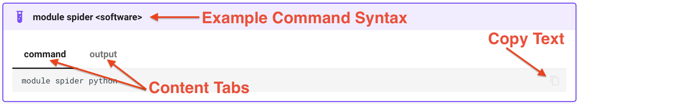

---
hide:
  - toc
---

# How to Discover Available Software 

??? abstract "Skip to Table of Commands"
    | Command                          | Description                                                |
    | :------------------------------- | :--------------------------------------------------------- |
    | `module spider <software>`       | Query if `<software>` is available                         |
    | `module load <software>`         | Load `<software` into environment                          |
    | `module list`                    | List loaded software packages                              |
    | `module rm <software>`           | Remove previously loaded `<software>` from environment     |
    | `module unload <software>`       | Same as `module rm <software>`                             |
    | `module purge`                   | Remove all previously loaded `<software>` from environment |

CRC uses the [**Lmod**](https://github.com/TACC/Lmod) Environment Modules tool to manage and provision software applications. The 
command `module spider <software>` (1) shows if a package is available. For example, (2)
{ .annotate }

1.  Throughout the examples, we use the conventional syntax `<variable>` to represent a placeholder for an expected value that the user
    will provide.
2.  

!!! Example "module spider &lt;software>"

    === "command"
        ```commandline
        module spider python
        ```
    === "output"
        ```bash
        ------------------------------------------------------------------------------------------------------------------------------------------------------------------------------------------------------
          python:
        ------------------------------------------------------------------------------------------------------------------------------------------------------------------------------------------------------
            Description:
              Anaconda is the leading open data science platform powered by Python.
        
             Versions:
                python/anaconda2.7-4.2.0_westpa
                python/anaconda2.7-4.2.0
                python/anaconda2.7-4.4.0_genomics
                python/anaconda2.7-5.2.0_westpa
                python/anaconda2.7-5.2.0
                python/anaconda2.7-2018.12_westpa
                python/anaconda3.5-4.2.0-dev
                python/anaconda3.5-4.2.0
                python/anaconda3.6-5.2.0_deeplabcut
                python/anaconda3.6-5.2.0_leap
                python/anaconda3.6-5.2.0
                python/anaconda3.7-5.3.1_genomics
                python/anaconda3.7-2018.12_westpa
                python/anaconda3.7-2019.03_astro_bagpipes-0.8.2
                python/anaconda3.7-2019.03_astro_bagpipes-0.8.8-alt
                python/anaconda3.7-2019.03_astro_bagpipes-0.8.8
                python/anaconda3.7-2019.03_astro
                python/anaconda3.7-2019.03_deformetrica
                python/anaconda3.7-2019.03
                python/anaconda3.8-2020.11
                python/anaconda3.9-2021.11
                python/anaconda3.10-2022.10
                python/bioconda-2.7-5.2.0
                python/bioconda-3.6-5.2.0
                python/bioconda-3.7-2019.03
                python/intel-3.5
                python/intel-3.6_2018.3.039
                python/intel-3.6_2019.2.066
                python/intel-3.6
                python/ondemand-jupyter-python3.8
                python/ondemand-jupyter-python3.9
                python/ondemand-jupyter-python3.10
                python/ondemand-jupyter-python3.11
                python/3.7.0-dev
                python/3.7.0-fastx
                python/3.7.0
        
             Other possible modules matches:
                biopython  openslide-python
        
        ------------------------------------------------------------------------------------------------------------------------------------------------------------------------------------------------------
          To find other possible module matches do:
              module -r spider '.*python.*'
        
        ------------------------------------------------------------------------------------------------------------------------------------------------------------------------------------------------------
          For detailed information about a specific "python" module (including how to load the modules) use the module's full name.
          For example:
        
             $ module spider python/ondemand-jupyter-python3.9
        ------------------------------------------------------------------------------------------------------------------------------------------------------------------------------------------------------
        ```
will show all the available Python versions.  Repeating this command with a version-specific Python will display how to load the 
package and if there are any dependencies:

!!! example "module spider &lt;specific software>"

    === "command"
        ```commandline
        module spider python/anaconda3.10-2022.10
        ```

    === "output"
        ```bash
        ------------------------------------------------------------------------------------------------------------------------------------------------------------------------------------------------------
          python: python/anaconda3.10-2022.10
        ------------------------------------------------------------------------------------------------------------------------------------------------------------------------------------------------------
            Description:
              Anaconda is the leading open data science platform powered by Python. Compatible with gcc/8.2.0
        
             Other possible modules matches:
                biopython, openslide-python
        
            You will need to load all module(s) on any one of the lines below before the "python/anaconda3.10-2022.10" module is available to load.
        
              gcc/8.2.0
        
        ------------------------------------------------------------------------------------------------------------------------------------------------------------------------------------------------------
          To find other possible module matches do:
              module -r spider '.*python/anaconda3.10-2022.10.*'
        ```

As instructed by the output of the `python/anaconda3.10-2022.10` module, you will need to load the `gcc/8.2.0` package before loading
the version-specific Python. The command to load a software package is `module load <software>`. You can load the packages one at a time
or all on the same commandline, making sure that the depedencies are loaded first:

!!! example "module load &lt;software>"
    === "command"
        ```commandline
        module load gcc/8.2.0
        module load python/anaconda3.10-2022.10
        ```
    === "alternative command"
        ```commandline
        module load gcc/8.2.0 python/anaconda3.10-2022.10
        ```

To show all the software that had been loaded into your environment, use the command `module list`:

!!! example "module list"
    === "command"
        ```commandline
        module list
        ```
    === "output"
        ```bash
        Currently Loaded Modules:
          1) gcc/8.2.0   2) python/anaconda3.10-2022.10
        ```

To remove a software package from your environment, use the command `module rm <software>`:

!!! example "module rm &lt;software>"
    === "command"
        ```commandline
        module list
        module rm python/anaconda3.10-2022.10
        module list
        ```
    === "output"
        ```bash
        {kimwong@login1.crc.pitt.edu ~}$module list
        
        Currently Loaded Modules:
          1) gcc/8.2.0   2) python/anaconda3.10-2022.10
        
        [kimwong@login1.crc.pitt.edu ~]$module rm python/anaconda3.10-2022.10
        [kimwong@login1.crc.pitt.edu ~]$module list
        No modules loaded
        [kimwong@login1.crc.pitt.edu ~]$
        ```

You should have noticed in the output that removal of the `python/anaconda3.10-2022.10` module also
removes `gcc/8.2.0`. This is because the latter was a dependency for the Python module. What happens if you 
were to remove the dependency first? Let's load the modules again and try it out:

!!! example "module rm &lt;software>"
    === "command"

        ```commandline
        module load gcc/8.2.0 python/anaconda3.10-2022.10
        module list
        module rm gcc/8.2.0
        module list
        ```
    === "output"

        ```bash
        [kimwong@login1.crc.pitt.edu ~]$module load gcc/8.2.0 python/anaconda3.10-2022.10
        [kimwong@login1.crc.pitt.edu ~]$module list
        
        Currently Loaded Modules:
          1) gcc/8.2.0   2) python/anaconda3.10-2022.10
        
        [kimwong@login1.crc.pitt.edu ~]$module rm gcc/8.2.0
        
        Inactive Modules:
          1) python/anaconda3.10-2022.10
        
        [kimwong@login1.crc.pitt.edu ~]$module list
        
        Currently Loaded Modules:
          None found.
        
        Inactive Modules:
          1) python/anaconda3.10-2022.10
        
        [kimwong@login1.crc.pitt.edu ~]$
        ```

The removal of the dependent software makes the main software module *inactive*, which has the same 
effect as a `module rm <software>`. Now, suppose you have a few software packages loaded. Do you need
to remove each package individually or is there a single global remove command? The command is 
`module purge`:

!!! example "module purge"
    === "command"

        ```commandline
        module load gcc/8.2.0 python/anaconda3.10-2022.10 r/3.6.0
        module list
        module purge
        module list
        ```
    === "output"

        ```bash
        [kimwong@login1.crc.pitt.edu ~]$module load gcc/8.2.0 python/anaconda3.10-2022.10 r/3.6.0
        [kimwong@login1.crc.pitt.edu ~]$module list
        
        Currently Loaded Modules:
          1) gcc/8.2.0                     3) java/1.8.0_181-oracle   5) bzip2/1.0.6   7) pcre/8.40     9) gsl/2.5     11) hdf5/1.10.4   13) gdal/2.4.2     15) r/3.6.0
          2) python/anaconda3.10-2022.10   4) zlib/1.2.9              6) xz/5.2.3      8) curl/7.52.1  10) jags/4.3.0  12) netcdf/4.6.3  14) openmpi/1.8.8
        
        [kimwong@login1.crc.pitt.edu ~]$module purge
        [kimwong@login1.crc.pitt.edu ~]$module list
        No modules loaded
        [kimwong@login1.crc.pitt.edu ~]$
        ```
