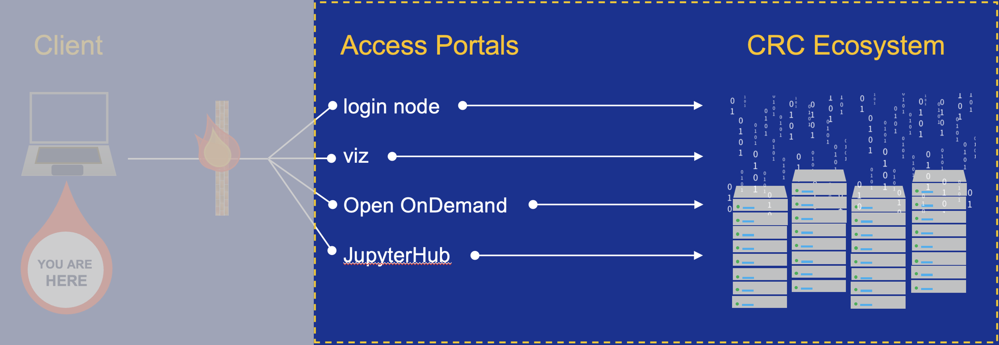

---
hide:
  - toc
---

# Step 3- Interacting with the CRC Ecosystem Basics

Now that you have successfully logged in an access portal, we will describe 

1. [**How to query what software is available within the ecosystem**](getting-started-step3-software.md)
2. [**How to request computing resources in the back-end**](getting-started-step3-resources.md)
3. [**How to submit jobs, query the status of jobs, and cancel jobs**](getting-started-step3-manage-jobs.md)

A schematic of this part of the process is highlighted below.

<ins>**Definitions**</ins>

*   **back-end** -- the dedicated computing nodes, storage arrays, networking, and supporting management 
infrastructure are often referred to collectively as the back-end. Access to the back-end are restriced based on access policy.
*   **front-end** -- these are the access portals, the gateway to the back-end. The 
[**Slurm workload manager**](https://slurm.schedmd.com/documentation.html) controls access to the back-end computing nodes.
