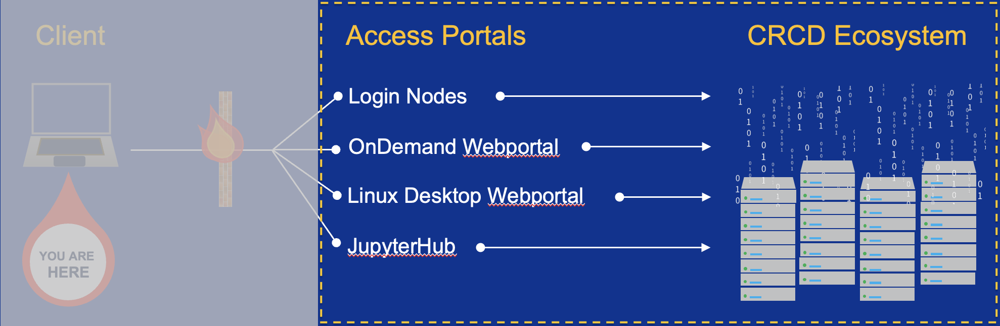

---
hide:
  - toc
---

# Step 3: The CRCD Ecosystem

Now that you have logged in to an access portal, learn how to:

1. [Discover available software](getting-started-step3-software.md) via the module system
2. [Request computing resources](getting-started-step3-resources.md) through Slurm
3. [Submit and manage jobs](getting-started-step3-manage-jobs.md)

## Definitions

| Term | Description |
|------|-------------|
| Back-end | The dedicated computing nodes, storage arrays, networking, and management infrastructure |
| Front-end | The access portals (login nodes) that serve as gateways to the back-end |
| Slurm | The [workload manager](https://slurm.schedmd.com/documentation.html) that controls access to compute nodes |
